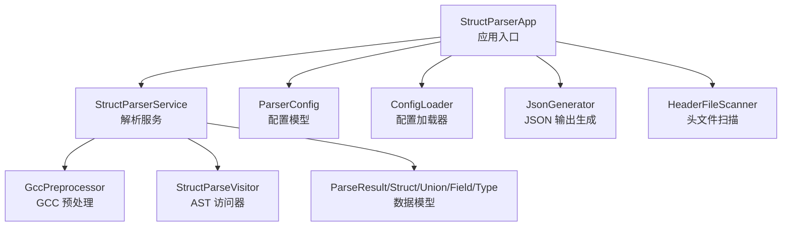
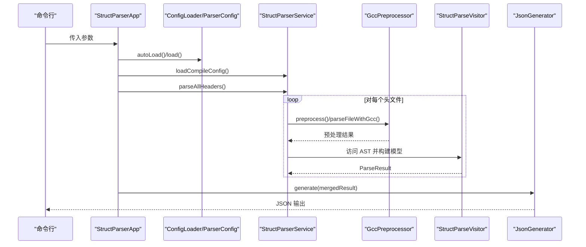
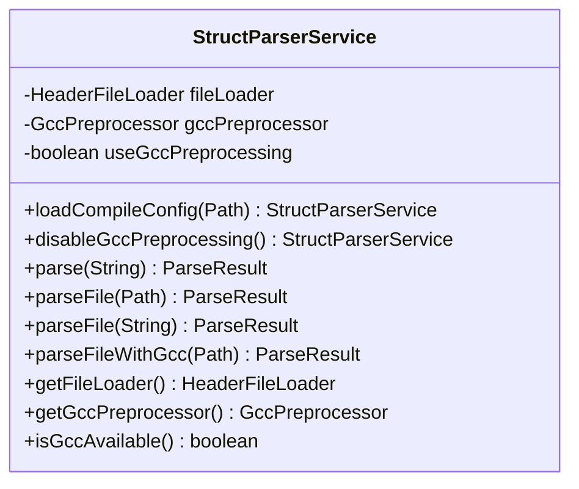
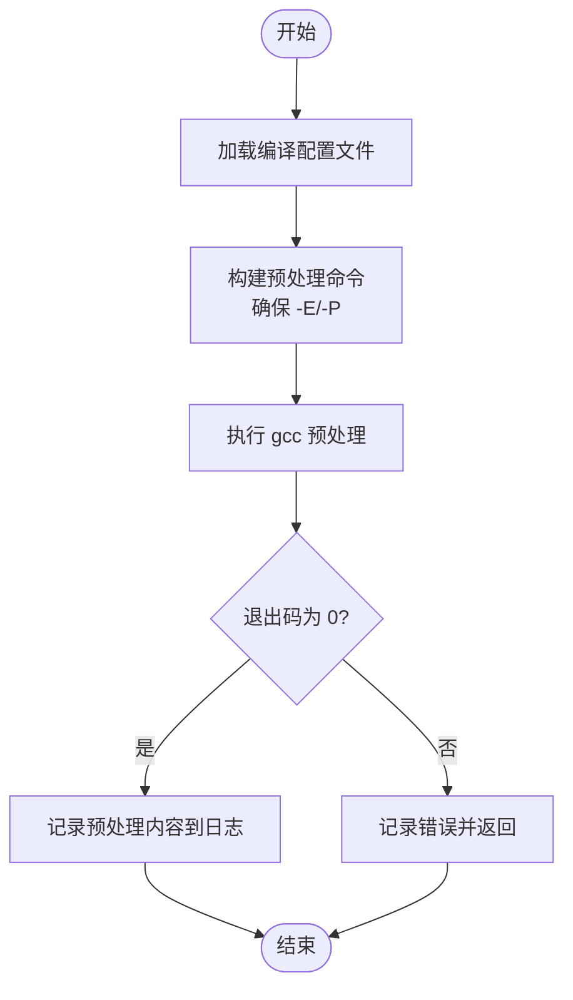
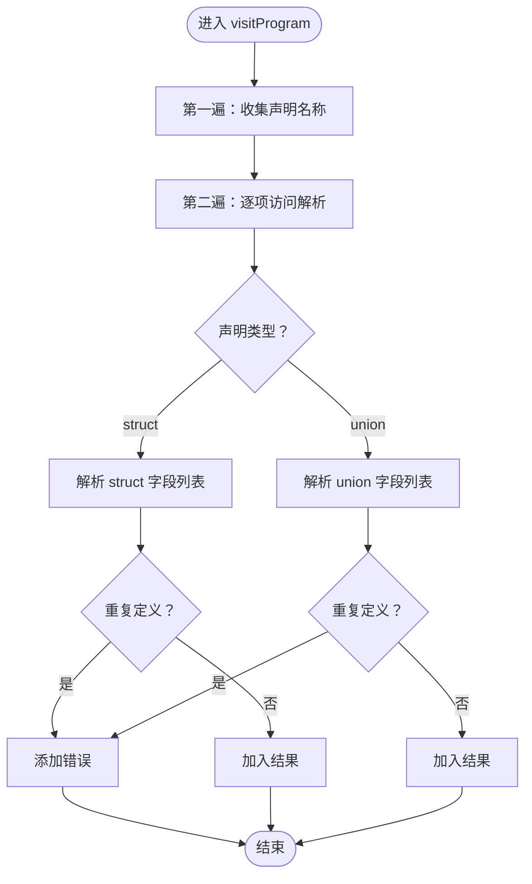
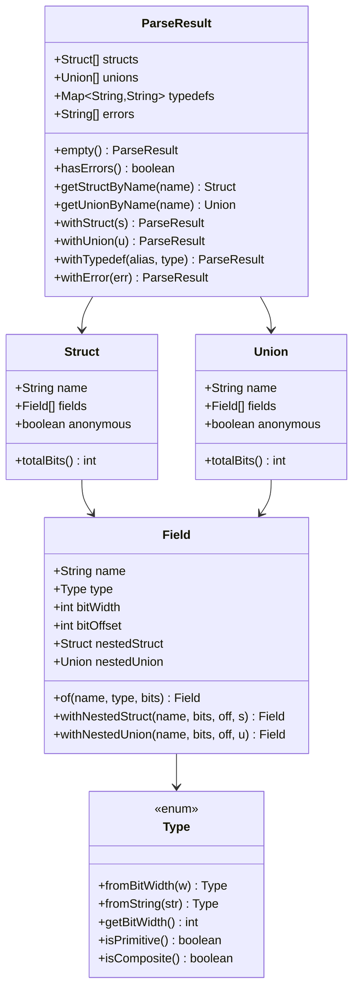
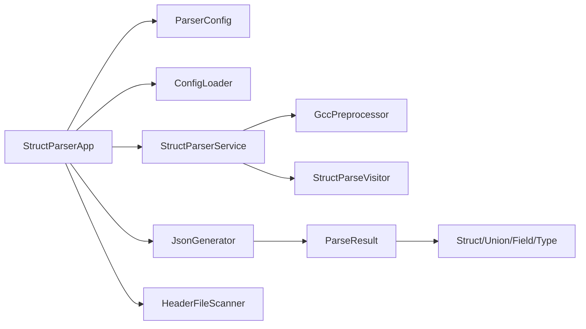

# API 参考

<cite>
**本文档引用的文件**
- [README.md](file://README.md)
- [StructParserApp.java](file://src/main/java/com/structparser/StructParserApp.java)
- [StructParserService.java](file://src/main/java/com/structparser/parser/StructParserService.java)
- [ParserConfig.java](file://src/main/java/com/structparser/config/ParserConfig.java)
- [ConfigLoader.java](file://src/main/java/com/structparser/config/ConfigLoader.java)
- [JsonGenerator.java](file://src/main/java/com/structparser/generator/JsonGenerator.java)
- [GccPreprocessor.java](file://src/main/java/com/structparser/parser/GccPreprocessor.java)
- [HeaderFileScanner.java](file://src/main/java/com/structparser/parser/HeaderFileScanner.java)
- [StructParseVisitor.java](file://src/main/java/com/structparser/parser/StructParseVisitor.java)
- [ParseResult.java](file://src/main/java/com/structparser/model/ParseResult.java)
- [Struct.java](file://src/main/java/com/structparser/model/Struct.java)
- [Union.java](file://src/main/java/com/structparser/model/Union.java)
- [Field.java](file://src/main/java/com/structparser/model/Field.java)
- [Type.java](file://src/main/java/com/structparser/model/Type.java)
- [struct-parser.yaml](file://struct-parser.yaml)
</cite>

## 目录
1. [简介](#简介)
2. [项目结构](#项目结构)
3. [核心组件](#核心组件)
4. [架构总览](#架构总览)
5. [详细组件分析](#详细组件分析)
6. [依赖关系分析](#依赖关系分析)
7. [性能考虑](#性能考虑)
8. [故障排除指南](#故障排除指南)
9. [结论](#结论)
10. [附录](#附录)

## 简介
本文件为 Struct Parser 工具的 API 参考，覆盖以下内容：
- 命令行接口与运行模式
- 核心解析服务 StructParserService 的公共 API
- 配置系统 ParserConfig 与 ConfigLoader 的配置接口
- 数据模型与输出格式
- 版本兼容性、废弃功能与迁移指南
- 集成示例与最佳实践

该工具通过 ANTLR4 语法解析与 GCC 预处理，支持 C 风格 struct/union 的解析，并生成 JSON 结构化输出。

章节来源
- [README.md:1-519](file://README.md#L1-L519)

## 项目结构
项目采用按职责分层的组织方式：
- 应用入口与命令行：StructParserApp
- 解析服务：StructParserService
- 配置系统：ParserConfig、ConfigLoader
- 预处理：GccPreprocessor
- 文件扫描：HeaderFileScanner
- 语法访问器：StructParseVisitor
- 数据模型：ParseResult、Struct、Union、Field、Type
- 输出生成：JsonGenerator

图表来源
- [StructParserApp.java:1-286](file://src/main/java/com/structparser/StructParserApp.java#L1-L286)
- [StructParserService.java:1-185](file://src/main/java/com/structparser/parser/StructParserService.java#L1-L185)
- [ParserConfig.java:1-53](file://src/main/java/com/structparser/config/ParserConfig.java#L1-L53)
- [ConfigLoader.java:1-110](file://src/main/java/com/structparser/config/ConfigLoader.java#L1-L110)
- [JsonGenerator.java:1-260](file://src/main/java/com/structparser/generator/JsonGenerator.java#L1-L260)
- [GccPreprocessor.java:1-194](file://src/main/java/com/structparser/parser/GccPreprocessor.java#L1-L194)
- [HeaderFileScanner.java:1-75](file://src/main/java/com/structparser/parser/HeaderFileScanner.java#L1-L75)
- [StructParseVisitor.java:1-488](file://src/main/java/com/structparser/parser/StructParseVisitor.java#L1-L488)
- [ParseResult.java:1-78](file://src/main/java/com/structparser/model/ParseResult.java#L1-L78)
- [Struct.java:1-47](file://src/main/java/com/structparser/model/Struct.java#L1-L47)
- [Union.java:1-20](file://src/main/java/com/structparser/model/Union.java#L1-L20)
- [Field.java:1-23](file://src/main/java/com/structparser/model/Field.java#L1-L23)
- [Type.java:1-104](file://src/main/java/com/structparser/model/Type.java#L1-L104)

章节来源
- [README.md:391-428](file://README.md#L391-L428)

## 核心组件
本节概述主要 API 与配置项，便于快速查阅与集成。

- 命令行接口
  - 无参运行：读取工作目录配置文件并执行解析
  - 子命令：help、gcc-info
- 配置接口
  - ParserConfig：包含 compileConfigFile 与 OutputConfig
  - ConfigLoader：支持 struct-parser.yaml/yml/json 自动加载与保存
- 解析服务
  - StructParserService：支持 GCC 预处理与禁用预处理两种模式；提供 parse/parseFile/parseFileWithGcc 等 API
- 输出生成
  - JsonGenerator：将 ParseResult 转换为 JSON 字符串或写入 Writer
- 预处理与扫描
  - GccPreprocessor：加载编译配置、执行 gcc 预处理、检查可用性
  - HeaderFileScanner：扫描目录中的头文件

章节来源
- [StructParserApp.java:29-56](file://src/main/java/com/structparser/StructParserApp.java#L29-L56)
- [ParserConfig.java:11-51](file://src/main/java/com/structparser/config/ParserConfig.java#L11-L51)
- [ConfigLoader.java:66-94](file://src/main/java/com/structparser/config/ConfigLoader.java#L66-L94)
- [StructParserService.java:39-123](file://src/main/java/com/structparser/parser/StructParserService.java#L39-L123)
- [JsonGenerator.java:21-76](file://src/main/java/com/structparser/generator/JsonGenerator.java#L21-L76)
- [GccPreprocessor.java:28-42](file://src/main/java/com/structparser/parser/GccPreprocessor.java#L28-L42)
- [HeaderFileScanner.java:19-51](file://src/main/java/com/structparser/parser/HeaderFileScanner.java#L19-L51)

## 架构总览
下图展示从命令行到解析与输出的完整流程：

图表来源
- [StructParserApp.java:148-227](file://src/main/java/com/structparser/StructParserApp.java#L148-L227)
- [StructParserService.java:60-102](file://src/main/java/com/structparser/parser/StructParserService.java#L60-L102)
- [GccPreprocessor.java:85-158](file://src/main/java/com/structparser/parser/GccPreprocessor.java#L85-L158)
- [StructParseVisitor.java:36-44](file://src/main/java/com/structparser/parser/StructParseVisitor.java#L36-L44)
- [JsonGenerator.java:21-76](file://src/main/java/com/structparser/generator/JsonGenerator.java#L21-L76)

## 详细组件分析

### 命令行接口
- 运行模式
  - 无参数：从工作目录加载配置并解析
  - 子命令：
    - help：打印帮助信息
    - gcc-info：检查 GCC 可用性与版本
- 错误处理
  - 未安装 GCC：提示安装
  - 配置文件缺失：列出期望文件名并给出示例
  - 配置无效：抛出异常并退出
- 输出
  - 成功：统计结构体/联合体数量与错误数量
  - 失败：输出错误详情并以非零状态码退出

章节来源
- [StructParserApp.java:29-56](file://src/main/java/com/structparser/StructParserApp.java#L29-L56)
- [StructParserApp.java:71-102](file://src/main/java/com/structparser/StructParserApp.java#L71-L102)
- [StructParserApp.java:229-284](file://src/main/java/com/structparser/StructParserApp.java#L229-L284)

### 配置系统 API
- ParserConfig
  - 字段
    - compileConfigFile：必需，指向编译配置文件路径
    - output：可选，默认 format=json
  - 方法
    - defaults()：创建默认配置
    - validate()：校验 compileConfigFile 存在性
- ConfigLoader
  - load(path)：按扩展名解析 YAML/JSON
  - loadFromClasspath(path)：从类路径加载
  - autoLoad(directory)：按顺序查找 struct-parser.yaml/yml/json
  - save(config, path)：保存配置（用于生成示例）

章节来源
- [ParserConfig.java:11-51](file://src/main/java/com/structparser/config/ParserConfig.java#L11-L51)
- [ParserConfig.java:33-42](file://src/main/java/com/structparser/config/ParserConfig.java#L33-L42)
- [ConfigLoader.java:23-60](file://src/main/java/com/structparser/config/ConfigLoader.java#L23-L60)
- [ConfigLoader.java:66-94](file://src/main/java/com/structparser/config/ConfigLoader.java#L66-L94)
- [ConfigLoader.java:99-108](file://src/main/java/com/structparser/config/ConfigLoader.java#L99-L108)

### StructParserService API
- 构造与初始化
  - 构造函数：初始化 HeaderFileLoader 与 GccPreprocessor
- 配置加载
  - loadCompileConfig(Path)：从编译配置文件加载预处理命令
- 预处理控制
  - disableGccPreprocessing()：禁用 GCC 预处理，使用自定义 #include 处理
  - isGccAvailable()：静态方法检查 GCC 可用性
- 解析入口
  - parse(String)：从字符串解析
  - parseFile(Path/String)：从文件解析，自动选择预处理方式
  - parseFileWithGcc(Path)：临时强制使用 GCC 预处理进行单次解析
- 访问器与工具
  - getFileLoader()/getGccPreprocessor()：获取内部组件实例

图表来源
- [StructParserService.java:23-168](file://src/main/java/com/structparser/parser/StructParserService.java#L23-L168)

章节来源
- [StructParserService.java:39-123](file://src/main/java/com/structparser/parser/StructParserService.java#L39-L123)
- [StructParserService.java:155-168](file://src/main/java/com/structparser/parser/StructParserService.java#L155-L168)

### 预处理与文件扫描
- GccPreprocessor
  - loadCompileConfig(Path)：解析直接命令文件，确保包含 -E/-P
  - preprocess(Path)：执行 gcc -E -P 预处理，记录日志并返回结果
  - isGccAvailable()/getGccVersion()：检查可用性与版本
- HeaderFileScanner
  - scan(Path)：扫描单目录头文件（.h/.hpp/.hh/.hxx）
  - scan(List<Path>)：聚合多目录扫描结果

图表来源
- [GccPreprocessor.java:28-80](file://src/main/java/com/structparser/parser/GccPreprocessor.java#L28-L80)
- [GccPreprocessor.java:85-158](file://src/main/java/com/structparser/parser/GccPreprocessor.java#L85-L158)

章节来源
- [GccPreprocessor.java:28-194](file://src/main/java/com/structparser/parser/GccPreprocessor.java#L28-L194)
- [HeaderFileScanner.java:19-74](file://src/main/java/com/structparser/parser/HeaderFileScanner.java#L19-L74)

### 解析流程与访问器
- 两遍扫描
  - 第一遍：收集顶层 struct/union 名称，建立声明集合
  - 第二遍：正常解析并检测循环引用
- 字段解析策略
  - 匿名嵌套结构：展开字段到父级
  - 具名嵌套结构：保留嵌套并展开 fields
  - Union 字段：共享相同 offset
- 循环引用检测
  - 使用 currentlyParsing 集合在解析过程中检测循环引用

图表来源
- [StructParseVisitor.java:36-134](file://src/main/java/com/structparser/parser/StructParseVisitor.java#L36-L134)
- [StructParseVisitor.java:306-367](file://src/main/java/com/structparser/parser/StructParseVisitor.java#L306-L367)

章节来源
- [StructParseVisitor.java:36-488](file://src/main/java/com/structparser/parser/StructParseVisitor.java#L36-L488)

### 数据模型与输出
- ParseResult
  - 字段：structs、unions、typedefs、errors
  - 方法：empty()、hasErrors()、getStructByName()、getUnionByName()、withStruct/withUnion/withTypedef/withError
- Struct/Union/Field/Type
  - Struct.totalBits()：考虑匿名 union 场景的最大宽度累加
  - Union.totalBits()：字段最大宽度
  - Field 提供静态工厂方法 withNestedStruct/withNestedUnion
  - Type 支持从位宽与字符串解析
- JsonGenerator
  - generate(ParseResult)：输出 JSON 字符串
  - generate(ParseResult, Writer)：写入 Writer
  - 支持去除匿名 union 成员前缀

图表来源
- [ParseResult.java:10-77](file://src/main/java/com/structparser/model/ParseResult.java#L10-L77)
- [Struct.java:9-46](file://src/main/java/com/structparser/model/Struct.java#L9-L46)
- [Union.java:9-19](file://src/main/java/com/structparser/model/Union.java#L9-L19)
- [Field.java:6-22](file://src/main/java/com/structparser/model/Field.java#L6-L22)
- [Type.java:6-103](file://src/main/java/com/structparser/model/Type.java#L6-L103)

章节来源
- [ParseResult.java:10-77](file://src/main/java/com/structparser/model/ParseResult.java#L10-L77)
- [Struct.java:15-46](file://src/main/java/com/structparser/model/Struct.java#L15-L46)
- [Union.java:15-19](file://src/main/java/com/structparser/model/Union.java#L15-L19)
- [Field.java:8-22](file://src/main/java/com/structparser/model/Field.java#L8-L22)
- [Type.java:61-94](file://src/main/java/com/structparser/model/Type.java#L61-L94)
- [JsonGenerator.java:78-212](file://src/main/java/com/structparser/generator/JsonGenerator.java#L78-L212)

## 依赖关系分析
- 组件耦合
  - StructParserApp 依赖 ConfigLoader、ParserConfig、StructParserService、JsonGenerator、HeaderFileScanner
  - StructParserService 依赖 GccPreprocessor 与 StructParseVisitor
  - JsonGenerator 依赖 ParseResult 与数据模型
- 外部依赖
  - ANTLR4：语法解析
  - Jackson：YAML/JSON 解析
  - SLF4J/Logback：日志
  - GCC：C 预处理

图表来源
- [StructParserApp.java:1-286](file://src/main/java/com/structparser/StructParserApp.java#L1-L286)
- [StructParserService.java:1-185](file://src/main/java/com/structparser/parser/StructParserService.java#L1-L185)
- [JsonGenerator.java:1-260](file://src/main/java/com/structparser/generator/JsonGenerator.java#L1-L260)
- [GccPreprocessor.java:1-194](file://src/main/java/com/structparser/parser/GccPreprocessor.java#L1-L194)
- [StructParseVisitor.java:1-488](file://src/main/java/com/structparser/parser/StructParseVisitor.java#L1-L488)
- [ParseResult.java:1-78](file://src/main/java/com/structparser/model/ParseResult.java#L1-L78)
- [Struct.java:1-47](file://src/main/java/com/structparser/model/Struct.java#L1-L47)
- [Union.java:1-20](file://src/main/java/com/structparser/model/Union.java#L1-L20)
- [Field.java:1-23](file://src/main/java/com/structparser/model/Field.java#L1-L23)
- [Type.java:1-104](file://src/main/java/com/structparser/model/Type.java#L1-L104)

章节来源
- [README.md:430-438](file://README.md#L430-L438)

## 性能考虑
- 预处理阶段
  - GCC 预处理会引入额外开销，建议合理配置 include 路径，避免扫描无关目录
- 解析阶段
  - 两遍扫描提升准确性但增加时间复杂度，建议在大型工程中分批处理
- 输出阶段
  - JsonGenerator 使用流式写入，内存占用较低；大结果集建议直接写文件而非内存拼接

## 故障排除指南
- GCC 不可用
  - 现象：启动即报错，提示安装 GCC
  - 处理：安装 GCC 并确保在 PATH 中
- 配置文件缺失
  - 现象：找不到 struct-parser.yaml/yml/json
  - 处理：在工作目录创建配置文件，参考示例
- 编译配置文件无效
  - 现象：无法提取预处理命令或文件不存在
  - 处理：检查 compileConfigFile 路径与内容
- 循环引用/前向引用
  - 现象：解析时报错“循环引用”或“不允许前向引用”
  - 处理：调整头文件结构，确保类型先定义再使用
- 输出为空或错误过多
  - 现象：输出 JSON 为空或包含大量错误
  - 处理：检查 GCC 预处理结果与头文件语法

章节来源
- [StructParserApp.java:62-121](file://src/main/java/com/structparser/StructParserApp.java#L62-L121)
- [StructParserService.java:67-98](file://src/main/java/com/structparser/parser/StructParserService.java#L67-L98)
- [StructParseVisitor.java:308-334](file://src/main/java/com/structparser/parser/StructParseVisitor.java#L308-L334)
- [GccPreprocessor.java:85-158](file://src/main/java/com/structparser/parser/GccPreprocessor.java#L85-L158)

## 结论
本 API 参考系统性地梳理了命令行接口、配置系统、解析服务、数据模型与输出生成等模块。通过明确的参数、返回值与错误处理机制，开发者可以稳定地集成该工具以解析 C 风格结构体定义并生成 JSON 结果。建议在生产环境中结合 GCC 预处理能力与严格的头文件组织，以获得最佳解析效果。

## 附录

### 命令行参数与使用示例
- 运行解析
  - java -jar target/struct-parser-1.0.0-jar-with-dependencies.jar
- 检查 GCC
  - java -jar target/struct-parser-1.0.0-jar-with-dependencies.jar gcc-info
- 显示帮助
  - java -jar target/struct-parser-1.0.0-jar-with-dependencies.jar help

章节来源
- [README.md:55-66](file://README.md#L55-L66)
- [StructParserApp.java:253-284](file://src/main/java/com/structparser/StructParserApp.java#L253-L284)

### 配置文件与编译配置
- struct-parser.yaml
  - compileConfigFile：编译配置文件路径
  - output.format：输出格式（当前仅支持 json）
  - output.outputFile：输出文件路径（未指定则输出到标准输出）
- 编译配置文件（command.txt）
  - 直接命令格式：gcc -E -P -I./include -I./drivers
  - 支持选项：-D、-include、-imacros、-I

章节来源
- [struct-parser.yaml:4-16](file://struct-parser.yaml#L4-L16)
- [README.md:134-148](file://README.md#L134-L148)

### 版本兼容性、废弃功能与迁移指南
- 当前版本
  - 工具版本：1.0.0
  - Java 版本：26+
  - ANTLR 版本：4.13.1
- 兼容性
  - 仅支持 uint1~uint32 基础类型
  - 不支持数组语法（使用展开形式）
  - 不支持标准 C 类型（int/char/float），仅支持无符号整数
- 废弃与变更
  - 未发现已废弃功能
- 迁移建议
  - 将数组语法替换为显式展开
  - 将标准 C 类型替换为 uintN
  - 使用 -D/-include/-imacros 管理条件编译宏

章节来源
- [README.md:461-468](file://README.md#L461-L468)
- [README.md:430-438](file://README.md#L430-L438)

### 集成示例与最佳实践
- 集成步骤
  - 准备 struct-parser.yaml 与 command.txt
  - 调用 StructParserService.parseFile() 或通过命令行运行
  - 使用 JsonGenerator 生成 JSON 输出
- 最佳实践
  - 将头文件按模块拆分，减少跨文件依赖
  - 使用 -I 指定精确的 include 路径，避免冗余扫描
  - 在 CI 中固定 GCC 版本，确保预处理一致性
  - 对大型工程分批解析并合并结果

章节来源
- [README.md:25-66](file://README.md#L25-L66)
- [StructParserApp.java:148-227](file://src/main/java/com/structparser/StructParserApp.java#L148-L227)
- [JsonGenerator.java:21-76](file://src/main/java/com/structparser/generator/JsonGenerator.java#L21-L76)