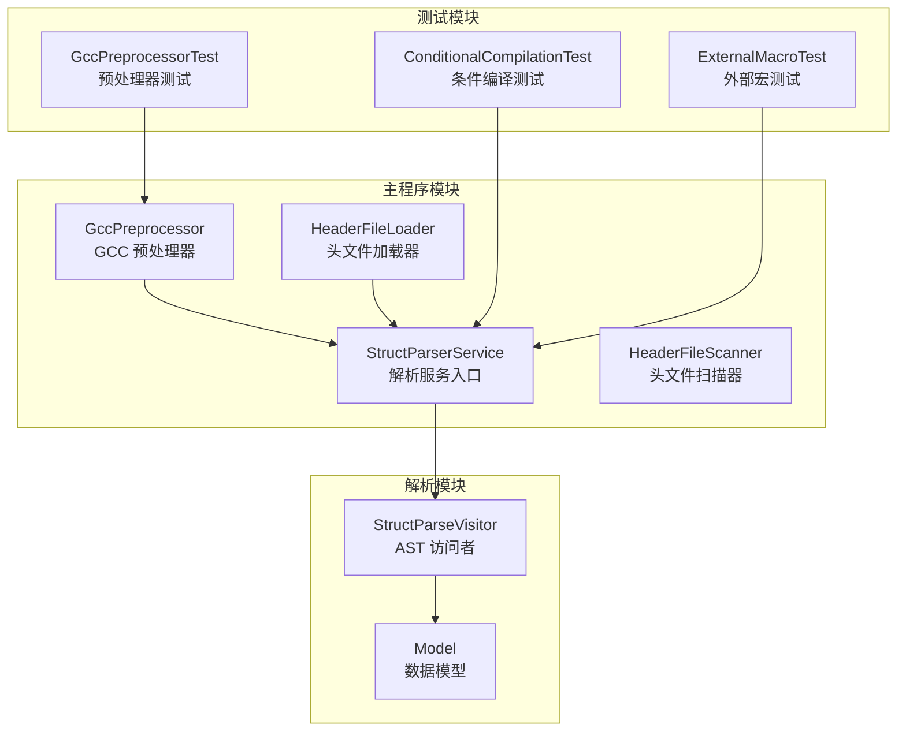
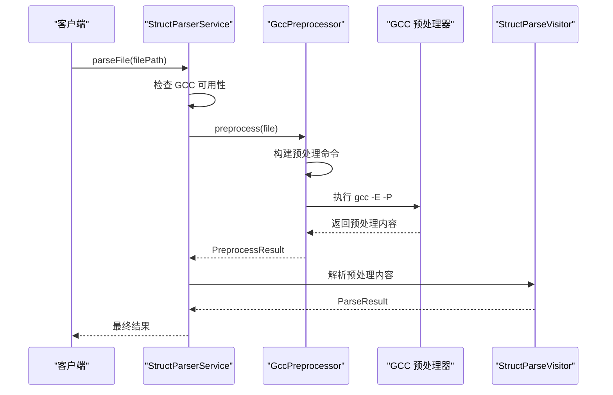
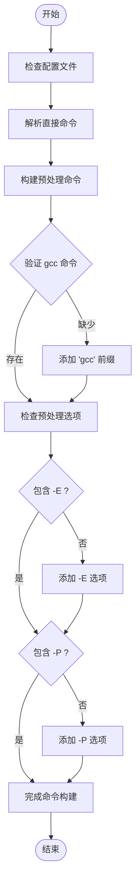
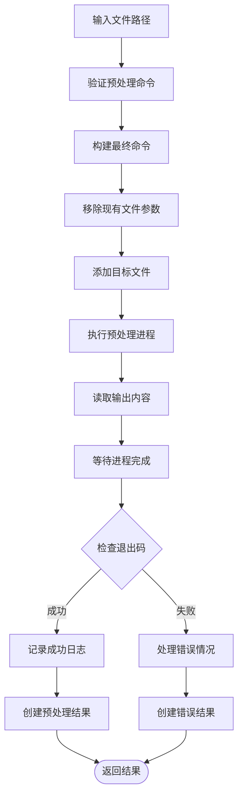
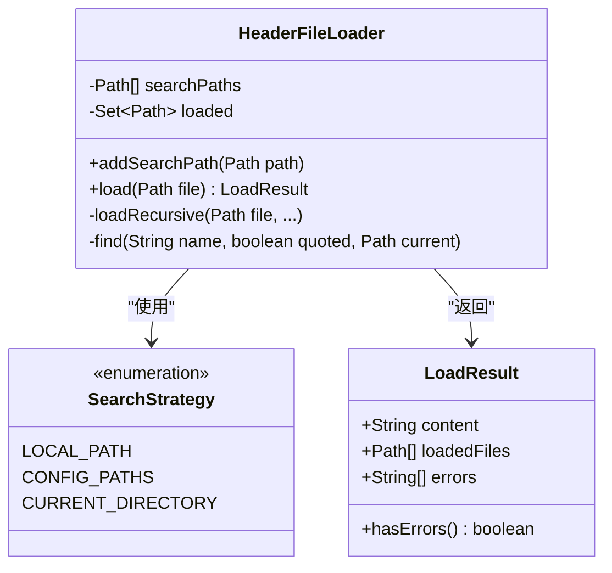
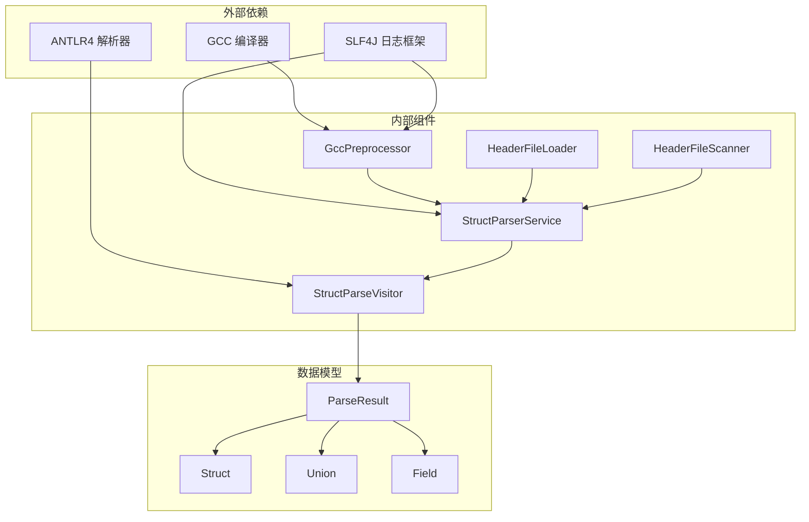

# GCC 预处理系统

<cite>
**本文档引用的文件**
- [GccPreprocessor.java](file://src/main/java/com/structparser/parser/GccPreprocessor.java)
- [StructParserService.java](file://src/main/java/com/structparser/parser/StructParserService.java)
- [HeaderFileLoader.java](file://src/main/java/com/structparser/parser/HeaderFileLoader.java)
- [HeaderFileScanner.java](file://src/main/java/com/structparser/parser/HeaderFileScanner.java)
- [StructParseVisitor.java](file://src/main/java/com/structparser/parser/StructParseVisitor.java)
- [GccPreprocessorTest.java](file://src/test/java/com/structparser/parser/GccPreprocessorTest.java)
- [ConditionalCompilationWithGccTest.java](file://src/test/java/com/structparser/parser/ConditionalCompilationWithGccTest.java)
- [ExternalMacroDefinitionTest.java](file://src/test/java/com/structparser/parser/ExternalMacroDefinitionTest.java)
- [ConditionalCompilationTest.java](file://src/test/java/com/structparser/parser/ConditionalCompilationTest.java)
- [command.txt](file://src/main/resources/include/command.txt)
- [README.md](file://README.md)
</cite>

## 目录
1. [简介](#简介)
2. [项目结构](#项目结构)
3. [核心组件](#核心组件)
4. [架构概览](#架构概览)
5. [详细组件分析](#详细组件分析)
6. [依赖关系分析](#依赖关系分析)
7. [性能考虑](#性能考虑)
8. [故障排除指南](#故障排除指南)
9. [结论](#结论)

## 简介

GCC 预处理系统是 Struct Parser 项目的核心组件之一，负责在解析 C 风格结构体之前对头文件进行预处理。该系统完全基于 GCC 的 C 预处理器，支持完整的条件编译指令、宏定义处理和头文件包含机制。

该项目专门设计用于嵌入式系统和硬件寄存器描述，能够解析复杂的 C 结构体和联合体定义，并生成包含位级字段布局的 JSON 输出。预处理阶段确保了对真实世界头文件的完整支持，包括条件编译、宏展开和跨文件引用。

## 项目结构

项目采用模块化架构，主要包含以下核心模块：



**图表来源**
- [GccPreprocessor.java:1-194](file://src/main/java/com/structparser/parser/GccPreprocessor.java#L1-L194)
- [StructParserService.java:1-185](file://src/main/java/com/structparser/parser/StructParserService.java#L1-L185)
- [HeaderFileLoader.java:1-96](file://src/main/java/com/structparser/parser/HeaderFileLoader.java#L1-L96)

**章节来源**
- [README.md:391-428](file://README.md#L391-L428)

## 核心组件

### GCC 预处理器 (GccPreprocessor)

GccPreprocessor 是整个预处理系统的核心组件，负责执行 GCC 预处理命令并处理预处理结果。

**主要功能特性：**
- 支持自定义 GCC 命令配置
- 自动添加必要的预处理选项 (-E, -P)
- 动态构建预处理命令
- 错误处理和日志记录
- 预处理内容的调试输出

**关键实现特点：**
- 使用 ProcessBuilder 启动 GCC 进程
- 支持流式输出读取
- 提供详细的错误信息
- 支持版本检查和可用性验证

**章节来源**
- [GccPreprocessor.java:14-194](file://src/main/java/com/structparser/parser/GccPreprocessor.java#L14-L194)

### 解析服务入口 (StructParserService)

StructParserService 作为整个解析流程的协调者，管理预处理和解析的完整工作流程。

**核心职责：**
- 加载编译配置文件
- 协调预处理和解析过程
- 错误处理和状态管理
- 支持两种预处理模式：GCC 预处理和自定义 #include 处理

**章节来源**
- [StructParserService.java:20-185](file://src/main/java/com/structparser/parser/StructParserService.java#L20-L185)

### 头文件加载器 (HeaderFileLoader)

当禁用 GCC 预处理时，HeaderFileLoader 提供自定义的 #include 处理机制。

**功能特性：**
- 递归解析 #include 指令
- 支持多种包含路径格式
- 检测循环包含
- 错误恢复机制

**章节来源**
- [HeaderFileLoader.java:11-96](file://src/main/java/com/structparser/parser/HeaderFileLoader.java#L11-L96)

## 架构概览

GCC 预处理系统采用分层架构设计，确保了模块间的清晰分离和高内聚低耦合。



**图表来源**
- [StructParserService.java:60-102](file://src/main/java/com/structparser/parser/StructParserService.java#L60-L102)
- [GccPreprocessor.java:85-158](file://src/main/java/com/structparser/parser/GccPreprocessor.java#L85-L158)

## 详细组件分析

### GCC 预处理命令构建机制

GccPreprocessor 实现了智能的命令构建逻辑，确保预处理过程的正确性和完整性。



**图表来源**
- [GccPreprocessor.java:54-80](file://src/main/java/com/structparser/parser/GccPreprocessor.java#L54-L80)

**章节来源**
- [GccPreprocessor.java:28-80](file://src/main/java/com/structparser/parser/GccPreprocessor.java#L28-L80)

### 预处理文件处理流程

预处理文件处理是一个多步骤的过程，涉及命令构建、进程执行和结果处理。



**图表来源**
- [GccPreprocessor.java:85-158](file://src/main/java/com/structparser/parser/GccPreprocessor.java#L85-L158)

**章节来源**
- [GccPreprocessor.java:85-158](file://src/main/java/com/structparser/parser/GccPreprocessor.java#L85-L158)

### 条件编译处理机制

系统支持完整的 C 条件编译指令，通过 GCC 预处理实现条件代码的选择性包含。

**支持的条件编译指令：**
- `#ifdef` / `#ifndef` - 基于宏定义的条件编译
- `#if` / `#elif` / `#else` - 基于表达式的条件编译
- `#endif` - 条件编译块结束

**宏定义支持：**
- 命令行定义：`-Dmacro[=value]`
- 外部文件包含：`-include file` 和 `-imacros file`
- 嵌套条件编译：支持多层条件嵌套

**章节来源**
- [ConditionalCompilationWithGccTest.java:36-253](file://src/test/java/com/structparser/parser/ConditionalCompilationWithGccTest.java#L36-L253)
- [ExternalMacroDefinitionTest.java:35-258](file://src/test/java/com/structparser/parser/ExternalMacroDefinitionTest.java#L35-L258)

### 头文件包含路径管理

系统提供了灵活的头文件包含路径管理机制，支持多种包含策略。



**图表来源**
- [HeaderFileLoader.java:14-96](file://src/main/java/com/structparser/parser/HeaderFileLoader.java#L14-L96)

**章节来源**
- [HeaderFileLoader.java:14-96](file://src/main/java/com/structparser/parser/HeaderFileLoader.java#L14-L96)

## 依赖关系分析

系统采用松耦合的设计，各组件间通过清晰的接口进行交互。



**图表来源**
- [GccPreprocessor.java:1-194](file://src/main/java/com/structparser/parser/GccPreprocessor.java#L1-L194)
- [StructParserService.java:1-185](file://src/main/java/com/structparser/parser/StructParserService.java#L1-L185)

**章节来源**
- [StructParserService.java:23-34](file://src/main/java/com/structparser/parser/StructParserService.java#L23-L34)

## 性能考虑

### 预处理性能优化

1. **命令构建优化**
   - 避免不必要的字符串操作
   - 使用 ArrayList 进行动态命令构建
   - 智能检测和添加必需选项

2. **进程管理**
   - 使用 ProcessBuilder 进行高效进程启动
   - 流式读取避免内存溢出
   - 及时清理进程资源

3. **缓存策略**
   - 防止重复包含同一文件
   - 维护已处理文件集合
   - 限制递归包含深度

### 内存使用优化

- 使用缓冲区流式处理大文件
- 及时释放不再使用的对象
- 避免创建不必要的中间字符串

## 故障排除指南

### 常见问题及解决方案

**GCC 不可用**
- 症状：预处理失败，提示 GCC 不可用
- 解决方案：安装 GCC 编译器或禁用 GCC 预处理

**预处理命令配置错误**
- 症状：编译配置文件格式不正确
- 解决方案：检查 command.txt 文件格式，确保包含有效的 gcc 命令

**头文件包含失败**
- 症状：无法找到包含的头文件
- 解决方案：验证包含路径，检查文件是否存在

**条件编译问题**
- 症状：条件编译结果不符合预期
- 解决方案：检查宏定义是否正确传递给 GCC

**章节来源**
- [GccPreprocessorTest.java:314-364](file://src/test/java/com/structparser/parser/GccPreprocessorTest.java#L314-L364)

### 调试技巧

1. **启用详细日志**
   - 查看 logs/preprocessed.log 获取预处理内容
   - 检查 logs/struct-parser.log 获取错误信息

2. **验证 GCC 版本**
   ```bash
   java -jar target/struct-parser-1.0.0-jar-with-dependencies.jar gcc-info
   ```

3. **测试预处理命令**
   ```bash
   gcc -E -P -I. test.h > output.txt
   ```

**章节来源**
- [README.md:469-485](file://README.md#L469-L485)

## 结论

GCC 预处理系统为 Struct Parser 项目提供了强大的 C 预处理能力，支持完整的条件编译、宏定义和头文件包含机制。通过模块化的架构设计和完善的错误处理机制，该系统能够可靠地处理复杂的头文件解析任务。

系统的主要优势包括：
- 完整的 GCC 预处理支持
- 灵活的配置选项
- 强大的条件编译能力
- 优秀的错误处理和调试支持
- 良好的性能表现

未来可以考虑的功能增强包括：
- 更丰富的预处理选项支持
- 预处理结果缓存机制
- 更详细的性能监控
- 增强的错误诊断功能