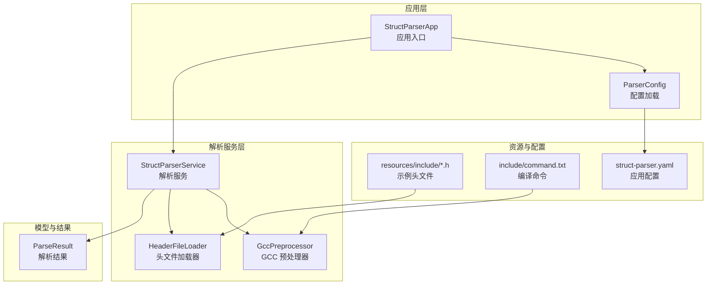
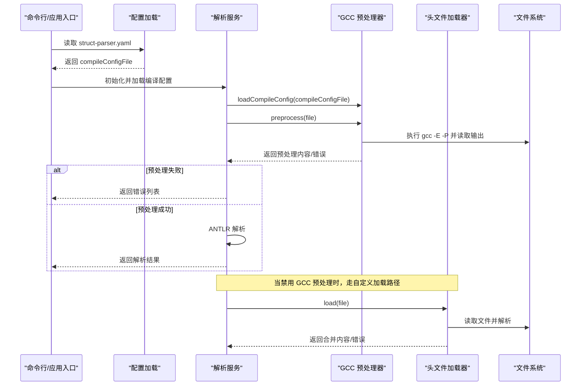
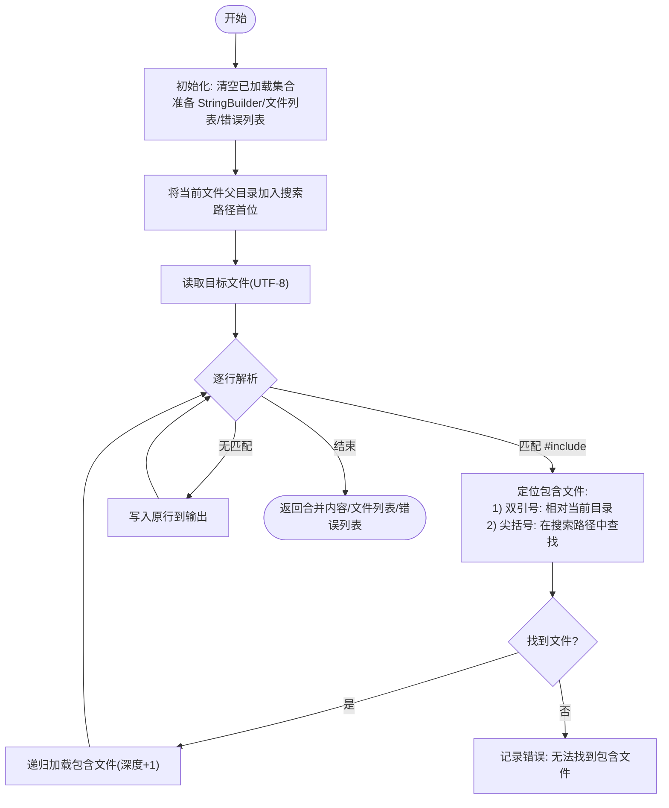
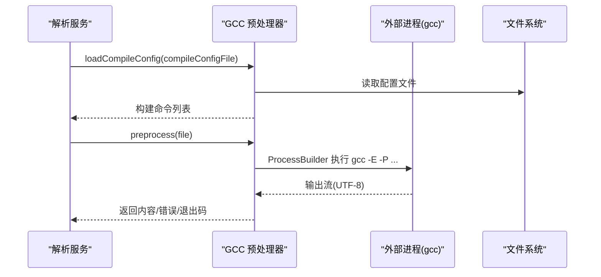
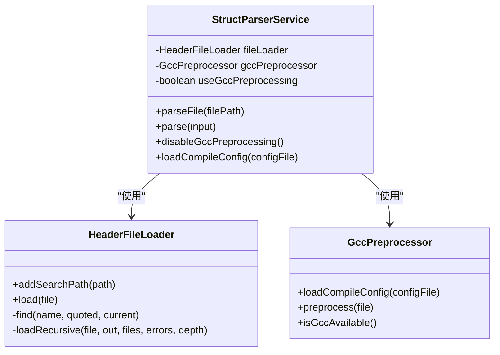
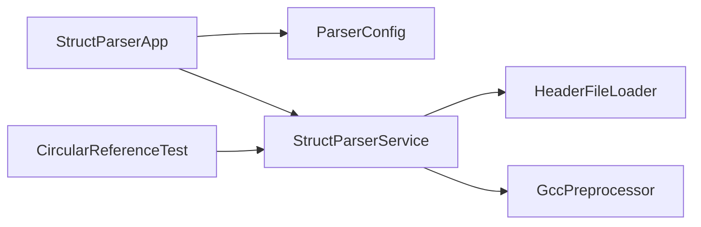

# 头文件加载器

<cite>
**本文档引用的文件**
- [HeaderFileLoader.java](file://src/main/java/com/structparser/parser/HeaderFileLoader.java)
- [GccPreprocessor.java](file://src/main/java/com/structparser/parser/GccPreprocessor.java)
- [HeaderFileScanner.java](file://src/main/java/com/structparser/parser/HeaderFileScanner.java)
- [StructParserService.java](file://src/main/java/com/structparser/parser/StructParserService.java)
- [StructParserApp.java](file://src/main/java/com/structparser/StructParserApp.java)
- [ParserConfig.java](file://src/main/java/com/structparser/config/ParserConfig.java)
- [ParseResult.java](file://src/main/java/com/structparser/model/ParseResult.java)
- [CircularReferenceTest.java](file://src/test/java/com/structparser/parser/CircularReferenceTest.java)
- [circular_a.h](file://src/test/resources/headers/circular_a.h)
- [circular_b.h](file://src/test/resources/headers/circular_b.h)
- [types.h](file://src/main/resources/include/types.h)
- [base_types.h](file://src/main/resources/include/base_types.h)
- [device_types.h](file://src/main/resources/include/device_types.h)
- [command.txt](file://src/main/resources/include/command.txt)
- [struct-parser.yaml](file://struct-parser.yaml)
</cite>

## 目录
1. [简介](#简介)
2. [项目结构](#项目结构)
3. [核心组件](#核心组件)
4. [架构总览](#架构总览)
5. [详细组件分析](#详细组件分析)
6. [依赖关系分析](#依赖关系分析)
7. [性能考虑](#性能考虑)
8. [故障排除指南](#故障排除指南)
9. [结论](#结论)
10. [附录](#附录)

## 简介
本文件面向“头文件加载器”的设计与实现，聚焦以下主题：
- 文件读取机制：如何读取源文件、处理包含指令、构建合并后的文本内容
- 编码处理：统一采用 UTF-8 字符集进行读写
- 内容缓存策略：基于已加载文件集合的去重与深度限制
- 文件加载优先级规则：相对路径优先于包含路径搜索
- 依赖关系解析与循环引用检测：在解析阶段识别交叉引用问题
- 大文件处理优化与内存管理：深度限制、流式处理思路
- 路径解析、包含路径搜索与相对路径处理：绝对化、规范化与搜索顺序
- 故障排除与性能调优建议：日志、错误收集与 GCC 预处理开关

## 项目结构
该项目是一个基于 Java 的 C 风格结构体/联合体解析工具，核心解析流程由应用入口驱动，通过编译配置文件（如 command.txt）启动 GCC 预处理，随后交由解析器进行语法分析与语义抽取。

图表来源
- [StructParserApp.java:1-286](file://src/main/java/com/structparser/StructParserApp.java#L1-L286)
- [StructParserService.java:1-185](file://src/main/java/com/structparser/parser/StructParserService.java#L1-L185)
- [HeaderFileLoader.java:1-96](file://src/main/java/com/structparser/parser/HeaderFileLoader.java#L1-L96)
- [GccPreprocessor.java:1-194](file://src/main/java/com/structparser/parser/GccPreprocessor.java#L1-L194)
- [ParserConfig.java:1-53](file://src/main/java/com/structparser/config/ParserConfig.java#L1-L53)
- [ParseResult.java:1-78](file://src/main/java/com/structparser/model/ParseResult.java#L1-L78)
- [command.txt:1-2](file://src/main/resources/include/command.txt#L1-L2)
- [struct-parser.yaml:1-17](file://struct-parser.yaml#L1-L17)

章节来源
- [StructParserApp.java:1-286](file://src/main/java/com/structparser/StructParserApp.java#L1-L286)
- [struct-parser.yaml:1-17](file://struct-parser.yaml#L1-L17)

## 核心组件
- 头文件加载器（HeaderFileLoader）：负责读取文件、解析 #include 指令、按顺序拼接内容，并进行循环引用检测与错误收集
- GCC 预处理器（GccPreprocessor）：读取编译配置，构建并执行 gcc -E -P 命令，返回预处理后的文本
- 解析服务（StructParserService）：协调预处理与加载两种模式，驱动 ANTLR 解析，汇总错误
- 应用入口（StructParserApp）：从配置文件加载编译命令，扫描头文件，逐个解析并输出结果
- 配置（ParserConfig）：校验编译配置文件存在性与有效性
- 解析结果（ParseResult）：不可变记录类，封装结构体、联合体、类型别名与错误列表

章节来源
- [HeaderFileLoader.java:1-96](file://src/main/java/com/structparser/parser/HeaderFileLoader.java#L1-L96)
- [GccPreprocessor.java:1-194](file://src/main/java/com/structparser/parser/GccPreprocessor.java#L1-L194)
- [StructParserService.java:1-185](file://src/main/java/com/structparser/parser/StructParserService.java#L1-L185)
- [ParserConfig.java:1-53](file://src/main/java/com/structparser/config/ParserConfig.java#L1-L53)
- [ParseResult.java:1-78](file://src/main/java/com/structparser/model/ParseResult.java#L1-L78)

## 架构总览
下图展示了从应用入口到解析完成的整体流程，包括两种文件加载路径：GCC 预处理与自定义 #include 处理。

图表来源
- [StructParserApp.java:135-227](file://src/main/java/com/structparser/StructParserApp.java#L135-L227)
- [StructParserService.java:39-102](file://src/main/java/com/structparser/parser/StructParserService.java#L39-L102)
- [GccPreprocessor.java:85-158](file://src/main/java/com/structparser/parser/GccPreprocessor.java#L85-L158)
- [HeaderFileLoader.java:29-78](file://src/main/java/com/structparser/parser/HeaderFileLoader.java#L29-L78)

## 详细组件分析

### 头文件加载器（HeaderFileLoader）
职责与行为
- 读取文件：以 UTF-8 编码读取源文件内容
- 解析包含指令：使用正则匹配 #include "..." 与 #include <...>
- 路径解析与搜索：
  - 若为双引号形式，优先在当前文件所在目录查找
  - 将当前文件目录插入搜索路径首位，随后按顺序在配置的搜索路径中查找
  - 对每个候选路径进行标准化（normalize），确保唯一性与可比较性
- 内容拼接：为每个被包含文件追加分隔注释，然后将源行原样写入
- 循环引用检测：维护已加载文件集合，避免重复加载
- 错误收集：记录文件不存在、读取异常、包含文件未找到、包含层级过深等错误
- 深度限制：超过阈值（例如 100 层）即终止递归并报告错误

数据结构与复杂度
- 已加载集合：Set<Path>，用于 O(1) 查重
- 搜索路径列表：List<Path>，每次查找为 O(k)，k 为搜索路径数量
- 时间复杂度：近似 O(N) 线性扫描，其中 N 为总字符数；包含解析为线性行遍历
- 空间复杂度：O(M) 存储已加载文件与结果字符串，M 为合并后内容大小

图表来源
- [HeaderFileLoader.java:29-78](file://src/main/java/com/structparser/parser/HeaderFileLoader.java#L29-L78)

章节来源
- [HeaderFileLoader.java:1-96](file://src/main/java/com/structparser/parser/HeaderFileLoader.java#L1-L96)

### GCC 预处理器（GccPreprocessor）
职责与行为
- 从编译配置文件加载预处理命令，构建 gcc -E -P 命令序列
- 执行外部进程，捕获标准输出作为预处理结果
- 错误处理：进程中断、退出码非零、输出截断等均记录为错误
- 日志记录：成功时输出长度信息，失败时输出错误摘要与部分输出预览

关键点
- 命令构建：若未显式包含 gcc、-E、-P，会自动补齐
- 输入文件替换：移除命令中可能存在的 .c/.h/.cpp 文件，避免冲突
- 输出内容：以 UTF-8 读取并返回字符串

图表来源
- [GccPreprocessor.java:28-42](file://src/main/java/com/structparser/parser/GccPreprocessor.java#L28-L42)
- [GccPreprocessor.java:85-158](file://src/main/java/com/structparser/parser/GccPreprocessor.java#L85-L158)

章节来源
- [GccPreprocessor.java:1-194](file://src/main/java/com/structparser/parser/GccPreprocessor.java#L1-L194)

### 解析服务（StructParserService）
职责与行为
- 统一入口：根据配置决定使用 GCC 预处理还是自定义加载
- 错误传播：将预处理或加载阶段的错误汇总到 ParseResult
- ANTLR 解析：词法分析、语法分析、访问者模式收集结构体/联合体/类型别名
- 错误监听：自定义错误监听器收集语法错误并附加到结果

图表来源
- [StructParserService.java:23-34](file://src/main/java/com/structparser/parser/StructParserService.java#L23-L34)
- [HeaderFileLoader.java:14-96](file://src/main/java/com/structparser/parser/HeaderFileLoader.java#L14-L96)
- [GccPreprocessor.java:17-194](file://src/main/java/com/structparser/parser/GccPreprocessor.java#L17-L194)

章节来源
- [StructParserService.java:1-185](file://src/main/java/com/structparser/parser/StructParserService.java#L1-L185)

### 应用入口（StructParserApp）
职责与行为
- 从 struct-parser.yaml 加载配置，校验 compileConfigFile 存在性
- 从编译配置文件所在目录扫描头文件（简化实现：扫描目录内所有 .h 文件）
- 逐个解析并合并结果，生成 JSON 输出至文件或标准输出
- 提供 gcc-info 命令检查 GCC 可用性与版本

章节来源
- [StructParserApp.java:1-286](file://src/main/java/com/structparser/StructParserApp.java#L1-L286)
- [struct-parser.yaml:1-17](file://struct-parser.yaml#L1-L17)

### 配置与结果模型
- 配置（ParserConfig）：校验 compileConfigFile 存在且有效
- 结果（ParseResult）：不可变记录类，提供查询与扩展方法

章节来源
- [ParserConfig.java:1-53](file://src/main/java/com/structparser/config/ParserConfig.java#L1-L53)
- [ParseResult.java:1-78](file://src/main/java/com/structparser/model/ParseResult.java#L1-L78)

## 依赖关系分析
- 应用入口依赖配置加载与解析服务
- 解析服务同时依赖头文件加载器与 GCC 预处理器
- 头文件加载器与 GCC 预处理器相互独立，由解析服务在运行时选择其一
- 测试用例验证交叉引用检测能力，间接反映解析阶段的依赖关系处理

图表来源
- [StructParserApp.java:135-227](file://src/main/java/com/structparser/StructParserApp.java#L135-L227)
- [StructParserService.java:23-34](file://src/main/java/com/structparser/parser/StructParserService.java#L23-L34)
- [HeaderFileLoader.java:14-96](file://src/main/java/com/structparser/parser/HeaderFileLoader.java#L14-L96)
- [GccPreprocessor.java:17-194](file://src/main/java/com/structparser/parser/GccPreprocessor.java#L17-L194)
- [CircularReferenceTest.java:1-146](file://src/test/java/com/structparser/parser/CircularReferenceTest.java#L1-L146)

章节来源
- [StructParserApp.java:1-286](file://src/main/java/com/structparser/StructParserApp.java#L1-L286)
- [StructParserService.java:1-185](file://src/main/java/com/structparser/parser/StructParserService.java#L1-L185)
- [CircularReferenceTest.java:1-146](file://src/test/java/com/structparser/parser/CircularReferenceTest.java#L1-L146)

## 性能考虑
- 包含深度限制：防止深层递归导致栈溢出与内存膨胀（阈值示例：100 层）
- 路径标准化：避免重复路径与相对路径差异造成的重复 IO
- 搜索路径顺序：将当前文件目录置于首位，减少查找时间
- 字符串拼接：使用 StringBuilder 降低频繁拼接成本
- 编码一致性：统一 UTF-8，避免转码开销
- 大文件优化建议：
  - 使用流式读取替代一次性读取（当前实现为读取全部，可考虑按块读取）
  - 对超大文件可考虑分段处理或外部预处理（优先使用 GCC 预处理）
  - 控制包含层级与去重策略，避免指数级膨胀
- 内存管理：
  - 及时释放中间结果，避免长时间持有大字符串
  - 使用不可变数据结构（如 ParseResult）便于共享与 GC

[本节为通用性能指导，无需特定文件引用]

## 故障排除指南
常见问题与排查步骤
- GCC 不可用
  - 现象：解析服务提示需要安装 GCC 或禁用 GCC 预处理
  - 排查：使用 gcc-info 命令确认 GCC 可用性与版本
  - 处理：安装 GCC 或在解析服务中禁用 GCC 预处理
- 编译配置文件缺失或无效
  - 现象：配置校验失败或找不到编译配置文件
  - 排查：检查 struct-parser.yaml 中 compileConfigFile 路径是否存在
  - 处理：修正路径或创建对应文件
- 包含文件未找到
  - 现象：加载器报告无法找到包含文件
  - 排查：确认包含路径是否在搜索路径中，相对路径是否正确
  - 处理：添加包含路径或修正包含语句
- 包含层级过深
  - 现象：加载器报告包含深度超出限制
  - 排查：检查是否存在循环包含或深层嵌套
  - 处理：重构头文件结构，拆分或去环
- 交叉引用/前向引用错误
  - 现象：解析阶段报告交叉引用或前向引用错误
  - 排查：查看测试用例与实际头文件，定位循环引用链
  - 处理：调整数据结构设计，避免循环引用

章节来源
- [StructParserApp.java:62-68](file://src/main/java/com/structparser/StructParserApp.java#L62-L68)
- [StructParserService.java:67-73](file://src/main/java/com/structparser/parser/StructParserService.java#L67-L73)
- [HeaderFileLoader.java:43-46](file://src/main/java/com/structparser/parser/HeaderFileLoader.java#L43-L46)
- [CircularReferenceTest.java:12-35](file://src/test/java/com/structparser/parser/CircularReferenceTest.java#L12-L35)

## 结论
头文件加载器通过简洁的递归策略与严格的去重控制，实现了对 C 风格头文件包含关系的可靠解析。结合 GCC 预处理，系统能够在真实工程环境中处理复杂的宏展开与条件编译。通过配置化的编译命令与可选的自定义加载模式，系统兼顾了灵活性与稳定性。建议在大规模工程中配合路径规范化、包含层级控制与外部预处理，以获得更佳的性能与可靠性。

[本节为总结性内容，无需特定文件引用]

## 附录

### 文件路径解析与包含路径搜索细节
- 相对路径处理：双引号形式的包含优先在当前文件目录解析，随后回退到搜索路径
- 绝对路径处理：读取时进行标准化（normalize），确保唯一性与可比较性
- 搜索路径顺序：当前文件目录优先，随后按配置顺序查找
- 错误定位：包含文件未找到时记录行号，便于快速定位

章节来源
- [HeaderFileLoader.java:80-90](file://src/main/java/com/structparser/parser/HeaderFileLoader.java#L80-L90)
- [HeaderFileLoader.java:35-38](file://src/main/java/com/structparser/parser/HeaderFileLoader.java#L35-L38)

### 编码处理
- 统一采用 UTF-8 进行文件读取与输出，确保跨平台兼容性
- 预处理输出同样以 UTF-8 读取，避免乱码

章节来源
- [HeaderFileLoader.java:54](file://src/main/java/com/structparser/parser/HeaderFileLoader.java#L54)
- [GccPreprocessor.java:123](file://src/main/java/com/structparser/parser/GccPreprocessor.java#L123)

### 内容缓存策略
- 已加载文件集合：Set<Path>，避免重复加载同一文件
- 合并内容：StringBuilder 逐步拼接，最终一次性返回
- 文件列表：记录包含顺序，便于调试与审计

章节来源
- [HeaderFileLoader.java:18-19](file://src/main/java/com/structparser/parser/HeaderFileLoader.java#L18-L19)
- [HeaderFileLoader.java:30-39](file://src/main/java/com/structparser/parser/HeaderFileLoader.java#L30-L39)

### 依赖关系解析与循环引用检测
- 依赖关系解析：通过 #include 指令建立文件间的包含关系
- 循环引用检测：在加载器中通过已加载集合进行检测；在解析阶段通过语义分析进一步识别交叉引用
- 测试覆盖：交叉引用测试用例验证了循环引用与前向引用的识别能力

章节来源
- [HeaderFileLoader.java:47](file://src/main/java/com/structparser/parser/HeaderFileLoader.java#L47)
- [CircularReferenceTest.java:12-35](file://src/test/java/com/structparser/parser/CircularReferenceTest.java#L12-L35)
- [circular_a.h:1-13](file://src/test/resources/headers/circular_a.h#L1-L13)
- [circular_b.h:1-13](file://src/test/resources/headers/circular_b.h#L1-L13)

### 大文件处理优化方案与内存管理策略
- 优化方案：
  - 使用流式读取替代一次性读取（当前实现为读取全部，可考虑按块读取）
  - 控制包含层级与去重策略，避免指数级膨胀
  - 优先使用 GCC 预处理，借助外部工具处理宏与条件编译
- 内存管理：
  - 及时释放中间结果，避免长时间持有大字符串
  - 使用不可变数据结构（如 ParseResult）便于共享与 GC

[本节为通用优化建议，无需特定文件引用]

### 配置与示例
- 应用配置（struct-parser.yaml）：指定编译配置文件路径与输出设置
- 编译命令示例（command.txt）：包含 -I 搜索路径与 -nostdinc 等选项
- 示例头文件：types.h、base_types.h、device_types.h 展示了多层嵌套与包含关系

章节来源
- [struct-parser.yaml:1-17](file://struct-parser.yaml#L1-L17)
- [command.txt:1-2](file://src/main/resources/include/command.txt#L1-L2)
- [types.h:1-99](file://src/main/resources/include/types.h#L1-L99)
- [base_types.h:1-28](file://src/main/resources/include/base_types.h#L1-L28)
- [device_types.h:1-50](file://src/main/resources/include/device_types.h#L1-L50)