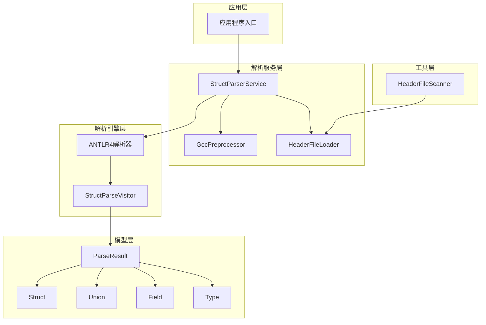
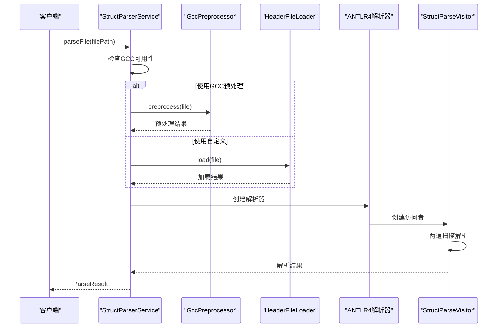
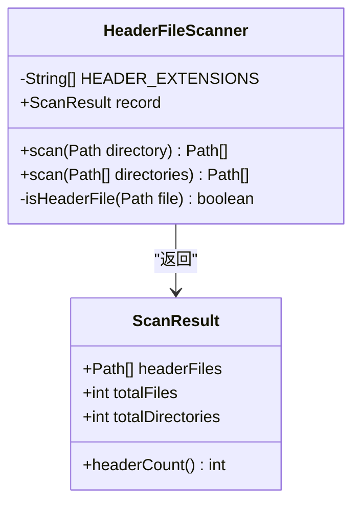
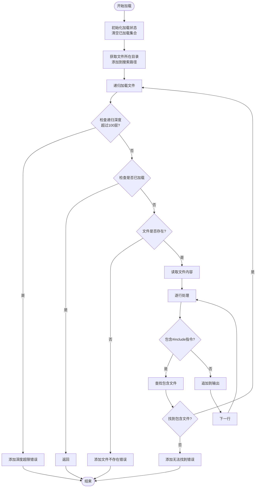
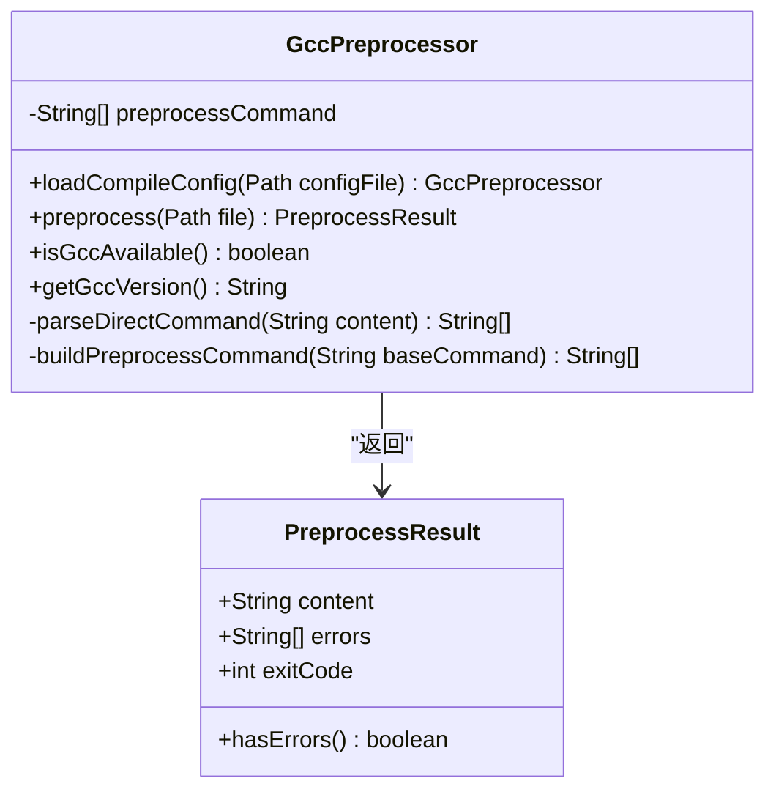
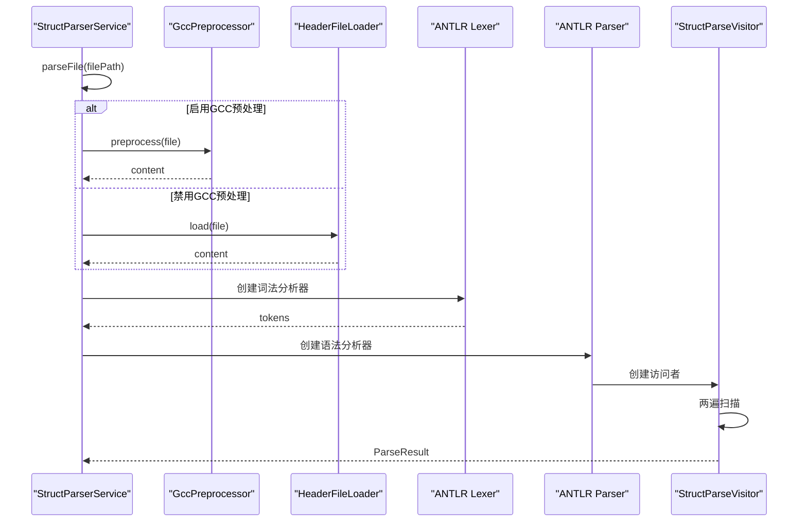
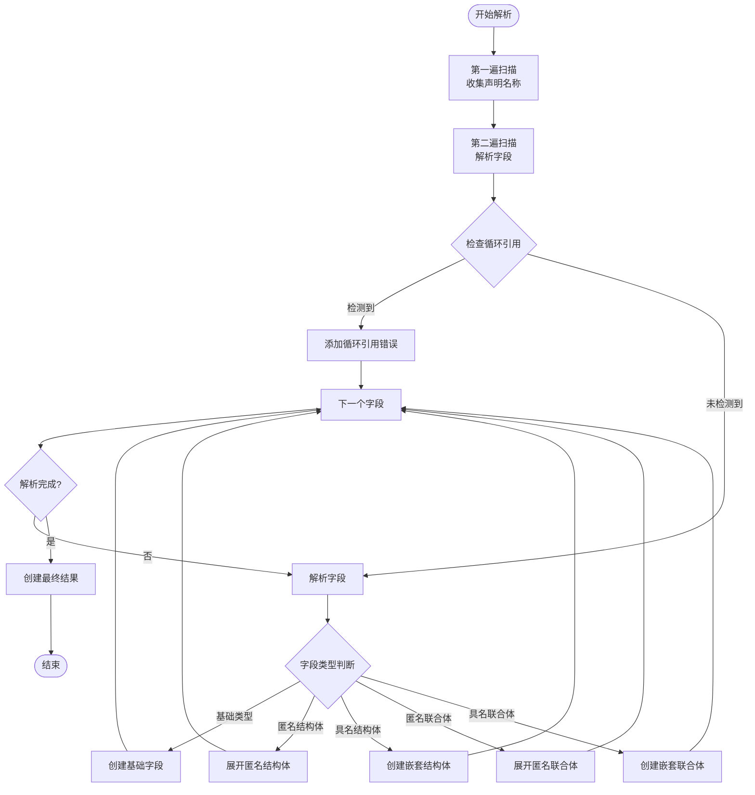
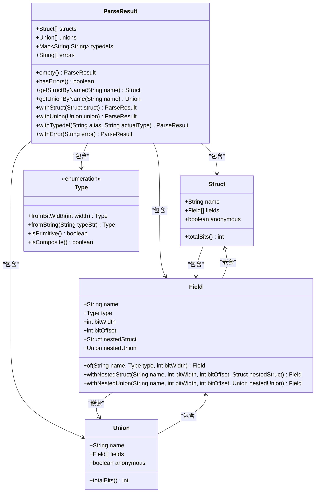
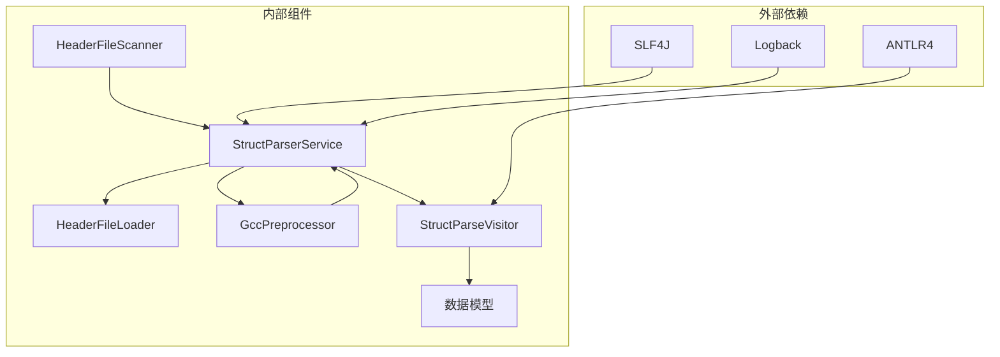
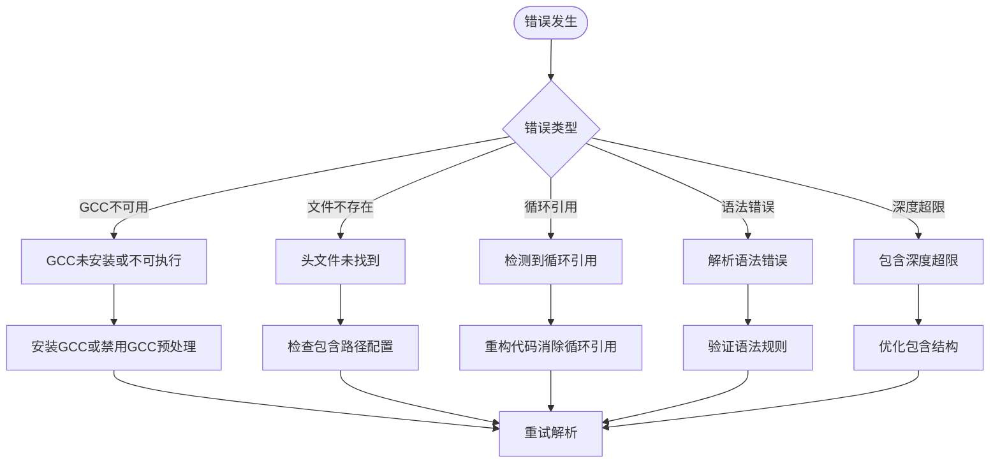

# 头文件处理系统

<cite>
**本文档引用的文件**
- [HeaderFileScanner.java](file://src/main/java/com/structparser/parser/HeaderFileScanner.java)
- [HeaderFileLoader.java](file://src/main/java/com/structparser/parser/HeaderFileLoader.java)
- [GccPreprocessor.java](file://src/main/java/com/structparser/parser/GccPreprocessor.java)
- [StructParserService.java](file://src/main/java/com/structparser/parser/StructParserService.java)
- [StructParseVisitor.java](file://src/main/java/com/structparser/parser/StructParseVisitor.java)
- [ParseResult.java](file://src/main/java/com/structparser/model/ParseResult.java)
- [Struct.java](file://src/main/java/com/structparser/model/Struct.java)
- [Union.java](file://src/main/java/com/structparser/model/Union.java)
- [Field.java](file://src/main/java/com/structparser/model/Field.java)
- [Type.java](file://src/main/java/com/structparser/model/Type.java)
- [MultiFileParserTest.java](file://src/test/java/com/structparser/parser/MultiFileParserTest.java)
- [CircularReferenceTest.java](file://src/test/java/com/structparser/parser/CircularReferenceTest.java)
- [base_types.h](file://src/main/resources/include/base_types.h)
- [types.h](file://src/main/resources/include/types.h)
- [README.md](file://README.md)
</cite>

## 目录
1. [简介](#简介)
2. [项目结构](#项目结构)
3. [核心组件](#核心组件)
4. [架构概览](#架构概览)
5. [详细组件分析](#详细组件分析)
6. [依赖关系分析](#依赖关系分析)
7. [性能考虑](#性能考虑)
8. [故障排除指南](#故障排除指南)
9. [结论](#结论)
10. [附录](#附录)

## 简介
本系统是一个专门针对嵌入式系统和硬件寄存器描述设计的C风格结构体/联合体解析工具。它提供了完整的头文件处理能力，包括头文件扫描、文件发现算法、跨文件引用解析、依赖关系管理、头文件加载策略、缓存机制以及性能优化。系统支持GCC预处理和自定义#include处理两种模式，能够处理复杂的条件编译、循环依赖检测和语法容错。

## 项目结构
项目采用分层架构设计，主要分为以下层次：

**图表来源**
- [StructParserService.java:23-34](file://src/main/java/com/structparser/parser/StructParserService.java#L23-L34)
- [GccPreprocessor.java:17-22](file://src/main/java/com/structparser/parser/GccPreprocessor.java#L17-L22)
- [HeaderFileLoader.java:14-23](file://src/main/java/com/structparser/parser/HeaderFileLoader.java#L14-L23)

**章节来源**
- [README.md:391-428](file://README.md#L391-L428)

## 核心组件
系统的核心组件包括头文件扫描器、头文件加载器、GCC预处理器和解析服务。每个组件都有明确的职责分工和清晰的接口定义。

### 头文件扫描机制
头文件扫描器负责递归扫描目录中的所有头文件，支持多种文件扩展名（.h, .hpp, .hh, .hxx）。它提供了单目录扫描和多目录扫描两种模式，确保能够覆盖项目中的所有头文件。

### 文件发现算法
系统采用深度优先搜索算法来发现和解析头文件依赖关系。算法会跟踪已加载的文件，避免重复处理和循环包含问题。

### 跨文件引用解析
通过两遍扫描机制实现跨文件引用解析。第一遍扫描收集所有顶层声明的名称，第二遍扫描进行实际解析，同时检测循环引用和前向引用问题。

### 依赖关系管理
系统维护一个包含路径搜索列表，支持相对路径和绝对路径的混合使用。它能够处理#include "file"和#include <file>两种包含语法。

**章节来源**
- [HeaderFileScanner.java:12-75](file://src/main/java/com/structparser/parser/HeaderFileScanner.java#L12-L75)
- [HeaderFileLoader.java:14-96](file://src/main/java/com/structparser/parser/HeaderFileLoader.java#L14-L96)
- [StructParseVisitor.java:21-44](file://src/main/java/com/structparser/parser/StructParseVisitor.java#L21-L44)

## 架构概览
系统采用模块化架构设计，各组件之间通过清晰的接口进行通信。整体架构遵循单一职责原则，确保每个组件专注于特定的功能领域。

**图表来源**
- [StructParserService.java:60-102](file://src/main/java/com/structparser/parser/StructParserService.java#L60-L102)
- [GccPreprocessor.java:85-158](file://src/main/java/com/structparser/parser/GccPreprocessor.java#L85-L158)
- [HeaderFileLoader.java:29-40](file://src/main/java/com/structparser/parser/HeaderFileLoader.java#L29-L40)

## 详细组件分析

### 头文件扫描器 (HeaderFileScanner)
头文件扫描器实现了高效的文件发现算法，支持多种文件扩展名和目录扫描模式。

**图表来源**
- [HeaderFileScanner.java:12-75](file://src/main/java/com/structparser/parser/HeaderFileScanner.java#L12-L75)

**章节来源**
- [HeaderFileScanner.java:19-51](file://src/main/java/com/structparser/parser/HeaderFileScanner.java#L19-L51)

### 头文件加载器 (HeaderFileLoader)
头文件加载器负责处理#include指令，实现文件包含路径解析和递归加载功能。

**图表来源**
- [HeaderFileLoader.java:42-78](file://src/main/java/com/structparser/parser/HeaderFileLoader.java#L42-L78)

**章节来源**
- [HeaderFileLoader.java:29-95](file://src/main/java/com/structparser/parser/HeaderFileLoader.java#L29-L95)

### GCC预处理器 (GccPreprocessor)
GCC预处理器提供完整的C预处理功能，支持条件编译、宏定义和包含文件处理。

**图表来源**
- [GccPreprocessor.java:17-194](file://src/main/java/com/structparser/parser/GccPreprocessor.java#L17-L194)

**章节来源**
- [GccPreprocessor.java:28-158](file://src/main/java/com/structparser/parser/GccPreprocessor.java#L28-L158)

### 解析服务 (StructParserService)
解析服务是系统的主控制器，协调各个组件的工作流程。

**图表来源**
- [StructParserService.java:60-153](file://src/main/java/com/structparser/parser/StructParserService.java#L60-L153)

**章节来源**
- [StructParserService.java:39-102](file://src/main/java/com/structparser/parser/StructParserService.java#L39-L102)

### 解析访问者 (StructParseVisitor)
解析访问者实现两遍扫描算法，处理复杂的嵌套结构和引用解析。

**图表来源**
- [StructParseVisitor.java:36-44](file://src/main/java/com/structparser/parser/StructParseVisitor.java#L36-L44)
- [StructParseVisitor.java:287-347](file://src/main/java/com/structparser/parser/StructParseVisitor.java#L287-L347)

**章节来源**
- [StructParseVisitor.java:68-134](file://src/main/java/com/structparser/parser/StructParseVisitor.java#L68-L134)

### 数据模型
系统使用Java Records定义数据模型，确保不可变性和线程安全。

**图表来源**
- [ParseResult.java:10-78](file://src/main/java/com/structparser/model/ParseResult.java#L10-L78)
- [Struct.java:9-47](file://src/main/java/com/structparser/model/Struct.java#L9-L47)
- [Union.java:9-20](file://src/main/java/com/structparser/model/Union.java#L9-L20)
- [Field.java:6-23](file://src/main/java/com/structparser/model/Field.java#L6-L23)
- [Type.java:6-104](file://src/main/java/com/structparser/model/Type.java#L6-L104)

**章节来源**
- [ParseResult.java:24-77](file://src/main/java/com/structparser/model/ParseResult.java#L24-L77)
- [Struct.java:15-45](file://src/main/java/com/structparser/model/Struct.java#L15-L45)

## 依赖关系分析
系统采用松耦合的设计，组件之间的依赖关系清晰明确。

**图表来源**
- [StructParserService.java:3-19](file://src/main/java/com/structparser/parser/StructParserService.java#L3-L19)
- [GccPreprocessor.java:3-12](file://src/main/java/com/structparser/parser/GccPreprocessor.java#L3-L12)

**章节来源**
- [StructParserService.java:27-34](file://src/main/java/com/structparser/parser/StructParserService.java#L27-L34)
- [GccPreprocessor.java:19-21](file://src/main/java/com/structparser/parser/GccPreprocessor.java#L19-L21)

## 性能考虑
系统在设计时充分考虑了性能优化，采用了多种策略来提升处理效率：

### 缓存机制
- **文件加载缓存**: 使用HashSet记录已加载的文件路径，避免重复处理
- **递归深度限制**: 设置最大递归深度（100层）防止无限递归
- **包含路径缓存**: 维护搜索路径列表，避免重复的路径查找

### 优化策略
- **流式处理**: 使用BufferedReader进行大文件的流式读取
- **延迟解析**: 两遍扫描减少不必要的重复工作
- **内存管理**: 使用Records确保不可变性，减少内存碎片

### 并发处理
- **单线程设计**: 避免并发访问导致的数据竞争
- **状态隔离**: 每次解析都创建新的实例，确保状态隔离

**章节来源**
- [HeaderFileLoader.java:42-47](file://src/main/java/com/structparser/parser/HeaderFileLoader.java#L42-L47)
- [StructParseVisitor.java:27-30](file://src/main/java/com/structparser/parser/StructParseVisitor.java#L27-L30)

## 故障排除指南

### 常见问题诊断
系统提供了完善的错误处理和日志记录机制：

**图表来源**
- [StructParserService.java:67-73](file://src/main/java/com/structparser/parser/StructParserService.java#L67-L73)
- [HeaderFileLoader.java:43-46](file://src/main/java/com/structparser/parser/HeaderFileLoader.java#L43-L46)

### 调试技巧
1. **启用详细日志**: 使用DEBUG级别查看详细的处理过程
2. **预处理内容检查**: 查看预处理后的文件内容进行问题定位
3. **逐步验证**: 从简单的头文件开始，逐步增加复杂度
4. **路径验证**: 确保包含路径配置正确

### 最佳实践
- **组织头文件结构**: 合理组织头文件的包含关系，避免深层嵌套
- **使用前置声明**: 在可能的情况下使用前置声明减少包含依赖
- **条件编译优化**: 使用适当的条件编译选项控制包含范围
- **错误处理**: 实现健壮的错误处理机制，提供有意义的错误信息

**章节来源**
- [MultiFileParserTest.java:72-82](file://src/test/java/com/structparser/parser/MultiFileParserTest.java#L72-L82)
- [CircularReferenceTest.java:12-35](file://src/test/java/com/structparser/parser/CircularReferenceTest.java#L12-L35)

## 结论
头文件处理系统提供了一个完整、高效且可靠的解决方案，用于解析C风格的结构体和联合体定义。系统的主要优势包括：

1. **模块化设计**: 清晰的组件分离和职责划分
2. **强大的功能**: 支持复杂的条件编译、循环依赖检测和语法容错
3. **高性能**: 优化的算法和缓存机制确保快速处理
4. **易用性**: 简洁的API和丰富的配置选项
5. **可扩展性**: 良好的架构设计便于功能扩展

系统特别适用于嵌入式开发、硬件寄存器描述和需要精确位级布局的应用场景。通过合理的配置和使用，可以有效提升开发效率并减少错误。

## 附录

### 实际示例
系统提供了丰富的测试用例，展示了各种使用场景：

#### 多文件解析示例
系统能够正确处理复杂的多文件包含关系，包括嵌套包含和循环包含的检测。

#### 条件编译示例
通过GCC预处理支持完整的C条件编译功能，包括宏定义和外部宏文件的使用。

#### 循环依赖检测示例
系统能够准确检测和报告循环引用问题，帮助开发者及时发现和修复问题。

### 配置参考
系统支持灵活的配置选项，包括编译配置文件和输出格式设置。配置文件采用YAML/JSON格式，提供了直观的配置界面。

**章节来源**
- [MultiFileParserTest.java:28-41](file://src/test/java/com/structparser/parser/MultiFileParserTest.java#L28-L41)
- [CircularReferenceTest.java:83-114](file://src/test/java/com/structparser/parser/CircularReferenceTest.java#L83-L114)