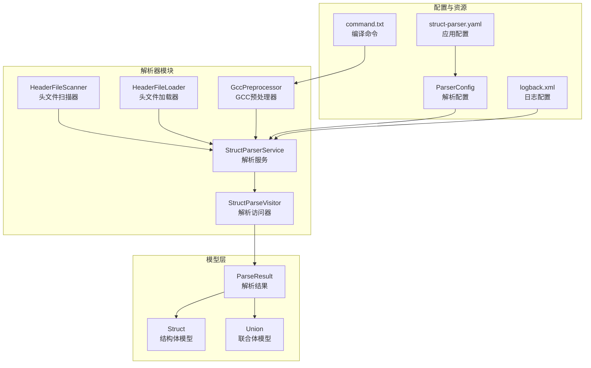
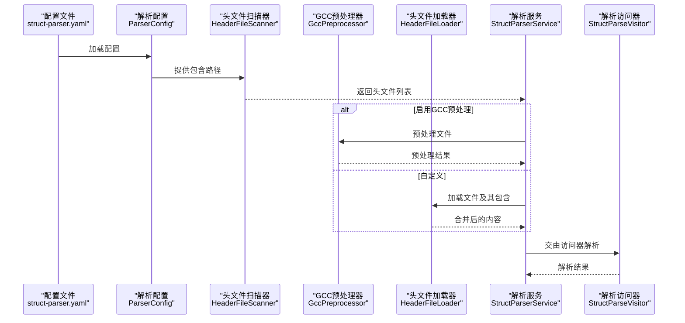
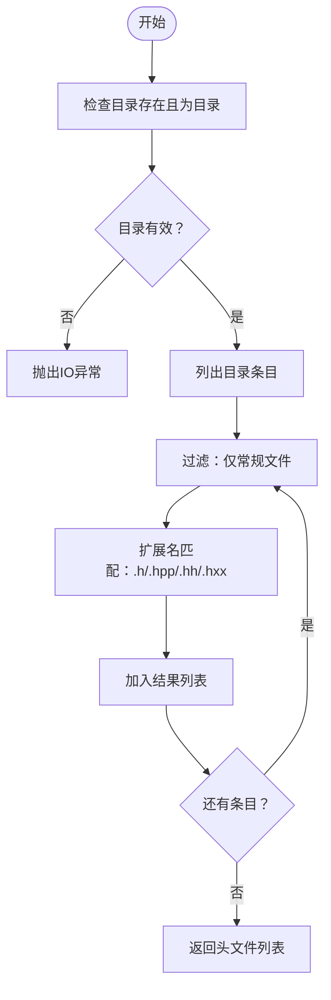
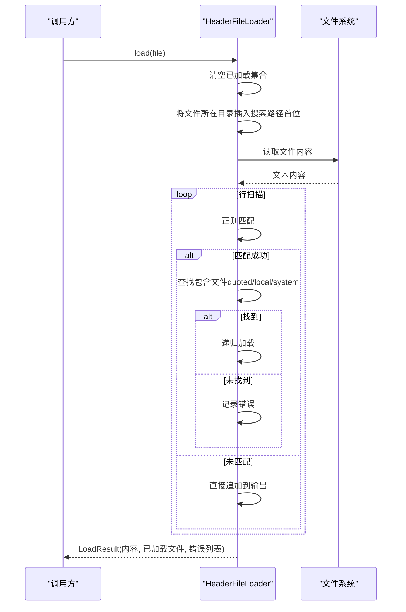
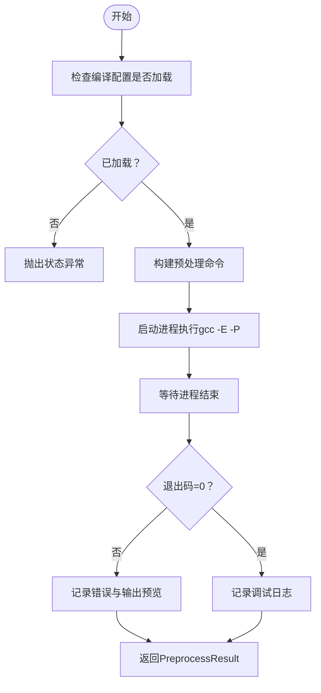
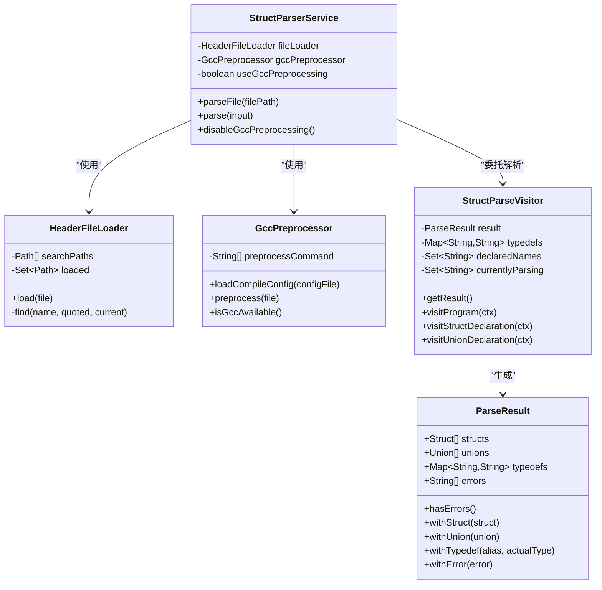
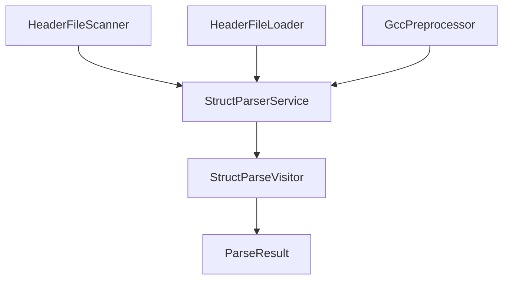

# 头文件扫描器

<cite>
**本文档引用的文件**
- [HeaderFileScanner.java](file://src/main/java/com/structparser/parser/HeaderFileScanner.java)
- [HeaderFileLoader.java](file://src/main/java/com/structparser/parser/HeaderFileLoader.java)
- [GccPreprocessor.java](file://src/main/java/com/structparser/parser/GccPreprocessor.java)
- [StructParserService.java](file://src/main/java/com/structparser/parser/StructParserService.java)
- [StructParseVisitor.java](file://src/main/java/com/structparser/parser/StructParseVisitor.java)
- [ParseResult.java](file://src/main/java/com/structparser/model/ParseResult.java)
- [ParserConfig.java](file://src/main/java/com/structparser/config/ParserConfig.java)
- [logback.xml](file://src/main/resources/logback.xml)
- [README.md](file://README.md)
- [command.txt](file://src/main/resources/include/command.txt)
- [struct-parser.yaml](file://struct-parser.yaml)
- [types.h](file://src/test/resources/headers/types.h)
- [device.h](file://src/test/resources/headers/device.h)
</cite>

## 目录
1. [简介](#简介)
2. [项目结构](#项目结构)
3. [核心组件](#核心组件)
4. [架构概览](#架构概览)
5. [详细组件分析](#详细组件分析)
6. [依赖分析](#依赖分析)
7. [性能考虑](#性能考虑)
8. [故障排除指南](#故障排除指南)
9. [结论](#结论)
10. [附录](#附录)

## 简介
本文档详细介绍头文件扫描器的设计与实现，涵盖目录扫描算法、文件过滤机制、扩展名匹配逻辑，以及单目录与多目录扫描的差异。同时说明扫描结果的数据结构设计、性能优化技巧、错误处理策略，并提供实际使用示例与常见问题解决方案。

## 项目结构
头文件扫描器位于解析器模块中，与预处理器、文件加载器、解析服务协同工作，形成完整的头文件发现与解析流水线。

**图表来源**
- [HeaderFileScanner.java:12-75](file://src/main/java/com/structparser/parser/HeaderFileScanner.java#L12-L75)
- [HeaderFileLoader.java:14-96](file://src/main/java/com/structparser/parser/HeaderFileLoader.java#L14-L96)
- [GccPreprocessor.java:17-194](file://src/main/java/com/structparser/parser/GccPreprocessor.java#L17-L194)
- [StructParserService.java:23-185](file://src/main/java/com/structparser/parser/StructParserService.java#L23-L185)
- [StructParseVisitor.java:21-200](file://src/main/java/com/structparser/parser/StructParseVisitor.java#L21-L200)
- [ParseResult.java:10-78](file://src/main/java/com/structparser/model/ParseResult.java#L10-L78)
- [ParserConfig.java:11-53](file://src/main/java/com/structparser/config/ParserConfig.java#L11-L53)
- [logback.xml:1-40](file://src/main/resources/logback.xml#L1-L40)
- [README.md:391-429](file://README.md#L391-L429)

**章节来源**
- [README.md:391-429](file://README.md#L391-L429)

## 核心组件
- 头文件扫描器：负责在单个或多个目录中递归/非递归地发现头文件，支持多种C/C++头文件扩展名。
- 头文件加载器：处理#include指令，解析相对/系统包含路径，构建包含树并生成合并后的内容。
- GCC预处理器：调用系统gcc进行C预处理，支持宏定义、条件编译、外部头文件包含等。
- 解析服务：协调预处理与解析流程，提供两种模式（GCC预处理 vs 自定义#include处理）。
- 解析访问器：基于ANTLR的访问者模式实现，执行两遍扫描以支持跨文件引用。
- 解析结果模型：不可变数据容器，封装结构体、联合体、类型别名及错误信息。

**章节来源**
- [HeaderFileScanner.java:12-75](file://src/main/java/com/structparser/parser/HeaderFileScanner.java#L12-L75)
- [HeaderFileLoader.java:14-96](file://src/main/java/com/structparser/parser/HeaderFileLoader.java#L14-L96)
- [GccPreprocessor.java:17-194](file://src/main/java/com/structparser/parser/GccPreprocessor.java#L17-L194)
- [StructParserService.java:23-185](file://src/main/java/com/structparser/parser/StructParserService.java#L23-L185)
- [StructParseVisitor.java:21-200](file://src/main/java/com/structparser/parser/StructParseVisitor.java#L21-L200)
- [ParseResult.java:10-78](file://src/main/java/com/structparser/model/ParseResult.java#L10-L78)

## 架构概览
头文件扫描器作为解析流程的起点，配合配置文件与编译命令，为后续的预处理与解析提供输入。下图展示了从配置加载到扫描、预处理再到解析的整体流程。

**图表来源**
- [ParserConfig.java:11-53](file://src/main/java/com/structparser/config/ParserConfig.java#L11-L53)
- [HeaderFileScanner.java:19-51](file://src/main/java/com/structparser/parser/HeaderFileScanner.java#L19-L51)
- [GccPreprocessor.java:85-158](file://src/main/java/com/structparser/parser/GccPreprocessor.java#L85-L158)
- [HeaderFileLoader.java:29-40](file://src/main/java/com/structparser/parser/HeaderFileLoader.java#L29-L40)
- [StructParserService.java:60-102](file://src/main/java/com/structparser/parser/StructParserService.java#L60-L102)
- [StructParseVisitor.java:36-44](file://src/main/java/com/structparser/parser/StructParseVisitor.java#L36-L44)

## 详细组件分析

### 头文件扫描器（HeaderFileScanner）
- 功能概述
  - 单目录扫描：对指定目录进行非递归扫描，仅返回当前层级的常规文件。
  - 多目录扫描：对多个目录逐一调用单目录扫描，合并结果。
  - 文件过滤：仅接受.h、.hpp、.hh、.hxx四种扩展名的文件。
  - 错误处理：对不存在或非目录路径抛出IO异常。
- 数据结构
  - 返回值：List<Path>，包含所有匹配的头文件路径。
  - 扫描统计：ScanResult记录头文件集合、总文件数、总目录数，提供headerCount便捷方法。
- 算法复杂度
  - 时间复杂度：O(N)，N为目录中条目总数；过滤阶段按常数时间检查扩展名。
  - 空间复杂度：O(K)，K为匹配的头文件数量。
- 关键实现点
  - 单目录扫描通过Files.list流式处理，结合isRegularFile与isHeaderFile过滤。
  - isHeaderFile采用后缀匹配，大小写不敏感。
  - 多目录扫描通过迭代器顺序调用单目录扫描并合并结果。

**图表来源**
- [HeaderFileScanner.java:19-64](file://src/main/java/com/structparser/parser/HeaderFileScanner.java#L19-L64)

**章节来源**
- [HeaderFileScanner.java:12-75](file://src/main/java/com/structparser/parser/HeaderFileScanner.java#L12-L75)

### 头文件加载器（HeaderFileLoader）
- 功能概述
  - 解析#include指令，支持双引号与尖括号两种形式。
  - 搜索路径优先级：文件所在目录（临时插入到搜索路径首位）、显式添加的搜索路径、系统默认路径。
  - 递归加载：遇到#include时递归解析，避免重复加载。
  - 深度限制：防止深度过大导致栈溢出或死循环。
- 数据结构
  - LoadResult封装内容字符串、已加载文件列表、错误信息列表。
- 错误处理
  - 文件未找到、包含深度超限、读取异常均记录到错误列表。
- 性能要点
  - 使用Set<Path>去重，避免重复加载同一文件。
  - 使用正则表达式快速定位#include行，减少不必要的解析。

**图表来源**
- [HeaderFileLoader.java:29-94](file://src/main/java/com/structparser/parser/HeaderFileLoader.java#L29-L94)

**章节来源**
- [HeaderFileLoader.java:14-96](file://src/main/java/com/structparser/parser/HeaderFileLoader.java#L14-L96)

### GCC预处理器（GccPreprocessor）
- 功能概述
  - 从编译配置文件加载预处理命令，确保包含-E与-P选项。
  - 动态构建命令行，替换或补充输入文件参数。
  - 执行预处理并捕获输出与错误，记录调试日志。
- 数据结构
  - PreprocessResult封装预处理后的内容、错误列表与退出码。
- 错误处理
  - 编译配置未加载、GCC不可用、进程被中断、非零退出码均视为失败。
  - 对输出进行截断预览，便于日志定位。
- 性能与健壮性
  - 日志分离：预处理内容单独写入文件，避免污染主日志。
  - 版本检测：提供isGccAvailable与getGccVersion辅助诊断。

**图表来源**
- [GccPreprocessor.java:85-158](file://src/main/java/com/structparser/parser/GccPreprocessor.java#L85-L158)

**章节来源**
- [GccPreprocessor.java:17-194](file://src/main/java/com/structparser/parser/GccPreprocessor.java#L17-L194)

### 解析服务与访问器（StructParserService & StructParseVisitor）
- 功能概述
  - 解析服务根据配置决定使用GCC预处理还是自定义#include处理。
  - 解析访问器执行两遍扫描：第一遍收集顶层声明，第二遍进行完整解析与循环引用检测。
- 数据结构
  - ParseResult封装结构体、联合体、类型别名与错误列表，提供查询与组合方法。
- 错误处理
  - 解析过程中的语法错误通过自定义ErrorListener收集并附加到结果中。

**图表来源**
- [StructParserService.java:23-185](file://src/main/java/com/structparser/parser/StructParserService.java#L23-L185)
- [HeaderFileLoader.java:14-96](file://src/main/java/com/structparser/parser/HeaderFileLoader.java#L14-L96)
- [GccPreprocessor.java:17-194](file://src/main/java/com/structparser/parser/GccPreprocessor.java#L17-L194)
- [StructParseVisitor.java:21-200](file://src/main/java/com/structparser/parser/StructParseVisitor.java#L21-L200)
- [ParseResult.java:10-78](file://src/main/java/com/structparser/model/ParseResult.java#L10-L78)

**章节来源**
- [StructParserService.java:23-185](file://src/main/java/com/structparser/parser/StructParserService.java#L23-L185)
- [StructParseVisitor.java:21-200](file://src/main/java/com/structparser/parser/StructParseVisitor.java#L21-L200)
- [ParseResult.java:10-78](file://src/main/java/com/structparser/model/ParseResult.java#L10-L78)

## 依赖分析
- 组件耦合
  - HeaderFileScanner与StructParserService之间为使用关系，前者提供输入，后者消费结果。
  - HeaderFileLoader与GccPreprocessor分别服务于解析服务的两种模式，彼此独立。
  - StructParseVisitor依赖于ANTLR生成的语法树，最终产出ParseResult。
- 外部依赖
  - 文件系统API用于目录扫描与文件读取。
  - 进程执行用于调用gcc进行预处理。
  - 日志框架用于记录调试与错误信息。

**图表来源**
- [HeaderFileScanner.java:12-75](file://src/main/java/com/structparser/parser/HeaderFileScanner.java#L12-L75)
- [StructParserService.java:23-185](file://src/main/java/com/structparser/parser/StructParserService.java#L23-L185)
- [StructParseVisitor.java:21-200](file://src/main/java/com/structparser/parser/StructParseVisitor.java#L21-L200)

**章节来源**
- [HeaderFileScanner.java:12-75](file://src/main/java/com/structparser/parser/HeaderFileScanner.java#L12-L75)
- [StructParserService.java:23-185](file://src/main/java/com/structparser/parser/StructParserService.java#L23-L185)
- [StructParseVisitor.java:21-200](file://src/main/java/com/structparser/parser/StructParseVisitor.java#L21-L200)

## 性能考虑
- 目录扫描
  - 使用Files.list进行流式处理，避免一次性加载所有条目至内存。
  - 扩展名匹配为常数时间检查，整体线性复杂度。
- 文件加载
  - 使用HashSet进行已加载文件去重，避免重复I/O。
  - 递归深度限制可防止极端情况下的栈溢出与长时间阻塞。
- 预处理
  - 仅在需要时调用gcc，避免不必要的外部进程开销。
  - 输出内容写入独立日志文件，降低主日志的磁盘压力。
- 并发与批处理
  - 当前实现为串行处理；如需提升吞吐量，可在上层引入并行扫描与解析任务池（需注意线程安全与资源竞争）。

[本节为通用性能建议，无需特定文件引用]

## 故障排除指南
- 目录不存在或非目录
  - 现象：抛出IO异常。
  - 排查：确认传入路径存在且为目录。
  - 参考实现：[HeaderFileScanner.java:22-28](file://src/main/java/com/structparser/parser/HeaderFileScanner.java#L22-L28)
- 扩展名不匹配
  - 现象：文件未被识别为头文件。
  - 排查：确认文件扩展名为.h/.hpp/.hh/.hxx之一。
  - 参考实现：[HeaderFileScanner.java:56-64](file://src/main/java/com/structparser/parser/HeaderFileScanner.java#L56-L64)
- 包含深度超限
  - 现象：记录"Include depth exceeded"错误。
  - 排查：检查是否存在循环包含或过深的包含层次。
  - 参考实现：[HeaderFileLoader.java:43-46](file://src/main/java/com/structparser/parser/HeaderFileLoader.java#L43-L46)
- 文件未找到
  - 现象：记录"File not found"错误。
  - 排查：确认包含路径正确，文件存在于搜索路径中。
  - 参考实现：[HeaderFileLoader.java:48-51](file://src/main/java/com/structparser/parser/HeaderFileLoader.java#L48-L51)
- GCC不可用或预处理失败
  - 现象：返回错误结果或抛出状态异常。
  - 排查：使用isGccAvailable检查环境，查看日志文件定位具体错误。
  - 参考实现：[GccPreprocessor.java:86-89](file://src/main/java/com/structparser/parser/GccPreprocessor.java#L86-L89), [GccPreprocessor.java:138-157](file://src/main/java/com/structparser/parser/GccPreprocessor.java#L138-L157)
- 日志定位
  - 应用日志：logs/struct-parser.log
  - 预处理内容：logs/preprocessed.log
  - 参考配置：[logback.xml:19-32](file://src/main/resources/logback.xml#L19-L32)

**章节来源**
- [HeaderFileScanner.java:22-28](file://src/main/java/com/structparser/parser/HeaderFileScanner.java#L22-L28)
- [HeaderFileScanner.java:56-64](file://src/main/java/com/structparser/parser/HeaderFileScanner.java#L56-L64)
- [HeaderFileLoader.java:43-51](file://src/main/java/com/structparser/parser/HeaderFileLoader.java#L43-L51)
- [GccPreprocessor.java:86-89](file://src/main/java/com/structparser/parser/GccPreprocessor.java#L86-L89)
- [GccPreprocessor.java:138-157](file://src/main/java/com/structparser/parser/GccPreprocessor.java#L138-L157)
- [logback.xml:19-32](file://src/main/resources/logback.xml#L19-L32)

## 结论
头文件扫描器通过简洁高效的目录扫描与扩展名过滤，为整个解析流程提供了可靠的输入。配合头文件加载器与GCC预处理器，系统能够处理复杂的C/C++头文件包含关系与条件编译。解析服务与访问器确保了跨文件引用的正确性与结果的完整性。遵循本文档提供的性能优化与故障排除建议，可进一步提升工具的稳定性与易用性。

[本节为总结性内容，无需特定文件引用]

## 附录

### 使用示例
- 配置文件示例
  - struct-parser.yaml：指定编译配置文件路径与输出设置。
  - 参考文件：[struct-parser.yaml:1-17](file://struct-parser.yaml#L1-L17)
- 编译命令示例
  - command.txt：包含gcc预处理命令与包含路径。
  - 参考文件：[command.txt:1-2](file://src/main/resources/include/command.txt#L1-L2)
- 输入头文件示例
  - types.h：基础类型定义示例。
  - device.h：设备寄存器与包含关系示例。
  - 参考文件：[types.h:1-27](file://src/test/resources/headers/types.h#L1-L27), [device.h:1-42](file://src/test/resources/headers/device.h#L1-L42)
- 运行与诊断
  - 检查GCC可用性：java -jar ... gcc-info
  - 显示帮助：java -jar ... help
  - 参考说明：[README.md:55-66](file://README.md#L55-L66)

**章节来源**
- [struct-parser.yaml:1-17](file://struct-parser.yaml#L1-L17)
- [command.txt:1-2](file://src/main/resources/include/command.txt#L1-L2)
- [types.h:1-27](file://src/test/resources/headers/types.h#L1-L27)
- [device.h:1-42](file://src/test/resources/headers/device.h#L1-L42)
- [README.md:55-66](file://README.md#L55-L66)