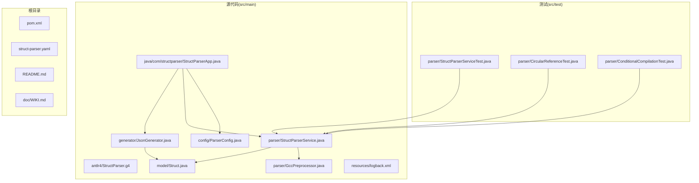
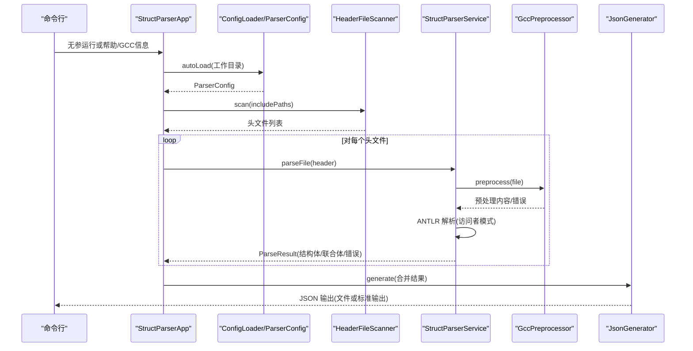
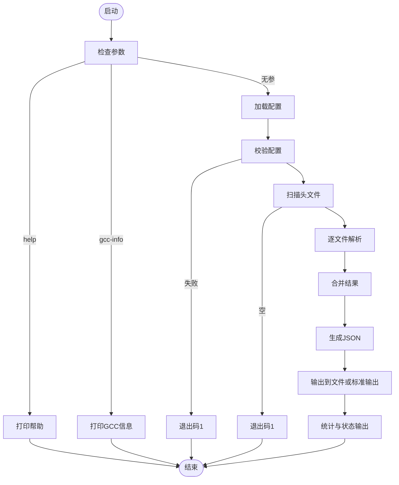
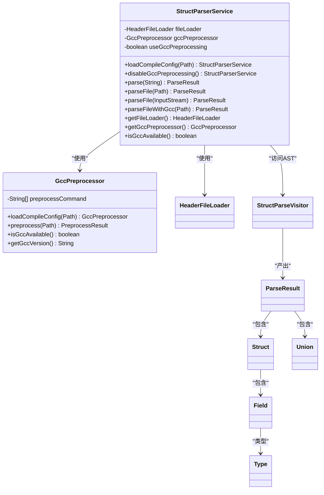
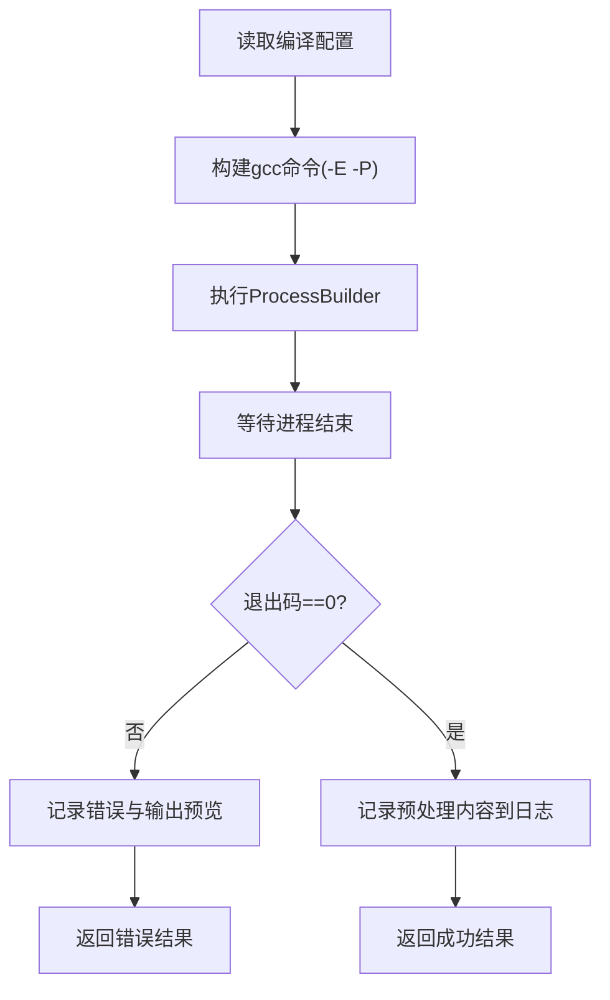
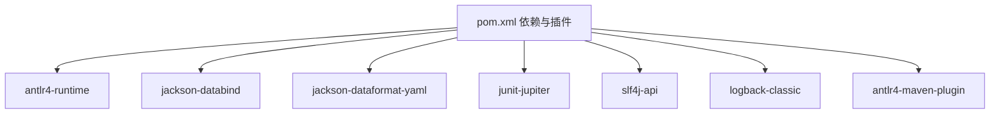

# 开发指南

<cite>
**本文档引用的文件**
- [README.md](file://README.md)
- [pom.xml](file://pom.xml)
- [StructParserApp.java](file://src/main/java/com/structparser/StructParserApp.java)
- [ParserConfig.java](file://src/main/java/com/structparser/config/ParserConfig.java)
- [StructParserService.java](file://src/main/java/com/structparser/parser/StructParserService.java)
- [GccPreprocessor.java](file://src/main/java/com/structparser/parser/GccPreprocessor.java)
- [Struct.java](file://src/main/java/com/structparser/model/Struct.java)
- [JsonGenerator.java](file://src/main/java/com/structparser/generator/JsonGenerator.java)
- [StructParser.g4](file://src/main/antlr4/com/structparser/StructParser.g4)
- [logback.xml](file://src/main/resources/logback.xml)
- [WIKI.md](file://doc/WIKI.md)
- [struct-parser.yaml](file://struct-parser.yaml)
- [StructParserServiceTest.java](file://src/test/java/com/structparser/parser/StructParserServiceTest.java)
- [CircularReferenceTest.java](file://src/test/java/com/structparser/parser/CircularReferenceTest.java)
- [ConditionalCompilationTest.java](file://src/test/java/com/structparser/parser/ConditionalCompilationTest.java)
</cite>

## 目录
1. [简介](#简介)
2. [项目结构](#项目结构)
3. [核心组件](#核心组件)
4. [架构总览](#架构总览)
5. [详细组件分析](#详细组件分析)
6. [依赖分析](#依赖分析)
7. [性能考虑](#性能考虑)
8. [故障排查指南](#故障排查指南)
9. [结论](#结论)
10. [附录](#附录)

## 简介
本开发指南面向参与 struct-parser 项目的开发者，涵盖开发环境搭建、IDE 配置建议、项目结构理解、构建与打包流程、依赖管理、代码规范与注释标准、贡献流程与 PR 规范、代码审查要求、调试与性能分析方法，以及扩展与插件开发建议。项目采用 Java 26、ANTLR4、Maven、JUnit 5、Jackson、SLF4J/Logback 等技术栈，目标是解析 C 风格的 struct/union 定义，支持 GCC 预处理、条件编译、跨文件引用，并输出带位级布局的 JSON。

## 项目结构
项目采用按职责分层的模块化组织：
- src/main/antlr4：ANTLR4 语法定义，支持语法容错与结构体/联合体提取
- src/main/java：核心业务逻辑
  - config：配置模型与加载器
  - parser：GCC 预处理、头文件扫描、AST 访问与解析服务
  - model：数据模型（Struct、Union、Field、Type、ParseResult）
  - generator：JSON 输出生成器
- src/main/resources：日志配置与资源
- src/test：单元测试与集成测试
- doc：Wiki 文档
- 根目录：Maven 构建配置、示例配置与说明文档

图表来源
- [StructParserApp.java:1-286](file://src/main/java/com/structparser/StructParserApp.java#L1-L286)
- [StructParserService.java:1-185](file://src/main/java/com/structparser/parser/StructParserService.java#L1-L185)
- [GccPreprocessor.java:1-194](file://src/main/java/com/structparser/parser/GccPreprocessor.java#L1-L194)
- [JsonGenerator.java:1-260](file://src/main/java/com/structparser/generator/JsonGenerator.java#L1-L260)
- [Struct.java:1-47](file://src/main/java/com/structparser/model/Struct.java#L1-L47)
- [ParserConfig.java:1-53](file://src/main/java/com/structparser/config/ParserConfig.java#L1-L53)
- [logback.xml:1-40](file://src/main/resources/logback.xml#L1-L40)
- [StructParser.g4:1-126](file://src/main/antlr4/com/structparser/StructParser.g4#L1-L126)
- [pom.xml:1-140](file://pom.xml#L1-L140)
- [struct-parser.yaml:1-17](file://struct-parser.yaml#L1-L17)
- [README.md:1-519](file://README.md#L1-L519)
- [WIKI.md:1-518](file://doc/WIKI.md#L1-L518)

章节来源
- [README.md:391-428](file://README.md#L391-L428)
- [WIKI.md:351-372](file://doc/WIKI.md#L351-L372)

## 核心组件
- 应用入口与控制流：StructParserApp 负责参数解析、配置加载、头文件发现、调用解析服务、合并结果与输出 JSON
- 解析服务：StructParserService 组织 GCC 预处理与 ANTLR 解析，提供两遍扫描与错误收集
- GCC 预处理：GccPreprocessor 读取编译配置，执行 gcc -E -P，记录预处理日志
- 数据模型：Struct、Union、Field、Type、ParseResult 等以 Record 表达不可变数据结构
- JSON 生成：JsonGenerator 将解析结果序列化为 JSON，支持嵌套结构与错误列表
- 配置模型：ParserConfig 与 OutputConfig 提供默认值与校验

章节来源
- [StructParserApp.java:29-227](file://src/main/java/com/structparser/StructParserApp.java#L29-L227)
- [StructParserService.java:23-184](file://src/main/java/com/structparser/parser/StructParserService.java#L23-L184)
- [GccPreprocessor.java:17-194](file://src/main/java/com/structparser/parser/GccPreprocessor.java#L17-L194)
- [Struct.java:9-47](file://src/main/java/com/structparser/model/Struct.java#L9-L47)
- [JsonGenerator.java:14-260](file://src/main/java/com/structparser/generator/JsonGenerator.java#L14-L260)
- [ParserConfig.java:11-53](file://src/main/java/com/structparser/config/ParserConfig.java#L11-L53)

## 架构总览
下图展示从命令行到输出的端到端流程，包括配置加载、GCC 预处理、解析与 JSON 生成。

图表来源
- [StructParserApp.java:61-227](file://src/main/java/com/structparser/StructParserApp.java#L61-L227)
- [StructParserService.java:60-153](file://src/main/java/com/structparser/parser/StructParserService.java#L60-L153)
- [GccPreprocessor.java:85-158](file://src/main/java/com/structparser/parser/GccPreprocessor.java#L85-L158)
- [JsonGenerator.java:21-76](file://src/main/java/com/structparser/generator/JsonGenerator.java#L21-L76)

## 详细组件分析

### 应用入口与控制流（StructParserApp）
- 参数处理：支持无参执行解析、help、gcc-info
- 配置加载：自动查找 struct-parser.yaml/yml/json，校验 compileConfigFile 存在
- 头文件发现：基于编译配置目录扫描头文件
- 解析与合并：逐文件解析，合并结构体/联合体/错误
- 输出：写入文件或标准输出；根据错误状态返回退出码

图表来源
- [StructParserApp.java:29-227](file://src/main/java/com/structparser/StructParserApp.java#L29-L227)

章节来源
- [StructParserApp.java:29-286](file://src/main/java/com/structparser/StructParserApp.java#L29-L286)

### 解析服务（StructParserService）
- 双重职责：GCC 预处理与 ANTLR 解析
- 预处理开关：可禁用 GCC 预处理，使用自定义 #include 处理
- 错误收集：统一记录解析错误与预处理错误
- 两遍扫描：先收集顶层类型名，再解析字段与检测交叉引用

图表来源
- [StructParserService.java:23-184](file://src/main/java/com/structparser/parser/StructParserService.java#L23-L184)
- [GccPreprocessor.java:17-194](file://src/main/java/com/structparser/parser/GccPreprocessor.java#L17-L194)

章节来源
- [StructParserService.java:23-184](file://src/main/java/com/structparser/parser/StructParserService.java#L23-L184)

### GCC 预处理（GccPreprocessor）
- 编译配置加载：从文本文件解析 gcc 命令，自动补全 -E -P
- 命令执行：ProcessBuilder 启动 gcc，捕获输出与错误
- 日志记录：将预处理内容写入独立日志文件，便于调试
- 可用性检测：查询 gcc --version 判断可用性

图表来源
- [GccPreprocessor.java:28-158](file://src/main/java/com/structparser/parser/GccPreprocessor.java#L28-L158)

章节来源
- [GccPreprocessor.java:17-194](file://src/main/java/com/structparser/parser/GccPreprocessor.java#L17-L194)

### ANTLR 语法与解析（StructParser.g4）
- 语法定义：支持 struct/union/typedef，忽略其他 C 语法
- 词法：注释与预处理指令跳过，实现语法岛容错
- 语义：通过访问者模式收集结构体/联合体与字段信息

章节来源
- [StructParser.g4:1-126](file://src/main/antlr4/com/structparser/StructParser.g4#L1-L126)

### 数据模型（Struct、Field、Type、ParseResult）
- 使用 Record 表达不可变数据，提供 totalBits 计算与字段集合
- Field 嵌套结构体/联合体时，JSON 生成器会将其展开为子数组

章节来源
- [Struct.java:9-47](file://src/main/java/com/structparser/model/Struct.java#L9-L47)

### JSON 生成（JsonGenerator）
- 生成结构体/联合体数组与字段列表
- 嵌套结构体/联合体以子数组形式嵌入字段对象
- 错误列表与 typedef 映射可选输出

章节来源
- [JsonGenerator.java:14-260](file://src/main/java/com/structparser/generator/JsonGenerator.java#L14-L260)

### 配置模型（ParserConfig）
- compileConfigFile 必填，output.format 默认 json
- 校验配置文件存在性与有效性

章节来源
- [ParserConfig.java:11-53](file://src/main/java/com/structparser/config/ParserConfig.java#L11-L53)
- [struct-parser.yaml:7-16](file://struct-parser.yaml#L7-L16)

## 依赖分析
Maven 依赖与插件：
- ANTLR4 运行时与 Maven 插件
- Jackson（databind、yaml）用于配置与 JSON 处理
- JUnit 5 用于测试
- SLF4J + Logback 用于日志

图表来源
- [pom.xml:27-70](file://pom.xml#L27-L70)
- [pom.xml:72-138](file://pom.xml#L72-L138)

章节来源
- [pom.xml:16-70](file://pom.xml#L16-L70)
- [pom.xml:72-138](file://pom.xml#L72-L138)

## 性能考虑
- GCC 预处理：-E -P 移除注释，减少后续解析负担；避免不必要的 include 路径
- 解析策略：两遍扫描，先收集类型名，再解析字段，有助于早期发现交叉引用
- 日志级别：生产环境建议 INFO，调试时使用 DEBUG 并关注预处理日志
- 输出生成：使用流式 Writer，避免大对象重复拷贝

章节来源
- [README.md:374-389](file://README.md#L374-L389)
- [logback.xml:35-38](file://src/main/resources/logback.xml#L35-L38)

## 故障排查指南
- GCC 可用性：使用 gcc-info 检查 gcc 是否安装与版本
- 配置文件：确认 struct-parser.yaml 存在且 compileConfigFile 指向有效文件
- 预处理失败：查看 logs/preprocessed.log 与应用日志，定位 gcc 错误
- 交叉引用：解析错误中包含“Circular reference”或“Forward reference”
- 条件编译：若期望结构体缺失，请检查宏定义与 -include/-imacros 设置

章节来源
- [StructParserApp.java:229-251](file://src/main/java/com/structparser/StructParserApp.java#L229-L251)
- [GccPreprocessor.java:163-186](file://src/main/java/com/structparser/parser/GccPreprocessor.java#L163-L186)
- [logback.xml:19-26](file://src/main/resources/logback.xml#L19-L26)
- [CircularReferenceTest.java:12-80](file://src/test/java/com/structparser/parser/CircularReferenceTest.java#L12-L80)

## 结论
本指南提供了从环境搭建到扩展开发的完整路径。遵循本文档的构建、测试、调试与贡献流程，可高效地迭代与维护该项目。未来版本规划包括数组类型、typedef 完善、代码生成与 IDE 插件等方向，建议在新增特性时保持与现有解析与输出格式的一致性。

## 附录

### 开发环境与 IDE 配置建议
- JDK：Java 26（与 Maven 编译版本一致）
- IDE：IntelliJ IDEA 或 Eclipse（启用 Annotation Processing 以支持 ANTLR4 生成）
- Maven：3.9+，确保本地仓库可用
- GCC：安装并确保在 PATH 中，用于预处理

章节来源
- [README.md:27-31](file://README.md#L27-L31)
- [pom.xml:16-25](file://pom.xml#L16-L25)

### 构建与打包流程（Maven）
- 生成解析器：mvn antlr4:antlr4
- 单元测试：mvn test
- 打包可执行 JAR：mvn clean package（包含依赖）

章节来源
- [README.md:442-459](file://README.md#L442-L459)
- [pom.xml:74-93](file://pom.xml#L74-L93)
- [pom.xml:112-136](file://pom.xml#L112-L136)

### 依赖管理与版本
- ANTLR4：4.13.1
- Jackson：2.15.2
- JUnit 5：5.10.0
- SLF4J：2.0.9
- Logback：1.4.11

章节来源
- [pom.xml:20-24](file://pom.xml#L20-L24)

### 代码规范与注释标准
- 命名约定
  - 类：帕斯卡命名（如 StructParserService）
  - 方法：驼峰命名（如 parseFile）
  - 常量：全大写（如 MAX_SIZE）
  - 包：反向域名（com.structparser）
- 注释
  - 公共 API 与复杂逻辑提供清晰注释
  - 使用中文注释，保持一致性
- 数据模型
  - 优先使用 Record 表达不可变数据
- 日志
  - 使用 SLF4J，按 ERROR/WARN/INFO/DEBUG 分级

章节来源
- [StructParserService.java:23-34](file://src/main/java/com/structparser/parser/StructParserService.java#L23-L34)
- [logback.xml:1-40](file://src/main/resources/logback.xml#L1-L40)

### 贡献流程、PR 规范与代码审查
- 提交前确保通过 mvn test
- 修改涉及解析或输出格式时，补充或更新测试用例
- 提交信息清晰描述变更目的与影响范围
- 代码审查关注：解析正确性、错误处理、日志完整性、性能影响

章节来源
- [README.md:511-513](file://README.md#L511-L513)
- [StructParserServiceTest.java:14-44](file://src/test/java/com/structparser/parser/StructParserServiceTest.java#L14-L44)
- [CircularReferenceTest.java:12-35](file://src/test/java/com/structparser/parser/CircularReferenceTest.java#L12-L35)
- [ConditionalCompilationTest.java:22-48](file://src/test/java/com/structparser/parser/ConditionalCompilationTest.java#L22-L48)

### 调试技巧与性能分析
- 使用 gcc-info 快速验证 GCC 环境
- 查看 logs/struct-parser.log 与 logs/preprocessed.log
- 逐步缩小输入范围，定位问题文件
- 使用 -Ddebug 级别日志观察解析过程

章节来源
- [StructParserApp.java:229-251](file://src/main/java/com/structparser/StructParserApp.java#L229-L251)
- [logback.xml:28-32](file://src/main/resources/logback.xml#L28-L32)

### 扩展与插件开发建议
- 新增语法支持：修改 ANTLR 语法文件并重新生成解析器
- 新增输出格式：扩展 JsonGenerator 或新增 Generator 实现
- 新增预处理选项：在 GccPreprocessor 中解析与拼接命令
- IDE 插件：参考 LSP 协议扩展，提供结构体/联合体可视化与导航

章节来源
- [WIKI.md:486-501](file://doc/WIKI.md#L486-L501)
- [StructParser.g4:1-126](file://src/main/antlr4/com/structparser/StructParser.g4#L1-L126)
- [JsonGenerator.java:14-76](file://src/main/java/com/structparser/generator/JsonGenerator.java#L14-L76)