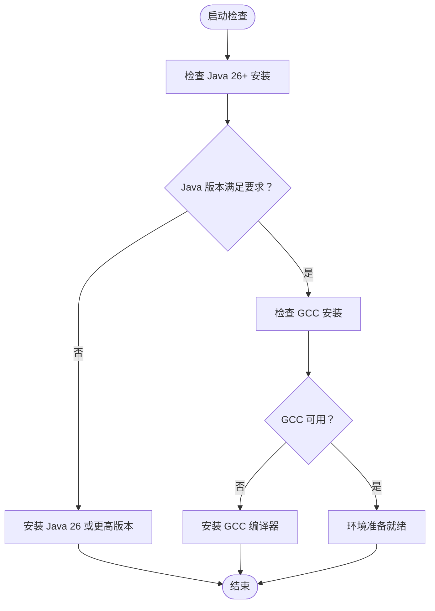
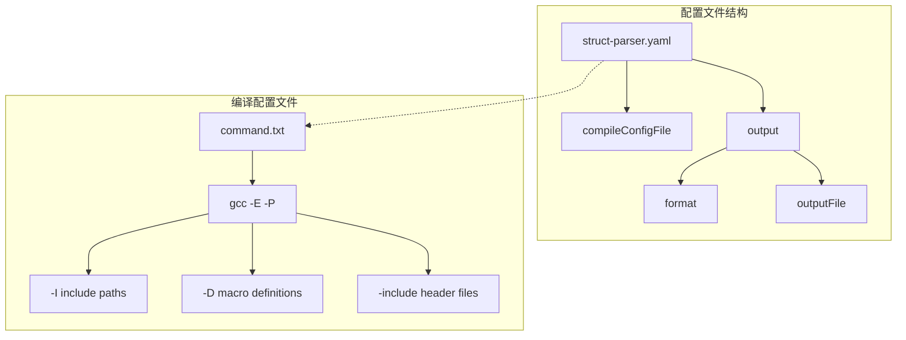
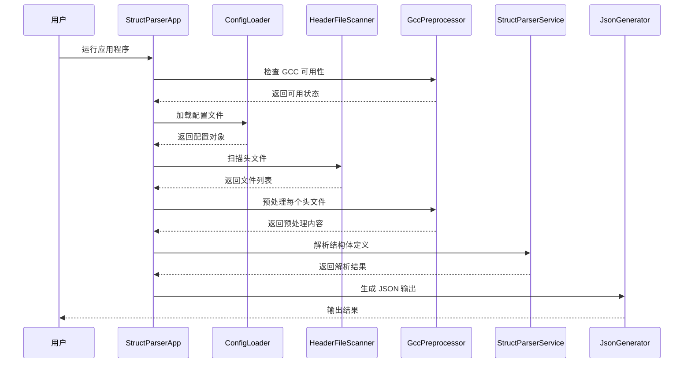
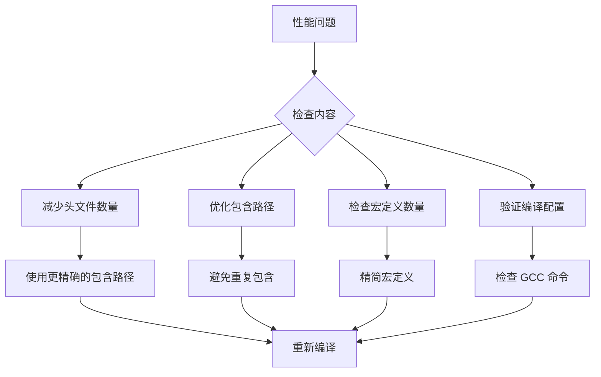

# 快速开始

<cite>
**本文档引用的文件**
- [README.md](file://README.md)
- [struct-parser.yaml](file://struct-parser.yaml)
- [pom.xml](file://pom.xml)
- [StructParserApp.java](file://src/main/java/com/structparser/StructParserApp.java)
- [ParserConfig.java](file://src/main/java/com/structparser/config/ParserConfig.java)
- [ConfigLoader.java](file://src/main/java/com/structparser/config/ConfigLoader.java)
- [GccPreprocessor.java](file://src/main/java/com/structparser/parser/GccPreprocessor.java)
- [HeaderFileScanner.java](file://src/main/java/com/structparser/parser/HeaderFileScanner.java)
- [command.txt](file://src/main/resources/include/command.txt)
- [types.h](file://src/main/resources/include/types.h)
- [base_types.h](file://src/main/resources/include/base_types.h)
- [device_types.h](file://src/main/resources/include/device_types.h)
- [WIKI.md](file://doc/WIKI.md)
</cite>

## 目录
1. [简介](#简介)
2. [环境要求](#环境要求)
3. [安装步骤](#安装步骤)
4. [配置文件创建](#配置文件创建)
5. [基本使用方法](#基本使用方法)
6. [第一个解析任务](#第一个解析任务)
7. [完整配置示例](#完整配置示例)
8. [命令行使用示例](#命令行使用示例)
9. [常见问题解答](#常见问题解答)
10. [故障排除指南](#故障排除指南)
11. [结论](#结论)

## 简介

Struct Parser 是一个专为嵌入式系统和硬件寄存器描述设计的 C 风格结构体/联合体解析工具。它使用 ANTLR4 和 GCC 预处理技术，能够从复杂的头文件中提取结构体定义，生成包含位级字段布局的 JSON 输出。

## 环境要求

### 必需组件

- **Java 26 或更高版本**：项目使用 Java 26 作为编译目标
- **GCC 编译器**：必需的 C 预处理器，用于处理 `#include`、`#define`、`#ifdef` 等预处理指令

### 系统依赖验证



**图表来源**
- [StructParserApp.java:29-56](file://src/main/java/com/structparser/StructParserApp.java#L29-L56)
- [pom.xml:16-25](file://pom.xml#L16-L25)

**章节来源**
- [README.md:27-31](file://README.md#L27-L31)
- [pom.xml:16-25](file://pom.xml#L16-L25)

## 安装步骤

### 1. 克隆项目

```bash
git clone https://github.com/NeeWe/struct-parser.git
cd struct-parser
```

### 2. 编译项目

```bash
mvn clean package
```

编译完成后，将在 `target/` 目录下生成可执行 JAR 文件：
- `target/struct-parser-1.0.0-jar-with-dependencies.jar`

### 3. 验证安装

```bash
java -jar target/struct-parser-1.0.0-jar-with-dependencies.jar help
```

**章节来源**
- [README.md:32-36](file://README.md#L32-L36)
- [pom.xml:112-136](file://pom.xml#L112-L136)

## 配置文件创建

### 配置文件结构

项目需要两个主要配置文件：

1. **主配置文件** (`struct-parser.yaml`)
2. **编译配置文件** (`command.txt`)

### 主配置文件 (struct-parser.yaml)

这是应用程序的主要配置文件，位于工作目录根目录。



**图表来源**
- [struct-parser.yaml:1-17](file://struct-parser.yaml#L1-L17)
- [ParserConfig.java:11-18](file://src/main/java/com/structparser/config/ParserConfig.java#L11-L18)

### 编译配置文件 (command.txt)

包含 GCC 预处理命令，支持以下选项：
- `-Dmacro[=defn]`：定义宏
- `-include file`：包含头文件
- `-imacros file`：包含宏定义文件
- `-Idir`：添加包含目录

**章节来源**
- [struct-parser.yaml:4-7](file://struct-parser.yaml#L4-L7)
- [command.txt:1](file://src/main/resources/include/command.txt#L1)

## 基本使用方法

### 基本运行流程



**图表来源**
- [StructParserApp.java:61-130](file://src/main/java/com/structparser/StructParserApp.java#L61-L130)
- [GccPreprocessor.java:85-158](file://src/main/java/com/structparser/parser/GccPreprocessor.java#L85-L158)

### 命令行参数

| 参数 | 描述 | 示例 |
|------|------|------|
| 无参数 | 执行解析任务 | `java -jar struct-parser.jar` |
| `help` 或 `-h` | 显示帮助信息 | `java -jar struct-parser.jar help` |
| `gcc-info` | 检查 GCC 可用性 | `java -jar struct-parser.jar gcc-info` |

**章节来源**
- [StructParserApp.java:39-55](file://src/main/java/com/structparser/StructParserApp.java#L39-L55)

## 第一个解析任务

### 步骤 1：准备测试头文件

创建一个简单的头文件 `test.h`：

```c
// 基础控制寄存器定义
struct ControlReg {
    uint1  enable;      // 1 bit
    uint1  interrupt;   // 1 bit
    uint2  mode;        // 2 bits
    uint4  reserved;    // 4 bits
    uint8  prescale;    // 8 bits
    uint16 timeout;     // 16 bits
};

// 数据包头部定义
struct PacketHeader {
    uint8  version;
    uint8  type;
    uint16 length;
    union {
        uint32 raw;
        struct {
            uint16 low;
            uint16 high;
        } words;
    } checksum;
};
```

### 步骤 2：更新编译配置

修改 `command.txt` 文件：

```txt
gcc -E -P -I. -I./include
```

### 步骤 3：运行解析器

```bash
java -jar target/struct-parser-1.0.0-jar-with-dependencies.jar
```

### 预期输出

解析器将生成类似以下的 JSON 输出：

```json
{
  "structs": [
    {
      "name": "",
      "type": "ControlReg",
      "size_bits": 32,
      "anonymous": false,
      "fields": [
        {"name": "enable", "type": "uint1", "bits": 1, "offset": 0},
        {"name": "interrupt", "type": "uint1", "bits": 1, "offset": 1},
        {"name": "mode", "type": "uint2", "bits": 2, "offset": 2},
        {"name": "reserved", "type": "uint4", "bits": 4, "offset": 4},
        {"name": "prescale", "type": "uint8", "bits": 8, "offset": 8},
        {"name": "timeout", "type": "uint16", "bits": 16, "offset": 16}
      ]
    }
  ],
  "unions": []
}
```

**章节来源**
- [README.md:68-118](file://README.md#L68-L118)
- [types.h:5-30](file://src/main/resources/include/types.h#L5-L30)

## 完整配置示例

### YAML 配置文件

```yaml
# Struct Parser 配置文件
# 程序将从 compileConfigFile 中提取编译命令并扫描头文件

# 必需：编译配置文件路径
# 仅支持直接命令文件格式（类C DSL场景）
# 示例内容: gcc -E -P -I./include -I./drivers
compileConfigFile: ./src/main/resources/include/command.txt

# 可选：输出配置
output:
  # 输出格式：目前仅支持 json
  format: json
  
  # 输出文件路径
  # 如果不指定，将输出到标准输出 (stdout)
  outputFile: output/structs.json
```

### JSON 配置文件

```json
{
  "compileConfigFile": "./src/main/resources/include/command.txt",
  "output": {
    "format": "json",
    "outputFile": "output/structs.json"
  }
}
```

### 编译配置文件示例

```txt
gcc -E -P -I./include -I./drivers -I./hal -DDEBUG -DENABLE_FEATURES
```

**章节来源**
- [struct-parser.yaml:1-17](file://struct-parser.yaml#L1-L17)
- [README.md:150-174](file://README.md#L150-L174)

## 命令行使用示例

### 基本解析命令

```bash
# 解析所有头文件（推荐方式）
java -jar target/struct-parser-1.0.0-jar-with-dependencies.jar

# 检查 GCC 可用性
java -jar target/struct-parser-1.0.0-jar-with-dependencies.jar gcc-info

# 显示帮助信息
java -jar target/struct-parser-1.0.0-jar-with-dependencies.jar help
```

### 高级使用场景

#### 条件编译示例

```bash
# 使用宏定义进行条件编译
java -jar target/struct-parser-1.0.0-jar-with-dependencies.jar -DFEATURE_A -DFEATURE_B

# 包含外部宏文件
java -jar target/struct-parser-1.0.0-jar-with-dependencies.jar -include features.h
```

#### 输出重定向

```bash
# 将输出重定向到文件
java -jar target/struct-parser-1.0.0-jar-with-dependencies.jar > output.json

# 使用配置文件指定输出文件
echo "compileConfigFile: ./command.txt" > struct-parser.yaml
echo "output:" >> struct-parser.yaml
echo "  format: json" >> struct-parser.yaml
echo "  outputFile: structs.json" >> struct-parser.yaml
```

**章节来源**
- [README.md:55-66](file://README.md#L55-L66)
- [StructParserApp.java:253-284](file://src/main/java/com/structparser/StructParserApp.java#L253-L284)

## 常见问题解答

### 1. 为什么必须安装 GCC？

GCC 用于预处理头文件，处理 `#include`、`#define`、`#ifdef` 等指令，确保解析的是标准 C 预处理后的代码。

### 2. 支持哪些预处理指令？

完全支持标准 C 预处理指令：
- `#include`、`#define`、`#ifdef`、`#ifndef`、`#endif`
- `#if`、`#elif`、`#else`、`#pragma`
- 命令行宏定义：`gcc -Dmacro=value`
- 外部宏文件：`gcc -include macros.h`

### 3. 如何处理循环引用？

工具实现了两遍扫描策略来检测和拒绝：
- **自引用**：结构体/联合体引用自身
- **双向交叉引用**：A 引用 B，B 又引用 A  
- **多向循环引用**：A → B → C → A

### 4. 头文件中包含函数声明怎么办？

解析器具有语法容错能力，会自动忽略无法识别的 C 语法：
- 函数声明：`void init(void);` → 忽略
- 枚举定义：`enum Color { RED, GREEN };` → 忽略
- 常量定义：`const int MAX = 100;` → 忽略
- 结构体/联合体：正常解析

### 5. 日志文件在哪里？

日志文件位于 `logs/` 目录：
- **`logs/struct-parser.log`**：应用日志，包含错误、警告和信息消息
- **`logs/preprocessed.log`**：预处理后的头文件内容（用于调试）

**章节来源**
- [WIKI.md:374-477](file://doc/WIKI.md#L374-L477)

## 故障排除指南

### 1. GCC 未找到错误

**问题**：`Error: GCC is required but not available.`

**解决方案**：
```bash
# 检查 GCC 可用性
java -jar target/struct-parser-1.0.0-jar-with-dependencies.jar gcc-info

# 安装 GCC
# macOS: xcode-select --install
# Ubuntu: sudo apt-get install gcc  
# Windows: 安装 MinGW-w64 或 WSL
```

### 2. 配置文件找不到

**问题**：`Error: Configuration file not found.`

**解决方案**：
```bash
# 确保配置文件存在
ls -la struct-parser.yaml
ls -la struct-parser.yml  
ls -la struct-parser.json

# 检查配置文件格式
cat struct-parser.yaml
```

### 3. 头文件扫描失败

**问题**：`Error: No header files found in compile config`

**解决方案**：
```bash
# 检查编译配置文件
cat command.txt

# 确保包含正确的头文件路径
gcc -E -P -I./include -I./drivers

# 验证头文件存在
find . -name "*.h" -type f
```

### 4. GCC 预处理错误

**问题**：`GCC preprocessing failed with exit code: 1`

**解决方案**：
```bash
# 检查预处理输出
cat logs/preprocessed.log

# 手动运行 GCC 命令验证
gcc -E -P -I./include -I./drivers

# 检查头文件语法
cppcheck --enable=all *.h
```

### 5. 解析结果为空

**问题**：解析结果显示没有结构体或联合体

**解决方案**：
```bash
# 检查头文件是否包含结构体定义
grep -r "struct\|union" *.h

# 验证数据类型支持
grep -r "uint[1-9]\|uint[1-2][0-9]\|uint3[0-2]" *.h

# 检查条件编译宏
gcc -E -P -I. -DDEBUG test.h
```

### 6. 性能优化建议



**图表来源**
- [GccPreprocessor.java:28-42](file://src/main/java/com/structparser/parser/GccPreprocessor.java#L28-L42)
- [HeaderFileScanner.java:19-38](file://src/main/java/com/structparser/parser/HeaderFileScanner.java#L19-L38)

**章节来源**
- [WIKI.md:419-468](file://doc/WIKI.md#L419-L468)

## 结论

Struct Parser 提供了一个强大而灵活的工具来解析 C 风格的结构体和联合体定义。通过结合 GCC 预处理和 ANTLR4 语法解析，它能够处理复杂的嵌入式系统头文件，生成准确的位级布局信息。

### 关键优势

- **完整的预处理支持**：支持所有标准 C 预处理指令
- **语法容错**：能够忽略无法识别的 C 语法
- **跨文件引用**：支持头文件间的类型引用
- **条件编译**：完全支持 `#ifdef`、`#if` 等条件编译
- **JSON 输出**：生成结构化的 JSON 格式结果

### 最佳实践

1. **合理组织头文件结构**：按功能模块划分头文件
2. **使用条件编译**：通过宏定义控制不同配置的结构体
3. **保持类型定义简洁**：避免过度复杂的嵌套结构
4. **定期验证配置**：确保编译配置文件的准确性
5. **监控日志输出**：及时发现和解决解析问题

通过遵循本指南，您应该能够成功安装和使用 Struct Parser 来解析您的 C 风格结构体定义。