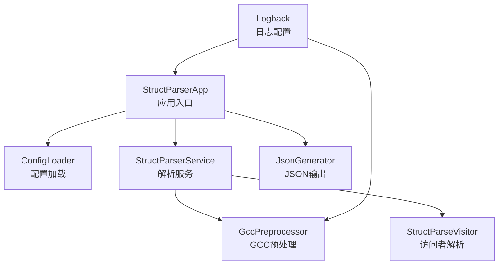
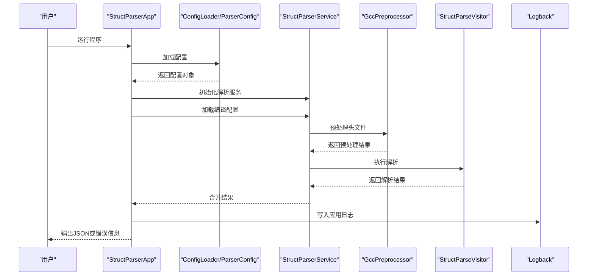
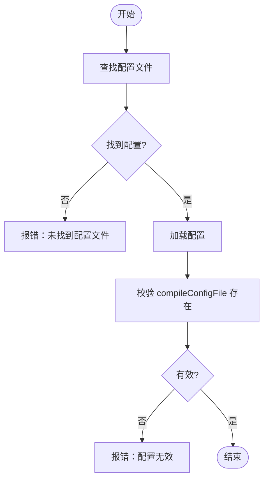
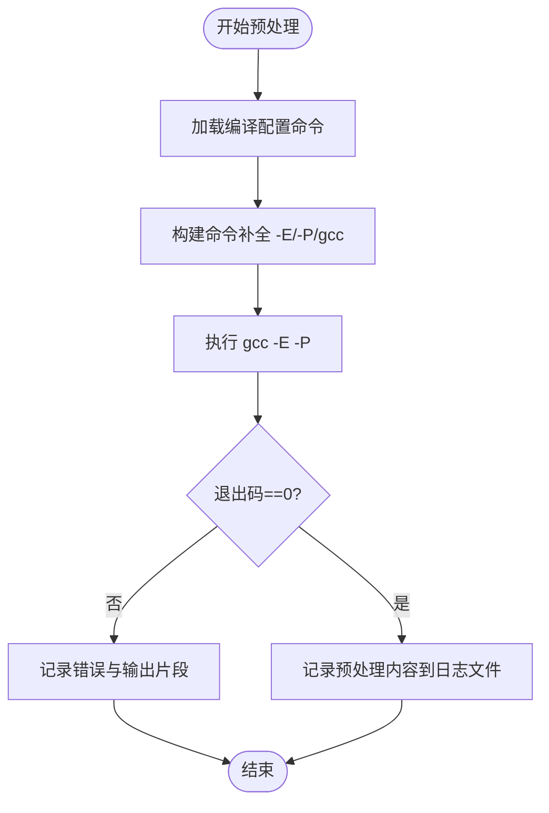
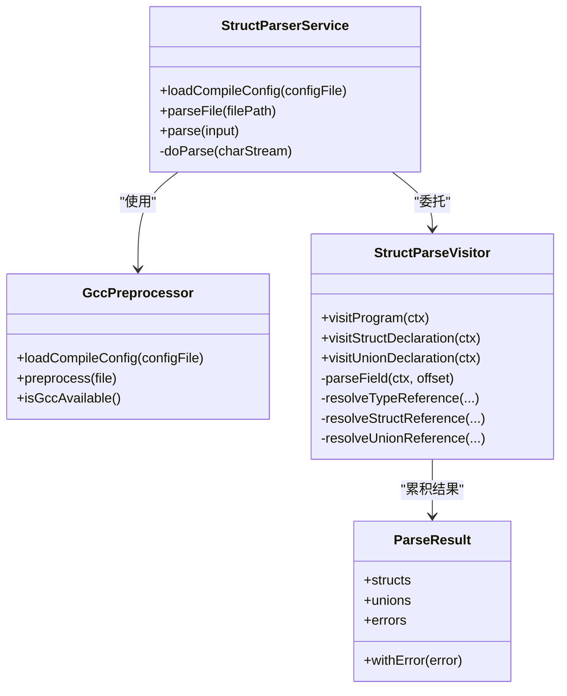
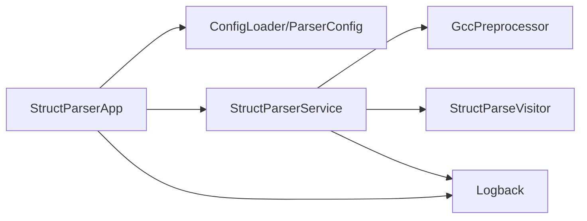

# 故障排除

<cite>
**本文引用的文件**
- [README.md](file://README.md)
- [logback.xml](file://src/main/resources/logback.xml)
- [struct-parser.yaml](file://struct-parser.yaml)
- [StructParserApp.java](file://src/main/java/com/structparser/StructParserApp.java)
- [ConfigLoader.java](file://src/main/java/com/structparser/config/ConfigLoader.java)
- [ParserConfig.java](file://src/main/java/com/structparser/config/ParserConfig.java)
- [GccPreprocessor.java](file://src/main/java/com/structparser/parser/GccPreprocessor.java)
- [StructParserService.java](file://src/main/java/com/structparser/parser/StructParserService.java)
- [StructParseVisitor.java](file://src/main/java/com/structparser/parser/StructParseVisitor.java)
- [ParseResult.java](file://src/main/java/com/structparser/model/ParseResult.java)
- [GccPreprocessorTest.java](file://src/test/java/com/structparser/parser/GccPreprocessorTest.java)
- [CircularReferenceTest.java](file://src/test/java/com/structparser/parser/CircularReferenceTest.java)
- [SyntaxToleranceTest.java](file://src/test/java/com/structparser/parser/SyntaxToleranceTest.java)
- [ConditionalCompilationTest.java](file://src/test/java/com/structparser/parser/ConditionalCompilationTest.java)
</cite>

## 目录
1. [简介](#简介)
2. [项目结构](#项目结构)
3. [核心组件](#核心组件)
4. [架构总览](#架构总览)
5. [详细组件分析](#详细组件分析)
6. [依赖关系分析](#依赖关系分析)
7. [性能考虑](#性能考虑)
8. [故障排除指南](#故障排除指南)
9. [结论](#结论)
10. [附录](#附录)

## 简介
本指南面向使用 Struct Parser 的工程师与技术支持人员，聚焦于常见问题的定位与解决。内容覆盖配置错误、GCC 预处理失败、解析异常、输出格式问题、日志系统使用、调试技巧、问题诊断流程、性能分析方法、错误码与警告解读，以及社区支持与反馈流程。文档基于仓库现有实现与测试用例进行归纳总结，确保可操作性强且与实际代码一致。

## 项目结构
- 应用入口负责参数解析、配置加载、文件扫描、调用解析服务与输出生成，并在出现错误时退出并返回相应状态码。
- 配置系统支持 YAML/JSON/Properties，自动查找配置文件并进行校验。
- 解析服务通过 GCC 预处理或自定义 #include 方式准备输入，再交由 ANTLR4 词法/语法分析与访问者模式抽取结构体与联合体定义。
- 日志系统采用 SLF4J + Logback，分别输出应用日志与预处理内容日志，便于问题复盘。

**图表来源**
- [StructParserApp.java:29-227](file://src/main/java/com/structparser/StructParserApp.java#L29-L227)
- [ConfigLoader.java:66-94](file://src/main/java/com/structparser/config/ConfigLoader.java#L66-L94)
- [ParserConfig.java:33-42](file://src/main/java/com/structparser/config/ParserConfig.java#L33-L42)
- [GccPreprocessor.java:28-80](file://src/main/java/com/structparser/parser/GccPreprocessor.java#L28-L80)
- [StructParserService.java:39-102](file://src/main/java/com/structparser/parser/StructParserService.java#L39-L102)
- [StructParseVisitor.java:125-153](file://src/main/java/com/structparser/parser/StructParseVisitor.java#L125-L153)
- [logback.xml:1-40](file://src/main/resources/logback.xml#L1-L40)

**章节来源**
- [README.md:391-428](file://README.md#L391-L428)
- [StructParserApp.java:29-227](file://src/main/java/com/structparser/StructParserApp.java#L29-L227)
- [logback.xml:1-40](file://src/main/resources/logback.xml#L1-L40)

## 核心组件
- 应用入口与控制流
  - 参数校验：仅支持无参运行（按配置解析）、help、gcc-info；其他参数将报错并退出。
  - 配置加载：自动查找 struct-parser.yaml/yml/json，不存在则提示期望文件与示例。
  - 配置校验：compileConfigFile 必填且存在；否则报错并退出。
  - 头文件发现：从编译配置文件所在目录扫描头文件。
  - 解析与输出：逐文件解析，合并结果，生成 JSON 并写入文件或标准输出；若有错误，按状态码退出。
- 配置系统
  - ConfigLoader 支持 YAML/JSON，默认尝试多种文件名，失败时抛出明确异常。
  - ParserConfig 提供默认输出配置与 validate 校验。
- 解析服务
  - StructParserService 负责加载编译配置、选择 GCC 预处理或自定义 #include、执行 ANTLR4 解析、收集错误。
  - GccPreprocessor 负责构建并执行 gcc -E -P 命令，记录预处理内容到专用日志文件。
  - StructParseVisitor 实现两遍扫描、循环引用检测、类型解析与字段展开。
- 日志系统
  - Logback 配置输出到控制台与文件；预处理日志单独输出到 logs/preprocessed.log，便于对比原始与预处理内容。

**章节来源**
- [StructParserApp.java:29-227](file://src/main/java/com/structparser/StructParserApp.java#L29-L227)
- [ConfigLoader.java:66-94](file://src/main/java/com/structparser/config/ConfigLoader.java#L66-L94)
- [ParserConfig.java:33-42](file://src/main/java/com/structparser/config/ParserConfig.java#L33-L42)
- [GccPreprocessor.java:28-80](file://src/main/java/com/structparser/parser/GccPreprocessor.java#L28-L80)
- [StructParserService.java:39-102](file://src/main/java/com/structparser/parser/StructParserService.java#L39-L102)
- [StructParseVisitor.java:36-153](file://src/main/java/com/structparser/parser/StructParseVisitor.java#L36-L153)
- [logback.xml:1-40](file://src/main/resources/logback.xml#L1-L40)

## 架构总览
下图展示从应用入口到解析与输出的关键交互，以及日志落盘位置。

**图表来源**
- [StructParserApp.java:61-227](file://src/main/java/com/structparser/StructParserApp.java#L61-L227)
- [GccPreprocessor.java:85-158](file://src/main/java/com/structparser/parser/GccPreprocessor.java#L85-L158)
- [StructParserService.java:53-153](file://src/main/java/com/structparser/parser/StructParserService.java#L53-L153)
- [logback.xml:10-38](file://src/main/resources/logback.xml#L10-L38)

## 详细组件分析

### 组件一：配置加载与校验
- 关键点
  - 自动查找顺序：struct-parser.yaml → struct-parser.yml → struct-parser.json；若均不存在，尝试从类路径加载同名资源。
  - 校验规则：compileConfigFile 必须存在；否则抛出非法状态异常。
  - 输出配置默认值：format 默认 json，outputFile 可为空（stdout）。
- 常见问题
  - 配置文件命名错误或路径不正确导致“未找到配置文件”。
  - 编译配置文件路径不存在或拼写错误导致“编译配置文件不存在”。

**图表来源**
- [ConfigLoader.java:66-94](file://src/main/java/com/structparser/config/ConfigLoader.java#L66-L94)
- [ParserConfig.java:33-42](file://src/main/java/com/structparser/config/ParserConfig.java#L33-L42)

**章节来源**
- [ConfigLoader.java:66-94](file://src/main/java/com/structparser/config/ConfigLoader.java#L66-L94)
- [ParserConfig.java:33-42](file://src/main/java/com/structparser/config/ParserConfig.java#L33-L42)

### 组件二：GCC 预处理与错误处理
- 关键点
  - 命令构建：自动补全 -E 与 -P；若未显式包含 gcc，则在首位插入 gcc。
  - 执行流程：构建命令数组，移除可能的输入文件参数，追加当前文件，启动进程并读取输出。
  - 错误处理：非零退出码记录错误；必要时输出前若干字符作为上下文；成功时将预处理内容写入 logs/preprocessed.log。
  - 可用性检查：isGccAvailable 通过调用 gcc --version 判断。
- 常见问题
  - GCC 未安装或不在 PATH 导致预处理失败。
  - 编译配置文件中包含非法参数或缺少必要的 -I/-include/-imacros。
  - 预处理输出为空或包含大量错误信息。

**图表来源**
- [GccPreprocessor.java:28-80](file://src/main/java/com/structparser/parser/GccPreprocessor.java#L28-L80)
- [GccPreprocessor.java:85-158](file://src/main/java/com/structparser/parser/GccPreprocessor.java#L85-L158)

**章节来源**
- [GccPreprocessor.java:28-80](file://src/main/java/com/structparser/parser/GccPreprocessor.java#L28-L80)
- [GccPreprocessor.java:85-158](file://src/main/java/com/structparser/parser/GccPreprocessor.java#L85-L158)

### 组件三：解析服务与访问者模式
- 关键点
  - 两遍扫描：第一遍收集顶层声明名称，第二遍进行解析与循环引用检测。
  - 类型解析：支持基础类型 uintN、typedef、结构体/联合体引用；对未识别类型标记为 CUSTOM。
  - 循环引用检测：通过 currentlyParsing 集合在解析过程中检测自引用、双向与多向交叉引用。
  - 错误收集：语法错误监听器将错误附加到 ParseResult。
- 常见问题
  - 交叉引用（自引用、双向、多向）导致解析失败。
  - 前向引用（引用尚未定义的类型）被拒绝。
  - 语法容错：函数、枚举等非结构体语法会被忽略，不会影响结构体/联合体提取。

**图表来源**
- [StructParserService.java:39-153](file://src/main/java/com/structparser/parser/StructParserService.java#L39-L153)
- [GccPreprocessor.java:28-80](file://src/main/java/com/structparser/parser/GccPreprocessor.java#L28-L80)
- [StructParseVisitor.java:36-153](file://src/main/java/com/structparser/parser/StructParseVisitor.java#L36-L153)
- [ParseResult.java:10-77](file://src/main/java/com/structparser/model/ParseResult.java#L10-L77)

**章节来源**
- [StructParserService.java:39-153](file://src/main/java/com/structparser/parser/StructParserService.java#L39-L153)
- [StructParseVisitor.java:36-153](file://src/main/java/com/structparser/parser/StructParseVisitor.java#L36-L153)
- [ParseResult.java:10-77](file://src/main/java/com/structparser/model/ParseResult.java#L10-L77)

## 依赖关系分析
- 组件耦合
  - StructParserApp 依赖 ConfigLoader、ParserConfig、StructParserService、JsonGenerator。
  - StructParserService 依赖 GccPreprocessor 与 StructParseVisitor。
  - 日志系统独立于业务逻辑，通过 Logback XML 配置生效。
- 外部依赖
  - GCC：必须可用，否则预处理阶段失败。
  - ANTLR4：词法/语法解析与访问者模式。
  - Jackson：YAML/JSON 配置解析。

**图表来源**
- [StructParserApp.java:29-227](file://src/main/java/com/structparser/StructParserApp.java#L29-L227)
- [StructParserService.java:39-153](file://src/main/java/com/structparser/parser/StructParserService.java#L39-L153)
- [logback.xml:1-40](file://src/main/resources/logback.xml#L1-L40)

**章节来源**
- [StructParserApp.java:29-227](file://src/main/java/com/structparser/StructParserApp.java#L29-L227)
- [StructParserService.java:39-153](file://src/main/java/com/structparser/parser/StructParserService.java#L39-L153)
- [logback.xml:1-40](file://src/main/resources/logback.xml#L1-L40)

## 性能考虑
- 预处理阶段
  - 大量头文件与深层嵌套包含会显著增加预处理时间；建议优化 include 路径与宏定义数量。
  - 使用 -P 保持简洁输出，避免额外注释处理开销。
- 解析阶段
  - 两遍扫描与循环引用检测成本较低；主要瓶颈在预处理与 I/O。
- 输出阶段
  - JSON 生成为纯内存序列化，通常不是瓶颈。

[本节为通用指导，无需特定文件引用]

## 故障排除指南

### 一、配置错误
- 现象
  - “未找到配置文件”或“配置无效”。
- 排查步骤
  - 确认工作目录存在 struct-parser.yaml/yml/json 之一；或检查类路径资源是否存在。
  - 检查 compileConfigFile 路径是否存在且可读。
  - 若使用相对路径，请确认与工作目录一致。
- 相关实现
  - 自动查找与异常抛出逻辑。
  - 配置校验规则。

**章节来源**
- [ConfigLoader.java:66-94](file://src/main/java/com/structparser/config/ConfigLoader.java#L66-L94)
- [ParserConfig.java:33-42](file://src/main/java/com/structparser/config/ParserConfig.java#L33-L42)
- [StructParserApp.java:70-102](file://src/main/java/com/structparser/StructParserApp.java#L70-L102)

### 二、GCC 预处理失败
- 现象
  - 预处理返回非零退出码；日志中出现错误信息与输出片段。
- 排查步骤
  - 使用 gcc-info 检查 GCC 可用性与版本。
  - 检查编译配置文件中的 gcc 命令是否包含必需的 -I/-include/-imacros。
  - 确认头文件路径与宏定义正确；查看 logs/preprocessed.log 对比原始与预处理内容。
  - 若 GCC 不可用，安装系统工具链并在 PATH 中可用。
- 相关实现
  - 命令构建与执行、错误处理与日志记录。

**章节来源**
- [StructParserApp.java:229-251](file://src/main/java/com/structparser/StructParserApp.java#L229-L251)
- [GccPreprocessor.java:85-158](file://src/main/java/com/structparser/parser/GccPreprocessor.java#L85-L158)
- [logback.xml:19-32](file://src/main/resources/logback.xml#L19-L32)

### 三、解析异常与循环引用
- 现象
  - 出现“循环引用”或“前向引用不允许”等错误。
- 排查步骤
  - 检查结构体/联合体之间的相互引用关系，避免自引用、双向与多向交叉引用。
  - 确保被引用类型在使用前已定义。
  - 使用语法容错模式（禁用 GCC 预处理）验证混合语法文件是否能正确提取目标结构体。
- 相关实现
  - 两遍扫描与循环引用检测。
  - 语法容错与混合语法测试。

**章节来源**
- [StructParseVisitor.java:27-153](file://src/main/java/com/structparser/parser/StructParseVisitor.java#L27-L153)
- [CircularReferenceTest.java:12-145](file://src/test/java/com/structparser/parser/CircularReferenceTest.java#L12-L145)
- [SyntaxToleranceTest.java:22-56](file://src/test/java/com/structparser/parser/SyntaxToleranceTest.java#L22-L56)

### 四、输出格式问题
- 现象
  - 输出为空或不符合预期。
- 排查步骤
  - 确认输出配置（format 与 outputFile）正确；若未指定 outputFile，输出到标准输出。
  - 检查解析结果中的 errors 字段，定位具体错误。
  - 使用 gcc-info 确认 GCC 可用，避免预处理失败导致无输出。
- 相关实现
  - 输出生成与写入逻辑。

**章节来源**
- [StructParserApp.java:190-227](file://src/main/java/com/structparser/StructParserApp.java#L190-L227)
- [ParseResult.java:72-77](file://src/main/java/com/structparser/model/ParseResult.java#L72-L77)

### 五、日志系统使用
- 日志文件位置
  - 应用日志：logs/struct-parser.log
  - 预处理内容：logs/preprocessed.log
- 日志级别
  - ERROR：错误、失败
  - WARN：非关键问题
  - INFO：进度与摘要
  - DEBUG：详细处理信息与预处理内容
- 使用建议
  - 发生问题时，优先查看 logs/struct-parser.log；若涉及预处理差异，同时查看 logs/preprocessed.log。
  - 在调试复杂宏或条件编译时，开启 DEBUG 级别以获取更详细信息。

**章节来源**
- [README.md:469-485](file://README.md#L469-L485)
- [logback.xml:10-38](file://src/main/resources/logback.xml#L10-L38)

### 六、调试技巧与诊断流程
- 基本流程
  - 使用 gcc-info 检查 GCC 状态。
  - 确认配置文件与编译配置文件路径正确。
  - 启用 DEBUG 级别日志，观察预处理与解析过程。
  - 对比 logs/preprocessed.log 与原始头文件，定位宏/条件编译问题。
- 高级技巧
  - 使用禁用 GCC 预处理的模式（.disableGccPreprocessing）验证混合语法容错能力。
  - 逐步缩小输入范围，先解析最小可复现文件，再扩展到完整工程。

**章节来源**
- [StructParserApp.java:229-251](file://src/main/java/com/structparser/StructParserApp.java#L229-L251)
- [StructParserService.java:48-51](file://src/main/java/com/structparser/parser/StructParserService.java#L48-L51)
- [logback.xml:28-32](file://src/main/resources/logback.xml#L28-L32)

### 七、错误码与警告解读
- 退出码
  - 0：成功
  - 1：配置/预处理/文件系统错误
  - 2：解析完成但存在错误（错误计数大于 0）
- 常见错误类型
  - 配置错误：compileConfigFile 不存在或为空。
  - 预处理错误：GCC 不可用、命令无效、包含文件缺失。
  - 解析错误：循环引用、前向引用、语法不匹配。
- 建议
  - 优先修复 ERROR 级别日志；随后关注 WARN 级别提示。

**章节来源**
- [StructParserApp.java:70-102](file://src/main/java/com/structparser/StructParserApp.java#L70-L102)
- [StructParserApp.java:211-227](file://src/main/java/com/structparser/StructParserApp.java#L211-L227)
- [GccPreprocessor.java:138-158](file://src/main/java/com/structparser/parser/GccPreprocessor.java#L138-L158)
- [StructParseVisitor.java:290-351](file://src/main/java/com/structparser/parser/StructParseVisitor.java#L290-L351)

### 八、社区支持与问题反馈
- 文档与路线图
  - 参考项目文档与路线图了解已知限制与未来计划。
- 反馈流程
  - 描述问题背景、重现步骤、日志与相关文件。
  - 提供最小可复现示例与编译配置文件。
  - 附上 gcc-info 输出与关键日志片段。

**章节来源**
- [README.md:486-519](file://README.md#L486-L519)

## 结论
本指南围绕配置、GCC 预处理、解析与输出四个关键环节，结合日志系统与测试用例，提供了系统化的故障排除方法。遵循“先检查 GCC 可用性与配置有效性，再核对预处理内容，最后定位解析错误”的流程，可高效定位并解决问题。遇到复杂场景时，利用日志与最小复现样本进行对比分析，通常能快速缩小问题范围。

## 附录

### A. 常见问题清单与参考实现
- 配置文件未找到
  - 参考：自动查找与异常抛出。
  - 位置：[ConfigLoader.java:66-94](file://src/main/java/com/structparser/config/ConfigLoader.java#L66-L94)
- compileConfigFile 不存在
  - 参考：配置校验。
  - 位置：[ParserConfig.java:33-42](file://src/main/java/com/structparser/config/ParserConfig.java#L33-L42)
- GCC 不可用
  - 参考：可用性检查与 gcc-info。
  - 位置：[StructParserApp.java:229-251](file://src/main/java/com/structparser/StructParserApp.java#L229-L251)，[GccPreprocessor.java:163-170](file://src/main/java/com/structparser/parser/GccPreprocessor.java#L163-L170)
- 预处理失败
  - 参考：命令构建、执行与错误处理。
  - 位置：[GccPreprocessor.java:85-158](file://src/main/java/com/structparser/parser/GccPreprocessor.java#L85-L158)
- 循环引用/前向引用
  - 参考：两遍扫描与检测逻辑。
  - 位置：[StructParseVisitor.java:27-153](file://src/main/java/com/structparser/parser/StructParseVisitor.java#L27-L153)
- 输出为空
  - 参考：输出生成与写入。
  - 位置：[StructParserApp.java:190-227](file://src/main/java/com/structparser/StructParserApp.java#L190-L227)
- 日志级别与文件
  - 参考：Logback 配置。
  - 位置：[logback.xml:10-38](file://src/main/resources/logback.xml#L10-L38)

### B. 测试用例参考（定位问题场景）
- GCC 预处理测试
  - 参考：宏定义、条件编译、嵌套包含、错误处理等场景。
  - 位置：[GccPreprocessorTest.java:37-449](file://src/test/java/com/structparser/parser/GccPreprocessorTest.java#L37-L449)
- 循环引用测试
  - 参考：自引用、双向、多向交叉引用。
  - 位置：[CircularReferenceTest.java:12-145](file://src/test/java/com/structparser/parser/CircularReferenceTest.java#L12-L145)
- 语法容错测试
  - 参考：混合语法忽略非结构体语法。
  - 位置：[SyntaxToleranceTest.java:22-56](file://src/test/java/com/structparser/parser/SyntaxToleranceTest.java#L22-L56)
- 条件编译测试
  - 参考：禁用 GCC 预处理时的条件宏行为。
  - 位置：[ConditionalCompilationTest.java:22-161](file://src/test/java/com/structparser/parser/ConditionalCompilationTest.java#L22-L161)