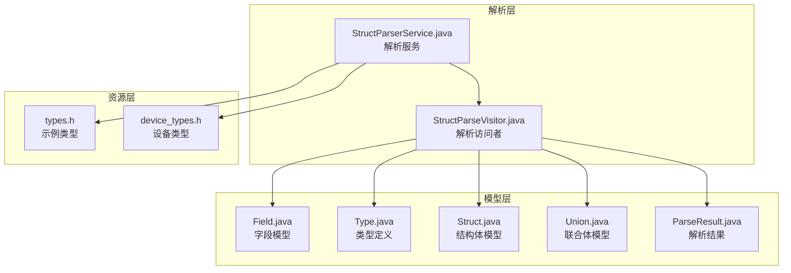
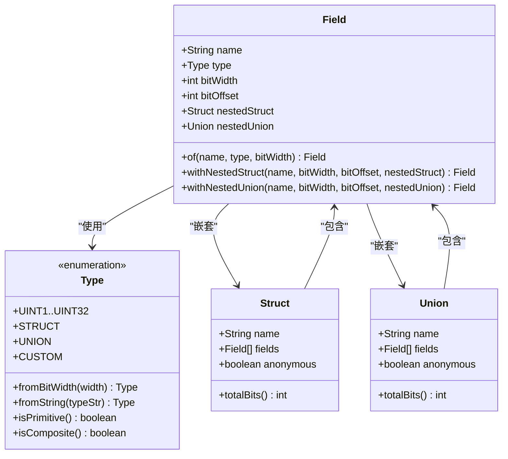
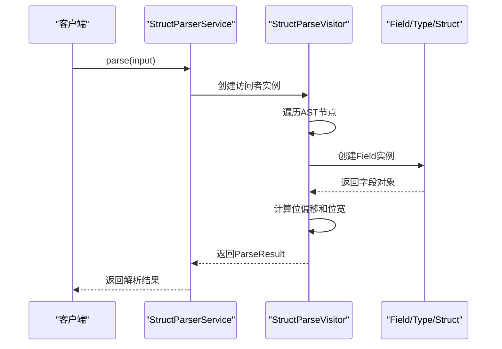
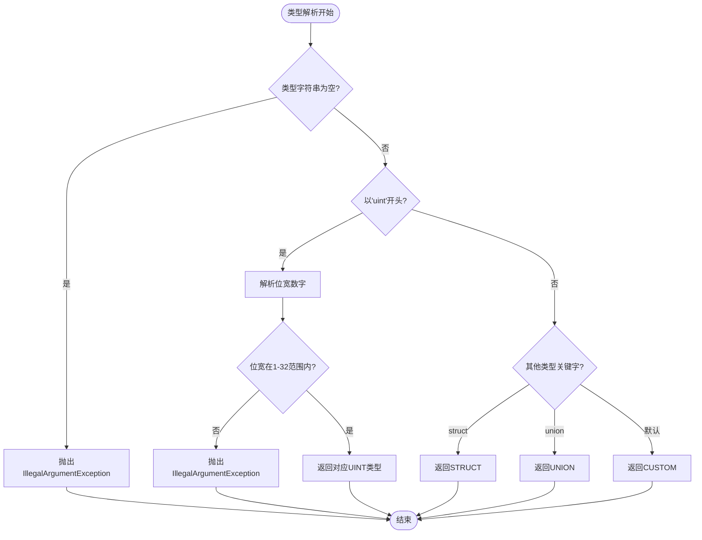
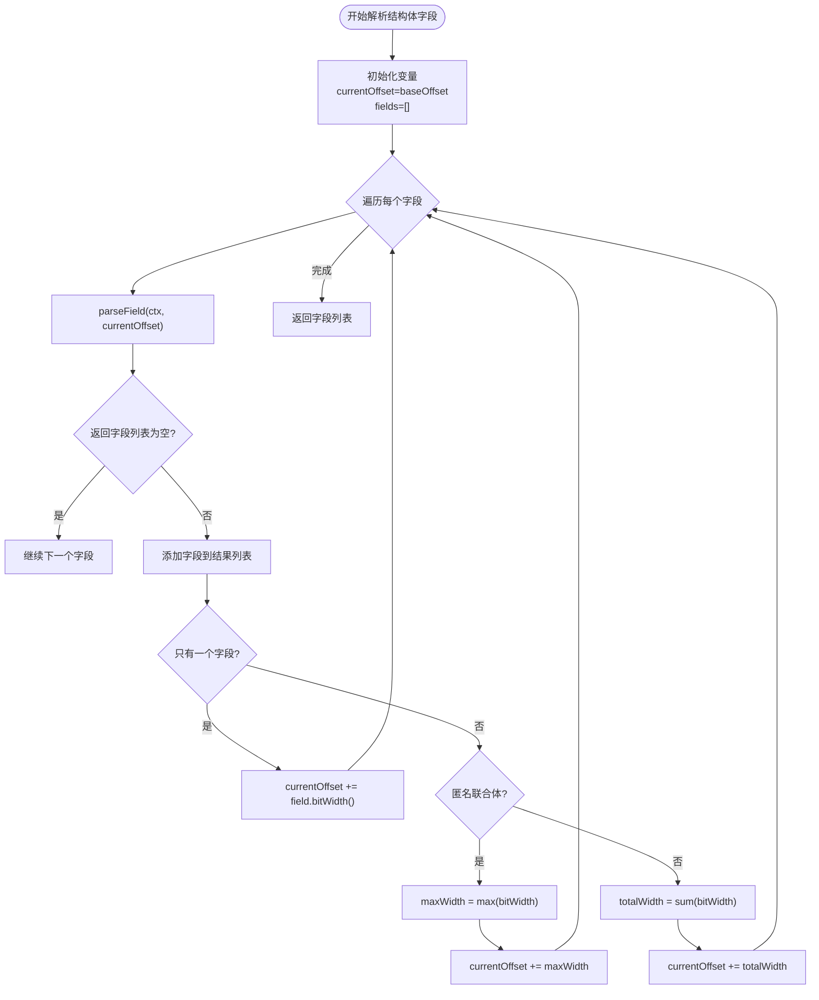
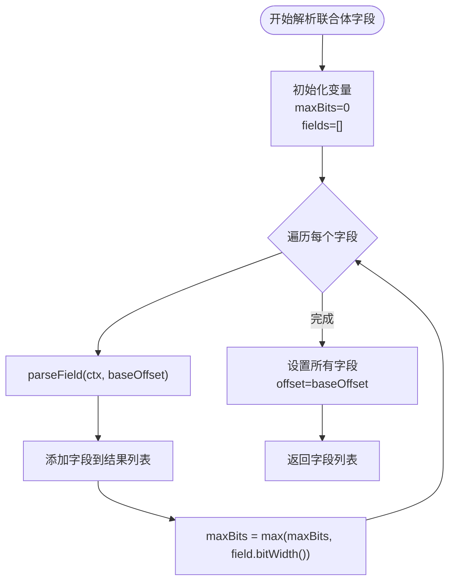
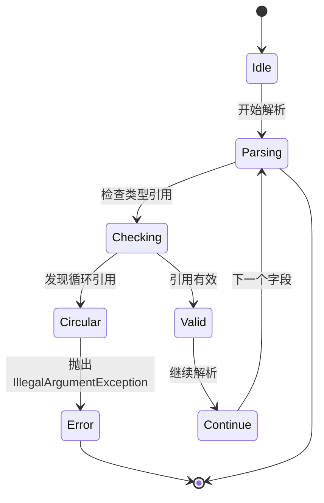
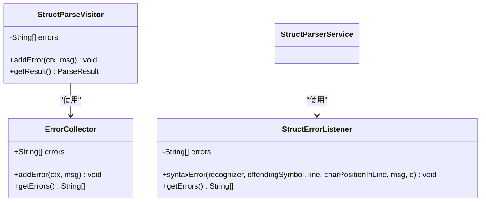
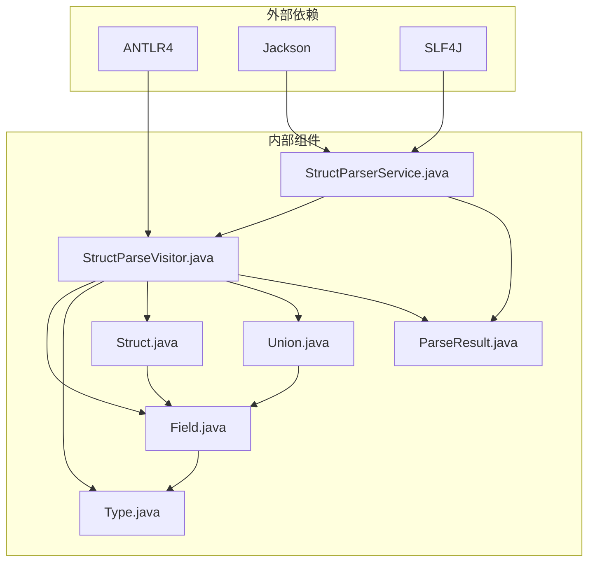

# 字段模型

<cite>
**本文档引用的文件**
- [Field.java](file://src/main/java/com/structparser/model/Field.java)
- [Type.java](file://src/main/java/com/structparser/model/Type.java)
- [Struct.java](file://src/main/java/com/structparser/model/Struct.java)
- [Union.java](file://src/main/java/com/structparser/model/Union.java)
- [ParseResult.java](file://src/main/java/com/structparser/model/ParseResult.java)
- [StructParseVisitor.java](file://src/main/java/com/structparser/parser/StructParseVisitor.java)
- [StructParserService.java](file://src/main/java/com/structparser/parser/StructParserService.java)
- [UnionOffsetTest.java](file://src/test/java/com/structparser/parser/UnionOffsetTest.java)
- [types.h](file://src/main/resources/include/types.h)
- [device_types.h](file://src/main/resources/include/device_types.h)
</cite>

## 目录
1. [简介](#简介)
2. [项目结构](#项目结构)
3. [核心组件](#核心组件)
4. [架构概览](#架构概览)
5. [详细组件分析](#详细组件分析)
6. [依赖关系分析](#依赖关系分析)
7. [性能考虑](#性能考虑)
8. [故障排除指南](#故障排除指南)
9. [结论](#结论)

## 简介

字段模型是结构体解析器的核心数据结构，负责表示C风格结构体和联合体中的字段信息。该模型采用现代Java记录类（Record）特性，提供了不可变的数据封装，并支持位级别的字段布局计算。本文档深入解释了Field记录类的设计和实现，包括字段名称、类型、位偏移和位宽等核心属性，以及字段布局计算的关键算法。

## 项目结构

该项目采用模块化架构，主要包含以下关键目录：

**图表来源**
- [Field.java:1-23](file://src/main/java/com/structparser/model/Field.java#L1-L23)
- [StructParseVisitor.java:1-517](file://src/main/java/com/structparser/parser/StructParseVisitor.java#L1-L517)
- [StructParserService.java:1-185](file://src/main/java/com/structparser/parser/StructParserService.java#L1-L185)

**章节来源**
- [README.md:1-519](file://README.md#L1-L519)

## 核心组件

字段模型系统由多个相互协作的组件组成，每个组件都有明确的职责和接口。

### 字段模型设计

Field记录类是整个系统的核心，它封装了字段的所有必要信息：

**图表来源**
- [Field.java:6](file://src/main/java/com/structparser/model/Field.java#L6)
- [Type.java:6-104](file://src/main/java/com/structparser/model/Type.java#L6-L104)
- [Struct.java:9-47](file://src/main/java/com/structparser/model/Struct.java#L9-L47)
- [Union.java:9-20](file://src/main/java/com/structparser/model/Union.java#L9-L20)

**章节来源**
- [Field.java:1-23](file://src/main/java/com/structparser/model/Field.java#L1-L23)
- [Type.java:1-104](file://src/main/java/com/structparser/model/Type.java#L1-L104)
- [Struct.java:1-47](file://src/main/java/com/structparser/model/Struct.java#L1-L47)
- [Union.java:1-20](file://src/main/java/com/structparser/model/Union.java#L1-L20)

## 架构概览

字段模型在整个解析系统中的作用和交互关系如下：

**图表来源**
- [StructParserService.java:125-153](file://src/main/java/com/structparser/parser/StructParserService.java#L125-L153)
- [StructParseVisitor.java:21-44](file://src/main/java/com/structparser/parser/StructParseVisitor.java#L21-L44)

## 详细组件分析

### 字段模型核心属性

字段模型包含以下核心属性：

#### 字段名称（name）
- 类型：String
- 描述：字段的标识符名称
- 约束：不能为空或null

#### 字段类型（type）
- 类型：Type枚举
- 描述：字段的数据类型，支持uint1-uint32、struct、union、custom
- 默认值：CUSTOM

#### 位宽（bitWidth）
- 类型：int
- 描述：字段占用的位数
- 约束：1-32之间的正整数
- 对于复合类型：表示整个复合结构的总位宽

#### 位偏移（bitOffset）
- 类型：int
- 描述：字段在结构体中的绝对位偏移量
- 计算规则：相对于最外层结构体的起始位置

#### 嵌套结构（nestedStruct）
- 类型：Struct
- 描述：当字段是嵌套结构体时的引用
- 约束：仅在Type为STRUCT时有效

#### 嵌套联合体（nestedUnion）
- 类型：Union
- 描述：当字段是嵌套联合体时的引用
- 约束：仅在Type为UNION时有效

**章节来源**
- [Field.java:6](file://src/main/java/com/structparser/model/Field.java#L6)

### 类型系统设计

Type枚举提供了完整的类型定义系统：

**图表来源**
- [Type.java:71-94](file://src/main/java/com/structparser/model/Type.java#L71-L94)

**章节来源**
- [Type.java:1-104](file://src/main/java/com/structparser/model/Type.java#L1-L104)

### 字段布局计算算法

字段布局计算是系统的核心功能，涉及复杂的位偏移和位宽计算逻辑。

#### 结构体字段布局算法

**图表来源**
- [StructParseVisitor.java:140-185](file://src/main/java/com/structparser/parser/StructParseVisitor.java#L140-L185)

#### 联合体字段布局算法

联合体的特殊处理确保所有字段共享相同的位偏移：

**图表来源**
- [StructParseVisitor.java:191-207](file://src/main/java/com/structparser/parser/StructParseVisitor.java#L191-L207)

**章节来源**
- [StructParseVisitor.java:136-207](file://src/main/java/com/structparser/parser/StructParseVisitor.java#L136-L207)

### 字段验证和错误处理机制

系统实现了多层次的验证和错误处理机制：

#### 循环引用检测

**图表来源**
- [StructParseVisitor.java:335-364](file://src/main/java/com/structparser/parser/StructParseVisitor.java#L335-L364)

#### 错误收集和报告

系统使用统一的错误收集机制：

**图表来源**
- [StructParseVisitor.java:25](file://src/main/java/com/structparser/parser/StructParseVisitor.java#L25)
- [StructParseVisitor.java:511-515](file://src/main/java/com/structparser/parser/StructParseVisitor.java#L511-L515)
- [StructParserService.java:170-183](file://src/main/java/com/structparser/parser/StructParserService.java#L170-L183)

**章节来源**
- [StructParseVisitor.java:21-517](file://src/main/java/com/structparser/parser/StructParseVisitor.java#L21-L517)
- [StructParserService.java:170-183](file://src/main/java/com/structparser/parser/StructParserService.java#L170-L183)

## 依赖关系分析

字段模型与其他组件的依赖关系如下：

**图表来源**
- [StructParserService.java:3-9](file://src/main/java/com/structparser/parser/StructParserService.java#L3-L9)
- [StructParseVisitor.java:3-8](file://src/main/java/com/structparser/parser/StructParseVisitor.java#L3-L8)

**章节来源**
- [StructParserService.java:1-185](file://src/main/java/com/structparser/parser/StructParserService.java#L1-L185)
- [StructParseVisitor.java:1-517](file://src/main/java/com/structparser/parser/StructParseVisitor.java#L1-L517)

## 性能考虑

字段模型在设计时充分考虑了性能优化：

### 时间复杂度分析

- **字段解析**：O(n)，其中n是字段数量
- **位偏移计算**：O(n)，线性扫描字段列表
- **循环引用检测**：O(n)，使用HashSet进行快速查找
- **类型解析**：O(1)，枚举查找和字符串匹配

### 空间复杂度分析

- **内存使用**：O(n)，存储所有字段信息
- **递归深度**：O(d)，其中d是嵌套深度
- **缓存友好**：连续存储字段数据，提高缓存命中率

### 优化策略

1. **不可变设计**：使用Record类确保线程安全
2. **延迟计算**：仅在需要时计算总位宽
3. **早期退出**：发现错误立即停止解析
4. **批量操作**：使用流式API进行高效处理

## 故障排除指南

### 常见问题和解决方案

#### 位宽范围错误

**问题描述**：尝试使用超出支持范围的位宽（<1或>32）

**解决方案**：
- 检查输入数据格式
- 使用支持的uint1-uint32范围
- 参考Type.fromBitWidth()方法的异常信息

#### 循环引用错误

**问题描述**：检测到结构体或联合体的循环引用

**解决方案**：
- 检查类型定义的依赖关系
- 避免自引用和双向引用
- 使用前向引用时确保正确顺序

#### 未定义类型错误

**问题描述**：引用了未定义的结构体或联合体

**解决方案**：
- 确保类型在使用前已定义
- 检查头文件包含路径
- 验证typedef定义的正确性

**章节来源**
- [StructParseVisitor.java:335-364](file://src/main/java/com/structparser/parser/StructParseVisitor.java#L335-L364)

### 调试技巧

1. **启用详细日志**：使用DEBUG级别查看解析过程
2. **检查AST树**：验证语法规则的正确性
3. **单元测试**：运行现有的测试用例验证功能
4. **边界测试**：测试极端情况和边界条件

## 结论

字段模型系统通过精心设计的Record类和枚举类型，提供了一个强大而灵活的位级别字段表示方案。系统的主要优势包括：

1. **类型安全**：使用现代Java特性确保数据完整性
2. **性能优化**：高效的算法和数据结构设计
3. **错误处理**：全面的验证和错误报告机制
4. **可扩展性**：模块化的架构支持功能扩展

该系统特别适用于嵌入式系统和硬件寄存器描述，能够准确计算字段的位偏移和位宽，为底层编程提供可靠的数据结构支持。通过结合GCC预处理和ANTLR语法分析，系统能够处理复杂的C风格头文件，提取有用的结构体和联合体信息。