# 数据模型系统

<cite>
**本文档引用的文件**
- [Struct.java](file://src/main/java/com/structparser/model/Struct.java)
- [Union.java](file://src/main/java/com/structparser/model/Union.java)
- [Field.java](file://src/main/java/com/structparser/model/Field.java)
- [Type.java](file://src/main/java/com/structparser/model/Type.java)
- [ParseResult.java](file://src/main/java/com/structparser/model/ParseResult.java)
- [StructParseVisitor.java](file://src/main/java/com/structparser/parser/StructParseVisitor.java)
- [StructParserService.java](file://src/main/java/com/structparser/parser/StructParserService.java)
- [JsonGenerator.java](file://src/main/java/com/structparser/generator/JsonGenerator.java)
- [ParserConfig.java](file://src/main/java/com/structparser/config/ParserConfig.java)
- [README.md](file://README.md)
- [StructParserServiceTest.java](file://src/test/java/com/structparser/parser/StructParserServiceTest.java)
- [ExampleIntegrationTest.java](file://src/test/java/com/structparser/parser/ExampleIntegrationTest.java)
</cite>

## 目录
1. [简介](#简介)
2. [项目结构](#项目结构)
3. [核心组件](#核心组件)
4. [架构概览](#架构概览)
5. [详细组件分析](#详细组件分析)
6. [依赖关系分析](#依赖关系分析)
7. [性能考虑](#性能考虑)
8. [故障排除指南](#故障排除指南)
9. [结论](#结论)

## 简介

数据模型系统是一个基于 Java 26 Record 特性的现代 C 风格结构体解析器，专门设计用于嵌入式系统和硬件寄存器描述。该系统提供了不可变数据模型，支持结构体（Struct）、联合体（Union）、字段（Field）、类型（Type）和解析结果（ParseResult）等核心类，实现了精确的位级字段布局计算和强大的数据验证机制。

系统采用两遍扫描策略，通过 ANTLR4 语法解析器和 GCC 预处理支持，能够处理复杂的 C 语法混合文件，同时保持对嵌套类型、匿名类型和交叉文件引用的完美支持。

## 项目结构

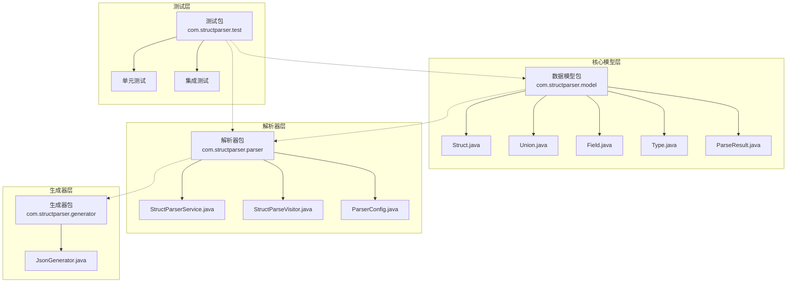

**图表来源**
- [Struct.java:1-47](file://src/main/java/com/structparser/model/Struct.java#L1-L47)
- [Union.java:1-20](file://src/main/java/com/structparser/model/Union.java#L1-L20)
- [Field.java:1-23](file://src/main/java/com/structparser/model/Field.java#L1-L23)
- [Type.java:1-104](file://src/main/java/com/structparser/model/Type.java#L1-L104)
- [ParseResult.java:1-78](file://src/main/java/com/structparser/model/ParseResult.java#L1-L78)

**章节来源**
- [README.md:391-428](file://README.md#L391-L428)

## 核心组件

### 不可变数据模型优势

系统采用 Java 26 Record 特性实现所有核心数据模型，提供了以下关键优势：

- **线程安全**：Record 对象不可变，天然支持并发访问
- **值语义**：对象状态不可修改，避免意外的状态变更
- **简洁性**：自动生成构造函数、getter 方法、equals/hashCode/toString
- **内存效率**：Record 的内存布局优化，减少对象头开销

### 数据模型关系图

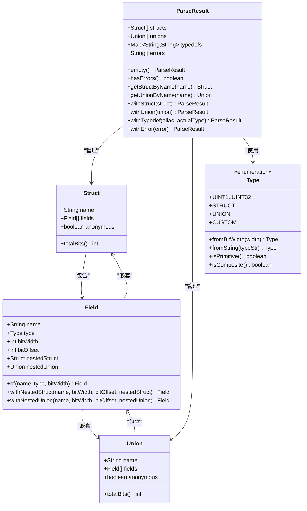

**图表来源**
- [Struct.java:6-45](file://src/main/java/com/structparser/model/Struct.java#L6-L45)
- [Union.java:6-18](file://src/main/java/com/structparser/model/Union.java#L6-L18)
- [Field.java:6-21](file://src/main/java/com/structparser/model/Field.java#L6-L21)
- [Type.java:6-102](file://src/main/java/com/structparser/model/Type.java#L6-L102)
- [ParseResult.java:10-76](file://src/main/java/com/structparser/model/ParseResult.java#L10-L76)

**章节来源**
- [Struct.java:1-47](file://src/main/java/com/structparser/model/Struct.java#L1-L47)
- [Union.java:1-20](file://src/main/java/com/structparser/model/Union.java#L1-L20)
- [Field.java:1-23](file://src/main/java/com/structparser/model/Field.java#L1-L23)
- [Type.java:1-104](file://src/main/java/com/structparser/model/Type.java#L1-L104)
- [ParseResult.java:1-78](file://src/main/java/com/structparser/model/ParseResult.java#L1-L78)

## 架构概览

### 解析流程架构

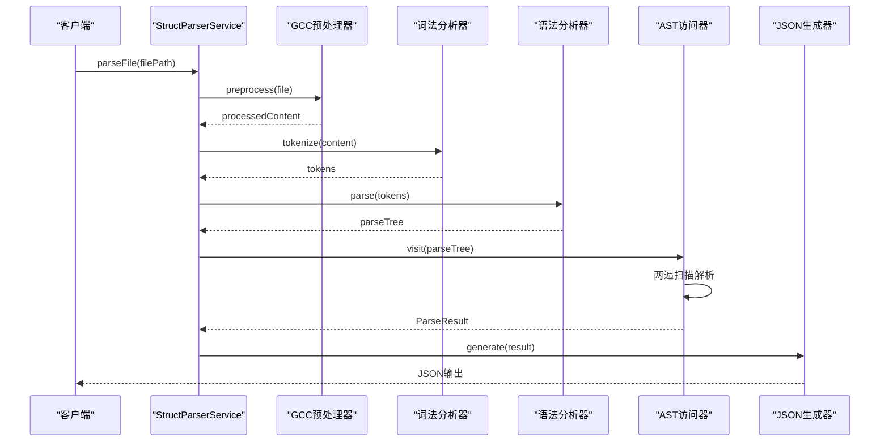

**图表来源**
- [StructParserService.java:53-153](file://src/main/java/com/structparser/parser/StructParserService.java#L53-L153)
- [StructParseVisitor.java:36-44](file://src/main/java/com/structparser/parser/StructParseVisitor.java#L36-L44)

### 字段布局计算流程

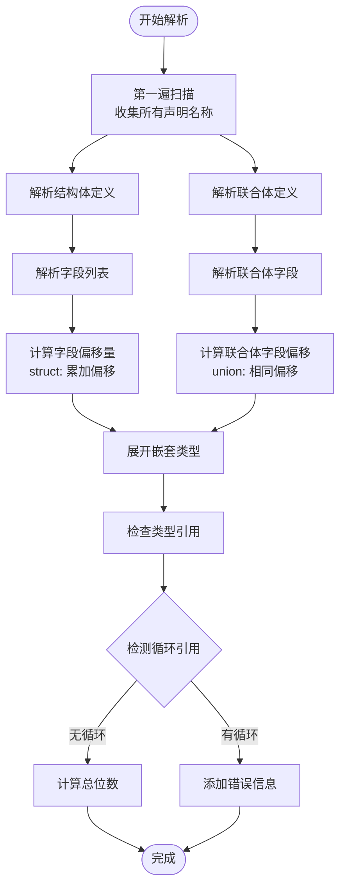

**图表来源**
- [StructParseVisitor.java:36-134](file://src/main/java/com/structparser/parser/StructParseVisitor.java#L36-L134)
- [StructParseVisitor.java:140-178](file://src/main/java/com/structparser/parser/StructParseVisitor.java#L140-L178)

**章节来源**
- [README.md:374-390](file://README.md#L374-L390)

## 详细组件分析

### Struct 类分析

Struct 类代表 C 语言中的结构体定义，采用 Record 实现不可变数据模型。

#### 核心特性

- **字段布局计算**：通过 `totalBits()` 方法智能计算结构体总位数
- **匿名结构体支持**：支持匿名结构体定义和处理
- **嵌套类型处理**：正确处理嵌套的结构体和联合体

#### 总位数计算算法

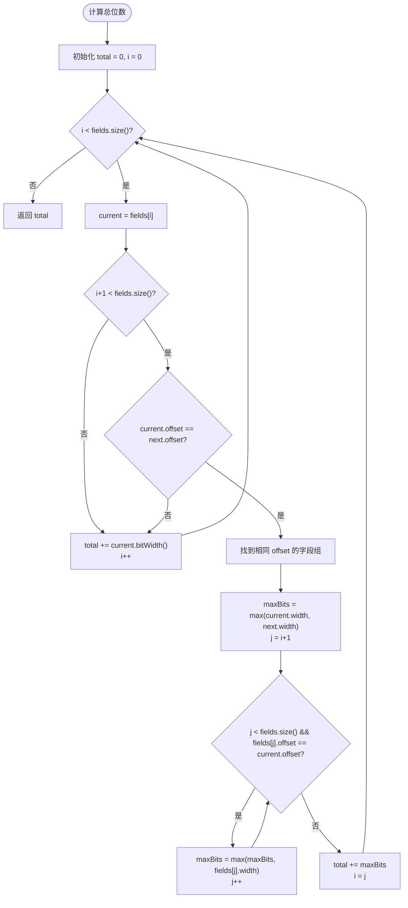

**图表来源**
- [Struct.java:15-45](file://src/main/java/com/structparser/model/Struct.java#L15-L45)

**章节来源**
- [Struct.java:1-47](file://src/main/java/com/structparser/model/Struct.java#L1-L47)

### Union 类分析

Union 类代表 C 语言中的联合体定义，同样采用 Record 实现。

#### 核心特性

- **最大位宽计算**：通过 `totalBits()` 返回联合体中最大字段的位宽
- **字段偏移统一**：联合体内所有字段具有相同的绝对偏移量
- **匿名联合体支持**：支持匿名联合体的定义和处理

#### 联合体字段布局

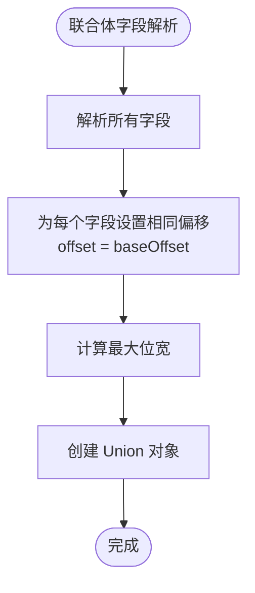

**图表来源**
- [Union.java:15-18](file://src/main/java/com/structparser/model/Union.java#L15-L18)
- [StructParseVisitor.java:162-178](file://src/main/java/com/structparser/parser/StructParseVisitor.java#L162-L178)

**章节来源**
- [Union.java:1-20](file://src/main/java/com/structparser/model/Union.java#L1-L20)

### Field 类分析

Field 类代表结构体或联合体中的单个字段，提供多种工厂方法以支持不同的字段创建场景。

#### 工厂方法设计

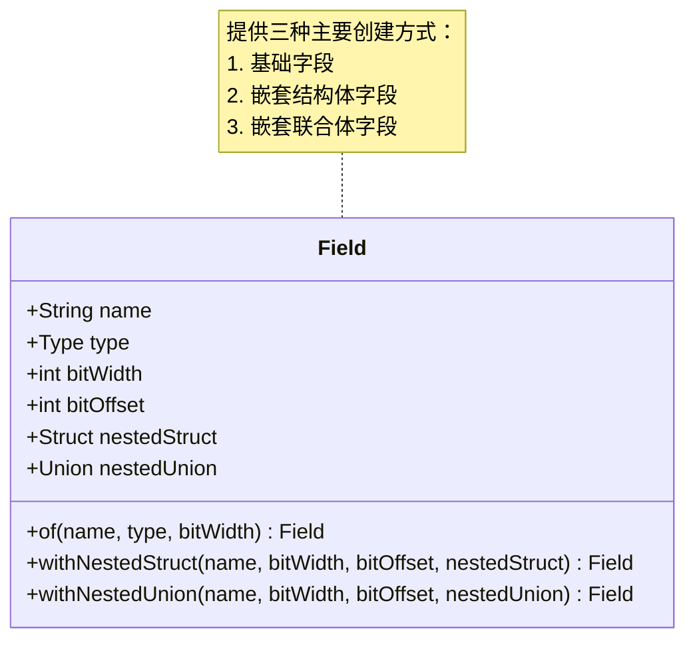

**图表来源**
- [Field.java:6-21](file://src/main/java/com/structparser/model/Field.java#L6-L21)

**章节来源**
- [Field.java:1-23](file://src/main/java/com/structparser/model/Field.java#L1-L23)

### Type 枚举分析

Type 枚举定义了系统支持的所有数据类型，提供了类型解析和验证功能。

#### 类型系统设计

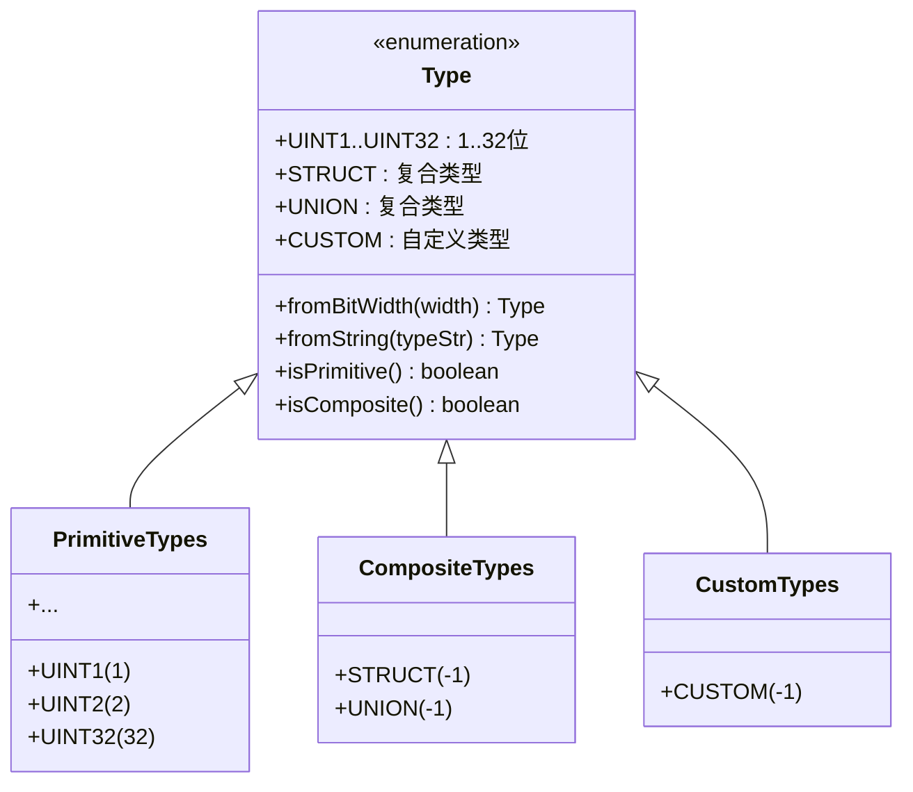

**图表来源**
- [Type.java:6-102](file://src/main/java/com/structparser/model/Type.java#L6-L102)

#### 类型解析机制

系统支持多种类型解析方式：

1. **位宽解析**：`fromBitWidth(width)` 将位宽转换为对应的基础类型
2. **字符串解析**：`fromString(typeStr)` 解析类型字符串如 "uint8"
3. **复合类型识别**：识别 struct、union 等复合类型

**章节来源**
- [Type.java:1-104](file://src/main/java/com/structparser/model/Type.java#L1-L104)

### ParseResult 类分析

ParseResult 类作为解析结果的容器，封装了所有解析过程中产生的结构体、联合体、类型别名和错误信息。

#### 不可变结果设计

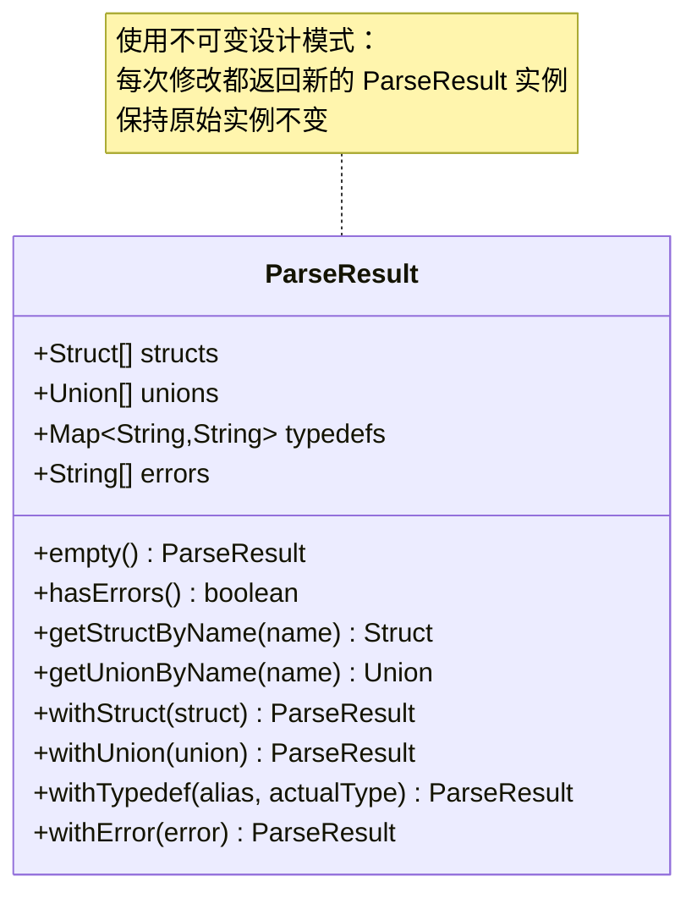

**图表来源**
- [ParseResult.java:10-76](file://src/main/java/com/structparser/model/ParseResult.java#L10-L76)

**章节来源**
- [ParseResult.java:1-78](file://src/main/java/com/structparser/model/ParseResult.java#L1-L78)

## 依赖关系分析

### 组件耦合度分析

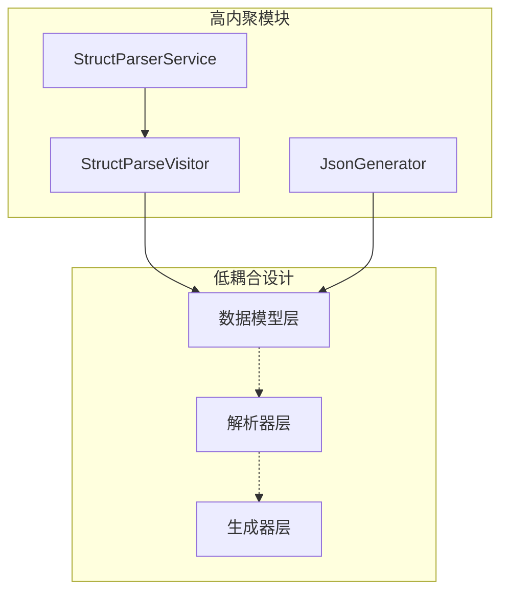

**图表来源**
- [StructParseVisitor.java:1-21](file://src/main/java/com/structparser/parser/StructParseVisitor.java#L1-L21)
- [StructParserService.java:1-23](file://src/main/java/com/structparser/parser/StructParserService.java#L1-L23)

### 关键依赖关系

1. **解析器依赖模型**：解析器完全依赖数据模型进行结果封装
2. **生成器依赖模型**：生成器仅依赖模型接口，不关心实现细节
3. **服务层协调**：服务层协调预处理、解析和生成三个阶段

**章节来源**
- [StructParseVisitor.java:3-4](file://src/main/java/com/structparser/parser/StructParseVisitor.java#L3-L4)
- [JsonGenerator.java:3-4](file://src/main/java/com/structparser/generator/JsonGenerator.java#L3-L4)

## 性能考虑

### 记忆化优化

系统在解析过程中实现了多种性能优化策略：

1. **两遍扫描优化**：第一遍收集声明，第二遍执行解析，避免重复扫描
2. **类型缓存**：Type 枚举的静态属性提供快速类型查找
3. **不可变对象复用**：Record 对象的不可变性允许安全的共享和复用

### 内存使用优化

- **流式处理**：大量使用 Java Stream API 进行内存友好的数据处理
- **延迟计算**：字段偏移量和总位数在需要时才计算
- **对象池化**：频繁使用的类型对象通过枚举实现池化

### 并发安全性

由于采用不可变数据模型，系统天然支持并发访问：

- **线程安全的数据结构**：Record 对象的不可变性保证了线程安全
- **无锁设计**：避免了传统同步机制带来的性能开销
- **安全共享**：解析结果可以在多个线程间安全共享

## 故障排除指南

### 常见错误类型

#### 循环引用检测

系统实现了完善的循环引用检测机制：

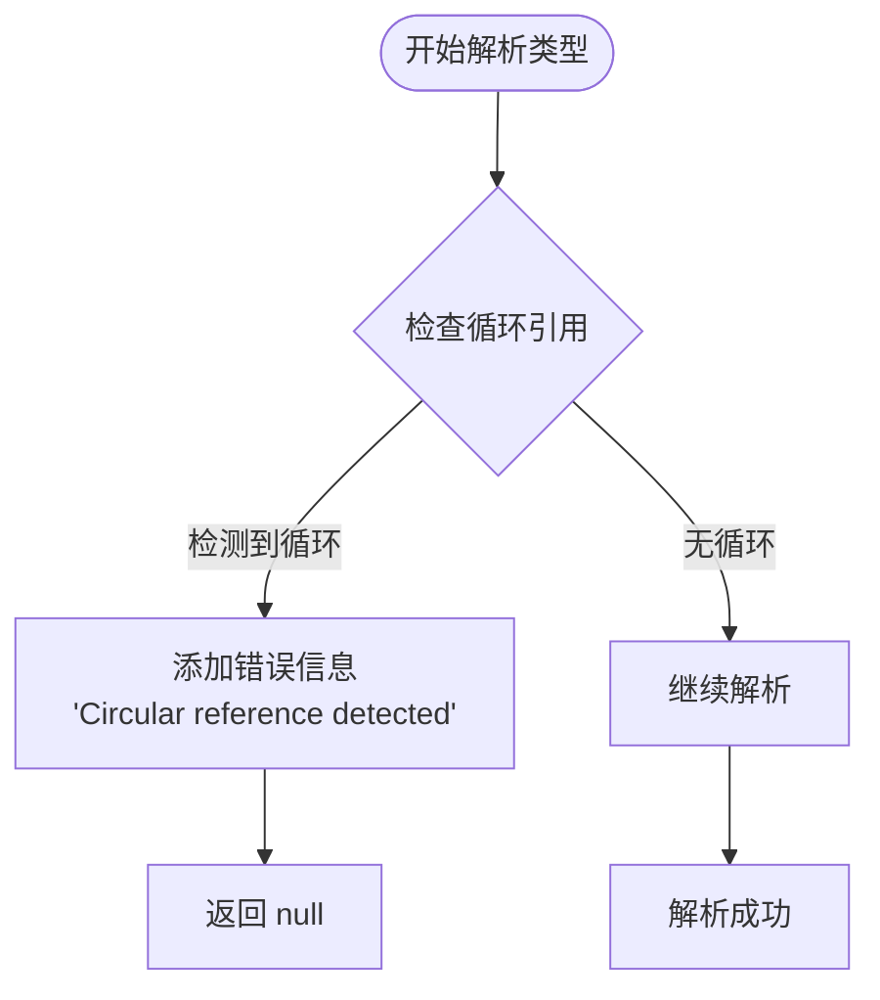

**图表来源**
- [StructParseVisitor.java:290-315](file://src/main/java/com/structparser/parser/StructParseVisitor.java#L290-L315)

#### 类型验证错误

系统提供多层次的类型验证：

1. **位宽范围验证**：确保位宽在 1-32 范围内
2. **重复定义检查**：防止结构体和联合体的重复定义
3. **未定义类型检查**：检测引用的类型是否已定义

**章节来源**
- [StructParseVisitor.java:428-455](file://src/main/java/com/structparser/parser/StructParseVisitor.java#L428-L455)

### 调试技巧

1. **日志分析**：利用 SLF4J + Logback 系统查看详细的解析过程
2. **中间结果检查**：通过测试用例验证各阶段的中间结果
3. **错误定位**：利用错误消息中的行列号精确定位问题

**章节来源**
- [README.md:469-485](file://README.md#L469-L485)

## 结论

数据模型系统通过采用现代 Java Record 特性和精心设计的架构，成功构建了一个高性能、可维护的结构体解析器。系统的核心优势包括：

1. **不可变数据模型**：提供线程安全和值语义的强保证
2. **精确的位级布局**：准确计算字段偏移量和总大小
3. **强大的类型系统**：支持基础类型、复合类型和自定义类型
4. **完善的错误处理**：提供详细的错误信息和循环引用检测
5. **优秀的扩展性**：清晰的架构设计便于功能扩展和维护

该系统特别适用于嵌入式系统开发、硬件寄存器描述和底层系统编程场景，为复杂 C 语法文件的解析提供了可靠的技术解决方案。