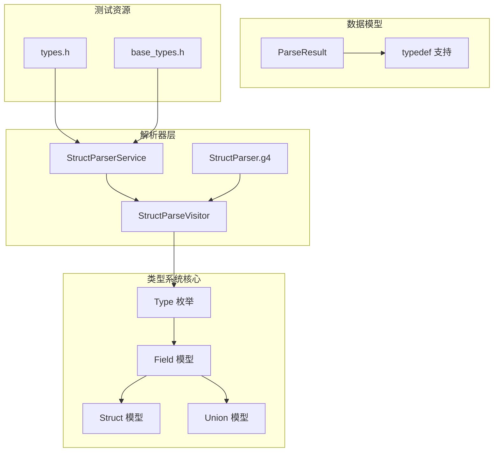
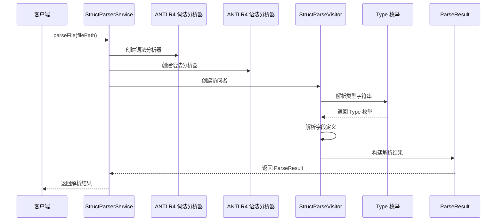
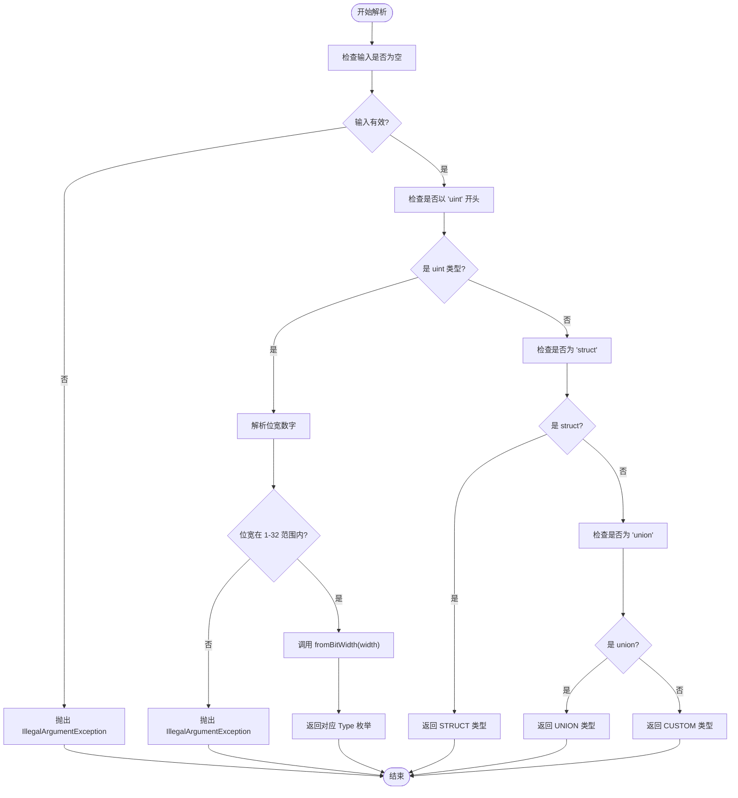
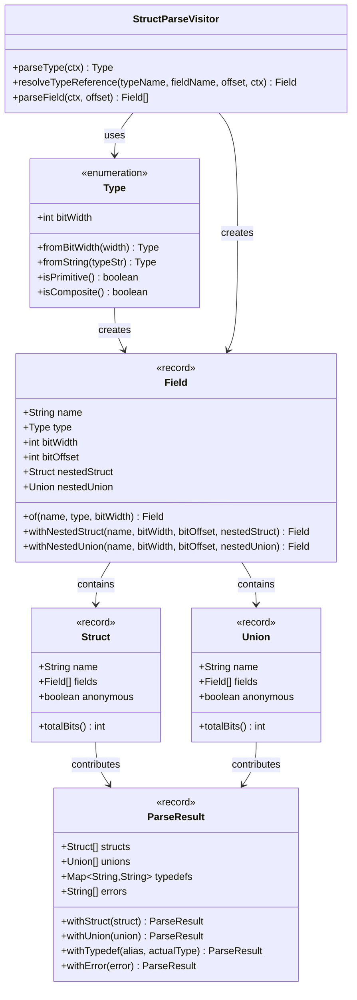

# 类型系统

<cite>
**本文档引用的文件**
- [Type.java](file://src/main/java/com/structparser/model/Type.java)
- [StructParseVisitor.java](file://src/main/java/com/structparser/parser/StructParseVisitor.java)
- [StructParserService.java](file://src/main/java/com/structparser/parser/StructParserService.java)
- [Field.java](file://src/main/java/com/structparser/model/Field.java)
- [Struct.java](file://src/main/java/com/structparser/model/Struct.java)
- [Union.java](file://src/main/java/com/structparser/model/Union.java)
- [ParseResult.java](file://src/main/java/com/structparser/model/ParseResult.java)
- [StructParser.g4](file://src/main/antlr4/com/structparser/StructParser.g4)
- [types.h](file://src/main/resources/include/types.h)
- [base_types.h](file://src/main/resources/include/base_types.h)
- [README.md](file://README.md)
</cite>

## 目录
1. [简介](#简介)
2. [项目结构](#项目结构)
3. [核心组件](#核心组件)
4. [架构概览](#架构概览)
5. [详细组件分析](#详细组件分析)
6. [依赖关系分析](#依赖关系分析)
7. [性能考虑](#性能考虑)
8. [故障排除指南](#故障排除指南)
9. [结论](#结论)

## 简介

类型系统是结构解析器的核心组成部分，负责定义和管理支持的数据类型。该系统基于 ANTLR4 语法解析器，专门设计用于解析 C 风格的结构体和联合体定义，支持位级别的精确布局计算。

本类型系统的核心特性包括：
- 支持 1 到 32 位的无符号整数类型（uint1 到 uint32）
- 复合类型支持（结构体和联合体）
- 自定义类型别名支持（typedef）
- 严格的类型验证和错误处理机制
- 位级别的精确计算和布局分析

## 项目结构

类型系统在整个项目架构中扮演着关键角色，主要分布在以下模块中：



**图表来源**
- [Type.java:1-104](file://src/main/java/com/structparser/model/Type.java#L1-L104)
- [StructParseVisitor.java:1-517](file://src/main/java/com/structparser/parser/StructParseVisitor.java#L1-L517)
- [StructParserService.java:1-185](file://src/main/java/com/structparser/parser/StructParserService.java#L1-L185)

**章节来源**
- [README.md:391-428](file://README.md#L391-L428)
- [Type.java:1-104](file://src/main/java/com/structparser/model/Type.java#L1-L104)

## 核心组件

### Type 枚举设计

Type 枚举是类型系统的核心，定义了所有支持的数据类型。其设计遵循以下原则：

#### 基础整数类型
系统支持从 uint1 到 uint32 的完整范围，每个类型都有明确的位宽定义：
- **uint1 到 uint32**：连续的位宽序列，对应 1 到 32 位
- **位宽映射**：通过构造函数直接存储对应的位宽值
- **类型验证**：提供从位宽到类型的映射方法

#### 复合类型
复合类型用于表示复杂的嵌套结构：
- **STRUCT(-1)**：结构体类型，位宽为 -1 表示需要动态计算
- **UNION(-1)**：联合体类型，同样需要动态计算总位宽
- **CUSTOM(-1)**：自定义类型，用于 typedef 和外部引用

#### 类型判断方法
系统提供了便捷的方法来区分不同类型：
- `isPrimitive()`：判断是否为基础整数类型
- `isComposite()`：判断是否为复合类型（结构体或联合体）

**章节来源**
- [Type.java:6-103](file://src/main/java/com/structparser/model/Type.java#L6-L103)

### 字段模型 Field

Field 模型使用 Java Record 特性，提供了不可变的数据结构：
- **字段属性**：名称、类型、位宽、位偏移、嵌套结构体、嵌套联合体
- **工厂方法**：提供便捷的构造方法
- **嵌套类型支持**：通过重载方法支持嵌套结构体和联合体

**章节来源**
- [Field.java:6-22](file://src/main/java/com/structparser/model/Field.java#L6-L22)

### 结构体和联合体模型

Struct 和 Union 模型都使用 Record 特性，提供类型安全的数据封装：

#### Struct 模型
- **总位宽计算**：智能处理匿名联合体的位宽计算
- **字段验证**：确保字段列表的完整性
- **匿名标志**：标识匿名结构体

#### Union 模型  
- **最大位宽原则**：联合体的总位宽等于最大字段位宽
- **字段压缩**：所有字段共享相同的内存空间

**章节来源**
- [Struct.java:9-46](file://src/main/java/com/structparser/model/Struct.java#L9-L46)
- [Union.java:9-19](file://src/main/java/com/structparser/model/Union.java#L9-L19)

## 架构概览

类型系统在整个解析流程中发挥着关键作用，从词法分析到最终的 JSON 输出：



**图表来源**
- [StructParserService.java:53-153](file://src/main/java/com/structparser/parser/StructParserService.java#L53-L153)
- [StructParseVisitor.java:36-44](file://src/main/java/com/structparser/parser/StructParseVisitor.java#L36-L44)
- [Type.java:71-94](file://src/main/java/com/structparser/model/Type.java#L71-L94)

## 详细组件分析

### 类型解析机制

类型解析是类型系统的核心功能，支持多种输入格式：

#### 位宽解析流程



**图表来源**
- [Type.java:71-94](file://src/main/java/com/structparser/model/Type.java#L71-L94)

#### 解析器中的类型处理

在解析过程中，Type 枚举被广泛应用于各种场景：

1. **字段类型解析**：从类型说明符中提取类型信息
2. **匿名类型展开**：根据类型决定是否展开字段
3. **嵌套类型处理**：识别和处理嵌套的结构体和联合体
4. **类型验证**：确保类型定义的有效性

**章节来源**
- [StructParseVisitor.java:289-330](file://src/main/java/com/structparser/parser/StructParseVisitor.java#L289-L330)
- [StructParseVisitor.java:477-509](file://src/main/java/com/structparser/parser/StructParseVisitor.java#L477-L509)

### 类型验证和错误处理

类型系统实现了多层次的验证机制：

#### 输入验证
- **空值检查**：防止 null 或空字符串输入
- **位宽范围验证**：确保位宽在 1-32 之间
- **格式验证**：检查 uintN 格式的正确性

#### 运行时验证
- **循环引用检测**：防止结构体和联合体的自引用
- **前向引用拒绝**：不允许在定义之前引用类型
- **重复定义检查**：防止同名类型的重复定义

#### 错误报告
- **精确位置定位**：提供错误发生的行号和列号
- **详细错误信息**：包含具体的错误原因
- **累积错误处理**：收集所有错误以便一次性报告

**章节来源**
- [StructParseVisitor.java:73-77](file://src/main/java/com/structparser/parser/StructParseVisitor.java#L73-L77)
- [StructParseVisitor.java:336-364](file://src/main/java/com/structparser/parser/StructParseVisitor.java#L336-L364)
- [StructParseVisitor.java:511-515](file://src/main/java/com/structparser/parser/StructParseVisitor.java#L511-L515)

### 类型转换机制

类型系统支持多种转换场景：

#### 位宽到类型的转换
```java
public static Type fromBitWidth(int width) {
    if (width < 1 || width > 32) {
        throw new IllegalArgumentException("Bit width must be between 1 and 32, got: " + width);
    }
    return values()[width - 1];
}
```

#### 字符串到类型的转换
```java
public static Type fromString(String typeStr) {
    String lower = typeStr.toLowerCase();
    if (lower.startsWith("uint")) {
        int width = Integer.parseInt(lower.substring(4));
        return fromBitWidth(width);
    }
    return switch (lower) {
        case "struct" -> STRUCT;
        case "union" -> UNION;
        default -> CUSTOM;
    };
}
```

**章节来源**
- [Type.java:61-94](file://src/main/java/com/structparser/model/Type.java#L61-L94)

## 依赖关系分析

类型系统与其他组件的依赖关系如下：



**图表来源**
- [Type.java:6-103](file://src/main/java/com/structparser/model/Type.java#L6-L103)
- [Field.java:6-22](file://src/main/java/com/structparser/model/Field.java#L6-L22)
- [Struct.java:9-46](file://src/main/java/com/structparser/model/Struct.java#L9-L46)
- [Union.java:9-19](file://src/main/java/com/structparser/model/Union.java#L9-L19)
- [ParseResult.java:10-77](file://src/main/java/com/structparser/model/ParseResult.java#L10-L77)
- [StructParseVisitor.java:477-509](file://src/main/java/com/structparser/parser/StructParseVisitor.java#L477-L509)

**章节来源**
- [StructParseVisitor.java:1-517](file://src/main/java/com/structparser/parser/StructParseVisitor.java#L1-L517)

## 性能考虑

类型系统的性能优化策略：

### 时间复杂度分析
- **类型解析**：O(1) - 基于枚举的直接查找
- **位宽验证**：O(1) - 简单的数值范围检查
- **字符串解析**：O(n) - n 为类型字符串长度
- **字段计算**：O(m) - m 为字段数量

### 空间复杂度
- **类型存储**：O(1) - 固定数量的枚举实例
- **字段存储**：O(m) - m 为字段总数
- **嵌套结构**：递归存储，深度受限于嵌套层次

### 优化建议
1. **缓存常用类型**：对于频繁使用的类型进行缓存
2. **延迟计算**：仅在需要时计算总位宽
3. **批量处理**：支持批量解析以提高吞吐量

## 故障排除指南

### 常见问题和解决方案

#### 类型解析错误
**问题**：`IllegalArgumentException: Bit width must be between 1 and 32`
**原因**：位宽超出允许范围
**解决**：检查类型定义，确保位宽在 1-32 之间

#### 循环引用错误
**问题**：`Circular reference detected: typeName`
**原因**：结构体或联合体相互引用
**解决**：重构类型定义，消除循环依赖

#### 未定义类型错误
**问题**：`Undefined struct/union: typeName`
**原因**：引用了未定义的类型
**解决**：确保类型在使用前正确定义

#### 重复定义错误
**问题**：`Duplicate struct/union: name`
**原因**：同名类型重复定义
**解决**：修改类型名称或删除重复定义

**章节来源**
- [StructParseVisitor.java:300-304](file://src/main/java/com/structparser/parser/StructParseVisitor.java#L300-L304)
- [StructParseVisitor.java:336-364](file://src/main/java/com/structparser/parser/StructParseVisitor.java#L336-L364)

## 结论

类型系统是结构解析器项目的核心基础设施，其设计体现了现代软件工程的最佳实践：

### 设计优势
- **类型安全**：通过枚举确保类型的一致性和完整性
- **扩展性**：支持自定义类型和类型别名
- **性能优化**：高效的类型解析和验证机制
- **错误处理**：完善的错误检测和报告系统

### 应用场景
- **嵌入式系统**：精确的位级别布局计算
- **硬件描述**：寄存器和内存映射的准确表示
- **协议解析**：网络协议和数据包格式的解析
- **跨文件引用**：复杂项目的类型依赖管理

### 发展方向
未来可以考虑的功能增强：
- 数组类型支持
- 更丰富的类型别名语义
- 代码生成能力
- 类型推断机制

类型系统为整个解析器提供了坚实的基础，确保了数据结构定义的准确性和可靠性。