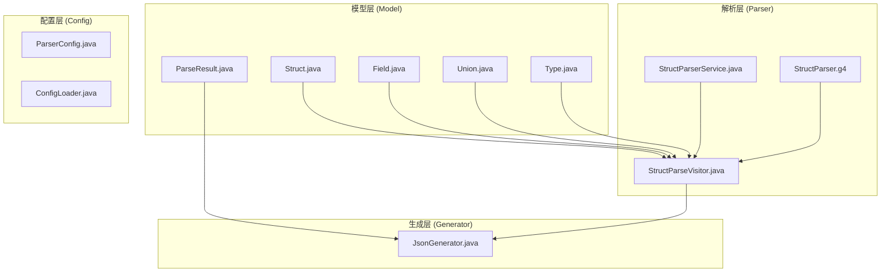
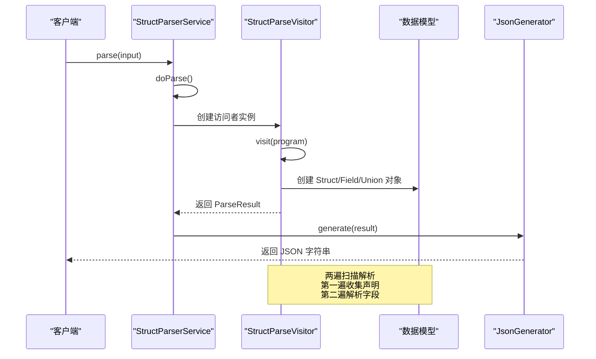
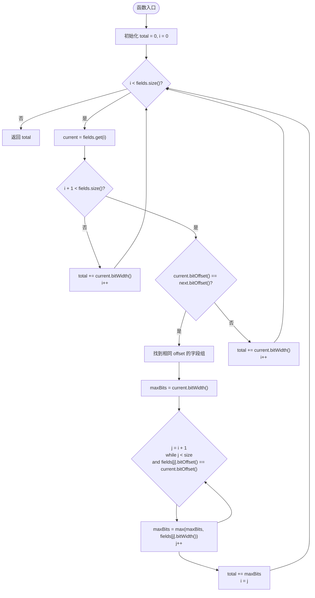
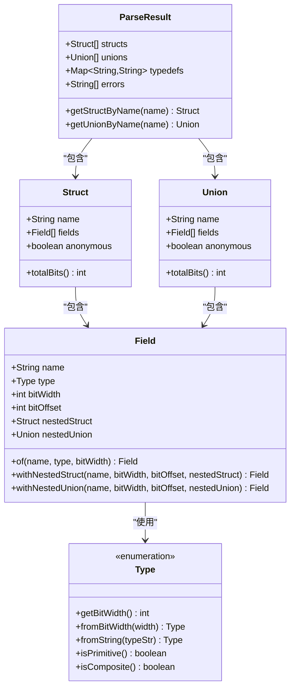

# 结构体模型

<cite>
**本文档引用的文件**
- [Struct.java](file://src/main/java/com/structparser/model/Struct.java)
- [Field.java](file://src/main/java/com/structparser/model/Field.java)
- [Union.java](file://src/main/java/com/structparser/model/Union.java)
- [Type.java](file://src/main/java/com/structparser/model/Type.java)
- [ParseResult.java](file://src/main/java/com/structparser/model/ParseResult.java)
- [StructParseVisitor.java](file://src/main/java/com/structparser/parser/StructParseVisitor.java)
- [JsonGenerator.java](file://src/main/java/com/structparser/generator/JsonGenerator.java)
- [StructParserService.java](file://src/main/java/com/structparser/parser/StructParserService.java)
- [StructParser.g4](file://src/main/antlr4/com/structparser/StructParser.g4)
- [AnonymousFieldExpansionTest.java](file://src/test/java/com/structparser/parser/AnonymousFieldExpansionTest.java)
- [UnionOffsetTest.java](file://src/test/java/com/structparser/parser/UnionOffsetTest.java)
- [README.md](file://README.md)
- [WIKI.md](file://doc/WIKI.md)
</cite>

## 目录
1. [简介](#简介)
2. [项目结构](#项目结构)
3. [核心组件](#核心组件)
4. [架构概览](#架构概览)
5. [详细组件分析](#详细组件分析)
6. [依赖关系分析](#依赖关系分析)
7. [性能考虑](#性能考虑)
8. [故障排除指南](#故障排除指南)
9. [结论](#结论)
10. [附录](#附录)

## 简介

结构体模型是 Struct Parser 项目的核心数据结构，专门设计用于嵌入式系统和硬件寄存器描述场景。该项目基于 Java 26 的 Record 特性，提供了类型安全、不可变的数据模型，支持 C 风格的结构体和联合体解析。

本项目的主要目标是：
- 解析 C 语言风格的结构体和联合体定义
- 支持嵌套和匿名结构体/联合体
- 提供位级别的字段布局计算
- 生成 JSON 格式的结构描述
- 支持 GCC 预处理和条件编译

## 项目结构

项目采用模块化的架构设计，主要分为以下几个核心模块：



**图表来源**
- [Struct.java:1-47](file://src/main/java/com/structparser/model/Struct.java#L1-L47)
- [Field.java:1-23](file://src/main/java/com/structparser/model/Field.java#L1-L23)
- [Union.java:1-20](file://src/main/java/com/structparser/model/Union.java#L1-L20)
- [Type.java:1-104](file://src/main/java/com/structparser/model/Type.java#L1-L104)
- [ParseResult.java:1-78](file://src/main/java/com/structparser/model/ParseResult.java#L1-L78)

**章节来源**
- [README.md:391-428](file://README.md#L391-L428)

## 核心组件

### 数据模型设计

项目使用 Java 26 的 Record 特性来实现不可变的数据模型，确保线程安全和类型安全。

#### 不可变性保证

所有核心模型类都使用 Record 关键字定义，提供以下特性：
- 编译时不可变性
- 自动生成构造函数、getter 方法
- 自动实现 equals()、hashCode()、toString()
- 线程安全的并发访问

#### 字段列表处理

Field 类提供了灵活的字段创建方法：
- `of()`: 创建基础类型的字段
- `withNestedStruct()`: 创建嵌套结构体字段
- `withNestedUnion()`: 创建嵌套联合体字段

**章节来源**
- [Struct.java:9](file://src/main/java/com/structparser/model/Struct.java#L9)
- [Field.java:6](file://src/main/java/com/structparser/model/Field.java#L6)
- [Field.java:9-21](file://src/main/java/com/structparser/model/Field.java#L9-L21)

## 架构概览



**图表来源**
- [StructParserService.java:125-153](file://src/main/java/com/structparser/parser/StructParserService.java#L125-L153)
- [StructParseVisitor.java:36-44](file://src/main/java/com/structparser/parser/StructParseVisitor.java#L36-L44)

## 详细组件分析

### Struct 类分析

Struct 类是整个系统的核心，负责表示 C 语言中的结构体定义。

#### 设计理念

1. **不可变性**: 使用 Record 确保结构体定义一旦创建就不能修改
2. **字段列表处理**: 支持匿名字段的展开和具名字段的保留
3. **位宽计算**: 提供 totalBits() 方法计算结构体的总位宽

#### totalBits() 方法实现

这是 Struct 类的核心功能，实现了复杂的位宽计算逻辑：



**图表来源**
- [Struct.java:16-45](file://src/main/java/com/structparser/model/Struct.java#L16-L45)

#### 匿名联合体字段去重机制

totalBits() 方法的核心创新在于处理匿名联合体字段的去重计算：

1. **联合体识别**: 通过比较相邻字段的 bitOffset() 来识别来自同一联合体的字段
2. **最大宽度选择**: 对于同一联合体内的所有字段，选择 bitWidth() 最大的字段参与总位宽计算
3. **连续处理**: 一次性处理整个联合体字段组，避免重复计算

**章节来源**
- [Struct.java:16-45](file://src/main/java/com/structparser/model/Struct.java#L16-L45)
- [AnonymousFieldExpansionTest.java:84-88](file://src/test/java/com/structparser/parser/AnonymousFieldExpansionTest.java#L84-L88)

### Field 类分析

Field 类表示结构体中的单个字段，支持多种字段类型：

#### 字段类型支持

1. **基础类型字段**: 直接存储 bitWidth 和 bitOffset
2. **嵌套结构体字段**: 通过 nestedStruct 属性引用
3. **嵌套联合体字段**: 通过 nestedUnion 属性引用

#### 工厂方法设计

Field 类提供了三种静态工厂方法：
- `of()`: 创建基础类型字段
- `withNestedStruct()`: 创建嵌套结构体字段
- `withNestedUnion()`: 创建嵌套联合体字段

**章节来源**
- [Field.java:6](file://src/main/java/com/structparser/model/Field.java#L6)
- [Field.java:9-21](file://src/main/java/com/structparser/model/Field.java#L9-L21)

### Union 类分析

Union 类表示 C 语言中的联合体定义，与 Struct 类类似但有不同的位宽计算规则。

#### 联合体位宽计算

Union 类的 totalBits() 方法实现非常简洁：
- 直接返回所有字段中 bitWidth() 的最大值
- 这符合联合体的语义：所有字段共享相同的内存位置

**章节来源**
- [Union.java:16-18](file://src/main/java/com/structparser/model/Union.java#L16-L18)

### Type 枚举分析

Type 枚举提供了完整的类型系统支持：

#### 基础类型支持

支持 uint1 到 uint32 的所有整数类型：
- 每种类型都有明确的位宽定义
- 提供从位宽到类型的转换方法
- 支持从字符串解析类型

#### 类型解析机制

Type 类提供了两种主要的类型解析方法：
- `fromBitWidth()`: 根据位宽获取对应类型
- `fromString()`: 解析字符串形式的类型定义

**章节来源**
- [Type.java:6-104](file://src/main/java/com/structparser/model/Type.java#L6-L104)

## 依赖关系分析



**图表来源**
- [Struct.java:9](file://src/main/java/com/structparser/model/Struct.java#L9)
- [Field.java:6](file://src/main/java/com/structparser/model/Field.java#L6)
- [Union.java:9](file://src/main/java/com/structparser/model/Union.java#L9)
- [Type.java:6-104](file://src/main/java/com/structparser/model/Type.java#L6-L104)
- [ParseResult.java:10-15](file://src/main/java/com/structparser/model/ParseResult.java#L10-L15)

### 组件耦合度分析

项目采用了良好的分层设计，各组件之间的耦合度较低：

1. **模型层**: 完全独立，不依赖其他层
2. **解析层**: 依赖模型层，但模型层不依赖解析层
3. **生成层**: 依赖模型层，但模型层不依赖生成层

这种设计确保了：
- 模型的稳定性
- 解析逻辑的可测试性
- 生成逻辑的可扩展性

**章节来源**
- [StructParseVisitor.java:3-10](file://src/main/java/com/structparser/parser/StructParseVisitor.java#L3-L10)

## 性能考虑

### 时间复杂度分析

1. **Struct.totalBits()**: O(n)，其中 n 是字段数量
2. **Union.totalBits()**: O(n)，需要遍历所有字段找到最大宽度
3. **整体解析**: O(m)，其中 m 是输入文件中的声明数量

### 空间复杂度分析

1. **模型存储**: O(n)，每个字段都需要存储其元数据
2. **解析过程**: O(n)，递归展开嵌套结构体时的临时存储
3. **结果存储**: O(n)，最终的解析结果

### 优化策略

1. **不可变性带来的性能优势**: 避免了同步开销，提高了并发安全性
2. **延迟计算**: 字段的 bitOffset 和 bitWidth 在解析时就计算完成
3. **流式处理**: 使用 Stream API 进行高效的批量操作

## 故障排除指南

### 常见问题及解决方案

#### 循环引用检测

项目实现了两遍扫描机制来检测循环引用：
- 第一遍扫描收集所有顶层声明
- 第二遍扫描解析字段并检测循环引用
- 支持自引用、双向交叉引用和多向循环引用的检测

#### 匿名字段展开问题

匿名字段的展开遵循以下规则：
- 匿名结构体字段：直接展开到父级结构体
- 匿名联合体字段：展开为多个具有相同偏移量的字段
- 具名字段：保持嵌套结构不变

#### 位宽计算异常

如果发现位宽计算异常，检查以下几点：
- 字段的 bitOffset 是否正确设置
- 匿名联合体字段是否具有相同的 bitOffset
- 嵌套结构体的位宽计算是否正确

**章节来源**
- [StructParseVisitor.java:79-90](file://src/main/java/com/structparser/parser/StructParseVisitor.java#L79-L90)
- [StructParseVisitor.java:187-216](file://src/main/java/com/structparser/parser/StructParseVisitor.java#L187-L216)

## 结论

结构体模型设计体现了现代 Java 开发的最佳实践：

1. **类型安全**: 使用 Record 确保数据的不可变性和类型安全
2. **清晰的职责分离**: 模型、解析、生成三层架构清晰
3. **强大的功能**: 支持复杂的嵌套结构和匿名字段处理
4. **优秀的性能**: 优化的算法和数据结构设计

该模型特别适用于硬件寄存器描述和嵌入式系统开发场景，能够准确地表示 C 语言结构体的位级布局，并提供可靠的 JSON 输出格式。

## 附录

### 使用示例

#### 基础结构体解析

```c
struct ControlReg {
    uint1  enable;
    uint1  interrupt;
    uint2  mode;
    uint4  reserved;
    uint8  prescale;
    uint16 timeout;
};
```

#### 嵌套结构体解析

```c
struct PacketHeader {
    uint8  version;
    uint8  type;
    uint16 length;
    union {
        uint32 raw;
        struct {
            uint16 low;
            uint16 high;
        } words;
    } checksum;
};
```

### 最佳实践

1. **字段顺序**: 按照位级布局的顺序定义字段
2. **匿名字段**: 合理使用匿名字段以获得更紧凑的布局
3. **联合体设计**: 谨慎设计联合体字段，确保位宽兼容性
4. **类型选择**: 优先使用 uintN 类型以获得精确的位宽控制

### 硬件寄存器描述应用场景

该结构体模型特别适用于以下硬件寄存器描述场景：

1. **控制寄存器**: 表示硬件设备的控制位和状态标志
2. **数据包格式**: 描述网络协议或通信协议的数据包结构
3. **配置寄存器**: 存储硬件配置参数和运行时设置
4. **状态机寄存器**: 表示有限状态机的状态和转换条件

通过精确的位级布局计算，该模型能够确保硬件描述的准确性，避免位宽冲突和布局错误。