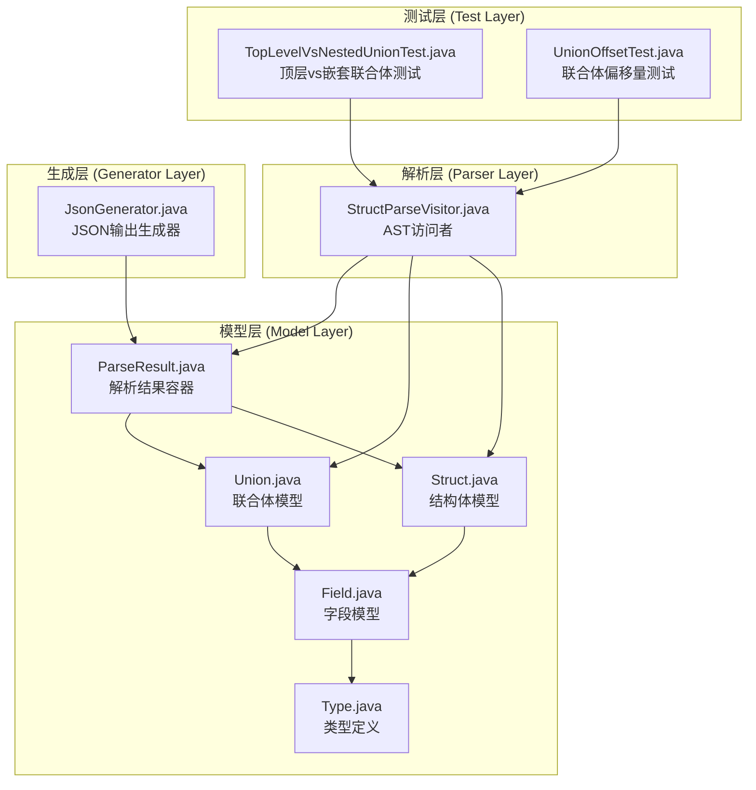
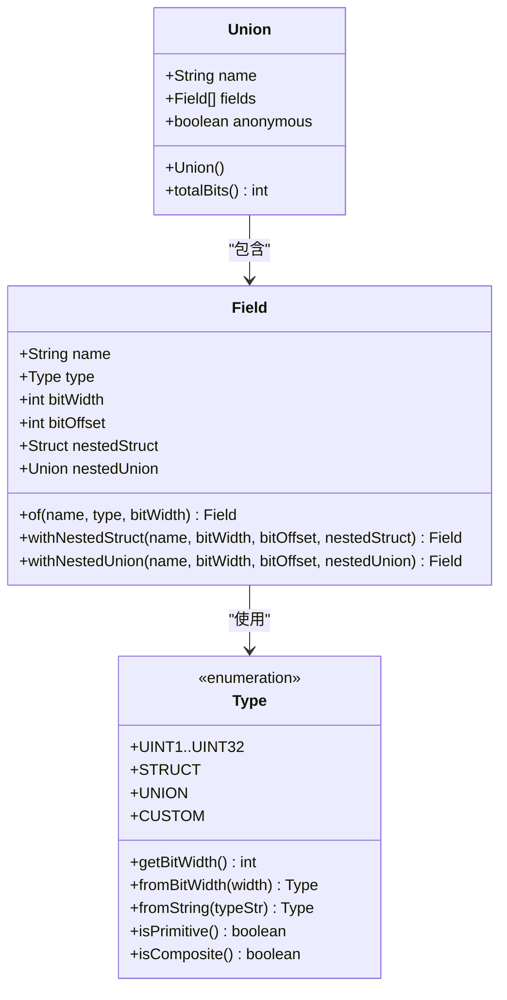
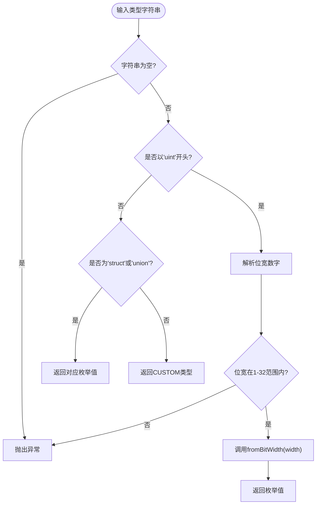
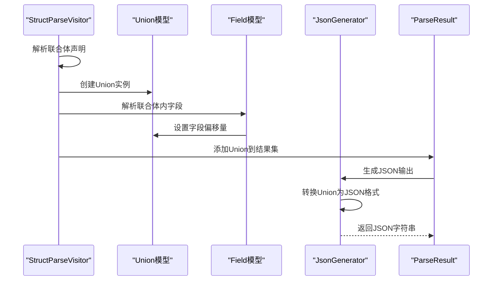
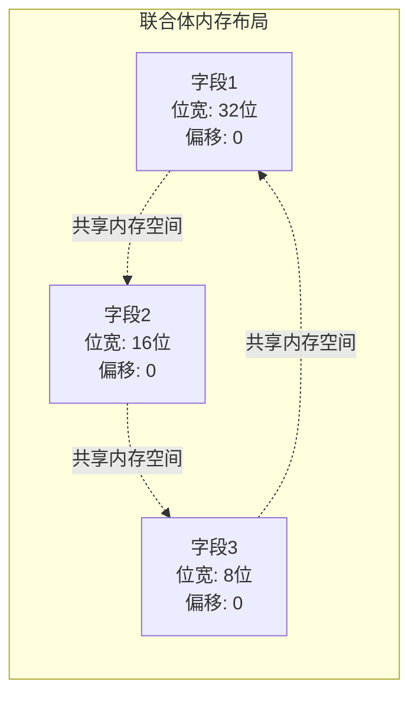
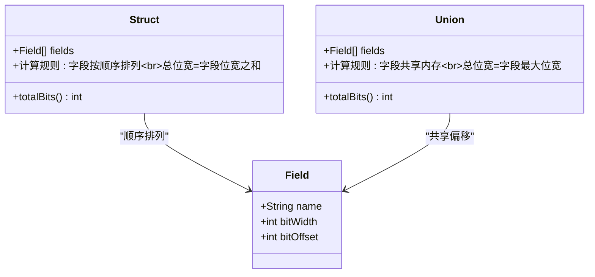
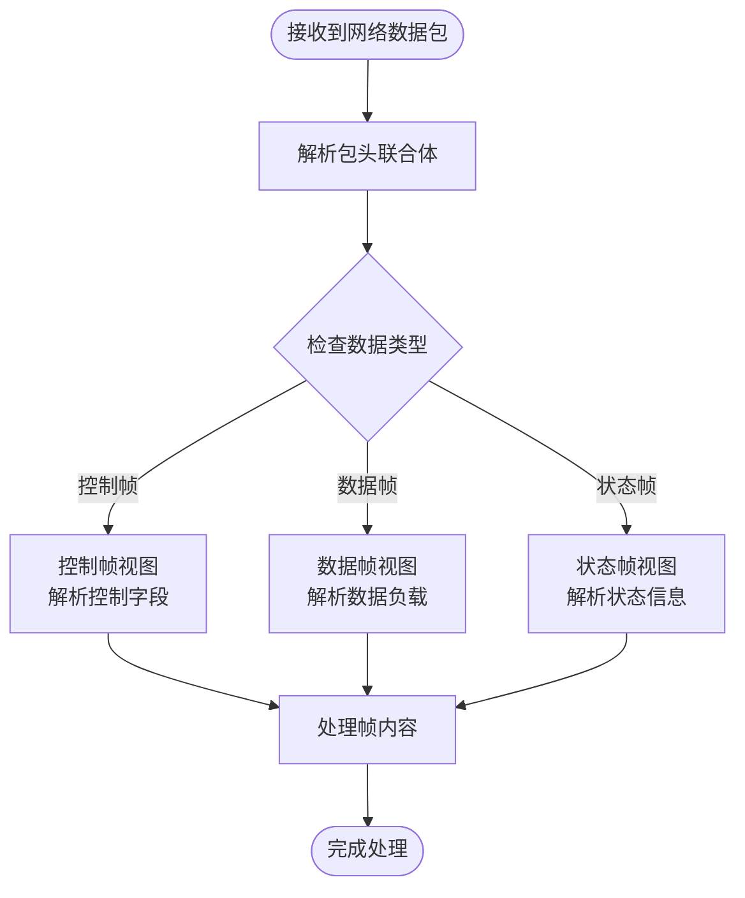
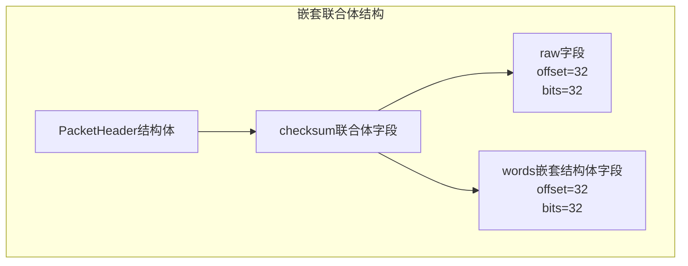
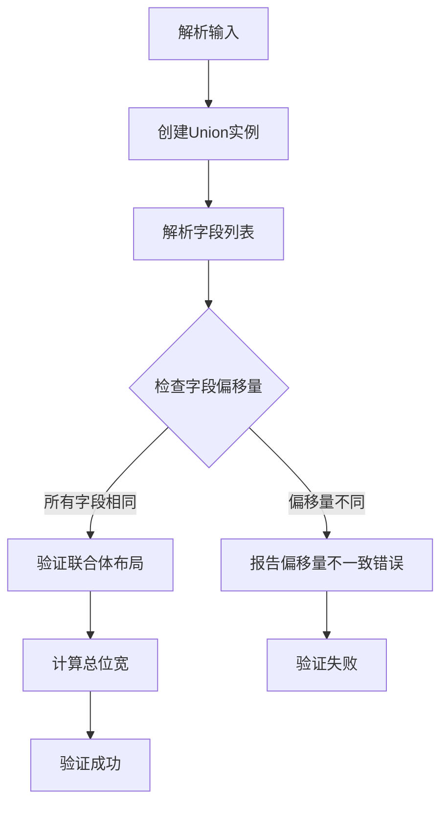
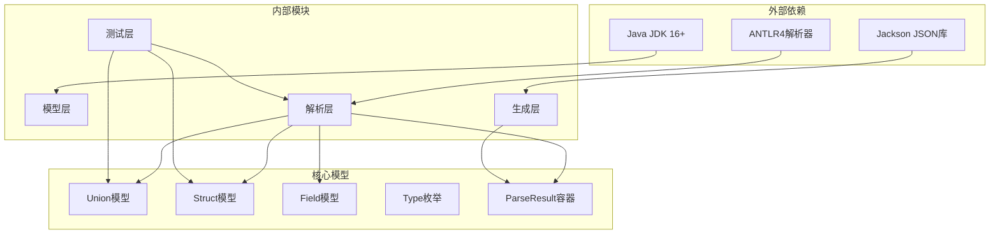

# 联合体模型

<cite>
**本文档引用的文件**
- [Union.java](file://src/main/java/com/structparser/model/Union.java)
- [Struct.java](file://src/main/java/com/structparser/model/Struct.java)
- [Field.java](file://src/main/java/com/structparser/model/Field.java)
- [Type.java](file://src/main/java/com/structparser/model/Type.java)
- [ParseResult.java](file://src/main/java/com/structparser/model/ParseResult.java)
- [StructParseVisitor.java](file://src/main/java/com/structparser/parser/StructParseVisitor.java)
- [JsonGenerator.java](file://src/main/java/com/structparser/generator/JsonGenerator.java)
- [TopLevelVsNestedUnionTest.java](file://src/test/java/com/structparser/parser/TopLevelVsNestedUnionTest.java)
- [UnionOffsetTest.java](file://src/test/java/com/structparser/parser/UnionOffsetTest.java)
- [README.md](file://README.md)
- [types.h](file://src/test/resources/headers/types.h)
</cite>

## 目录
1. [简介](#简介)
2. [项目结构](#项目结构)
3. [核心组件](#核心组件)
4. [架构概览](#架构概览)
5. [详细组件分析](#详细组件分析)
6. [依赖关系分析](#依赖关系分析)
7. [性能考虑](#性能考虑)
8. [故障排除指南](#故障排除指南)
9. [结论](#结论)

## 简介

联合体模型是本项目的核心数据结构之一，专门用于表示C语言中的联合体（union）类型。联合体是一种特殊的结构体，其所有成员共享同一块内存空间，这使得它成为硬件描述、嵌入式系统和底层编程中的重要工具。

本项目采用现代Java技术栈，使用JDK 16+的Record特性来实现不可变的数据模型，并通过ANTLR4解析器生成器来处理复杂的C语言语法。联合体模型不仅支持基本的联合体定义，还支持嵌套联合体、匿名联合体以及与其他数据类型的组合使用。

## 项目结构

该项目采用模块化的架构设计，主要包含以下核心模块：



**图表来源**
- [Union.java:1-20](file://src/main/java/com/structparser/model/Union.java#L1-L20)
- [Struct.java:1-47](file://src/main/java/com/structparser/model/Struct.java#L1-L47)
- [Field.java:1-23](file://src/main/java/com/structparser/model/Field.java#L1-L23)
- [Type.java:1-104](file://src/main/java/com/structparser/model/Type.java#L1-L104)
- [ParseResult.java:1-78](file://src/main/java/com/structparser/model/ParseResult.java#L1-L78)

**章节来源**
- [README.md:391-428](file://README.md#L391-L428)

## 核心组件

### 联合体模型 (Union)

联合体模型是本项目中最核心的数据结构之一，采用JDK 16+的Record特性实现，确保了数据的不可变性和线程安全性。



**图表来源**
- [Union.java:6-19](file://src/main/java/com/structparser/model/Union.java#L6-L19)
- [Field.java:6](file://src/main/java/com/structparser/model/Field.java#L6)
- [Type.java:6-103](file://src/main/java/com/structparser/model/Type.java#L6-L103)

联合体模型的主要特点：

1. **不可变性**: 使用Record类确保数据一旦创建就不能被修改
2. **类型安全**: 通过泛型确保字段列表的类型正确性
3. **空值保护**: 构造函数中对null值进行处理，确保数据完整性
4. **位宽计算**: 提供`totalBits()`方法计算联合体的最大位宽

**章节来源**
- [Union.java:1-20](file://src/main/java/com/structparser/model/Union.java#L1-L20)

### 字段模型 (Field)

字段模型是联合体和结构体的基础单元，包含了字段的所有元数据信息。

字段模型的关键属性：
- `name`: 字段名称
- `type`: 字段类型（基础类型或复合类型）
- `bitWidth`: 字段的位宽
- `bitOffset`: 字段在内存中的偏移量
- `nestedStruct`: 嵌套的结构体（如果存在）
- `nestedUnion`: 嵌套的联合体（如果存在）

**章节来源**
- [Field.java:1-23](file://src/main/java/com/structparser/model/Field.java#L1-L23)

### 类型系统 (Type)

类型系统提供了完整的类型定义和转换机制，支持从字符串到类型枚举的转换。



**图表来源**
- [Type.java:71-94](file://src/main/java/com/structparser/model/Type.java#L71-L94)

**章节来源**
- [Type.java:1-104](file://src/main/java/com/structparser/model/Type.java#L1-L104)

## 架构概览

联合体模型在整个系统中的作用和交互关系如下：



**图表来源**
- [StructParseVisitor.java:102-134](file://src/main/java/com/structparser/parser/StructParseVisitor.java#L102-L134)
- [JsonGenerator.java:108-136](file://src/main/java/com/structparser/generator/JsonGenerator.java#L108-L136)

系统的工作流程：

1. **解析阶段**: `StructParseVisitor`解析C语言源码，识别联合体定义
2. **建模阶段**: 创建`Union`和`Field`实例，建立数据模型
3. **验证阶段**: 检查联合体的位宽计算和字段布局
4. **输出阶段**: 通过`JsonGenerator`生成结构化JSON输出

**章节来源**
- [README.md:374-389](file://README.md#L374-L389)

## 详细组件分析

### 联合体的特殊性质

联合体的核心特性是所有成员共享同一块内存空间。这种设计在硬件描述中具有重要意义：

#### 内存共享机制



**图表来源**
- [StructParseVisitor.java:197-204](file://src/main/java/com/structparser/parser/StructParseVisitor.java#L197-L204)

#### 字段布局计算

联合体的字段布局计算遵循以下规则：

1. **统一偏移量**: 所有联合体字段的`bitOffset`都设置为联合体的起始偏移量
2. **最大位宽**: 联合体的总位宽等于其字段中的最大位宽
3. **绝对定位**: 嵌套联合体内部字段的偏移量是相对于最外层结构体的绝对偏移

**章节来源**
- [Union.java:15-18](file://src/main/java/com/structparser/model/Union.java#L15-L18)
- [StructParseVisitor.java:191-207](file://src/main/java/com/structparser/parser/StructParseVisitor.java#L191-L207)

### 联合体与结构体的区别

虽然联合体和结构体在概念上相似，但它们在内存布局和使用方式上有本质区别：



**图表来源**
- [Struct.java:15-45](file://src/main/java/com/structparser/model/Struct.java#L15-L45)
- [Union.java:15-18](file://src/main/java/com/structparser/model/Union.java#L15-L18)

#### 关键差异对比

| 特性 | 结构体 (Struct) | 联合体 (Union) |
|------|----------------|----------------|
| 内存布局 | 顺序排列 | 共享内存 |
| 总位宽计算 | 字段位宽之和 | 字段最大位宽 |
| 字段偏移 | 递增累加 | 相同偏移 |
| 数据访问 | 同时访问 | 互斥访问 |
| 使用场景 | 数据聚合 | 内存复用 |

**章节来源**
- [Struct.java:15-45](file://src/main/java/com/structparser/model/Struct.java#L15-L45)
- [Union.java:15-18](file://src/main/java/com/structparser/model/Union.java#L15-L18)

### 硬件描述中的应用场景

联合体在硬件描述中具有广泛的应用价值：

#### 寄存器映射

在嵌入式系统中，联合体常用于寄存器的不同视图表示：

```mermaid
graph TB
subgraph "寄存器联合体"
RAW[原始32位寄存器<br/>uint32 raw]
WORDS[16位字视图<br/>struct { uint16 low; uint16 high; } words]
BYTES[8位字节视图<br/>struct { uint8 a; uint8 b; uint8 c; uint8 d; } bytes]
end
RAW -.->|"内存共享"| WORDS
WORDS -.->|"内存共享"| BYTES
BYTES -.->|"内存共享"| RAW
```

#### 协议帧解析

在网络协议和通信协议中，联合体用于表示同一数据的不同解释方式：



**图表来源**
- [UnionOffsetTest.java:18-97](file://src/test/java/com/structparser/parser/UnionOffsetTest.java#L18-L97)

### 使用示例

#### 顶层联合体示例

顶层联合体是最简单的联合体形式，所有字段都从偏移量0开始：

```mermaid
sequenceDiagram
participant User as "用户代码"
participant Parser as "StructParseVisitor"
participant Union as "Union模型"
participant Field as "Field模型"
User->>Parser : 解析 "union Data { uint32 word; uint8 bytes; }"
Parser->>Union : 创建Union实例
Parser->>Field : 创建字段word (offset=0)
Parser->>Field : 创建字段bytes (offset=0)
Parser->>Union : 设置totalBits=32
Parser-->>User : 返回解析结果
```

**图表来源**
- [TopLevelVsNestedUnionTest.java:14-35](file://src/test/java/com/structparser/parser/TopLevelVsNestedUnionTest.java#L14-L35)

#### 嵌套联合体示例

嵌套联合体展示了联合体在复杂数据结构中的应用：



**图表来源**
- [UnionOffsetTest.java:20-33](file://src/test/java/com/structparser/parser/UnionOffsetTest.java#L20-L33)

**章节来源**
- [TopLevelVsNestedUnionTest.java:1-72](file://src/test/java/com/structparser/parser/TopLevelVsNestedUnionTest.java#L1-L72)
- [UnionOffsetTest.java:1-143](file://src/test/java/com/structparser/parser/UnionOffsetTest.java#L1-L143)

### 数据验证机制

系统实现了多层次的数据验证机制来确保联合体模型的正确性：

#### 偏移量验证



**图表来源**
- [StructParseVisitor.java:191-207](file://src/main/java/com/structparser/parser/StructParseVisitor.java#L191-L207)

#### 联合体布局验证

系统通过单元测试验证联合体的布局正确性：

1. **顶层联合体验证**: 确保所有字段偏移量都为0
2. **嵌套联合体验证**: 确保嵌套字段具有正确的绝对偏移量
3. **位宽计算验证**: 确保联合体的总位宽等于最大字段位宽

**章节来源**
- [TopLevelVsNestedUnionTest.java:30-34](file://src/test/java/com/structparser/parser/TopLevelVsNestedUnionTest.java#L30-L34)
- [UnionOffsetTest.java:66-81](file://src/test/java/com/structparser/parser/UnionOffsetTest.java#L66-L81)

## 依赖关系分析

联合体模型的依赖关系体现了清晰的分层架构：



**图表来源**
- [README.md:430-438](file://README.md#L430-L438)

### 模块间耦合度分析

- **低耦合**: 模型层与解析层通过接口分离，便于独立测试和维护
- **高内聚**: 相关功能集中在同一模块内，如联合体相关的所有逻辑都在解析层处理
- **清晰边界**: 每个模块都有明确的职责划分，避免功能重叠

**章节来源**
- [README.md:430-438](file://README.md#L430-L438)

## 性能考虑

### 内存效率

联合体模型采用了多种优化策略来提高内存效率：

1. **Record类**: 使用不可变Record类减少内存开销
2. **List.copyOf()**: 创建不可变列表副本，避免不必要的数据复制
3. **Stream API**: 使用函数式编程接口提高处理效率

### 处理效率

- **延迟计算**: 联合体的总位宽计算采用惰性求值策略
- **缓存机制**: 解析结果通过不可变对象缓存，避免重复计算
- **批量操作**: 使用Stream API进行批量数据处理

## 故障排除指南

### 常见问题及解决方案

#### 联合体解析错误

**问题**: 联合体字段偏移量不正确
**原因**: 嵌套联合体的相对偏移量计算错误
**解决方案**: 检查`createExpandedUnion`方法的实现，确保字段偏移量正确设置

#### 类型转换错误

**问题**: 从字符串解析类型时抛出异常
**原因**: 输入的类型字符串不符合规范
**解决方案**: 使用`Type.fromString()`方法进行类型解析，检查输入格式

#### 循环引用检测

**问题**: 解析过程中检测到循环引用
**原因**: 联合体或结构体相互引用形成环路
**解决方案**: 检查数据模型的依赖关系，消除循环引用

**章节来源**
- [StructParseVisitor.java:335-364](file://src/main/java/com/structparser/parser/StructParseVisitor.java#L335-L364)

### 调试技巧

1. **启用详细日志**: 使用SLF4J框架记录解析过程
2. **单元测试**: 运行现有的联合体测试用例验证功能正确性
3. **可视化工具**: 使用JSON输出生成器查看中间结果

**章节来源**
- [README.md:469-485](file://README.md#L469-L485)

## 结论

联合体模型作为本项目的核心组件，成功地实现了对C语言联合体的完整支持。通过采用现代Java技术栈和精心设计的架构，该模型不仅保证了数据的正确性和一致性，还提供了良好的扩展性和可维护性。

### 主要成就

1. **准确的语义建模**: 准确反映了联合体的内存共享特性和字段布局规则
2. **完善的类型系统**: 提供了从字符串到类型枚举的完整转换机制
3. **强大的解析能力**: 支持复杂的嵌套联合体和混合数据结构
4. **可靠的验证机制**: 通过多层次的测试确保数据的正确性

### 技术特色

- **现代化实现**: 使用JDK 16+的Record特性实现不可变数据模型
- **高性能处理**: 采用Stream API和函数式编程接口提高处理效率
- **全面的测试覆盖**: 包含122+个测试用例，涵盖各种使用场景
- **灵活的配置支持**: 通过YAML配置文件支持批量解析和自定义输出格式

该联合体模型为硬件描述、嵌入式系统开发和底层编程提供了强有力的支持，是构建复杂数据结构描述工具的重要基础设施。