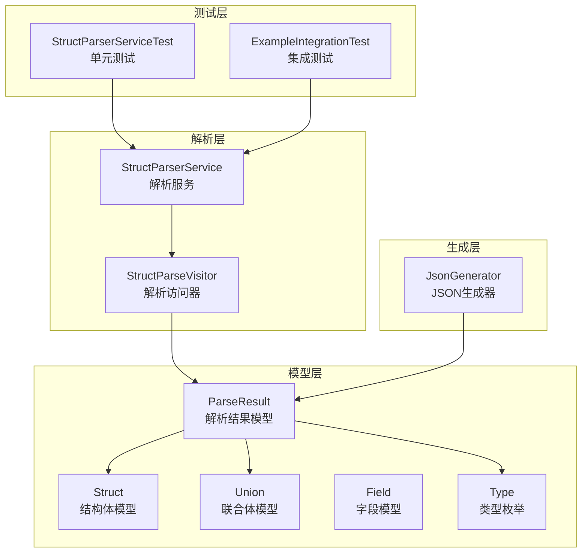
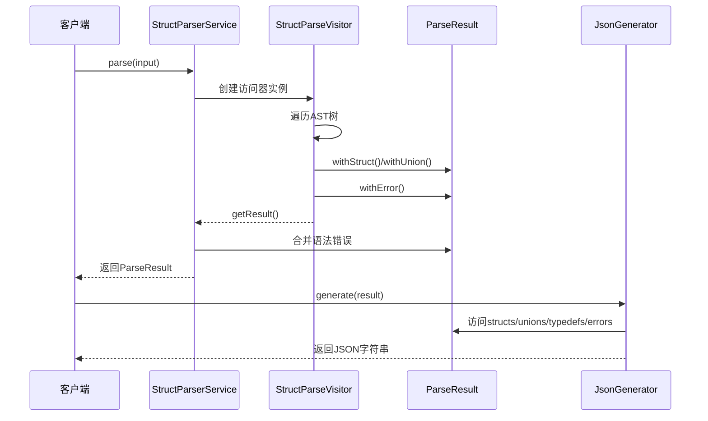
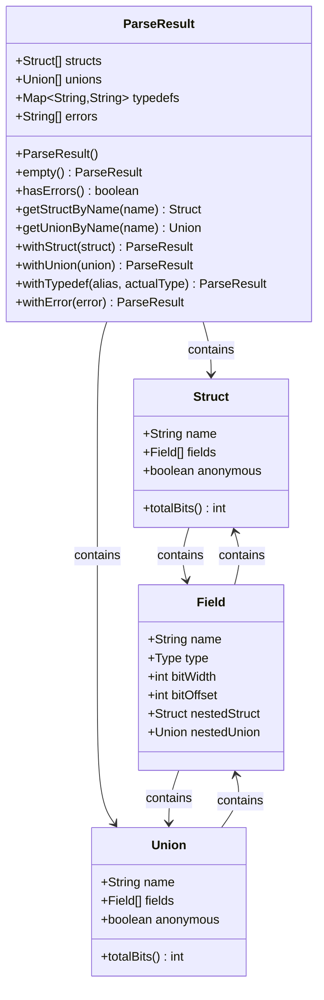
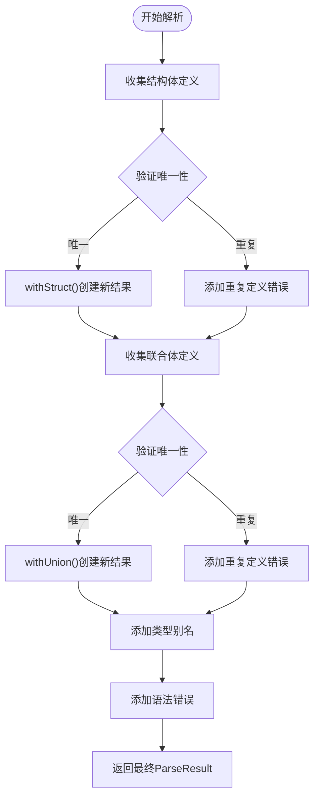
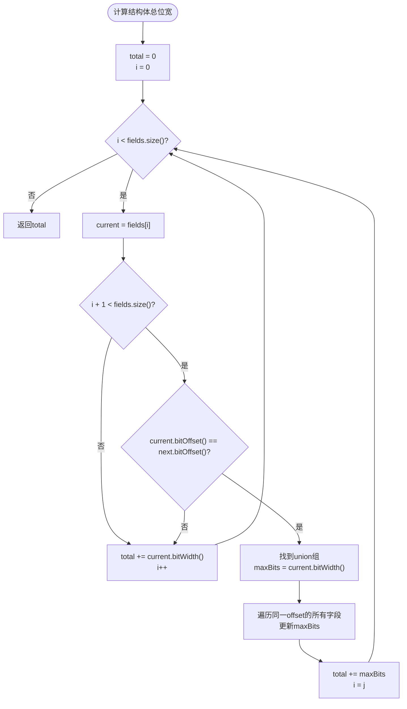
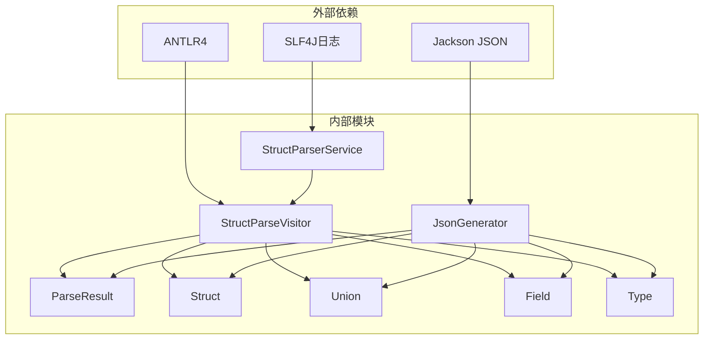
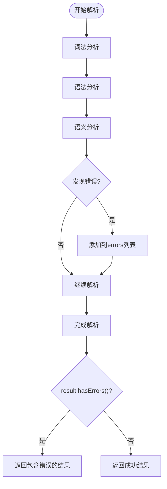

# 解析结果模型

<cite>
**本文档引用的文件**
- [ParseResult.java](file://src/main/java/com/structparser/model/ParseResult.java)
- [Struct.java](file://src/main/java/com/structparser/model/Struct.java)
- [Union.java](file://src/main/java/com/structparser/model/Union.java)
- [Field.java](file://src/main/java/com/structparser/model/Field.java)
- [Type.java](file://src/main/java/com/structparser/model/Type.java)
- [StructParseVisitor.java](file://src/main/java/com/structparser/parser/StructParseVisitor.java)
- [StructParserService.java](file://src/main/java/com/structparser/parser/StructParserService.java)
- [JsonGenerator.java](file://src/main/java/com/structparser/generator/JsonGenerator.java)
- [StructParserServiceTest.java](file://src/test/java/com/structparser/parser/StructParserServiceTest.java)
- [ExampleIntegrationTest.java](file://src/test/java/com/structparser/parser/ExampleIntegrationTest.java)
</cite>

## 目录
1. [简介](#简介)
2. [项目结构](#项目结构)
3. [核心组件](#核心组件)
4. [架构概览](#架构概览)
5. [详细组件分析](#详细组件分析)
6. [依赖关系分析](#依赖关系分析)
7. [性能考虑](#性能考虑)
8. [故障排除指南](#故障排除指南)
9. [结论](#结论)

## 简介

解析结果模型是结构体解析系统的核心数据结构，负责封装解析过程中的所有重要信息。该模型采用现代Java记录类（Record）设计，提供了不可变的数据封装和简洁的API接口。本文档深入分析ParseResult记录类的设计理念、实现细节以及在整个解析系统中的作用。

## 项目结构

该项目采用清晰的分层架构，主要包含以下模块：

**图表来源**
- [ParseResult.java:1-78](file://src/main/java/com/structparser/model/ParseResult.java#L1-L78)
- [StructParseVisitor.java:1-517](file://src/main/java/com/structparser/parser/StructParseVisitor.java#L1-L517)
- [StructParserService.java:1-185](file://src/main/java/com/structparser/parser/StructParserService.java#L1-L185)
- [JsonGenerator.java:1-260](file://src/main/java/com/structparser/generator/JsonGenerator.java#L1-L260)

**章节来源**
- [ParseResult.java:1-78](file://src/main/java/com/structparser/model/ParseResult.java#L1-L78)
- [StructParseVisitor.java:1-517](file://src/main/java/com/structparser/parser/StructParseVisitor.java#L1-L517)

## 核心组件

解析结果模型由四个核心组件构成，每个组件都有明确的职责和设计原则：

### ParseResult 记录类

ParseResult是整个解析系统的中央数据容器，采用JDK 16+ Record特性实现，确保了数据的不可变性和线程安全性。

### 数据结构组织

解析结果模型采用以下数据结构组织方式：

- **结构体列表**：存储所有解析到的结构体定义
- **联合体列表**：存储所有解析到的联合体定义  
- **类型别名映射**：存储typedef定义的类型映射关系
- **错误信息列表**：存储解析过程中产生的所有错误信息

### 设计特点

1. **不可变性**：通过Record类确保数据一旦创建就不能修改
2. **空值安全**：构造函数中对null值进行安全处理
3. **防御性拷贝**：对集合类型进行不可变包装
4. **便捷方法**：提供hasErrors()、getStructByName()等实用方法

**章节来源**
- [ParseResult.java:10-77](file://src/main/java/com/structparser/model/ParseResult.java#L10-L77)

## 架构概览

解析结果模型在整个系统中的作用可以通过以下序列图来展示：

**图表来源**
- [StructParserService.java:125-153](file://src/main/java/com/structparser/parser/StructParserService.java#L125-L153)
- [StructParseVisitor.java:31-34](file://src/main/java/com/structparser/parser/StructParseVisitor.java#L31-L34)
- [JsonGenerator.java:21-76](file://src/main/java/com/structparser/generator/JsonGenerator.java#L21-L76)

## 详细组件分析

### ParseResult 类深度分析

#### 类结构设计

**图表来源**
- [ParseResult.java:10-77](file://src/main/java/com/structparser/model/ParseResult.java#L10-L77)
- [Struct.java:9](file://src/main/java/com/structparser/model/Struct.java#L9)
- [Union.java:9](file://src/main/java/com/structparser/model/Union.java#L9)
- [Field.java:6](file://src/main/java/com/structparser/model/Field.java#L6)

#### 构造函数与初始化

ParseResult的构造函数实现了完整的数据验证和安全处理：

1. **参数验证**：使用Objects.requireNonNullElse处理null参数
2. **防御性拷贝**：对集合类型使用List.copyOf和Map.copyOf创建不可变副本
3. **默认值处理**：为空集合提供默认的空列表或空映射

#### 聚合机制

解析结果采用了"不可变聚合"的设计模式：

**图表来源**
- [StructParseVisitor.java:74-77](file://src/main/java/com/structparser/parser/StructParseVisitor.java#L74-L77)
- [StructParseVisitor.java:108-111](file://src/main/java/com/structparser/parser/StructParseVisitor.java#L108-L111)
- [ParseResult.java:51-62](file://src/main/java/com/structparser/model/ParseResult.java#L51-L62)

#### 数据完整性保证

ParseResult通过以下机制确保数据完整性：

1. **类型安全**：泛型参数确保集合元素类型正确
2. **不可变性**：Record类的不可变特性防止意外修改
3. **空值保护**：构造函数中的null检查避免空指针异常
4. **状态一致性**：所有操作都返回新的ParseResult实例，保持原有实例不变

### 结构体模型分析

#### 结构体总位宽计算

结构体的总位宽计算是解析系统的核心算法之一：

**图表来源**
- [Struct.java:16-45](file://src/main/java/com/structparser/model/Struct.java#L16-L45)

#### 联合体模型特点

联合体模型相对简单，因为所有字段共享相同的位偏移：

- **总位宽**：取所有字段中的最大位宽
- **字段偏移**：所有字段的bitOffset都是0
- **嵌套支持**：同样支持嵌套结构体和联合体

### 字段模型设计

字段模型采用Record类实现，包含以下关键属性：

- **名称**：字段的标识符
- **类型**：字段的类型（基础类型、复合类型或自定义类型）
- **位宽**：字段占用的位数
- **位偏移**：字段在结构体中的绝对位偏移
- **嵌套结构**：可选的嵌套结构体或联合体引用

**章节来源**
- [ParseResult.java:10-77](file://src/main/java/com/structparser/model/ParseResult.java#L10-L77)
- [Struct.java:9](file://src/main/java/com/structparser/model/Struct.java#L9)
- [Union.java:9](file://src/main/java/com/structparser/model/Union.java#L9)
- [Field.java:6](file://src/main/java/com/structparser/model/Field.java#L6)

## 依赖关系分析

解析结果模型的依赖关系体现了清晰的分层架构：

**图表来源**
- [StructParserService.java:3](file://src/main/java/com/structparser/parser/StructParserService.java#L3-L5)
- [JsonGenerator.java:3](file://src/main/java/com/structparser/generator/JsonGenerator.java#L3-L8)

### 组件耦合度分析

解析结果模型展现了良好的低耦合设计：

- **模型层独立**：ParseResult不依赖具体实现细节
- **解析层解耦**：StructParseVisitor通过接口与模型交互
- **生成层分离**：JsonGenerator仅依赖模型接口
- **测试隔离**：测试用例独立于具体实现

**章节来源**
- [StructParseVisitor.java:1-517](file://src/main/java/com/structparser/parser/StructParseVisitor.java#L1-L517)
- [JsonGenerator.java:1-260](file://src/main/java/com/structparser/generator/JsonGenerator.java#L1-L260)

## 性能考虑

### 时间复杂度分析

1. **解析结果构建**：O(n) - n为解析到的元素数量
2. **结构体总位宽计算**：O(n) - 需要遍历所有字段
3. **联合体总位宽计算**：O(n) - 需要找到最大位宽
4. **查找操作**：O(n) - 线性搜索结构体和联合体

### 空间复杂度优化

1. **不可变设计**：避免不必要的数据复制
2. **防御性拷贝**：只在必要时创建副本
3. **延迟计算**：totalBits()方法按需计算
4. **内存管理**：Record类提供更好的内存效率

### 缓存策略

解析结果模型天然支持缓存：
- **不可变性**：结果可以安全地缓存和重用
- **线程安全**：多线程环境下安全使用
- **序列化友好**：Record类支持自动序列化

## 故障排除指南

### 常见错误类型

根据测试用例分析，解析结果可能遇到以下错误：

1. **语法错误**：缺少分号、括号不匹配等
2. **语义错误**：重复定义、未知类型等
3. **逻辑错误**：循环引用、前向引用等

### 错误处理策略

**图表来源**
- [StructParserService.java:140-152](file://src/main/java/com/structparser/parser/StructParserService.java#L140-L152)
- [StructParseVisitor.java:511-515](file://src/main/java/com/structparser/parser/StructParseVisitor.java#L511-L515)

### 结果验证方法

测试用例展示了多种验证策略：

1. **基本验证**：检查结构体数量、字段数量
2. **位宽验证**：验证总位宽计算正确性
3. **偏移量验证**：验证字段偏移量的绝对性
4. **嵌套验证**：验证嵌套结构的正确展开
5. **错误处理验证**：验证错误信息的正确收集

**章节来源**
- [StructParserServiceTest.java:14-44](file://src/test/java/com/structparser/parser/StructParserServiceTest.java#L14-L44)
- [ExampleIntegrationTest.java:18-61](file://src/test/java/com/structparser/parser/ExampleIntegrationTest.java#L18-L61)

## 结论

解析结果模型通过精心设计的Record类实现了数据的不可变性、类型安全性和线程安全性。其核心优势包括：

1. **设计优雅**：采用现代Java特性，代码简洁易懂
2. **功能完整**：涵盖结构体、联合体、字段等所有核心概念
3. **扩展性强**：支持类型别名和错误信息的动态扩展
4. **性能优秀**：不可变设计提供良好的性能特征
5. **测试友好**：清晰的接口便于单元测试和集成测试

该模型为整个结构体解析系统奠定了坚实的基础，既满足了当前的功能需求，又为未来的扩展预留了充足的空间。