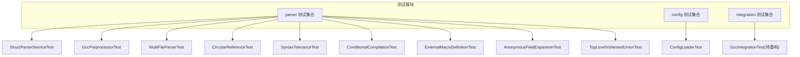
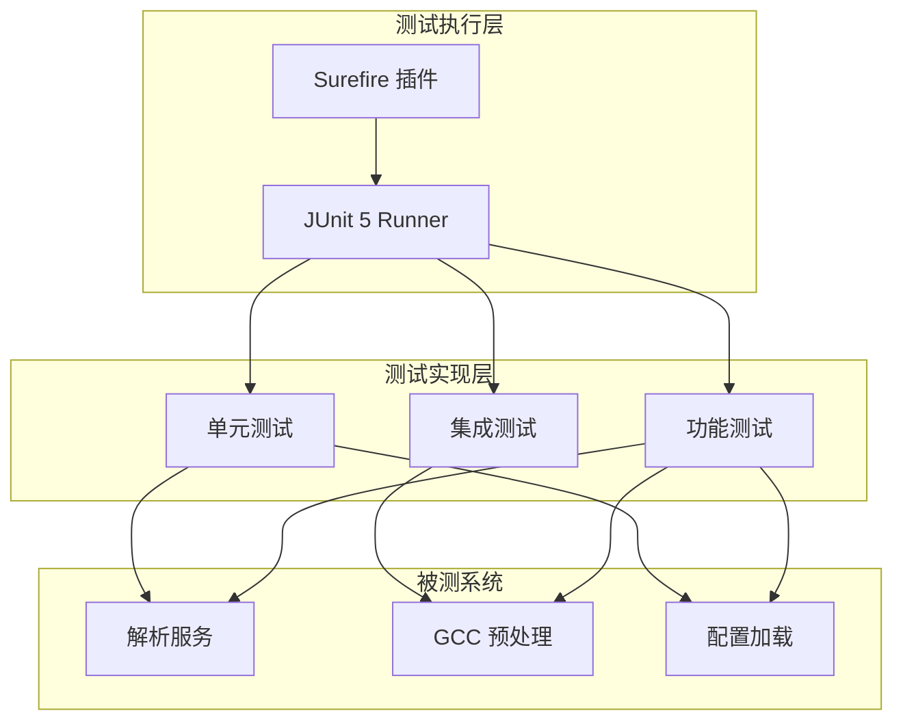
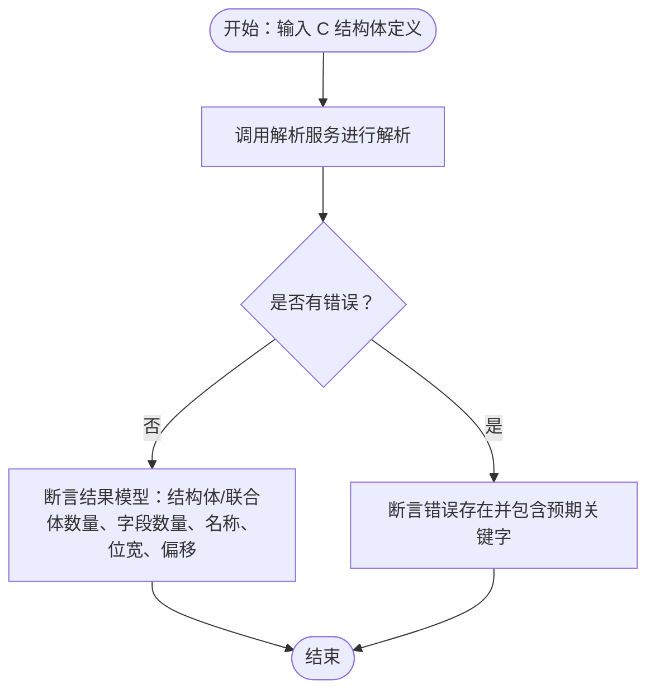
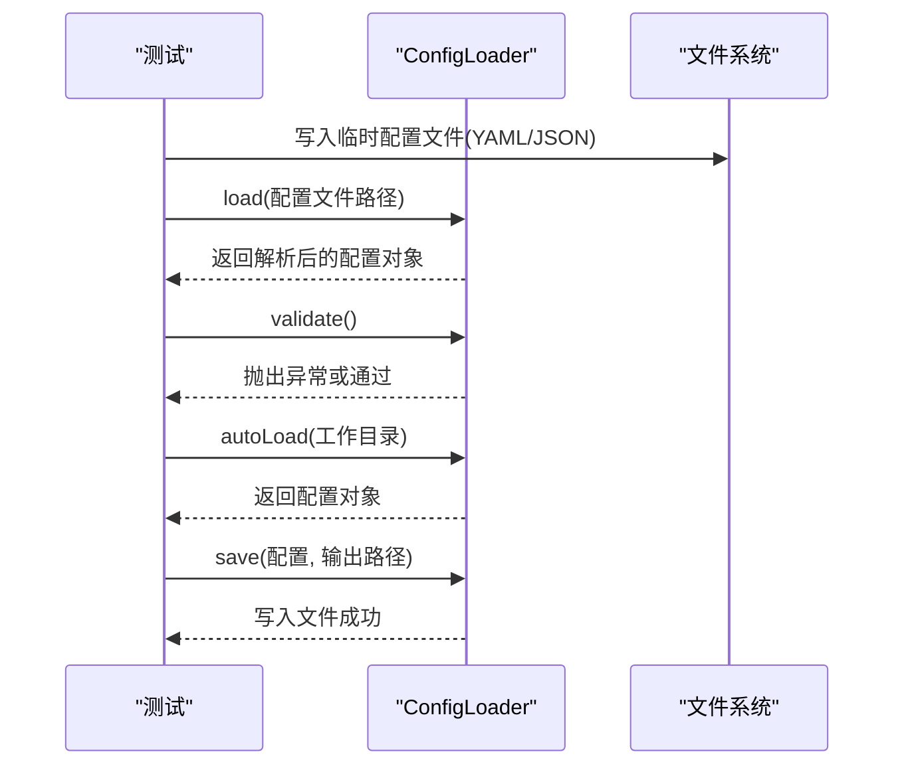
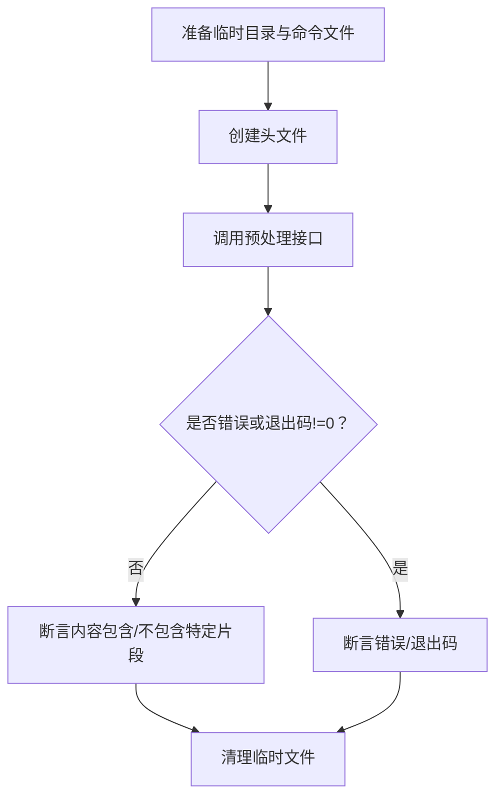
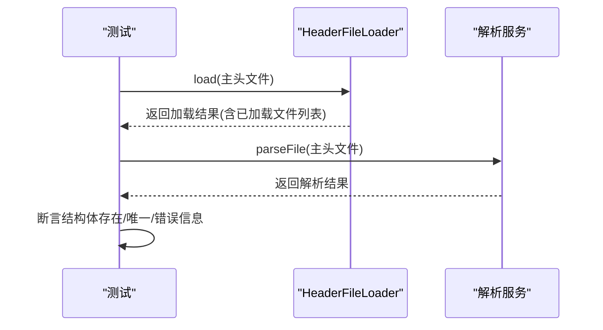
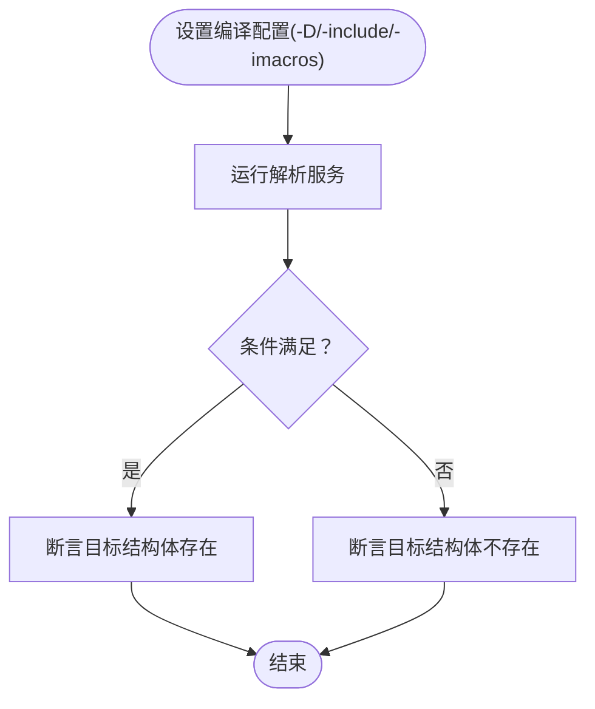
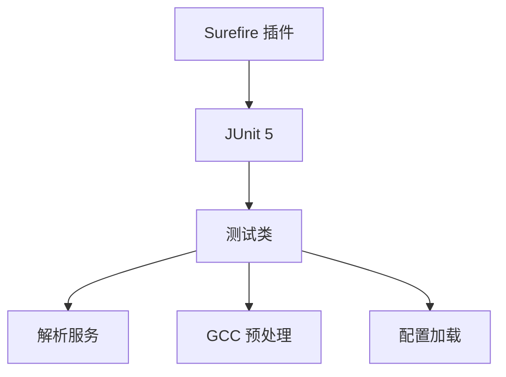

# 测试策略

<cite>
**本文档引用的文件**
- [README.md](file://README.md)
- [pom.xml](file://pom.xml)
- [StructParserServiceTest.java](file://src/test/java/com/structparser/parser/StructParserServiceTest.java)
- [ConfigLoaderTest.java](file://src/test/java/com/structparser/config/ConfigLoaderTest.java)
- [GccPreprocessorTest.java](file://src/test/java/com/structparser/parser/GccPreprocessorTest.java)
- [MultiFileParserTest.java](file://src/test/java/com/structparser/parser/MultiFileParserTest.java)
- [CircularReferenceTest.java](file://src/test/java/com/structparser/parser/CircularReferenceTest.java)
- [SyntaxToleranceTest.java](file://src/test/java/com/structparser/parser/SyntaxToleranceTest.java)
- [ConditionalCompilationTest.java](file://src/test/java/com/structparser/parser/ConditionalCompilationTest.java)
- [ExternalMacroDefinitionTest.java](file://src/test/java/com/structparser/parser/ExternalMacroDefinitionTest.java)
- [AnonymousFieldExpansionTest.java](file://src/test/java/com/structparser/parser/AnonymousFieldExpansionTest.java)
- [TopLevelVsNestedUnionTest.java](file://src/test/java/com/structparser/parser/TopLevelVsNestedUnionTest.java)
- [GccIntegrationTest.java](file://src/test/java/com/structparser/integration/GccIntegrationTest.java)
</cite>

## 目录
1. [引言](#引言)
2. [项目结构](#项目结构)
3. [核心组件](#核心组件)
4. [架构总览](#架构总览)
5. [详细组件分析](#详细组件分析)
6. [依赖分析](#依赖分析)
7. [性能考虑](#性能考虑)
8. [故障排查指南](#故障排查指南)
9. [结论](#结论)
10. [附录](#附录)

## 引言
本测试策略文档面向结构化解析器项目的质量保障体系，系统阐述测试架构设计、单元测试与集成测试的组织方式，测试用例设计原则、覆盖率目标与测试数据管理策略，并提供模拟对象使用、测试环境配置、持续集成流程、测试自动化与性能测试建议，以及调试与问题诊断方法。目标是在保证解析准确性的同时，提升可维护性与可扩展性。

## 项目结构
测试模块位于 src/test 下，采用按“功能域+层次”相结合的组织方式：
- parser：解析器相关测试（语法、预处理、多文件、条件编译、宏、匿名字段等）
- config：配置加载与校验测试
- integration：集成测试（当前处于重构状态）

图表来源
- [StructParserServiceTest.java:1-558](file://src/test/java/com/structparser/parser/StructParserServiceTest.java#L1-L558)
- [ConfigLoaderTest.java:1-285](file://src/test/java/com/structparser/config/ConfigLoaderTest.java#L1-L285)
- [GccPreprocessorTest.java:1-450](file://src/test/java/com/structparser/parser/GccPreprocessorTest.java#L1-L450)
- [MultiFileParserTest.java:1-221](file://src/test/java/com/structparser/parser/MultiFileParserTest.java#L1-L221)
- [CircularReferenceTest.java:1-146](file://src/test/java/com/structparser/parser/CircularReferenceTest.java#L1-L146)
- [SyntaxToleranceTest.java:1-57](file://src/test/java/com/structparser/parser/SyntaxToleranceTest.java#L1-L57)
- [ConditionalCompilationTest.java:1-162](file://src/test/java/com/structparser/parser/ConditionalCompilationTest.java#L1-L162)
- [ExternalMacroDefinitionTest.java:1-260](file://src/test/java/com/structparser/parser/ExternalMacroDefinitionTest.java#L1-L260)
- [AnonymousFieldExpansionTest.java:1-162](file://src/test/java/com/structparser/parser/AnonymousFieldExpansionTest.java#L1-L162)
- [TopLevelVsNestedUnionTest.java:1-72](file://src/test/java/com/structparser/parser/TopLevelVsNestedUnionTest.java#L1-L72)
- [GccIntegrationTest.java:1-16](file://src/test/java/com/structparser/integration/GccIntegrationTest.java#L1-L16)

章节来源
- [README.md:391-429](file://README.md#L391-L429)

## 核心组件
- 解析服务测试：覆盖结构体/联合体解析、嵌套/匿名类型、边界条件、错误处理等
- 配置加载测试：覆盖 YAML/JSON 加载、默认值、自动加载、保存、校验与错误处理
- 预处理测试：覆盖 GCC 可用性、宏、条件编译、包含、注释、错误处理与边界条件
- 多文件解析测试：覆盖 #include、搜索路径、包含守卫、循环包含、前向引用
- 条件编译与宏测试：覆盖外部宏文件、-D 与 -include/-imacros 组合
- 语法容错测试：验证对非结构化 C 语法的容忍度
- 圆形引用测试：验证交叉/自引用检测
- 匿名字段展开测试：验证匿名联合/结构体字段展开规则
- 顶层 vs 嵌套联合测试：验证字段偏移计算差异
- 集成测试：当前禁用，需基于新配置系统重构

章节来源
- [StructParserServiceTest.java:1-558](file://src/test/java/com/structparser/parser/StructParserServiceTest.java#L1-L558)
- [ConfigLoaderTest.java:1-285](file://src/test/java/com/structparser/config/ConfigLoaderTest.java#L1-L285)
- [GccPreprocessorTest.java:1-450](file://src/test/java/com/structparser/parser/GccPreprocessorTest.java#L1-L450)
- [MultiFileParserTest.java:1-221](file://src/test/java/com/structparser/parser/MultiFileParserTest.java#L1-L221)
- [CircularReferenceTest.java:1-146](file://src/test/java/com/structparser/parser/CircularReferenceTest.java#L1-L146)
- [SyntaxToleranceTest.java:1-57](file://src/test/java/com/structparser/parser/SyntaxToleranceTest.java#L1-L57)
- [ConditionalCompilationTest.java:1-162](file://src/test/java/com/structparser/parser/ConditionalCompilationTest.java#L1-L162)
- [ExternalMacroDefinitionTest.java:1-260](file://src/test/java/com/structparser/parser/ExternalMacroDefinitionTest.java#L1-L260)
- [AnonymousFieldExpansionTest.java:1-162](file://src/test/java/com/structparser/parser/AnonymousFieldExpansionTest.java#L1-L162)
- [TopLevelVsNestedUnionTest.java:1-72](file://src/test/java/com/structparser/parser/TopLevelVsNestedUnionTest.java#L1-L72)
- [GccIntegrationTest.java:1-16](file://src/test/java/com/structparser/integration/GccIntegrationTest.java#L1-L16)

## 架构总览
测试架构围绕“分层+功能域”的组织方式，结合 JUnit 5 的断言与生命周期管理，确保：
- 单元测试聚焦业务逻辑与边界条件
- 集成测试关注外部工具链（GCC）与配置交互
- 测试数据与资源分离，便于维护与复用

图表来源
- [pom.xml:105-111](file://pom.xml#L105-L111)
- [README.md:440-447](file://README.md#L440-L447)

## 详细组件分析

### 解析服务测试（StructParserServiceTest）
- 覆盖点：简单结构体、匿名结构体/联合体、嵌套结构体/联合体、注释、全类型位宽、无效宽度、空结构体、多重声明、单比特字段、深层嵌套、联合内联合、混合嵌套、大型结构体、下划线命名、语法错误、缺少分号、空输入、仅注释、重复名称、未知类型、零宽度、负宽度、未闭合结构、未闭合注释
- 设计原则：参数化构造输入、断言字段数量/名称/位宽/偏移；错误用例使用布尔断言
- 复杂度：O(n) 断言随字段数增长，整体 O(k·n)，k 为用例数

图表来源
- [StructParserServiceTest.java:14-558](file://src/test/java/com/structparser/parser/StructParserServiceTest.java#L14-L558)

章节来源
- [StructParserServiceTest.java:1-558](file://src/test/java/com/structparser/parser/StructParserServiceTest.java#L1-L558)

### 配置加载测试（ConfigLoaderTest）
- 覆盖点：YAML/JSON 加载、默认值、部分配置、验证（缺失/不存在）、自动加载（YAML/YML/JSON）、保存（YAML/JSON）、无效内容与不存在文件
- 设计原则：使用临时目录隔离 IO；顺序测试保证依赖链；断言默认值与合并行为
- 复杂度：O(m)（m 为配置项数），IO 密集型

图表来源
- [ConfigLoaderTest.java:24-285](file://src/test/java/com/structparser/config/ConfigLoaderTest.java#L24-L285)

章节来源
- [ConfigLoaderTest.java:1-285](file://src/test/java/com/structparser/config/ConfigLoaderTest.java#L1-L285)

### GCC 预处理测试（GccPreprocessorTest）
- 覆盖点：GCC 可用性与版本、宏定义/函数、条件编译（#ifdef/#if）、包含（#include）、注释保留、结构保持、错误处理（不存在文件/语法错误/缺失包含）、自定义命令、边界条件（空/大文件/特殊字符）
- 设计原则：使用临时目录与命令文件；断言退出码与内容；跳过无 GCC 环境的测试
- 复杂度：受外部进程影响，主要为 IO 与字符串处理

图表来源
- [GccPreprocessorTest.java:25-450](file://src/test/java/com/structparser/parser/GccPreprocessorTest.java#L25-L450)

章节来源
- [GccPreprocessorTest.java:1-450](file://src/test/java/com/structparser/parser/GccPreprocessorTest.java#L1-L450)

### 多文件解析测试（MultiFileParserTest）
- 覆盖点：单文件、相对路径包含、嵌套包含、循环包含、搜索路径、缺失包含、包含守卫、复杂层次、空文件/仅注释、多搜索路径
- 设计原则：使用资源目录与 HeaderFileLoader；断言结构体存在性与唯一性；容错处理前向引用
- 复杂度：O(f·s)（f 为文件数，s 为包含深度）

图表来源
- [MultiFileParserTest.java:22-221](file://src/test/java/com/structparser/parser/MultiFileParserTest.java#L22-L221)

章节来源
- [MultiFileParserTest.java:1-221](file://src/test/java/com/structparser/parser/MultiFileParserTest.java#L1-L221)

### 条件编译与宏测试（ConditionalCompilationTest、ExternalMacroDefinitionTest）
- 覆盖点：简单条件宏（FEATURE_A 存在/不存在）、复杂条件（&&、||、嵌套）、外部宏文件（-include/-imacros）、-D 与 -include 组合
- 设计原则：通过编译配置注入宏；断言结构体存在性与字段数量；验证全局结构始终存在
- 复杂度：O(1) 用例，主要为 IO 与字符串匹配

图表来源
- [ConditionalCompilationTest.java:22-162](file://src/test/java/com/structparser/parser/ConditionalCompilationTest.java#L22-L162)
- [ExternalMacroDefinitionTest.java:29-260](file://src/test/java/com/structparser/parser/ExternalMacroDefinitionTest.java#L29-L260)

章节来源
- [ConditionalCompilationTest.java:1-162](file://src/test/java/com/structparser/parser/ConditionalCompilationTest.java#L1-L162)
- [ExternalMacroDefinitionTest.java:1-260](file://src/test/java/com/structparser/parser/ExternalMacroDefinitionTest.java#L1-L260)

### 语法容错测试（SyntaxToleranceTest）
- 覆盖点：混合 C 语法（函数、枚举、常量等）与结构体/联合体共存
- 设计原则：断言解析错误为零，成功提取目标结构体与联合体
- 复杂度：O(n)（n 为文件大小）

章节来源
- [SyntaxToleranceTest.java:1-57](file://src/test/java/com/structparser/parser/SyntaxToleranceTest.java#L1-L57)

### 圆形引用测试（CircularReferenceTest）
- 覆盖点：双向/自引用、三向循环、有效嵌套引用
- 设计原则：断言错误包含“Circular reference”或“Forward reference”，有效嵌套不报错
- 复杂度：O(n)（n 为引用链长度）

章节来源
- [CircularReferenceTest.java:1-146](file://src/test/java/com/structparser/parser/CircularReferenceTest.java#L1-L146)

### 匿名字段展开测试（AnonymousFieldExpansionTest）
- 覆盖点：匿名联合/结构体字段展开、命名联合不展开、字段偏移与总位宽
- 设计原则：断言字段数量与偏移一致性
- 复杂度：O(n)（n 为字段数）

章节来源
- [AnonymousFieldExpansionTest.java:1-162](file://src/test/java/com/structparser/parser/AnonymousFieldExpansionTest.java#L1-L162)

### 顶层 vs 嵌套联合测试（TopLevelVsNestedUnionTest）
- 覆盖点：顶层联合字段偏移为 0，嵌套联合字段具有绝对偏移
- 设计原则：断言偏移一致性
- 复杂度：O(m)（m 为联合字段数）

章节来源
- [TopLevelVsNestedUnionTest.java:1-72](file://src/test/java/com/structparser/parser/TopLevelVsNestedUnionTest.java#L1-L72)

### 集成测试（GccIntegrationTest）
- 状态：当前禁用，提示需基于新配置系统重构
- 建议：迁移至 ConfigLoader 与编译配置文件驱动，恢复端到端流程测试

章节来源
- [GccIntegrationTest.java:1-16](file://src/test/java/com/structparser/integration/GccIntegrationTest.java#L1-L16)

## 依赖分析
- 测试框架：JUnit 5（断言、生命周期、排序、临时目录）
- 构建与执行：Maven Surefire 插件负责测试打包与执行
- 外部依赖：GCC（可选，用于预处理测试）

图表来源
- [pom.xml:49-55](file://pom.xml#L49-L55)
- [pom.xml:105-111](file://pom.xml#L105-L111)

章节来源
- [pom.xml:1-140](file://pom.xml#L1-L140)

## 性能考虑
- 单元测试：避免大文件与外部进程，优先使用内存输入与小规模数据
- 预处理测试：缓存临时目录与命令文件，减少重复 IO；在 CI 中按需启用
- 多文件测试：控制包含深度与文件数量，避免超大输入导致超时
- 并行执行：利用 JUnit 5 的并发能力，但注意共享资源（如临时目录）的互斥

## 故障排查指南
- 预处理失败
  - 症状：退出码非 0 或错误标志为真
  - 排查：确认 GCC 是否可用与版本；检查命令文件格式；验证包含路径与宏定义
- 循环/前向引用
  - 症状：错误信息包含“Circular reference”或“Forward reference”
  - 排查：检查引用顺序与包含关系；避免自引用与双向引用
- 条件编译不生效
  - 症状：目标结构体不存在
  - 排查：确认编译配置中的 -D/-include/-imacros 设置；验证宏定义文件路径
- 配置加载异常
  - 症状：加载/校验抛出异常
  - 排查：检查配置文件格式（YAML/JSON）；确认必需字段存在；验证文件路径

章节来源
- [GccPreprocessorTest.java:314-365](file://src/test/java/com/structparser/parser/GccPreprocessorTest.java#L314-L365)
- [CircularReferenceTest.java:12-80](file://src/test/java/com/structparser/parser/CircularReferenceTest.java#L12-L80)
- [ConditionalCompilationTest.java:22-162](file://src/test/java/com/structparser/parser/ConditionalCompilationTest.java#L22-L162)
- [ConfigLoaderTest.java:110-155](file://src/test/java/com/structparser/config/ConfigLoaderTest.java#L110-L155)

## 结论
本测试策略通过“功能域+分层”的测试组织方式，结合 JUnit 5 的断言与生命周期管理，覆盖了解析器的核心能力与关键边界。建议在 CI 中启用单元测试与必要的集成测试，逐步完善覆盖率与性能指标，并持续优化测试数据与环境配置，以支撑项目的长期演进。

## 附录
- 测试运行
  - 在本地运行 mvn test 启动测试套件
- 测试数据管理
  - 使用临时目录与资源文件；避免硬编码路径
- 模拟对象使用
  - 对于外部依赖（如文件系统），优先使用临时目录与最小化输入
- 持续集成流程
  - 建议在 CI 中启用 Maven Surefire 插件，配置测试报告与覆盖率收集
- 性能测试
  - 针对大文件与复杂包含场景，建立基准测试与回归阈值

章节来源
- [README.md:440-447](file://README.md#L440-L447)
- [pom.xml:105-111](file://pom.xml#L105-L111)