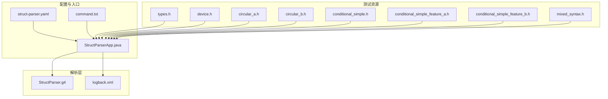
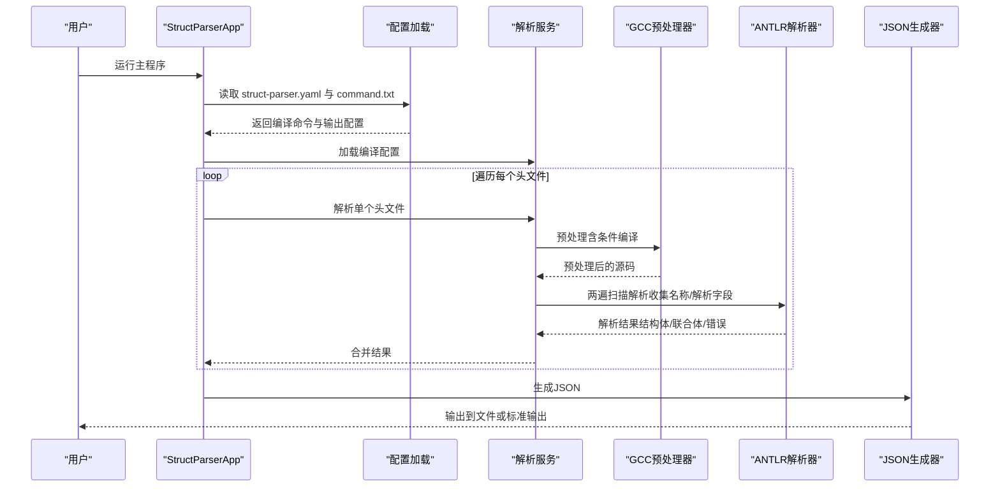
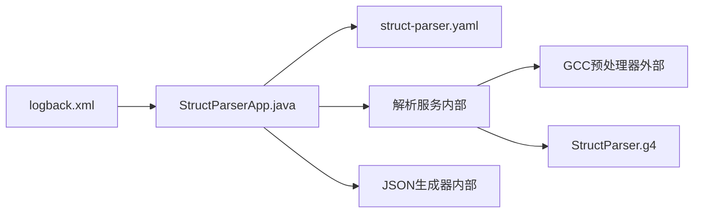

# 示例和用例

<cite>
**本文引用的文件**
- [README.md](file://README.md)
- [StructParserApp.java](file://src/main/java/com/structparser/StructParserApp.java)
- [StructParser.g4](file://src/main/antlr4/com/structparser/StructParser.g4)
- [logback.xml](file://src/main/resources/logback.xml)
- [struct-parser.yaml](file://struct-parser.yaml)
- [command.txt](file://src/main/resources/include/command.txt)
- [types.h](file://src/test/resources/headers/types.h)
- [device.h](file://src/test/resources/headers/device.h)
- [circular_a.h](file://src/test/resources/headers/circular_a.h)
- [circular_b.h](file://src/test/resources/headers/circular_b.h)
- [conditional_simple.h](file://src/test/resources/headers/conditional_simple.h)
- [conditional_simple_feature_a.h](file://src/test/resources/headers/conditional_simple_feature_a.h)
- [conditional_simple_feature_b.h](file://src/test/resources/headers/conditional_simple_feature_b.h)
- [mixed_syntax.h](file://src/test/resources/headers/mixed_syntax.h)
</cite>

## 目录
1. [简介](#简介)
2. [项目结构](#项目结构)
3. [核心组件](#核心组件)
4. [架构总览](#架构总览)
5. [详细组件分析](#详细组件分析)
6. [依赖关系分析](#依赖关系分析)
7. [性能考量](#性能考量)
8. [故障排查指南](#故障排查指南)
9. [结论](#结论)
10. [附录](#附录)

## 简介
本文件面向不同层次的用户，系统性地展示结构解析器在真实项目中的使用方式与最佳实践。内容覆盖从基础结构体解析、嵌套类型处理、条件编译应用，到跨文件引用与错误检测等场景，并提供可复现的输入文件、预期输出与解析流程说明，帮助读者快速上手并在生产环境中稳定集成。

## 项目结构
该项目采用模块化设计，核心由“配置加载”“GCC预处理”“语法容忍解析（ANTLR）”“模型构建”“JSON生成”“日志系统”等部分组成。下图给出与示例相关的文件组织与职责映射：

图表来源
- [StructParserApp.java:1-286](file://src/main/java/com/structparser/StructParserApp.java#L1-L286)
- [struct-parser.yaml:1-17](file://struct-parser.yaml#L1-L17)
- [command.txt:1-2](file://src/main/resources/include/command.txt#L1-L2)
- [StructParser.g4:1-126](file://src/main/antlr4/com/structparser/StructParser.g4#L1-L126)
- [logback.xml:1-40](file://src/main/resources/logback.xml#L1-L40)
- [types.h:1-27](file://src/test/resources/headers/types.h#L1-L27)
- [device.h:1-42](file://src/test/resources/headers/device.h#L1-L42)
- [circular_a.h:1-13](file://src/test/resources/headers/circular_a.h#L1-L13)
- [circular_b.h:1-13](file://src/test/resources/headers/circular_b.h#L1-L13)
- [conditional_simple.h:1-22](file://src/test/resources/headers/conditional_simple.h#L1-L22)
- [conditional_simple_feature_a.h:1-14](file://src/test/resources/headers/conditional_simple_feature_a.h#L1-L14)
- [conditional_simple_feature_b.h:1-13](file://src/test/resources/headers/conditional_simple_feature_b.h#L1-L13)
- [mixed_syntax.h:1-52](file://src/test/resources/headers/mixed_syntax.h#L1-L52)

章节来源
- [README.md:391-428](file://README.md#L391-L428)
- [StructParserApp.java:1-286](file://src/main/java/com/structparser/StructParserApp.java#L1-L286)
- [struct-parser.yaml:1-17](file://struct-parser.yaml#L1-L17)
- [command.txt:1-2](file://src/main/resources/include/command.txt#L1-L2)

## 核心组件
- 应用入口与控制流：负责读取配置、扫描头文件、调用解析服务、生成输出并汇总错误。
- ANTLR语法定义：通过结构化规则与“语法岛”策略，容忍非结构体/联合体语法，聚焦提取结构体/联合体/类型别名。
- 日志系统：分离应用日志与预处理日志，便于调试与审计。
- 配置系统：支持YAML/JSON配置，集中管理编译命令与输出目标。

章节来源
- [StructParserApp.java:29-227](file://src/main/java/com/structparser/StructParserApp.java#L29-L227)
- [StructParser.g4:5-78](file://src/main/antlr4/com/structparser/StructParser.g4#L5-L78)
- [logback.xml:1-40](file://src/main/resources/logback.xml#L1-L40)
- [struct-parser.yaml:1-17](file://struct-parser.yaml#L1-L17)

## 架构总览
下图展示一次典型解析流程：应用入口加载配置与编译命令，扫描头文件后逐个进行GCC预处理与解析，最终合并结果并生成JSON输出。

图表来源
- [StructParserApp.java:104-227](file://src/main/java/com/structparser/StructParserApp.java#L104-L227)
- [struct-parser.yaml:1-17](file://struct-parser.yaml#L1-L17)
- [command.txt:1-2](file://src/main/resources/include/command.txt#L1-L2)

## 详细组件分析

### 示例一：基础结构体解析（单文件）
- 输入文件
  - [types.h:1-27](file://src/test/resources/headers/types.h#L1-L27)
- 预期输出要点
  - 提取多个寄存器结构体（如8位、16位、32位寄存器），包含字段类型、位宽与偏移信息。
  - 不解析函数声明、枚举、常量等非结构体语法。
- 解析过程
  - 应用入口加载配置与编译命令，扫描并逐个解析头文件。
  - GCC预处理移除注释与宏展开，ANTLR按语法规则提取结构体定义。
  - JSON生成器输出结构体数组，包含字段偏移与大小。
- 运行步骤
  - 准备配置文件与编译命令文件，确保包含头文件所在目录。
  - 运行主程序，查看标准输出或指定输出文件。
- 关键参考
  - 配置与命令文件：[struct-parser.yaml:1-17](file://struct-parser.yaml#L1-L17)，[command.txt:1-2](file://src/main/resources/include/command.txt#L1-L2)
  - 解析入口与流程：[StructParserApp.java:104-227](file://src/main/java/com/structparser/StructParserApp.java#L104-L227)
  - 语法容忍规则：[StructParser.g4:16-78](file://src/main/antlr4/com/structparser/StructParser.g4#L16-L78)

章节来源
- [types.h:1-27](file://src/test/resources/headers/types.h#L1-L27)
- [StructParserApp.java:104-227](file://src/main/java/com/structparser/StructParserApp.java#L104-L227)
- [StructParser.g4:16-78](file://src/main/antlr4/com/structparser/StructParser.g4#L16-L78)
- [struct-parser.yaml:1-17](file://struct-parser.yaml#L1-L17)
- [command.txt:1-2](file://src/main/resources/include/command.txt#L1-L2)

### 示例二：嵌套类型与匿名成员（多层嵌套）
- 输入文件
  - [device.h:1-42](file://src/test/resources/headers/device.h#L1-L42)
- 预期输出要点
  - 支持嵌套结构体与联合体，字段按位级布局计算偏移。
  - 对匿名结构体/联合体，根据上下文决定是否展开或保留匿名层级。
- 解析过程
  - 预处理后，ANTLR解析器识别嵌套字段与匿名类型，第二遍扫描完成字段布局与类型解析。
- 运行步骤
  - 将包含公共头文件的路径加入编译命令的包含目录。
  - 运行主程序，检查输出中嵌套字段的偏移与大小。
- 关键参考
  - 嵌套与匿名规则：[StructParser.g4:56-73](file://src/main/antlr4/com/structparser/StructParser.g4#L56-L73)
  - 示例头文件：[device.h:1-42](file://src/test/resources/headers/device.h#L1-L42)

章节来源
- [device.h:1-42](file://src/test/resources/headers/device.h#L1-L42)
- [StructParser.g4:56-73](file://src/main/antlr4/com/structparser/StructParser.g4#L56-L73)

### 示例三：条件编译与外部宏（特征开关）
- 输入文件
  - [conditional_simple.h:1-22](file://src/test/resources/headers/conditional_simple.h#L1-L22)
  - [conditional_simple_feature_a.h:1-14](file://src/test/resources/headers/conditional_simple_feature_a.h#L1-L14)
  - [conditional_simple_feature_b.h:1-13](file://src/test/resources/headers/conditional_simple_feature_b.h#L1-L13)
- 预期输出要点
  - 通过命令行宏或外部宏文件控制分支，仅解析满足条件的结构体。
  - 未满足条件的分支被GCC预处理阶段裁剪，解析器不感知。
- 解析过程
  - 编译命令中添加宏定义或包含外部宏文件，GCC预处理后交由ANTLR解析。
- 运行步骤
  - 使用命令行宏：在编译命令中追加宏定义，观察输出差异。
  - 使用外部宏文件：通过包含宏文件的方式注入宏定义。
- 关键参考
  - 配置与命令示例：[README.md:181-240](file://README.md#L181-L240)，[struct-parser.yaml:1-17](file://struct-parser.yaml#L1-L17)，[command.txt:1-2](file://src/main/resources/include/command.txt#L1-L2)

章节来源
- [conditional_simple.h:1-22](file://src/test/resources/headers/conditional_simple.h#L1-L22)
- [conditional_simple_feature_a.h:1-14](file://src/test/resources/headers/conditional_simple_feature_a.h#L1-L14)
- [conditional_simple_feature_b.h:1-13](file://src/test/resources/headers/conditional_simple_feature_b.h#L1-L13)
- [README.md:181-240](file://README.md#L181-L240)
- [struct-parser.yaml:1-17](file://struct-parser.yaml#L1-L17)
- [command.txt:1-2](file://src/main/resources/include/command.txt#L1-L2)

### 示例四：跨文件引用（多文件解析与合并）
- 输入文件
  - [device.h:1-42](file://src/test/resources/headers/device.h#L1-L42)
  - [types.h:1-27](file://src/test/resources/headers/types.h#L1-L27)
- 预期输出要点
  - 跨文件引用的结构体与联合体能被正确解析并合并到最终结果中。
  - 保证引用类型在使用前已定义，避免前向引用。
- 解析过程
  - 应用入口扫描所有头文件，逐个进行GCC预处理与解析，最后合并为统一结果。
- 运行步骤
  - 在编译命令中包含所有相关头文件所在目录。
  - 运行主程序，检查合并后的结构体与联合体列表。
- 关键参考
  - 多文件解析流程：[StructParserApp.java:148-227](file://src/main/java/com/structparser/StructParserApp.java#L148-L227)
  - 示例头文件：[device.h:1-42](file://src/test/resources/headers/device.h#L1-L42)，[types.h:1-27](file://src/test/resources/headers/types.h#L1-L27)

章节来源
- [device.h:1-42](file://src/test/resources/headers/device.h#L1-L42)
- [types.h:1-27](file://src/test/resources/headers/types.h#L1-L27)
- [StructParserApp.java:148-227](file://src/main/java/com/structparser/StructParserApp.java#L148-L227)

### 示例五：循环引用检测（自引用与交叉引用）
- 输入文件
  - [circular_a.h:1-13](file://src/test/resources/headers/circular_a.h#L1-L13)
  - [circular_b.h:1-13](file://src/test/resources/headers/circular_b.h#L1-L13)
- 预期输出要点
  - 解析器应检测到循环引用并报告错误，拒绝生成结果。
- 解析过程
  - 第一遍收集类型名称，第二遍解析字段时进行循环引用检测。
- 运行步骤
  - 将两个文件放入编译命令包含路径，运行主程序，观察错误输出。
- 关键参考
  - 循环引用检测说明：[README.md:461-468](file://README.md#L461-L468)
  - 示例头文件：[circular_a.h:1-13](file://src/test/resources/headers/circular_a.h#L1-L13)，[circular_b.h:1-13](file://src/test/resources/headers/circular_b.h#L1-L13)

章节来源
- [circular_a.h:1-13](file://src/test/resources/headers/circular_a.h#L1-L13)
- [circular_b.h:1-13](file://src/test/resources/headers/circular_b.h#L1-L13)
- [README.md:461-468](file://README.md#L461-L468)

### 示例六：混合语法容忍（忽略无关语法）
- 输入文件
  - [mixed_syntax.h:1-52](file://src/test/resources/headers/mixed_syntax.h#L1-L52)
- 预期输出要点
  - 解析器应忽略函数声明、枚举、常量等非结构体语法，仅提取结构体与联合体。
- 解析过程
  - GCC预处理移除注释与宏后，ANTLR通过“其他内容”规则跳过非目标语法。
- 运行步骤
  - 运行主程序，确认仅输出被解析的结构体/联合体定义。
- 关键参考
  - 语法容忍规则：[StructParser.g4:16-78](file://src/main/antlr4/com/structparser/StructParser.g4#L16-L78)

章节来源
- [mixed_syntax.h:1-52](file://src/test/resources/headers/mixed_syntax.h#L1-L52)
- [StructParser.g4:16-78](file://src/main/antlr4/com/structparser/StructParser.g4#L16-L78)

### 示例七：类型别名与匿名类型（typedef与匿名嵌套）
- 输入文件
  - [types.h:1-27](file://src/test/resources/headers/types.h#L1-L27)
  - [device.h:1-42](file://src/test/resources/headers/device.h#L1-L42)
- 预期输出要点
  - 类型别名与匿名嵌套结构体/联合体应被正确识别与展开。
- 解析过程
  - ANTLR解析typedef与匿名类型定义，结合上下文推导字段布局。
- 运行步骤
  - 运行主程序，检查类型别名与匿名嵌套字段的偏移与大小。
- 关键参考
  - 类型与匿名规则：[StructParser.g4:38-73](file://src/main/antlr4/com/structparser/StructParser.g4#L38-L73)

章节来源
- [types.h:1-27](file://src/test/resources/headers/types.h#L1-L27)
- [device.h:1-42](file://src/test/resources/headers/device.h#L1-L42)
- [StructParser.g4:38-73](file://src/main/antlr4/com/structparser/StructParser.g4#L38-L73)

## 依赖关系分析
- 组件耦合
  - 应用入口依赖配置加载、解析服务与JSON生成器；解析服务依赖GCC预处理与ANTLR解析器。
  - 语法定义独立于解析逻辑，通过规则约束实现语法容忍与类型识别。
- 外部依赖
  - GCC用于预处理与条件编译；SLF4J/Logback用于日志；Jackson用于配置解析。
- 潜在问题
  - 前向引用与循环引用不被允许；数组语法不支持；标准C类型受限。

图表来源
- [StructParserApp.java:1-286](file://src/main/java/com/structparser/StructParserApp.java#L1-L286)
- [struct-parser.yaml:1-17](file://struct-parser.yaml#L1-L17)
- [logback.xml:1-40](file://src/main/resources/logback.xml#L1-L40)
- [StructParser.g4:1-126](file://src/main/antlr4/com/structparser/StructParser.g4#L1-L126)

章节来源
- [README.md:461-468](file://README.md#L461-L468)
- [pom.xml:27-70](file://pom.xml#L27-L70)

## 性能考量
- 预处理阶段
  - GCC预处理会显著影响整体耗时，建议尽量减少不必要的包含路径与宏定义数量。
- 解析阶段
  - 两遍扫描策略在大型头文件集合中可能增加时间开销，可通过并行化或增量解析优化（当前版本未实现）。
- I/O与输出
  - 大量头文件合并输出时，注意磁盘写入与内存占用；必要时拆分输出或启用流式处理（当前版本一次性合并）。

## 故障排查指南
- GCC不可用
  - 现象：启动即报错，提示需要安装GCC。
  - 排查：确认系统PATH中存在GCC，或使用内置信息检查工具验证。
  - 参考：[StructParserApp.java:62-68](file://src/main/java/com/structparser/StructParserApp.java#L62-L68)，[README.md:29-30](file://README.md#L29-L30)
- 配置文件缺失或无效
  - 现象：找不到配置文件或配置校验失败。
  - 排查：检查工作目录是否存在配置文件，核对字段与格式。
  - 参考：[StructParserApp.java:71-102](file://src/main/java/com/structparser/StructParserApp.java#L71-L102)，[struct-parser.yaml:1-17](file://struct-parser.yaml#L1-L17)
- 未发现头文件
  - 现象：编译配置中未找到头文件。
  - 排查：确认包含路径正确，且文件扩展名为.h。
  - 参考：[StructParserApp.java:107-121](file://src/main/java/com/structparser/StructParserApp.java#L107-L121)
- 循环引用
  - 现象：解析失败并报告循环引用。
  - 排查：检查相互引用的结构体/联合体定义，调整为单向或拆分类型。
  - 参考：[README.md:461-468](file://README.md#L461-L468)，[circular_a.h:1-13](file://src/test/resources/headers/circular_a.h#L1-L13)，[circular_b.h:1-13](file://src/test/resources/headers/circular_b.h#L1-L13)
- 预处理内容过大或异常
  - 现象：预处理日志文件异常或过大。
  - 排查：检查编译命令中的包含路径与宏定义，减少冗余包含。
  - 参考：[logback.xml:19-32](file://src/main/resources/logback.xml#L19-L32)

章节来源
- [StructParserApp.java:62-121](file://src/main/java/com/structparser/StructParserApp.java#L62-L121)
- [README.md:29-30](file://README.md#L29-L30)
- [struct-parser.yaml:1-17](file://struct-parser.yaml#L1-L17)
- [logback.xml:19-32](file://src/main/resources/logback.xml#L19-L32)
- [circular_a.h:1-13](file://src/test/resources/headers/circular_a.h#L1-L13)
- [circular_b.h:1-13](file://src/test/resources/headers/circular_b.h#L1-L13)

## 结论
本项目以GCC预处理与ANTLR语法解析为核心，提供了对C风格结构体/联合体的高容忍度解析能力。通过配置驱动与多文件合并，能够满足嵌入式与硬件寄存器描述等复杂场景的需求。建议在实际项目中遵循“先预处理、再解析”的原则，合理组织头文件与宏定义，充分利用条件编译与跨文件引用能力，并重视循环引用与前向引用的限制，以获得稳定可靠的解析结果。

## 附录
- 快速开始
  - 准备配置文件与编译命令文件，确保包含头文件所在目录。
  - 运行主程序，查看标准输出或指定输出文件。
  - 参考：[README.md:25-66](file://README.md#L25-L66)，[struct-parser.yaml:1-17](file://struct-parser.yaml#L1-L17)，[command.txt:1-2](file://src/main/resources/include/command.txt#L1-L2)
- 语法要点
  - 支持类型：uint1~uint32；结构体/联合体/类型别名；匿名嵌套。
  - 不支持：数组语法、标准C类型（int/char/float）、前向引用、循环引用。
  - 参考：[README.md:311-373](file://README.md#L311-L373)，[StructParser.g4:80-84](file://src/main/antlr4/com/structparser/StructParser.g4#L80-L84)