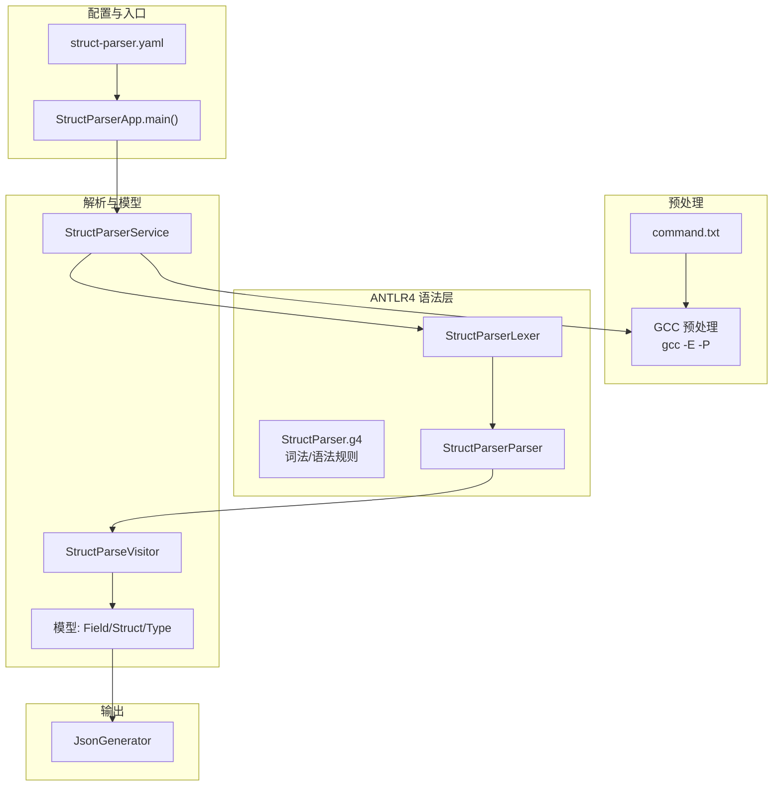
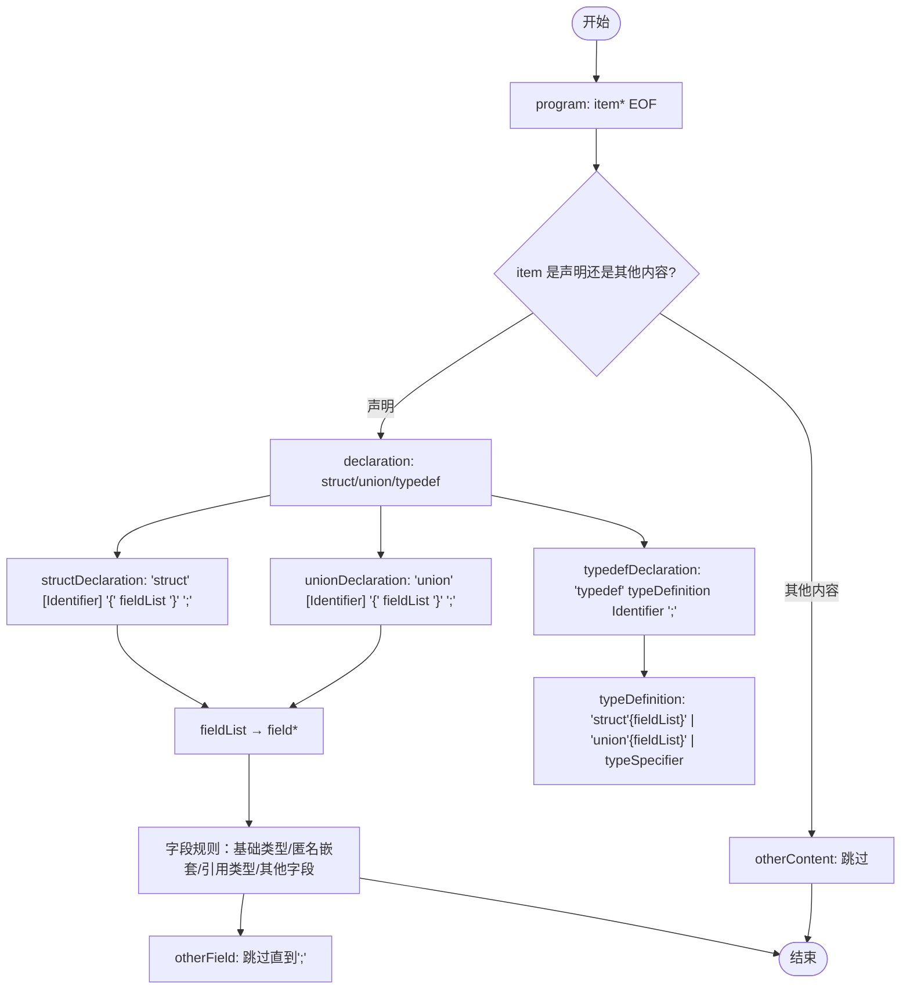
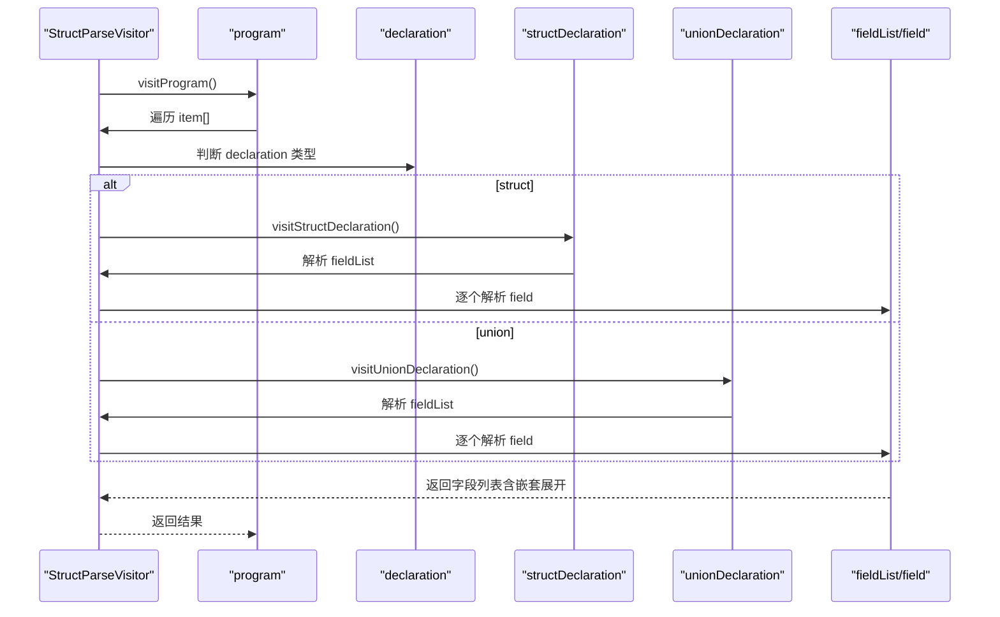
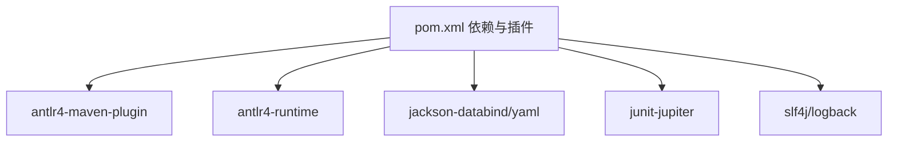

# ANTLR4 语法定义

<cite>
**本文引用的文件**
- [StructParser.g4](file://src/main/antlr4/com/structparser/StructParser.g4)
- [README.md](file://README.md)
- [pom.xml](file://pom.xml)
- [struct-parser.yaml](file://struct-parser.yaml)
- [StructParserApp.java](file://src/main/java/com/structparser/StructParserApp.java)
- [StructParserService.java](file://src/main/java/com/structparser/parser/StructParserService.java)
- [StructParseVisitor.java](file://src/main/java/com/structparser/parser/StructParseVisitor.java)
- [ParserConfig.java](file://src/main/java/com/structparser/config/ParserConfig.java)
- [Field.java](file://src/main/java/com/structparser/model/Field.java)
- [Struct.java](file://src/main/java/com/structparser/model/Struct.java)
- [Type.java](file://src/main/java/com/structparser/model/Type.java)
- [mixed_syntax.h](file://src/test/resources/headers/mixed_syntax.h)
- [conditional_simple.h](file://src/test/resources/headers/conditional_simple.h)
- [circular_a.h](file://src/test/resources/headers/circular_a.h)
- [command.txt](file://src/main/resources/include/command.txt)
</cite>

## 目录
1. [简介](#简介)
2. [项目结构](#项目结构)
3. [核心组件](#核心组件)
4. [架构总览](#架构总览)
5. [详细组件分析](#详细组件分析)
6. [依赖关系分析](#依赖关系分析)
7. [性能考量](#性能考量)
8. [故障排查指南](#故障排查指南)
9. [结论](#结论)
10. [附录](#附录)

## 简介
本技术文档围绕 ANTLR4 语法定义文件 StructParser.g4 展开，系统阐述其词法规则与语法规则的设计原理与实现细节，覆盖程序入口、声明匹配、结构体与联合体定义、类型说明符、字段定义、标识符与整数字面量、注释与空白字符处理、预处理指令处理、语法岛模式与错误容忍机制，并提供扩展指南与最佳实践。同时结合项目整体架构与运行流程，帮助读者从词法到语法再到应用层形成完整的理解。

## 项目结构
该项目采用“ANTLR4 语法 + Java 解析服务 + 预处理 + 两遍扫描解析 + JSON 输出”的分层设计。核心语法定义位于 ANTLR4 目录，解析服务负责调用词法/语法分析器、访问者模式遍历 AST、进行跨文件引用解析与错误收集；预处理由 GCC 提供，确保输入为“去条件编译、去注释、去宏替换”的干净 C 代码，从而最大化语法容忍度。



图表来源
- [StructParserApp.java:29-130](file://src/main/java/com/structparser/StructParserApp.java#L29-L130)
- [StructParserService.java:39-102](file://src/main/java/com/structparser/parser/StructParserService.java#L39-L102)
- [StructParser.g4:1-126](file://src/main/antlr4/com/structparser/StructParser.g4#L1-L126)
- [command.txt:1-2](file://src/main/resources/include/command.txt#L1-L2)

章节来源
- [README.md:391-429](file://README.md#L391-L429)
- [pom.xml:72-93](file://pom.xml#L72-L93)

## 核心组件
- 语法定义文件：定义了程序入口、顶层项目、声明、结构体/联合体/typedef 定义、字段列表与字段、类型说明符、标识符与整数字面量、以及词法规则（注释、空白、预处理指令、语法岛捕获）。
- 解析服务：封装 ANTLR4 词法/语法分析器与访问者，负责错误监听、两遍扫描、跨文件引用解析与结果聚合。
- 模型层：Field、Struct、Type 等数据模型，用于承载解析结果与布局信息。
- 预处理：通过 GCC 预处理（去注释、去条件编译、宏展开）保证输入的“纯净 C”，提升语法容忍度。

章节来源
- [StructParser.g4:1-126](file://src/main/antlr4/com/structparser/StructParser.g4#L1-L126)
- [StructParserService.java:20-102](file://src/main/java/com/structparser/parser/StructParserService.java#L20-L102)
- [StructParseVisitor.java:20-488](file://src/main/java/com/structparser/parser/StructParseVisitor.java#L20-L488)
- [Field.java:1-23](file://src/main/java/com/structparser/model/Field.java#L1-L23)
- [Struct.java:1-47](file://src/main/java/com/structparser/model/Struct.java#L1-L47)
- [Type.java:1-104](file://src/main/java/com/structparser/model/Type.java#L1-L104)

## 架构总览
下图展示了从命令行入口到最终 JSON 输出的端到端流程，强调 GCC 预处理、ANTLR4 语法解析与访问者两遍扫描的关键作用。

```mermaid
sequenceDiagram
participant CLI as "命令行"
participant App as "StructParserApp"
participant Svc as "StructParserService"
participant GCC as "GCC 预处理"
participant Lex as "StructParserLexer"
participant Par as "StructParserParser"
participant Vis as "StructParseVisitor"
participant Gen as "JsonGenerator"
CLI->>App : 运行主程序
App->>Svc : 加载配置并解析文件
Svc->>GCC : 执行预处理命令
GCC-->>Svc : 返回预处理后的源码
Svc->>Lex : 构建词法分析器
Lex->>Par : 构建语法分析器
Par->>Vis : 访问 AST两遍扫描
Vis-->>Svc : 返回解析结果
Svc-->>App : 合并结果
App->>Gen : 生成 JSON
Gen-->>CLI : 输出结果
```

图表来源
- [StructParserApp.java:29-130](file://src/main/java/com/structparser/StructParserApp.java#L29-L130)
- [StructParserService.java:53-153](file://src/main/java/com/structparser/parser/StructParserService.java#L53-L153)
- [StructParseVisitor.java:36-44](file://src/main/java/com/structparser/parser/StructParseVisitor.java#L36-L44)

## 详细组件分析

### 语法定义文件：StructParser.g4
该文件采用 ANTLR4 规范，定义了从顶层程序到字段定义的完整语法规则，并通过词法规则实现注释、空白、预处理指令的跳过与“语法岛”捕获，以实现对非目标语法的容忍。

- 程序入口与顶层项目
  - 程序入口 program 接受任意数量的顶层项目与 EOF。
  - 顶层项目 item 支持 declaration（目标结构）或其他内容 otherContent，后者构成“语法岛”，被忽略但不影响解析继续。
- 声明匹配
  - declaration 统一匹配 struct/union/typedef 三类声明。
- 结构体与联合体定义
  - structDeclaration 与 unionDeclaration 支持可选的类型名与花括号内的字段列表。
- typedef 定义
  - typedefDeclaration 由关键字、类型定义与标识符组成；typeDefinition 可为匿名结构体/联合体或现有类型说明符。
- 字段定义
  - 字段规则覆盖基础类型 uintN、匿名嵌套结构体/联合体、引用已定义类型（Identifier）、标准 C 语法 struct/union Name name、以及“其他字段 otherField”（跳过）。
- 类型说明符与标识符/整数字面量
  - typeSpecifier 支持 uintN 与 Identifier；fieldName 即 Identifier。
- 词法规则与特殊处理
  - 注释：行注释与块注释均被跳过。
  - 空白：空格、制表符、回车、换行被跳过。
  - 预处理指令：以 # 开头的行被跳过。
  - 语法岛捕获：AnyOther 捕获其余字符并跳过，确保遇到非目标语法时不会中断解析。



图表来源
- [StructParser.g4:6-78](file://src/main/antlr4/com/structparser/StructParser.g4#L6-L78)

章节来源
- [StructParser.g4:1-126](file://src/main/antlr4/com/structparser/StructParser.g4#L1-L126)

### 词法规则详解
- 标识符 Identifier：字母或下划线开头，后接字母、数字、下划线。
- 整数常量 IntegerLiteral：一个或多个十进制数字。
- 注释 LineComment/BlockComment：行注释与块注释均被跳过。
- 空白 Whitespace：空格、制表符、回车、换行被跳过。
- 预处理指令 PreprocessorDirective：以 # 开头的行被跳过。
- 语法岛 AnyOther：捕获其余字符并跳过，确保遇到非目标语法时仍能继续解析。

章节来源
- [StructParser.g4:93-125](file://src/main/antlr4/com/structparser/StructParser.g4#L93-L125)

### 语法岛模式与错误容忍
- 语法岛模式通过 otherContent 与 otherField 将非目标语法（函数、枚举、常量等）识别为“其他内容”并跳过，从而实现对复杂头文件的容忍。
- 预处理阶段由 GCC 完成，移除注释与条件编译，进一步降低语法歧义。
- 测试用例 mixed_syntax.h 展示了混合 C 语法的容忍效果：只有结构体与联合体被解析，其余被忽略。

章节来源
- [StructParser.g4:16-19](file://src/main/antlr4/com/structparser/StructParser.g4#L16-L19)
- [StructParser.g4:75-78](file://src/main/antlr4/com/structparser/StructParser.g4#L75-L78)
- [mixed_syntax.h:1-52](file://src/test/resources/headers/mixed_syntax.h#L1-L52)
- [README.md:241-269](file://README.md#L241-L269)

### 程序入口、声明匹配与结构体/联合体定义
- 程序入口 program：接受任意数量的顶层项目与 EOF。
- 声明匹配 declaration：统一匹配 struct/union/typedef。
- 结构体/联合体定义：支持可选类型名与花括号内字段列表；字段列表为空时仍合法。
- typedef 定义：支持匿名结构体/联合体与现有类型说明符。

章节来源
- [StructParser.g4:6-48](file://src/main/antlr4/com/structparser/StructParser.g4#L6-L48)

### 字段定义与类型说明符
- 字段规则覆盖：
  - 基础类型：uintN name;
  - 匿名嵌套：struct { fields } name?; union { fields } name?;
  - 引用已定义类型：Identifier name; struct/union Name name;
  - 其他字段：otherField 跳过直到分号。
- 类型说明符 typeSpecifier：
  - uintN：N 为 1~32；
  - Identifier：typedef 或自定义类型名。

章节来源
- [StructParser.g4:55-84](file://src/main/antlr4/com/structparser/StructParser.g4#L55-L84)
- [StructParser.g4:44-48](file://src/main/antlr4/com/structparser/StructParser.g4#L44-L48)

### 访问者解析与两遍扫描
- 两遍扫描：
  - 第一遍：收集顶层 struct/union 名称，建立“已声明集合”。
  - 第二遍：正常解析，利用“已声明集合”检测前向引用（不允许），并进行循环引用检测。
- 字段解析策略：
  - 匿名嵌套（无字段名）时将字段直接展开到父级；
  - 具名嵌套或引用类型保留嵌套结构并展开 fields；
  - Union 内所有成员共享相同起始偏移。
- 错误收集：通过自定义错误监听器收集语法错误并附加行列信息。



图表来源
- [StructParseVisitor.java:36-44](file://src/main/java/com/structparser/parser/StructParseVisitor.java#L36-L44)
- [StructParseVisitor.java:68-134](file://src/main/java/com/structparser/parser/StructParseVisitor.java#L68-L134)
- [StructParseVisitor.java:140-178](file://src/main/java/com/structparser/parser/StructParseVisitor.java#L140-L178)
- [StructParseVisitor.java:183-301](file://src/main/java/com/structparser/parser/StructParseVisitor.java#L183-L301)

章节来源
- [StructParseVisitor.java:20-488](file://src/main/java/com/structparser/parser/StructParseVisitor.java#L20-L488)

### 预处理指令处理与条件编译
- 预处理由 GCC 完成，移除注释与条件编译，仅保留生效分支。
- 项目支持通过命令行宏与外部宏文件参与条件编译，测试用例 conditional_simple.h 展示了 #ifdef 分支的效果。
- StructParser.g4 的词法规则对预处理指令进行跳过，避免干扰目标语法解析。

章节来源
- [README.md:181-240](file://README.md#L181-L240)
- [conditional_simple.h:1-22](file://src/test/resources/headers/conditional_simple.h#L1-L22)
- [StructParser.g4:117-120](file://src/main/antlr4/com/structparser/StructParser.g4#L117-L120)

### 循环引用检测与限制
- 项目明确禁止前向引用与循环引用（自引用、双向、多向循环）。
- 通过 currentlyParsing 集合在解析过程中检测循环引用；若发现，记录错误并终止该字段解析。
- 测试用例 circular_a.h 展示了跨文件引用的场景，解析器会基于“已声明集合”判断是否允许引用。

章节来源
- [README.md:461-467](file://README.md#L461-L467)
- [circular_a.h:1-13](file://src/test/resources/headers/circular_a.h#L1-L13)
- [StructParseVisitor.java:306-335](file://src/main/java/com/structparser/parser/StructParseVisitor.java#L306-L335)

### 数据模型与布局计算
- Field：字段名称、类型、位宽、位偏移、可选嵌套结构体/联合体。
- Struct：结构体名称、字段列表、是否匿名；提供 totalBits 计算，考虑匿名 union 的最大宽度叠加。
- Type：枚举型基础类型 uint1~uint32、复合类型 STRUCT/UNION、自定义类型 CUSTOM；提供按位宽映射与字符串解析。

章节来源
- [Field.java:1-23](file://src/main/java/com/structparser/model/Field.java#L1-L23)
- [Struct.java:1-47](file://src/main/java/com/structparser/model/Struct.java#L1-L47)
- [Type.java:1-104](file://src/main/java/com/structparser/model/Type.java#L1-L104)

## 依赖关系分析
- Maven 插件与依赖：
  - ANTLR4 Maven 插件负责从 g4 生成词法/语法分析器与访问者。
  - 运行时依赖 ANTLR4 Runtime、Jackson（JSON/YAML）、JUnit、SLF4J/Logback。
- 预处理命令：
  - command.txt 中的 gcc -E -P -I. -nostdinc 用于移除注释与条件编译。
- 配置驱动：
  - struct-parser.yaml 指定编译配置文件路径与输出格式/文件。



图表来源
- [pom.xml:27-70](file://pom.xml#L27-L70)
- [pom.xml:74-93](file://pom.xml#L74-L93)

章节来源
- [pom.xml:1-140](file://pom.xml#L1-L140)
- [struct-parser.yaml:1-17](file://struct-parser.yaml#L1-L17)
- [command.txt:1-2](file://src/main/resources/include/command.txt#L1-L2)

## 性能考量
- 词法/语法解析：ANTLR4 在预处理后的“纯净 C”上运行，语法岛与跳过规则减少回溯成本。
- 两遍扫描：第一遍仅收集名称，第二遍解析字段，避免重复解析带来的额外开销。
- 预处理优化：GCC 预处理一次性完成，减少运行时解析负担。
- 日志与错误：通过 SLF4J/Logback 记录错误与调试信息，便于定位问题，避免在生产环境过度打印。

## 故障排查指南
- 配置文件缺失或无效
  - 现象：启动时报错提示缺少配置文件或配置无效。
  - 处理：确保当前目录存在 struct-parser.yaml/yml/json，且 compileConfigFile 指向存在的文件。
- GCC 不可用
  - 现象：提示需要 GCC 但不可用。
  - 处理：安装 GCC 并确保在 PATH 中；可通过命令查询 GCC 信息。
- 编译配置文件错误
  - 现象：解析失败或找不到头文件。
  - 处理：检查 command.txt 中的 gcc 命令与包含路径是否正确。
- 语法错误
  - 现象：解析器报告语法错误（带行列号）。
  - 处理：根据错误信息修正语法；确认输入已通过 GCC 预处理。
- 循环引用或前向引用
  - 现象：报告循环引用或前向引用错误。
  - 处理：调整头文件包含顺序，确保类型先定义再使用；避免循环依赖。

章节来源
- [StructParserApp.java:70-102](file://src/main/java/com/structparser/StructParserApp.java#L70-L102)
- [StructParserService.java:170-183](file://src/main/java/com/structparser/parser/StructParserService.java#L170-L183)
- [StructParseVisitor.java:306-335](file://src/main/java/com/structparser/parser/StructParseVisitor.java#L306-L335)

## 结论
StructParser.g4 通过清晰的语法与严格的词法规则，结合 GCC 预处理与“语法岛”模式，实现了对复杂 C 头文件的稳健解析。两遍扫描与循环引用检测保障了跨文件引用的可靠性。配合完善的模型层与 JSON 输出，项目能够高效地提取结构体与联合体的位级布局信息，满足嵌入式与硬件寄存器描述场景的需求。

## 附录

### 语法扩展指南
- 新增字段类型
  - 在字段规则中增加新的匹配分支，例如支持数组展开或指针占位。
  - 在访问者中补充对应解析逻辑与布局计算。
- 新增声明类型
  - 在 declaration 中新增匹配分支，并在访问者中实现相应解析与模型构建。
- 新增类型说明符
  - 在 typeSpecifier 中添加新规则，并在访问者中完善类型解析与校验。
- 错误容忍增强
  - 可在 otherField 中细化跳过策略，或引入更细粒度的“安全解析”选项。

### 最佳实践
- 使用 GCC 预处理：确保输入为“去注释、去条件编译、去宏替换”的纯净 C。
- 控制头文件包含：避免循环包含，遵循“先定义后使用”的原则。
- 保持语法简洁：优先使用 uintN 与具名嵌套，减少匿名嵌套的复杂度。
- 配置管理：集中管理 command.txt 与 struct-parser.yaml，便于团队协作与 CI 集成。
- 日志与测试：充分利用日志与单元测试覆盖混合语法、条件编译与循环引用等边界场景。