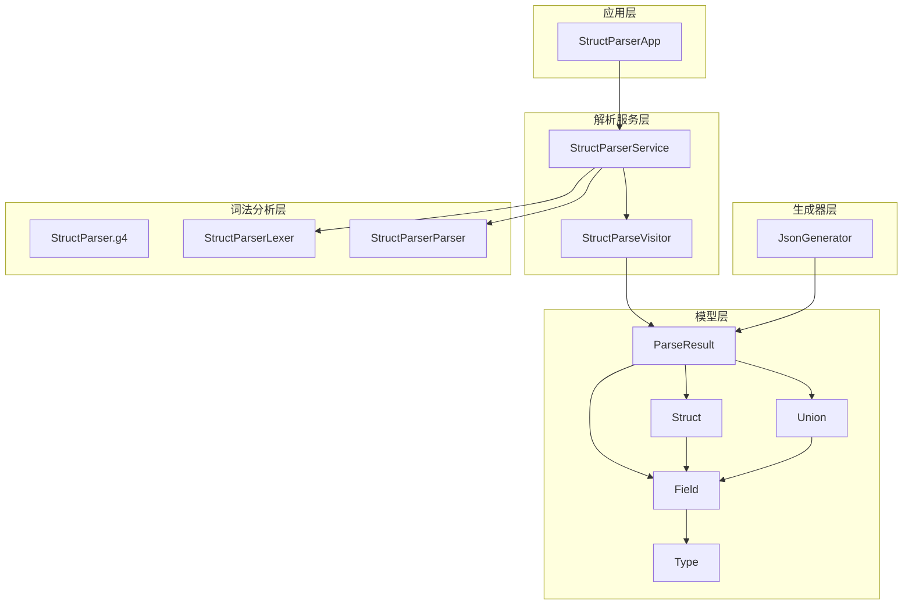
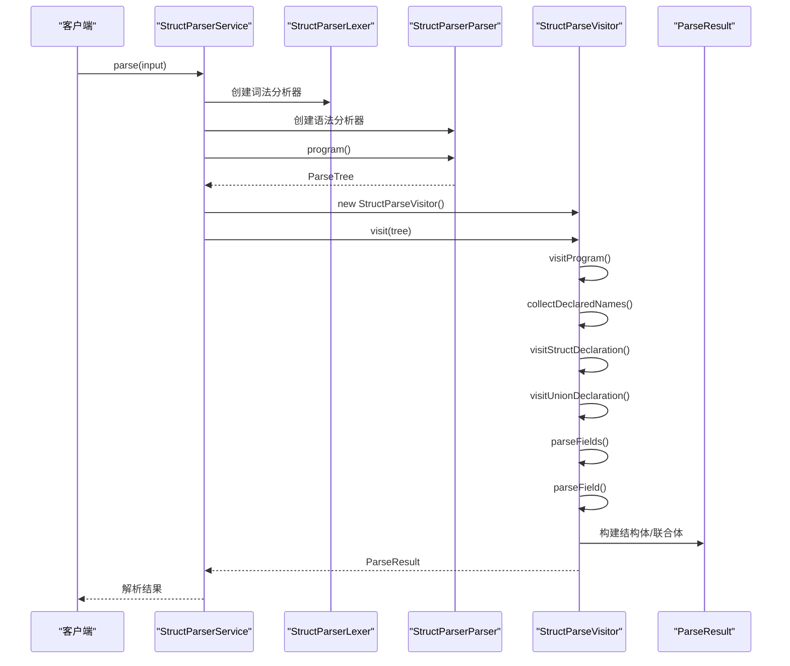
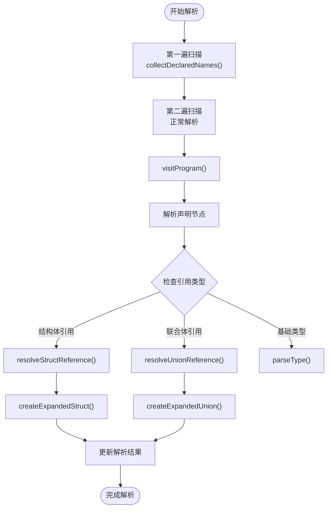
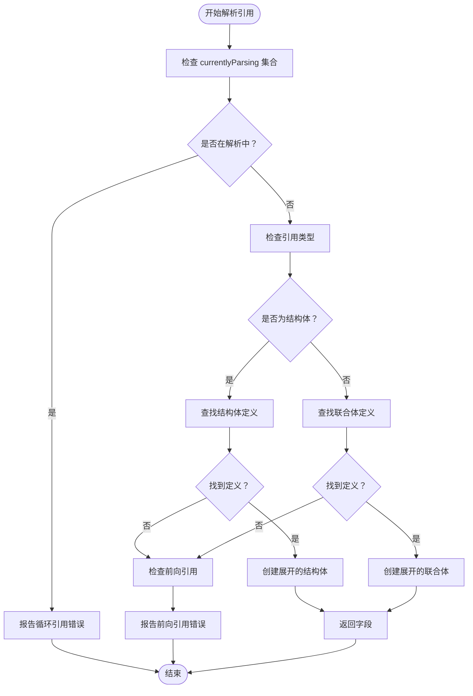
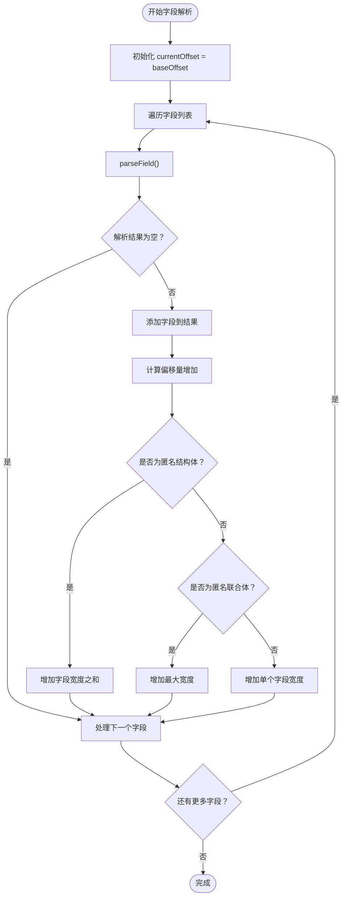
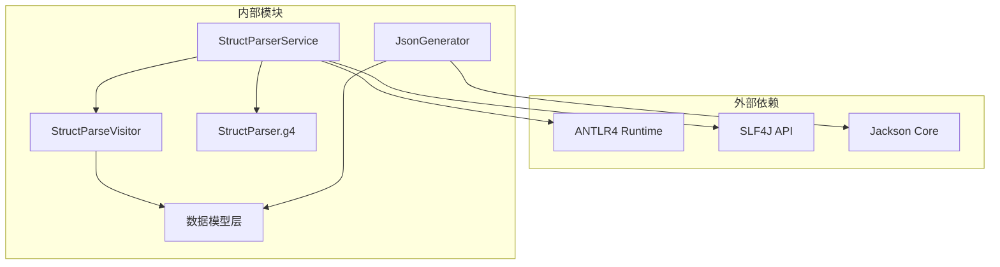

# AST 访问者模式

<cite>
**本文档引用的文件**
- [StructParseVisitor.java](file://src/main/java/com/structparser/parser/StructParseVisitor.java)
- [StructParserService.java](file://src/main/java/com/structparser/parser/StructParserService.java)
- [Struct.java](file://src/main/java/com/structparser/model/Struct.java)
- [Union.java](file://src/main/java/com/structparser/model/Union.java)
- [Field.java](file://src/main/java/com/structparser/model/Field.java)
- [Type.java](file://src/main/java/com/structparser/model/Type.java)
- [ParseResult.java](file://src/main/java/com/structparser/model/ParseResult.java)
- [StructParser.g4](file://src/main/antlr4/com/structparser/StructParser.g4)
- [JsonGenerator.java](file://src/main/java/com/structparser/generator/JsonGenerator.java)
- [README.md](file://README.md)
</cite>

## 目录
1. [简介](#简介)
2. [项目结构](#项目结构)
3. [核心组件](#核心组件)
4. [架构概览](#架构概览)
5. [详细组件分析](#详细组件分析)
6. [依赖分析](#依赖分析)
7. [性能考虑](#性能考虑)
8. [故障排除指南](#故障排除指南)
9. [结论](#结论)
10. [附录](#附录)

## 简介
本项目实现了基于 ANTLR4 的 C 风格结构体/联合体解析器，采用访问者模式遍历抽象语法树，提取结构体和联合体信息。访问者模式在此项目中的应用体现在：
- 使用 ANTLR4 生成的访问者基类进行深度优先遍历
- 通过多态方法处理不同类型的语法节点
- 实现两遍扫描以支持前向引用检测
- 统一的数据收集和错误处理机制

该项目专为嵌入式系统和硬件寄存器描述设计，支持 GCC 预处理、条件编译、跨文件引用等高级功能。

## 项目结构
项目采用模块化设计，主要分为以下层次：

**图表来源**
- [StructParserService.java:23-185](file://src/main/java/com/structparser/parser/StructParserService.java#L23-L185)
- [StructParseVisitor.java:21-517](file://src/main/java/com/structparser/parser/StructParseVisitor.java#L21-L517)

**章节来源**
- [README.md:391-428](file://README.md#L391-L428)

## 核心组件
本节详细介绍访问者模式的核心实现组件及其职责分工。

### 访问者模式实现
访问者模式在此项目中的核心实现位于 `StructParseVisitor` 类中，它继承自 ANTLR4 生成的 `StructParserBaseVisitor` 基类，重写各种访问方法来处理不同的语法节点类型。

### 数据模型
项目使用现代 Java Record 特性定义了不可变的数据模型：

- **Struct**: 表示结构体定义，包含名称、字段列表和匿名标志
- **Union**: 表示联合体定义，包含名称、字段列表和匿名标志  
- **Field**: 表示字段定义，包含名称、类型、位宽、位偏移以及可选的嵌套结构体或联合体
- **Type**: 枚举类型，定义了支持的位宽类型（uint1-uint32）、复合类型（struct、union）和自定义类型
- **ParseResult**: 解析结果容器，包含结构体列表、联合体列表、类型别名映射和错误列表

**章节来源**
- [Struct.java:6-47](file://src/main/java/com/structparser/model/Struct.java#L6-L47)
- [Union.java:6-20](file://src/main/java/com/structparser/model/Union.java#L6-L20)
- [Field.java:3-23](file://src/main/java/com/structparser/model/Field.java#L3-L23)
- [Type.java:6-104](file://src/main/java/com/structparser/model/Type.java#L6-L104)
- [ParseResult.java:10-78](file://src/main/java/com/structparser/model/ParseResult.java#L10-L78)

## 架构概览
项目采用经典的三层架构：表示层（模型）、业务逻辑层（访问者）、基础设施层（词法分析和生成器）。

**图表来源**
- [StructParserService.java:125-153](file://src/main/java/com/structparser/parser/StructParserService.java#L125-L153)
- [StructParseVisitor.java:36-44](file://src/main/java/com/structparser/parser/StructParseVisitor.java#L36-L44)

## 详细组件分析

### StructParseVisitor 类分析
`StructParseVisitor` 是访问者模式的核心实现，负责遍历 ANTLR4 生成的抽象语法树并提取结构信息。

#### 访问者模式实现原理
访问者模式在此项目中的应用体现在以下几个方面：

1. **继承访问者基类**: 继承 `StructParserBaseVisitor<Object>`，获得默认的访问方法实现
2. **重写访问方法**: 重写特定的访问方法来处理结构体、联合体、字段等节点
3. **统一返回值**: 所有访问方法返回 `Object` 类型，便于在访问过程中传递状态
4. **状态管理**: 通过实例变量维护解析状态，包括结果集、类型别名、错误列表等

#### 两遍扫描机制
为了支持前向引用检测，访问者实现了两遍扫描机制：

**图表来源**
- [StructParseVisitor.java:36-66](file://src/main/java/com/structparser/parser/StructParseVisitor.java#L36-L66)
- [StructParseVisitor.java:335-364](file://src/main/java/com/structparser/parser/StructParseVisitor.java#L335-L364)

#### 字段解析策略
访问者实现了复杂的字段解析逻辑，能够处理多种语法形式：

1. **匿名嵌套结构体**: `struct { ... } fieldName?;`
2. **匿名嵌套联合体**: `union { ... } fieldName?;`
3. **具名引用**: `StructName fieldName;` 或 `UnionName fieldName;`
4. **标准 C 语法**: `struct/union Identifier fieldName;`
5. **基础类型**: `uintN fieldName;`

#### 循环引用检测
访问者实现了完整的循环引用检测机制：

**图表来源**
- [StructParseVisitor.java:335-364](file://src/main/java/com/structparser/parser/StructParseVisitor.java#L335-L364)
- [StructParseVisitor.java:366-396](file://src/main/java/com/structparser/parser/StructParseVisitor.java#L366-L396)

**章节来源**
- [StructParseVisitor.java:11-517](file://src/main/java/com/structparser/parser/StructParseVisitor.java#L11-L517)

### 数据收集策略
访问者采用了统一的数据收集策略来确保解析结果的一致性和完整性：

#### 结果聚合
- **结构体收集**: 顶层结构体和具名嵌套结构体都会被收集到 `ParseResult` 中
- **联合体收集**: 仅具名联合体被收集到 `ParseResult` 中，匿名联合体的字段会被展开
- **类型别名**: `typedef` 声明被收集到 `typedefs` 映射中
- **错误收集**: 所有解析错误被收集到 `errors` 列表中

#### 偏移量计算
访问者实现了精确的位偏移量计算算法：

**图表来源**
- [StructParseVisitor.java:140-185](file://src/main/java/com/structparser/parser/StructParseVisitor.java#L140-L185)
- [StructParseVisitor.java:191-207](file://src/main/java/com/structparser/parser/StructParseVisitor.java#L191-L207)

**章节来源**
- [StructParseVisitor.java:140-207](file://src/main/java/com/structparser/parser/StructParseVisitor.java#L140-L207)

### 语法节点处理
访问者针对不同类型的语法节点实现了专门的处理逻辑：

#### 结构体声明处理
- **重复定义检查**: 检查是否存在同名结构体定义
- **匿名结构体处理**: 设置 `anonymous` 标志
- **字段解析**: 调用 `parseFields()` 方法解析字段列表
- **结果存储**: 将结构体添加到 `ParseResult` 中

#### 联合体声明处理
- **重复定义检查**: 检查是否存在同名联合体定义
- **匿名联合体处理**: 设置 `anonymous` 标志
- **字段解析**: 调用 `parseUnionFields()` 方法解析字段列表
- **偏移量统一**: 所有字段的偏移量都设置为 0

#### 字段定义处理
访问者支持五种不同的字段定义语法：

1. **匿名嵌套结构体**: 直接展开字段到父级
2. **匿名嵌套联合体**: 直接展开字段到父级  
3. **具名嵌套结构体**: 作为嵌套字段保留结构
4. **具名嵌套联合体**: 作为嵌套字段保留结构
5. **基础类型字段**: 解析 `uintN` 类型并验证位宽范围

**章节来源**
- [StructParseVisitor.java:68-134](file://src/main/java/com/structparser/parser/StructParseVisitor.java#L68-L134)
- [StructParseVisitor.java:212-330](file://src/main/java/com/structparser/parser/StructParseVisitor.java#L212-L330)

## 依赖分析
项目采用清晰的依赖关系设计，遵循单一职责原则和开闭原则。

**图表来源**
- [StructParserService.java:3-18](file://src/main/java/com/structparser/parser/StructParserService.java#L3-L18)
- [StructParseVisitor.java:3-7](file://src/main/java/com/structparser/parser/StructParseVisitor.java#L3-L7)

### 模块间耦合度
- **低耦合**: 访问者模式使得语法分析器与数据收集器解耦
- **高内聚**: 每个类专注于特定的职责
- **接口稳定**: 通过 ANTLR4 生成的接口保持稳定性

**章节来源**
- [StructParserService.java:1-185](file://src/main/java/com/structparser/parser/StructParserService.java#L1-L185)

## 性能考虑
访问者模式在此项目中的性能优化策略：

### 时间复杂度分析
- **整体复杂度**: O(N)，其中 N 是语法树中节点的数量
- **字段解析**: 每个字段节点最多被访问一次
- **引用解析**: 平均 O(1) 查找时间，使用哈希集合存储已定义类型

### 空间复杂度分析
- **解析状态**: O(M)，其中 M 是已定义类型的数量
- **结果存储**: O(K)，其中 K 是解析出的字段总数
- **递归栈**: O(H)，其中 H 是语法树的最大深度

### 优化技巧
1. **延迟解析**: 只在需要时才创建展开的结构体/联合体
2. **缓存机制**: 使用 `Map` 缓存已解析的类型定义
3. **流式处理**: 使用 Java Stream API 进行高效的数据转换
4. **内存管理**: 使用不可变 Record 对象减少内存碎片

## 故障排除指南
访问者模式在错误处理方面的最佳实践：

### 常见错误类型
1. **循环引用**: 检测到自引用或多路循环引用
2. **前向引用**: 引用尚未定义的类型
3. **重复定义**: 同名结构体/联合体重复定义
4. **无效位宽**: `uint` 类型位宽超出 1-32 范围

### 调试方法
1. **日志记录**: 使用 SLF4J 记录详细的解析过程
2. **错误聚合**: 将所有错误收集到 `ParseResult` 中统一处理
3. **断点调试**: 在关键访问方法中设置断点观察状态变化
4. **单元测试**: 编写针对性的测试用例验证边界条件

**章节来源**
- [StructParseVisitor.java:511-515](file://src/main/java/com/structparser/parser/StructParseVisitor.java#L511-L515)
- [StructParserService.java:170-183](file://src/main/java/com/structparser/parser/StructParserService.java#L170-L183)

## 结论
本项目成功地将访问者模式应用于 ANTLR4 生成的抽象语法树解析中，实现了以下关键特性：

1. **清晰的架构分离**: 访问者模式实现了语法分析与数据收集的完全分离
2. **强大的扩展能力**: 新增语法节点类型只需重写相应的访问方法
3. **完善的错误处理**: 提供了全面的错误检测和报告机制
4. **高性能实现**: 采用两遍扫描和缓存机制确保解析效率
5. **灵活的输出格式**: 支持 JSON 等多种输出格式

访问者模式在此项目中的应用展示了其在复杂语法树遍历场景下的优势，为类似的数据提取和转换任务提供了优秀的参考实现。

## 附录

### 访问者模式扩展指南
要扩展访问者模式以支持新的语法节点类型：

1. **继承访问者基类**: 继承现有的访问者类
2. **重写访问方法**: 实现新的 `visitXxx()` 方法
3. **更新数据模型**: 扩展相应的数据模型类
4. **编写测试用例**: 确保新功能的正确性
5. **更新文档**: 记录新的语法支持

### 自定义实现建议
1. **状态管理**: 使用清晰的状态变量管理解析上下文
2. **错误处理**: 实现一致的错误报告机制
3. **性能监控**: 添加性能指标以监控解析效率
4. **日志记录**: 提供详细的日志信息便于调试
5. **配置支持**: 允许通过配置文件定制解析行为