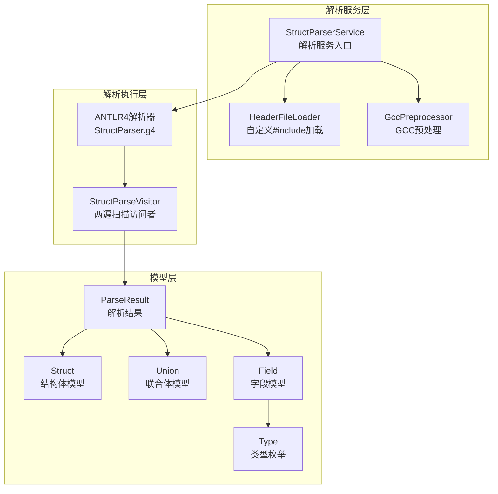
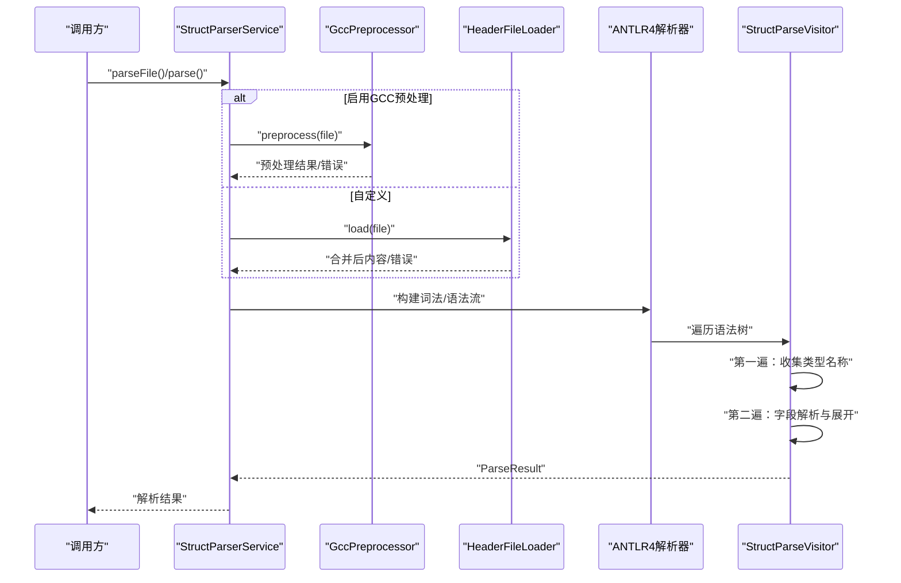
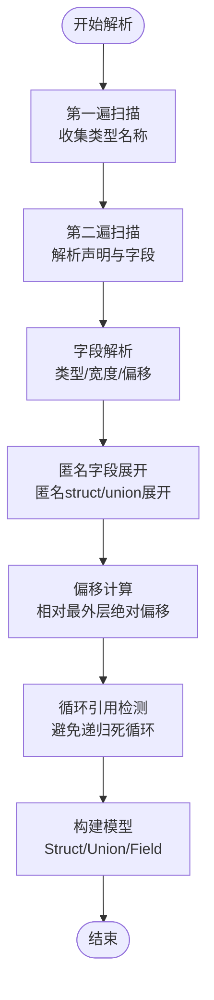
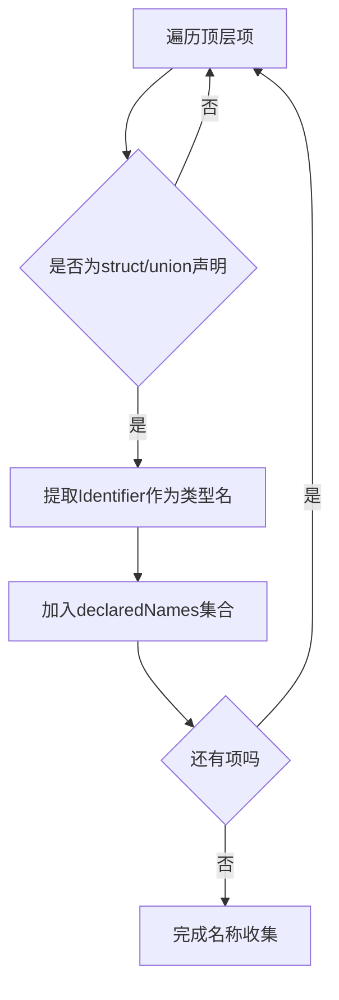
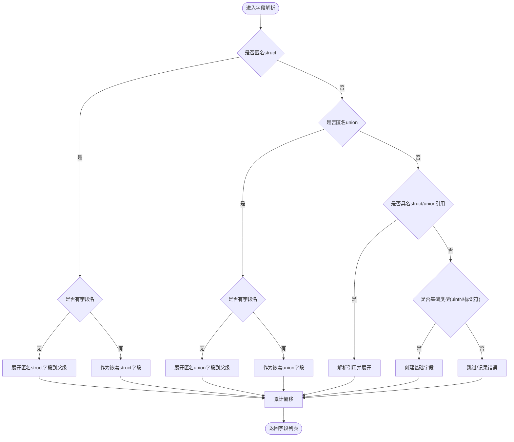
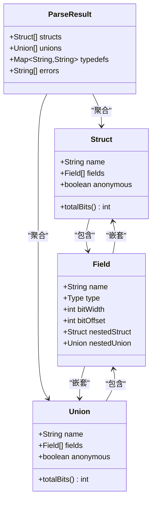
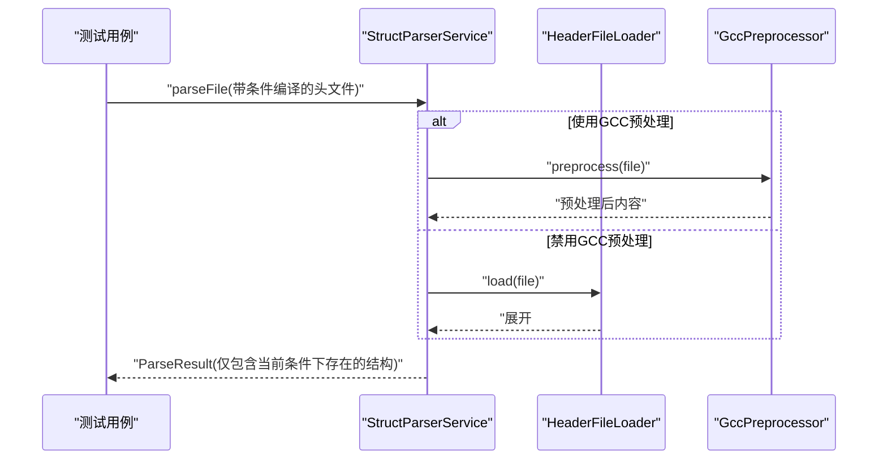
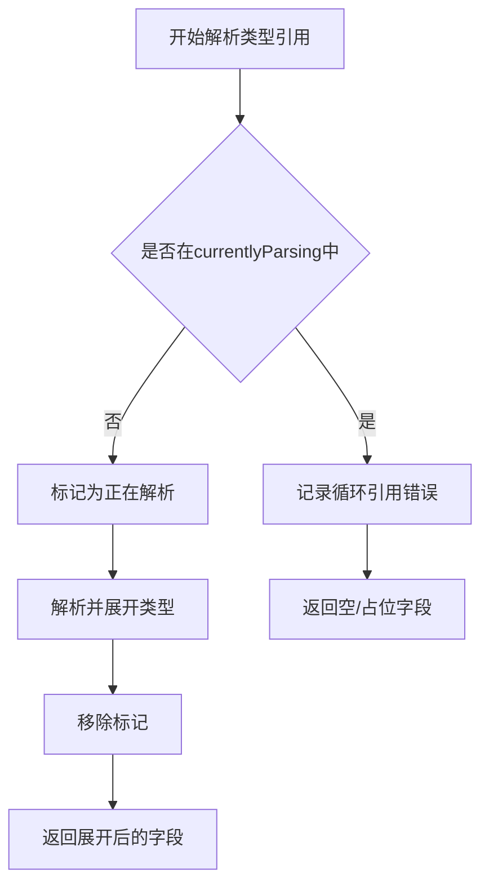
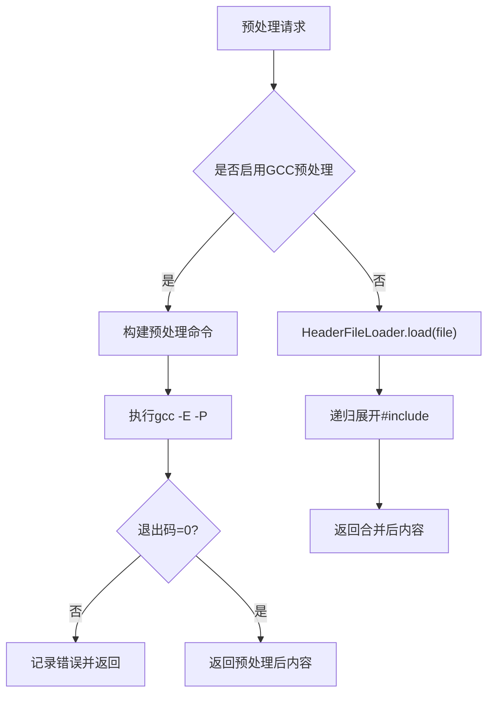
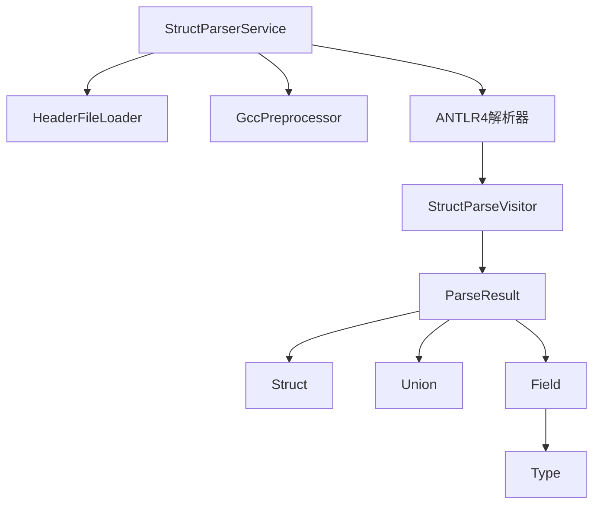

# 解析工作流程

<cite>
**本文档引用的文件**
- [StructParserService.java](file://src/main/java/com/structparser/parser/StructParserService.java)
- [StructParseVisitor.java](file://src/main/java/com/structparser/parser/StructParseVisitor.java)
- [HeaderFileLoader.java](file://src/main/java/com/structparser/parser/HeaderFileLoader.java)
- [GccPreprocessor.java](file://src/main/java/com/structparser/parser/GccPreprocessor.java)
- [Struct.java](file://src/main/java/com/structparser/model/Struct.java)
- [Union.java](file://src/main/java/com/structparser/model/Union.java)
- [Field.java](file://src/main/java/com/structparser/model/Field.java)
- [ParseResult.java](file://src/main/java/com/structparser/model/ParseResult.java)
- [Type.java](file://src/main/java/com/structparser/model/Type.java)
- [StructParser.g4](file://src/main/antlr4/com/structparser/StructParser.g4)
- [AnonymousFieldExpansionTest.java](file://src/test/java/com/structparser/parser/AnonymousFieldExpansionTest.java)
- [CircularReferenceTest.java](file://src/test/java/com/structparser/parser/CircularReferenceTest.java)
- [ConditionalCompilationTest.java](file://src/test/java/com/structparser/parser/ConditionalCompilationTest.java)
- [circular_a.h](file://src/test/resources/headers/circular_a.h)
- [conditional_simple.h](file://src/test/resources/headers/conditional_simple.h)
</cite>

## 目录
1. [简介](#简介)
2. [项目结构](#项目结构)
3. [核心组件](#核心组件)
4. [架构概览](#架构概览)
5. [详细组件分析](#详细组件分析)
6. [依赖分析](#依赖分析)
7. [性能考虑](#性能考虑)
8. [故障排除指南](#故障排除指南)
9. [结论](#结论)

## 简介
本文件面向结构解析器的两阶段解析流程，系统性阐述其设计原理与实现细节。解析器采用 ANTLR4 词法/语法分析，结合两遍扫描策略，完成对 C 风格结构体与联合体定义的解析。第一阶段专注于名称收集，确保类型前向引用的可解析性；第二阶段执行字段解析、类型展开与偏移计算，并处理匿名字段展开、条件编译与跨文件引用等复杂场景。

## 项目结构
项目采用分层组织：解析服务层负责预处理与入口控制；访问者层实现两遍扫描与字段解析；模型层提供结构化数据表示；测试层覆盖典型与边界场景。

**图表来源**
- [StructParserService.java:23-185](file://src/main/java/com/structparser/parser/StructParserService.java#L23-L185)
- [HeaderFileLoader.java:14-96](file://src/main/java/com/structparser/parser/HeaderFileLoader.java#L14-L96)
- [GccPreprocessor.java:17-194](file://src/main/java/com/structparser/parser/GccPreprocessor.java#L17-L194)
- [StructParseVisitor.java:21-517](file://src/main/java/com/structparser/parser/StructParseVisitor.java#L21-L517)
- [StructParser.g4:1-126](file://src/main/antlr4/com/structparser/StructParser.g4#L1-L126)
- [ParseResult.java:10-78](file://src/main/java/com/structparser/model/ParseResult.java#L10-L78)
- [Struct.java:9-47](file://src/main/java/com/structparser/model/Struct.java#L9-L47)
- [Union.java:9-20](file://src/main/java/com/structparser/model/Union.java#L9-L20)
- [Field.java:6-23](file://src/main/java/com/structparser/model/Field.java#L6-L23)
- [Type.java:6-104](file://src/main/java/com/structparser/model/Type.java#L6-L104)

**章节来源**
- [StructParserService.java:23-185](file://src/main/java/com/structparser/parser/StructParserService.java#L23-L185)
- [StructParser.g4:1-126](file://src/main/antlr4/com/structparser/StructParser.g4#L1-L126)

## 核心组件
- 解析服务入口：统一协调预处理与解析流程，支持 GCC 预处理与自定义 #include 处理。
- 两遍扫描访问者：第一遍收集类型名称，第二遍执行字段解析与类型展开。
- 模型层：以不可变记录类封装结构体、联合体、字段与解析结果，保证线程安全与清晰的数据契约。
- 预处理器：提供 GCC 预处理能力与自定义 #include 加载能力，支持条件编译场景。

**章节来源**
- [StructParserService.java:23-185](file://src/main/java/com/structparser/parser/StructParserService.java#L23-L185)
- [StructParseVisitor.java:21-517](file://src/main/java/com/structparser/parser/StructParseVisitor.java#L21-L517)
- [ParseResult.java:10-78](file://src/main/java/com/structparser/model/ParseResult.java#L10-L78)
- [Struct.java:9-47](file://src/main/java/com/structparser/model/Struct.java#L9-L47)
- [Union.java:9-20](file://src/main/java/com/structparser/model/Union.java#L9-L20)
- [Field.java:6-23](file://src/main/java/com/structparser/model/Field.java#L6-L23)
- [Type.java:6-104](file://src/main/java/com/structparser/model/Type.java#L6-L104)

## 架构概览
解析流程分为预处理阶段与解析阶段。预处理阶段根据配置选择 GCC 预处理或自定义 #include 展开；解析阶段由 ANTLR4 生成的解析器与访问者执行两遍扫描，最终产出结构化模型。

**图表来源**
- [StructParserService.java:53-153](file://src/main/java/com/structparser/parser/StructParserService.java#L53-L153)
- [GccPreprocessor.java:85-158](file://src/main/java/com/structparser/parser/GccPreprocessor.java#L85-L158)
- [HeaderFileLoader.java:29-78](file://src/main/java/com/structparser/parser/HeaderFileLoader.java#L29-L78)
- [StructParseVisitor.java:36-44](file://src/main/java/com/structparser/parser/StructParseVisitor.java#L36-L44)

## 详细组件分析

### 两阶段解析流程设计与实现
- 第一阶段（名称收集）：遍历顶层声明，收集 struct/union 名称至集合，用于后续前向引用检测与类型解析。
- 第二阶段（字段解析）：执行字段类型解析、偏移计算、匿名字段展开与嵌套结构处理，同时进行循环引用检测与错误累积。

**图表来源**
- [StructParseVisitor.java:36-66](file://src/main/java/com/structparser/parser/StructParseVisitor.java#L36-L66)
- [StructParseVisitor.java:140-185](file://src/main/java/com/structparser/parser/StructParseVisitor.java#L140-L185)
- [StructParseVisitor.java:212-330](file://src/main/java/com/structparser/parser/StructParseVisitor.java#L212-L330)

**章节来源**
- [StructParseVisitor.java:36-66](file://src/main/java/com/structparser/parser/StructParseVisitor.java#L36-L66)
- [StructParseVisitor.java:140-185](file://src/main/java/com/structparser/parser/StructParseVisitor.java#L140-L185)
- [StructParseVisitor.java:212-330](file://src/main/java/com/structparser/parser/StructParseVisitor.java#L212-L330)

### 第一阶段：名称收集过程
- 目标：在解析开始前，扫描顶层声明，建立类型名称索引，为后续类型解析与前向引用检测提供依据。
- 实现要点：
  - 遍历所有顶层项，识别 struct/union 声明。
  - 提取标识符作为类型名称并加入集合。
  - 仅处理顶层声明，避免嵌套内部声明影响名称收集。

**图表来源**
- [StructParseVisitor.java:49-66](file://src/main/java/com/structparser/parser/StructParseVisitor.java#L49-L66)

**章节来源**
- [StructParseVisitor.java:49-66](file://src/main/java/com/structparser/parser/StructParseVisitor.java#L49-L66)

### 第二阶段：字段解析与偏移计算
- 字段解析策略：
  - 匿名 struct/union：根据是否有字段名决定展开或保留嵌套。
  - 具名嵌套：创建嵌套字段，递归展开内部字段。
  - 基础类型：解析 uintN 或类型标识符，计算位宽与类型。
- 偏移计算规则：
  - 所有字段偏移为相对最外层结构体的绝对偏移。
  - 匿名 union 内字段共享相同偏移，总宽度取最大值。
  - 匿名 struct 内字段顺序展开，累计位宽。

**图表来源**
- [StructParseVisitor.java:212-330](file://src/main/java/com/structparser/parser/StructParseVisitor.java#L212-L330)
- [StructParseVisitor.java:140-185](file://src/main/java/com/structparser/parser/StructParseVisitor.java#L140-L185)
- [StructParseVisitor.java:191-207](file://src/main/java/com/structparser/parser/StructParseVisitor.java#L191-L207)

**章节来源**
- [StructParseVisitor.java:212-330](file://src/main/java/com/structparser/parser/StructParseVisitor.java#L212-L330)
- [StructParseVisitor.java:140-185](file://src/main/java/com/structparser/parser/StructParseVisitor.java#L140-L185)
- [StructParseVisitor.java:191-207](file://src/main/java/com/structparser/parser/StructParseVisitor.java#L191-L207)

### 匿名字段展开与嵌套结构处理
- 匿名 struct：无字段名时，其内部字段直接展开到父级结构体，保持字段顺序与偏移连续。
- 匿名 union：无字段名时，其内部字段共享相同偏移，总宽度按最大字段宽度计算。
- 具名嵌套：保留嵌套结构，内部字段偏移基于父级字段的绝对偏移重新计算。

**图表来源**
- [Struct.java:9-47](file://src/main/java/com/structparser/model/Struct.java#L9-L47)
- [Union.java:9-20](file://src/main/java/com/structparser/model/Union.java#L9-L20)
- [Field.java:6-23](file://src/main/java/com/structparser/model/Field.java#L6-L23)
- [ParseResult.java:10-78](file://src/main/java/com/structparser/model/ParseResult.java#L10-L78)

**章节来源**
- [Struct.java:15-45](file://src/main/java/com/structparser/model/Struct.java#L15-L45)
- [Union.java:15-18](file://src/main/java/com/structparser/model/Union.java#L15-L18)
- [Field.java:6-23](file://src/main/java/com/structparser/model/Field.java#L6-L23)
- [ParseResult.java:34-48](file://src/main/java/com/structparser/model/ParseResult.java#L34-L48)

### 条件编译与跨文件引用处理
- 条件编译：通过 GCC 预处理生成符合当前编译条件的源码，再交由解析器处理。测试覆盖了简单条件与复杂条件组合场景。
- 跨文件引用：自定义 #include 处理器支持相对路径与搜索路径，递归展开头文件并记录加载顺序，避免循环包含。

**图表来源**
- [ConditionalCompilationTest.java:22-161](file://src/test/java/com/structparser/parser/ConditionalCompilationTest.java#L22-L161)
- [HeaderFileLoader.java:29-78](file://src/main/java/com/structparser/parser/HeaderFileLoader.java#L29-L78)
- [GccPreprocessor.java:85-158](file://src/main/java/com/structparser/parser/GccPreprocessor.java#L85-L158)

**章节来源**
- [ConditionalCompilationTest.java:22-161](file://src/test/java/com/structparser/parser/ConditionalCompilationTest.java#L22-L161)
- [HeaderFileLoader.java:29-78](file://src/main/java/com/structparser/parser/HeaderFileLoader.java#L29-L78)
- [GccPreprocessor.java:85-158](file://src/main/java/com/structparser/parser/GccPreprocessor.java#L85-L158)

### 循环引用检测与错误恢复
- 检测机制：在解析过程中维护“正在解析”集合，遇到类型引用时检查是否已在集合内，若存在则判定为循环引用。
- 错误恢复：记录错误信息并继续解析其他声明，最终汇总到 ParseResult 中，便于上层处理。

**图表来源**
- [StructParseVisitor.java:335-364](file://src/main/java/com/structparser/parser/StructParseVisitor.java#L335-L364)
- [StructParseVisitor.java:366-396](file://src/main/java/com/structparser/parser/StructParseVisitor.java#L366-L396)

**章节来源**
- [StructParseVisitor.java:335-364](file://src/main/java/com/structparser/parser/StructParseVisitor.java#L335-L364)
- [StructParseVisitor.java:366-396](file://src/main/java/com/structparser/parser/StructParseVisitor.java#L366-L396)
- [CircularReferenceTest.java:12-145](file://src/test/java/com/structparser/parser/CircularReferenceTest.java#L12-L145)

### 预处理与文件加载策略
- GCC 预处理：从编译配置文件构建预处理命令，执行 gcc -E -P，捕获退出码与输出，支持错误日志记录与预处理后内容调试输出。
- 自定义 #include：正则匹配 #include 指令，支持双引号与尖括号形式，按搜索路径查找并递归展开，限制最大递归深度防止栈溢出。

**图表来源**
- [StructParserService.java:65-98](file://src/main/java/com/structparser/parser/StructParserService.java#L65-L98)
- [GccPreprocessor.java:85-158](file://src/main/java/com/structparser/parser/GccPreprocessor.java#L85-L158)
- [HeaderFileLoader.java:29-78](file://src/main/java/com/structparser/parser/HeaderFileLoader.java#L29-L78)

**章节来源**
- [StructParserService.java:65-98](file://src/main/java/com/structparser/parser/StructParserService.java#L65-L98)
- [GccPreprocessor.java:85-158](file://src/main/java/com/structparser/parser/GccPreprocessor.java#L85-L158)
- [HeaderFileLoader.java:29-78](file://src/main/java/com/structparser/parser/HeaderFileLoader.java#L29-L78)

## 依赖分析
- 组件耦合：
  - StructParserService 依赖 HeaderFileLoader 与 GccPreprocessor，负责预处理与入口控制。
  - StructParseVisitor 依赖模型层（Struct/Union/Field/ParseResult/Type），实现两遍扫描与字段解析。
  - ANTLR4 语法文件定义了解析规则，访问者基于规则进行遍历与处理。
- 外部依赖：
  - ANTLR4 运行时库用于词法/语法分析。
  - SLF4J 日志框架用于日志记录与调试输出。

**图表来源**
- [StructParserService.java:23-34](file://src/main/java/com/structparser/parser/StructParserService.java#L23-L34)
- [StructParseVisitor.java:21-34](file://src/main/java/com/structparser/parser/StructParseVisitor.java#L21-L34)
- [ParseResult.java:10-15](file://src/main/java/com/structparser/model/ParseResult.java#L10-L15)

**章节来源**
- [StructParserService.java:23-34](file://src/main/java/com/structparser/parser/StructParserService.java#L23-L34)
- [StructParseVisitor.java:21-34](file://src/main/java/com/structparser/parser/StructParseVisitor.java#L21-L34)
- [ParseResult.java:10-15](file://src/main/java/com/structparser/model/ParseResult.java#L10-L15)

## 性能考虑
- 两遍扫描优化：第一遍仅收集名称，避免重复解析与类型查找开销；第二遍集中执行字段解析与展开。
- 数据结构选择：使用不可变记录类减少同步开销；哈希集合用于 O(1) 查找与去重。
- 预处理策略：GCC 预处理一次性完成，减少解析器对条件宏的处理负担；自定义 #include 递归深度限制防止深度递归导致的性能问题。
- 错误聚合：错误在访问者中累积，最后统一写入 ParseResult，降低频繁异常抛出的成本。

[本节为通用性能建议，无需特定文件引用]

## 故障排除指南
- GCC 预处理失败：
  - 症状：解析结果包含错误信息，退出码非零。
  - 排查：确认 GCC 可用性与编译配置文件中的命令格式；检查预处理输出日志定位具体错误。
- 自定义 #include 未找到：
  - 症状：加载结果包含“文件未找到”或“无法找到包含文件”。
  - 排查：确认包含路径与搜索路径设置；检查 #include 语法与引号形式。
- 循环引用/前向引用：
  - 症状：出现“循环引用”或“前向引用不允许”的错误。
  - 排查：调整类型定义顺序或拆分结构体，避免交叉引用；确保类型在使用前已定义。
- 匿名字段展开不符合预期：
  - 症状：字段数量与偏移与预期不符。
  - 排查：确认匿名 struct/union 的字段名是否存在；验证嵌套结构的展开逻辑。

**章节来源**
- [StructParserService.java:67-83](file://src/main/java/com/structparser/parser/StructParserService.java#L67-L83)
- [HeaderFileLoader.java:43-51](file://src/main/java/com/structparser/parser/HeaderFileLoader.java#L43-L51)
- [StructParseVisitor.java:337-361](file://src/main/java/com/structparser/parser/StructParseVisitor.java#L337-L361)
- [AnonymousFieldExpansionTest.java:16-89](file://src/test/java/com/structparser/parser/AnonymousFieldExpansionTest.java#L16-L89)

## 结论
本解析器通过两遍扫描与 ANTLR4 词法/语法分析相结合，实现了对 C 风格结构体与联合体的稳健解析。第一遍名称收集确保类型解析的完整性，第二遍字段解析与展开处理了匿名字段、嵌套结构与偏移计算等复杂场景。配合 GCC 预处理与自定义 #include 加载，能够有效应对条件编译与跨文件引用等实际工程问题。通过循环引用检测与错误聚合机制，提升了系统的健壮性与可维护性。