# 语法容错机制

<cite>
**本文档引用的文件**
- [StructParser.g4](file://src/main/antlr4/com/structparser/StructParser.g4)
- [GccPreprocessor.java](file://src/main/java/com/structparser/parser/GccPreprocessor.java)
- [StructParseVisitor.java](file://src/main/java/com/structparser/parser/StructParseVisitor.java)
- [StructParserService.java](file://src/main/java/com/structparser/parser/StructParserService.java)
- [HeaderFileLoader.java](file://src/main/java/com/structparser/parser/HeaderFileLoader.java)
- [ParseResult.java](file://src/main/java/com/structparser/model/ParseResult.java)
- [Field.java](file://src/main/java/com/structparser/model/Field.java)
- [Struct.java](file://src/main/java/com/structparser/model/Struct.java)
- [SyntaxToleranceTest.java](file://src/test/java/com/structparser/parser/SyntaxToleranceTest.java)
- [ConditionalCompilationTest.java](file://src/test/java/com/structparser/parser/ConditionalCompilationTest.java)
- [mixed_syntax.h](file://src/test/resources/headers/mixed_syntax.h)
- [conditional_simple.h](file://src/test/resources/headers/conditional_simple.h)
- [README.md](file://README.md)
</cite>

## 目录
1. [简介](#简介)
2. [项目结构](#项目结构)
3. [核心组件](#核心组件)
4. [架构概览](#架构概览)
5. [详细组件分析](#详细组件分析)
6. [依赖关系分析](#依赖关系分析)
7. [性能考虑](#性能考虑)
8. [故障排除指南](#故障排除指南)
9. [结论](#结论)
10. [附录](#附录)

## 简介

本项目是一个基于 ANTLR4 的 C 风格结构体/联合体解析器，专门设计用于嵌入式系统和硬件寄存器描述。其核心特性之一是强大的语法容错机制，能够在复杂的 C 头文件中优雅地提取结构体和联合体定义，同时忽略其他无关的 C 语法内容。

语法容错机制通过以下方式实现：
- **语法岛模式**：使用 `otherContent` 规则捕获并跳过不相关的 C 语法
- **预处理指令处理**：通过 GCC 预处理完全消除条件编译和宏展开的影响
- **错误容忍策略**：优雅处理语法错误而不中断整个解析过程
- **两遍扫描机制**：先收集类型信息，再进行完整解析

## 项目结构

该项目采用模块化架构，主要分为以下几个层次：

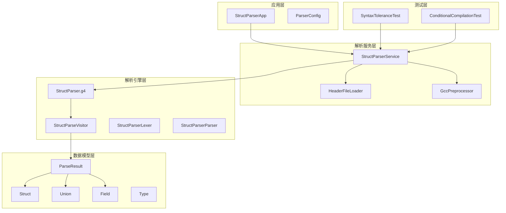

**图表来源**
- [StructParserService.java:23-34](file://src/main/java/com/structparser/parser/StructParserService.java#L23-L34)
- [StructParser.g4:1-126](file://src/main/antlr4/com/structparser/StructParser.g4#L1-L126)

**章节来源**
- [README.md:391-428](file://README.md#L391-L428)

## 核心组件

### 语法岛模式实现

语法岛模式是本项目容错机制的核心。它通过 ANTLR4 的词法规则实现，能够识别并跳过所有不相关的 C 语法内容。

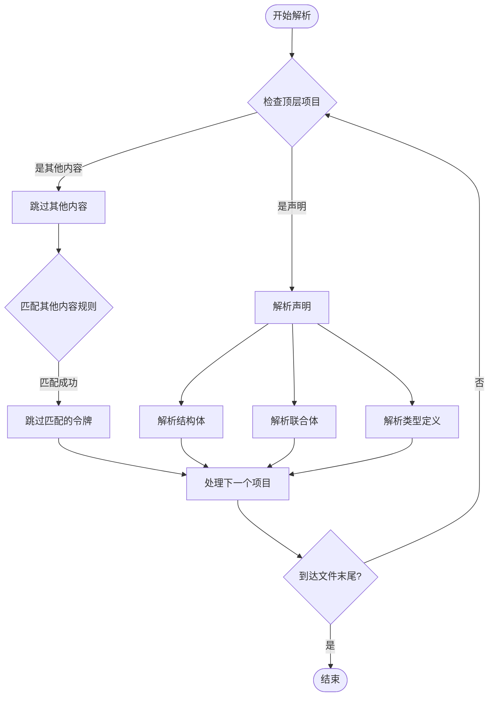

**图表来源**
- [StructParser.g4:10-19](file://src/main/antlr4/com/structparser/StructParser.g4#L10-L19)

### 预处理指令处理策略

项目支持两种预处理方式：

1. **GCC 预处理**：使用 `gcc -E -P` 完全预处理头文件
2. **自定义 #include 处理**：简单的文件包含合并

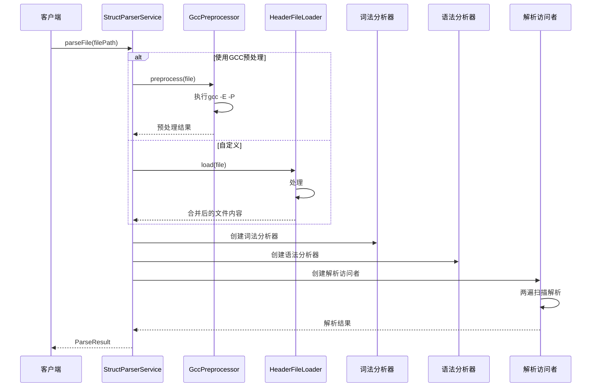

**图表来源**
- [StructParserService.java:60-102](file://src/main/java/com/structparser/parser/StructParserService.java#L60-L102)
- [GccPreprocessor.java:85-158](file://src/main/java/com/structparser/parser/GccPreprocessor.java#L85-L158)

**章节来源**
- [StructParser.g4:117-125](file://src/main/antlr4/com/structparser/StructParser.g4#L117-L125)
- [GccPreprocessor.java:14-194](file://src/main/java/com/structparser/parser/GccPreprocessor.java#L14-L194)

## 架构概览

### 两遍扫描机制

项目实现了智能的两遍扫描机制来处理复杂的类型引用关系：

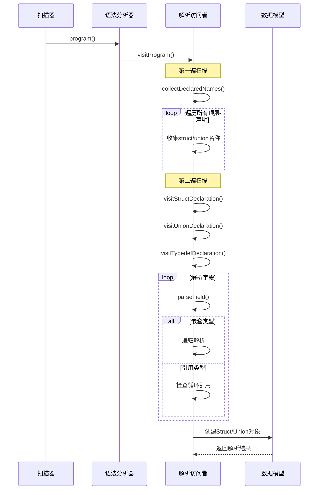

**图表来源**
- [StructParseVisitor.java:36-66](file://src/main/java/com/structparser/parser/StructParseVisitor.java#L36-L66)
- [StructParseVisitor.java:68-134](file://src/main/java/com/structparser/parser/StructParseVisitor.java#L68-L134)

### 错误处理和容错策略

系统实现了多层次的错误处理机制：

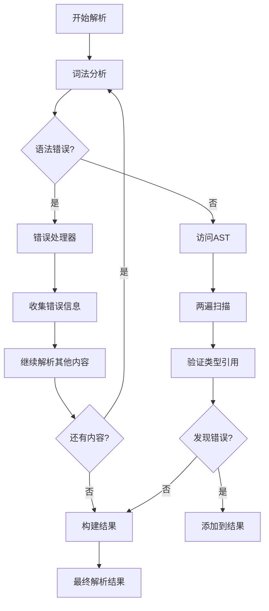

**图表来源**
- [StructParserService.java:170-183](file://src/main/java/com/structparser/parser/StructParserService.java#L170-L183)
- [StructParseVisitor.java:511-515](file://src/main/java/com/structparser/parser/StructParseVisitor.java#L511-L515)

**章节来源**
- [StructParseVisitor.java:21-517](file://src/main/java/com/structparser/parser/StructParseVisitor.java#L21-L517)

## 详细组件分析

### 语法岛模式实现详解

#### 词法规则设计

语法岛模式通过精心设计的词法规则实现：

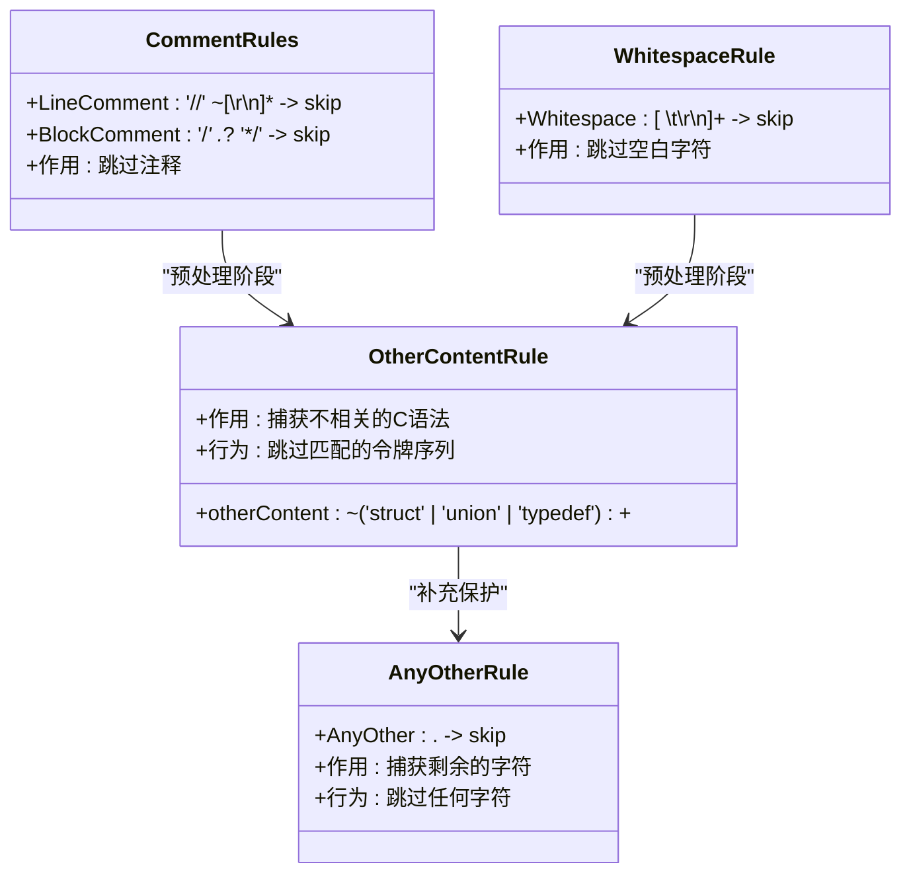

**图表来源**
- [StructParser.g4:16-19](file://src/main/antlr4/com/structparser/StructParser.g4#L16-L19)
- [StructParser.g4:122-125](file://src/main/antlr4/com/structparser/StructParser.g4#L122-L125)
- [StructParser.g4:103-115](file://src/main/antlr4/com/structparser/StructParser.g4#L103-L115)

#### 字段级别的容错处理

字段解析器实现了智能的容错机制：

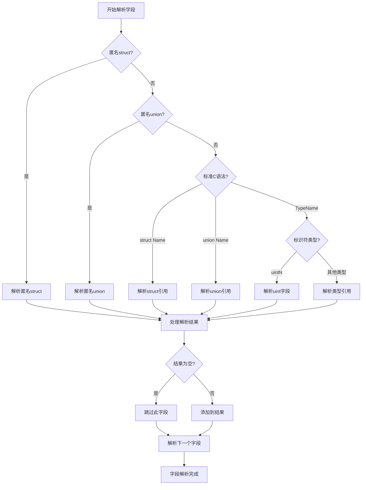

**图表来源**
- [StructParseVisitor.java:212-330](file://src/main/java/com/structparser/parser/StructParseVisitor.java#L212-L330)

**章节来源**
- [StructParser.g4:55-78](file://src/main/antlr4/com/structparser/StructParser.g4#L55-L78)
- [StructParseVisitor.java:212-330](file://src/main/java/com/structparser/parser/StructParseVisitor.java#L212-L330)

### 预处理指令处理策略

#### GCC 预处理集成

项目提供了完整的 GCC 预处理支持：

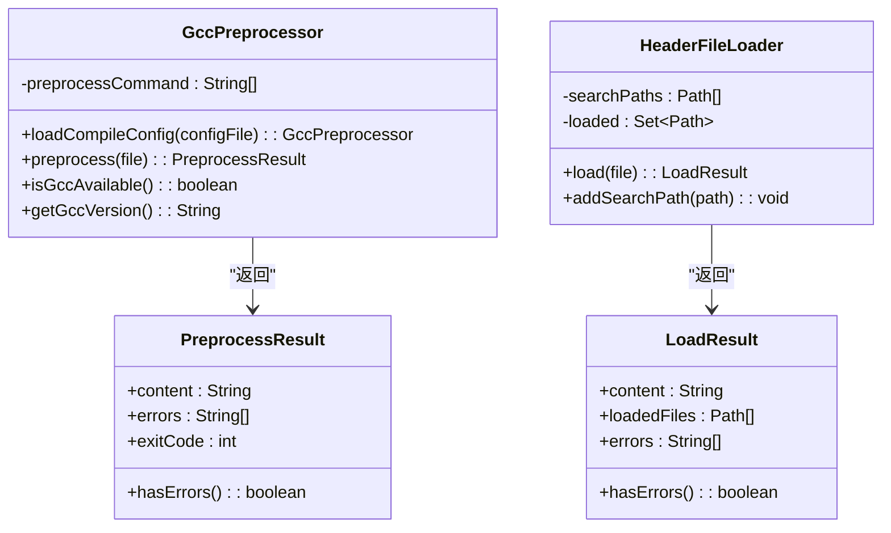

**图表来源**
- [GccPreprocessor.java:17-194](file://src/main/java/com/structparser/parser/GccPreprocessor.java#L17-L194)
- [HeaderFileLoader.java:14-96](file://src/main/java/com/structparser/parser/HeaderFileLoader.java#L14-L96)

#### 条件编译支持

系统完全支持 C 语言的条件编译机制：

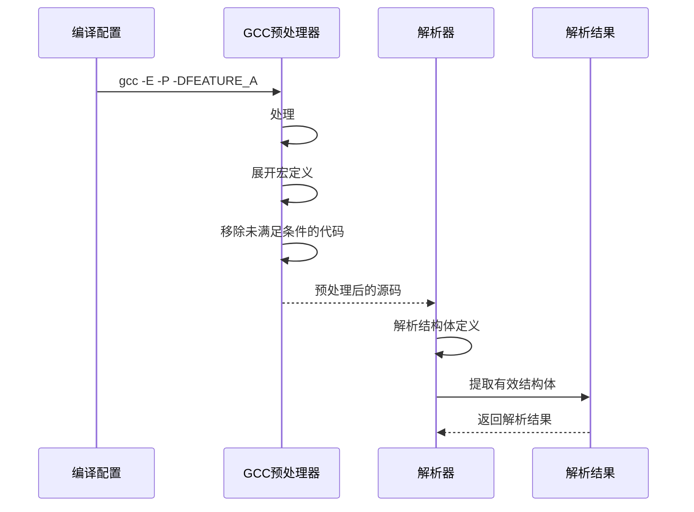

**图表来源**
- [README.md:181-240](file://README.md#L181-L240)

**章节来源**
- [GccPreprocessor.java:28-80](file://src/main/java/com/structparser/parser/GccPreprocessor.java#L28-L80)
- [HeaderFileLoader.java:29-78](file://src/main/java/com/structparser/parser/HeaderFileLoader.java#L29-L78)

### 错误容忍和优雅降级

#### 错误收集机制

系统实现了完善的错误收集和报告机制：

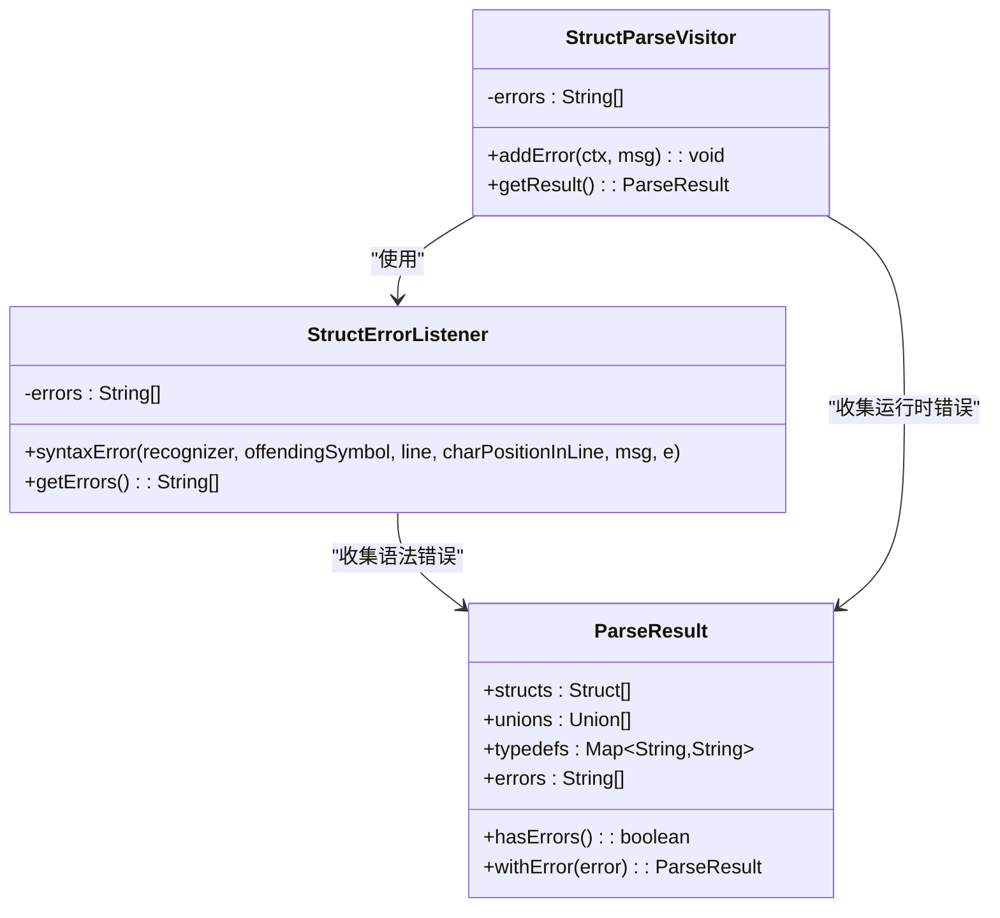

**图表来源**
- [StructParserService.java:170-183](file://src/main/java/com/structparser/parser/StructParserService.java#L170-L183)
- [ParseResult.java:10-78](file://src/main/java/com/structparser/model/ParseResult.java#L10-L78)
- [StructParseVisitor.java:511-515](file://src/main/java/com/structparser/parser/StructParseVisitor.java#L511-L515)

#### 循环引用检测

项目实现了智能的循环引用检测机制：

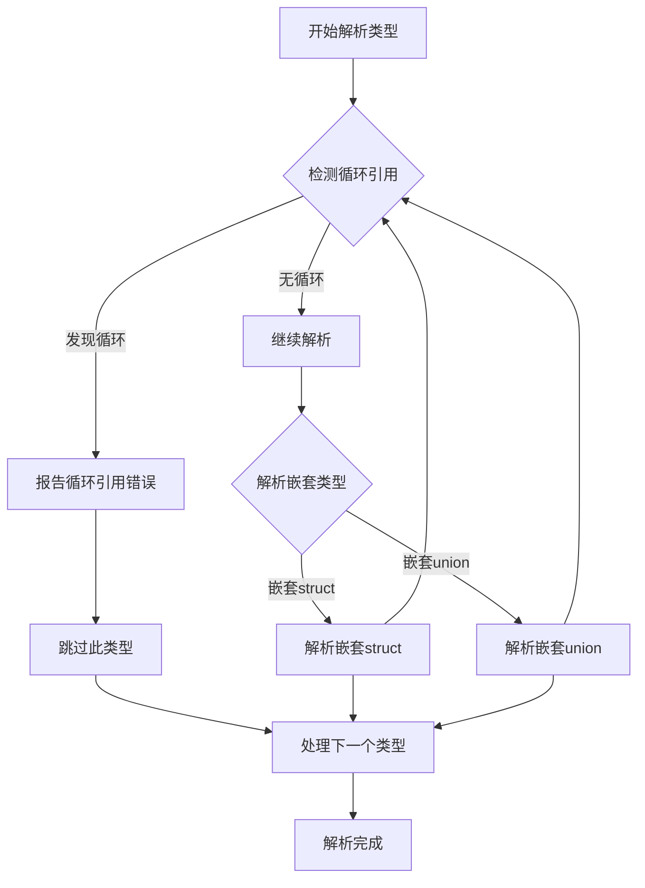

**图表来源**
- [StructParseVisitor.java:335-364](file://src/main/java/com/structparser/parser/StructParseVisitor.java#L335-L364)

**章节来源**
- [StructParseVisitor.java:335-396](file://src/main/java/com/structparser/parser/StructParseVisitor.java#L335-L396)

## 依赖关系分析

### 组件耦合度分析

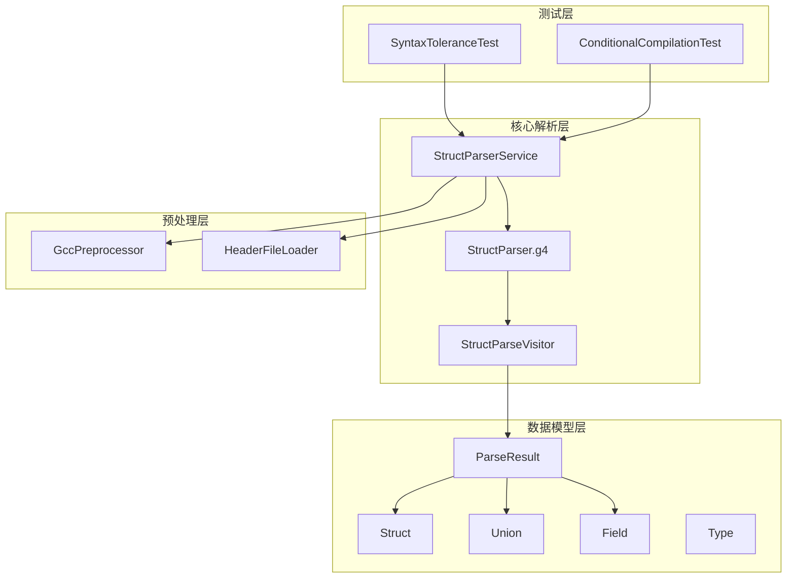

**图表来源**
- [StructParserService.java:23-34](file://src/main/java/com/structparser/parser/StructParserService.java#L23-L34)
- [StructParseVisitor.java:21-34](file://src/main/java/com/structparser/parser/StructParseVisitor.java#L21-L34)

### 外部依赖管理

项目的主要外部依赖包括：

- **ANTLR4**: 语法分析器生成器
- **SLF4J + Logback**: 日志记录框架
- **JUnit 5**: 单元测试框架
- **GCC**: C 预处理器

**章节来源**
- [README.md:430-438](file://README.md#L430-L438)

## 性能考虑

### 解析性能优化

1. **词法分析优化**：通过专用的词法规则快速跳过不相关内容
2. **两遍扫描**：避免重复解析和类型检查
3. **缓存机制**：重用已解析的类型定义
4. **流式处理**：支持大文件的流式解析

### 内存使用优化

- 使用不可变的数据结构减少内存占用
- 及时释放不再使用的解析上下文
- 控制错误消息的数量和大小

## 故障排除指南

### 常见问题诊断

#### 预处理失败

**症状**：解析器报告 GCC 不可用或预处理失败

**解决方案**：
1. 检查 GCC 是否正确安装
2. 验证编译配置文件的路径
3. 确认预处理命令的正确性

#### 语法错误处理

**症状**：解析过程中出现语法错误但继续执行

**解决方案**：
1. 查看详细的错误日志
2. 检查输入文件的语法正确性
3. 使用禁用 GCC 预处理的模式进行调试

#### 类型引用错误

**症状**：报告未定义的类型或循环引用

**解决方案**：
1. 确保类型定义在使用前已定义
2. 检查类型名称的拼写
3. 避免循环引用的结构设计

**章节来源**
- [StructParserService.java:67-83](file://src/main/java/com/structparser/parser/StructParserService.java#L67-L83)
- [StructParseVisitor.java:335-364](file://src/main/java/com/structparser/parser/StructParseVisitor.java#L335-L364)

## 结论

本项目的语法容错机制通过精心设计的语法岛模式、智能的预处理策略和完善的错误处理机制，实现了对复杂 C 头文件的强大解析能力。其核心优势包括：

1. **强大的容错能力**：能够优雅处理各种语法错误和不兼容内容
2. **灵活的预处理支持**：支持 GCC 预处理和自定义 #include 处理
3. **智能的类型解析**：通过两遍扫描机制处理复杂的类型引用关系
4. **完善的错误报告**：提供详细的错误信息和调试支持

这些特性使得该解析器特别适用于嵌入式系统开发中的硬件寄存器描述和跨文件类型引用场景。

## 附录

### 最佳实践建议

1. **使用 GCC 预处理**：优先使用 GCC 预处理以获得最佳的条件编译支持
2. **合理组织头文件**：确保类型定义的顺序符合解析要求
3. **监控错误日志**：定期检查解析日志以发现潜在问题
4. **单元测试覆盖**：为关键的解析场景编写单元测试

### 扩展容错能力的指南

1. **自定义词法规则**：根据特定需求添加新的容错规则
2. **增强错误恢复**：实现更智能的错误恢复策略
3. **性能优化**：针对特定使用场景优化解析性能
4. **插件化架构**：支持第三方扩展和自定义解析器