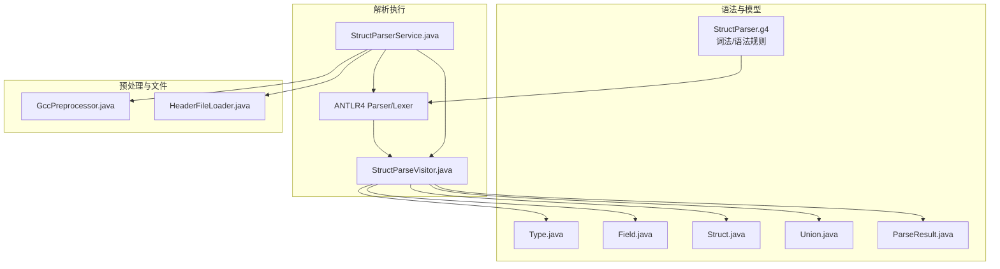
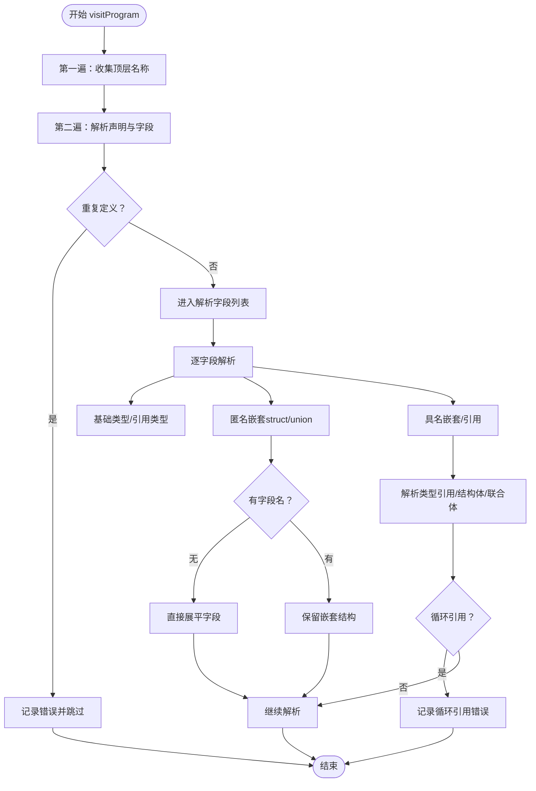
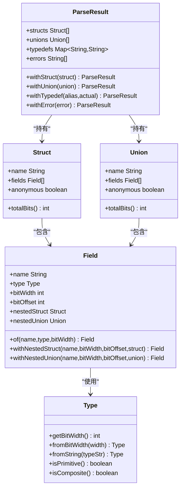
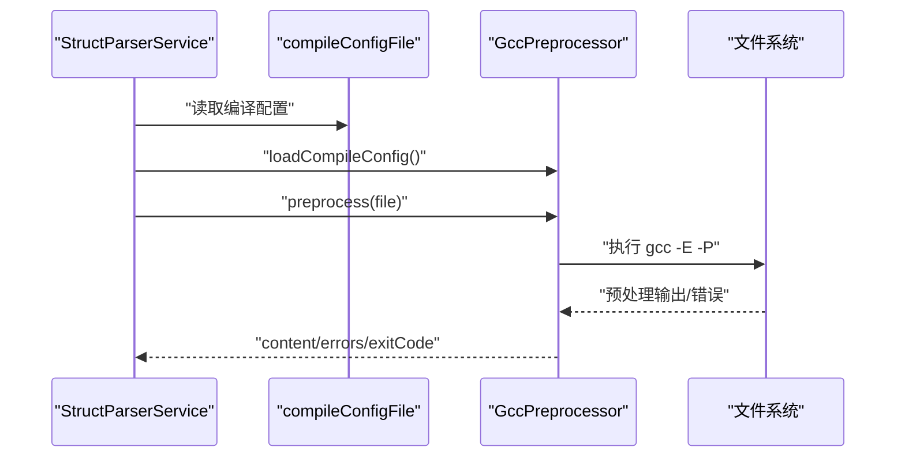
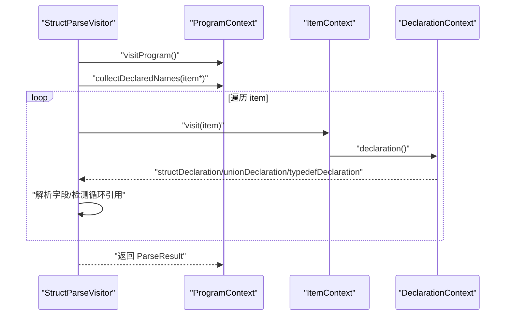
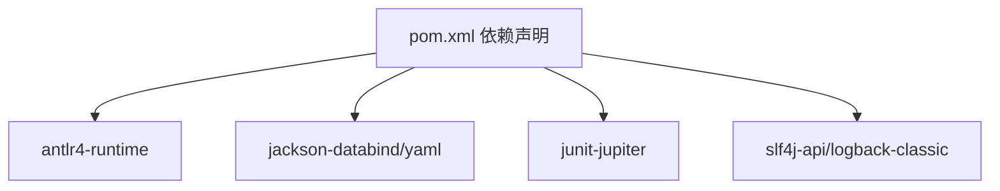

# 语法解析引擎

<cite>
**本文档引用的文件**
- [StructParser.g4](file://src/main/antlr4/com/structparser/StructParser.g4)
- [StructParseVisitor.java](file://src/main/java/com/structparser/parser/StructParseVisitor.java)
- [StructParserService.java](file://src/main/java/com/structparser/parser/StructParserService.java)
- [ParseResult.java](file://src/main/java/com/structparser/model/ParseResult.java)
- [Struct.java](file://src/main/java/com/structparser/model/Struct.java)
- [Union.java](file://src/main/java/com/structparser/model/Union.java)
- [Field.java](file://src/main/java/com/structparser/model/Field.java)
- [Type.java](file://src/main/java/com/structparser/model/Type.java)
- [GccPreprocessor.java](file://src/main/java/com/structparser/parser/GccPreprocessor.java)
- [HeaderFileLoader.java](file://src/main/java/com/structparser/parser/HeaderFileLoader.java)
- [README.md](file://README.md)
- [pom.xml](file://pom.xml)
- [types.h](file://src/main/resources/include/types.h)
- [mixed_syntax.h](file://src/test/resources/headers/mixed_syntax.h)
- [circular_a.h](file://src/test/resources/headers/circular_a.h)
</cite>

## 目录
1. [简介](#简介)
2. [项目结构](#项目结构)
3. [核心组件](#核心组件)
4. [架构总览](#架构总览)
5. [详细组件分析](#详细组件分析)
6. [依赖关系分析](#依赖关系分析)
7. [性能考虑](#性能考虑)
8. [故障排查指南](#故障排查指南)
9. [结论](#结论)
10. [附录](#附录)

## 简介
本项目是一个基于 ANTLR4 的 C 风格结构体/联合体解析引擎，专为嵌入式系统与硬件寄存器描述设计。其核心能力包括：
- 通过 GCC 预处理支持条件编译与头文件包含
- 语法容错：忽略未知 C 语法（函数、枚举等），仅提取 struct/union/typedef
- 两阶段解析：名称收集与字段解析，支持跨文件引用但禁止前向引用与循环引用
- AST 访问者模式实现，生成带位级布局的结构化结果
- 输出 JSON 格式，包含字段偏移、大小与嵌套结构

## 项目结构
项目采用按职责分层的组织方式：
- 语法定义：src/main/antlr4/com/structparser/StructParser.g4
- 解析服务：src/main/java/com/structparser/parser/StructParserService.java
- 词法/语法分析与访问者：由 ANTLR4 生成的 Lexer/Parser 与访问者
- 模型对象：src/main/java/com/structparser/model/ 下的 Struct、Union、Field、Type、ParseResult
- 预处理与头文件加载：GccPreprocessor.java、HeaderFileLoader.java
- 示例与测试：resources/include/types.h、测试资源与集成测试



图表来源
- [StructParser.g4:1-126](file://src/main/antlr4/com/structparser/StructParser.g4#L1-L126)
- [StructParserService.java:1-185](file://src/main/java/com/structparser/parser/StructParserService.java#L1-L185)
- [StructParseVisitor.java:1-463](file://src/main/java/com/structparser/parser/StructParseVisitor.java#L1-L463)
- [Type.java:1-104](file://src/main/java/com/structparser/model/Type.java#L1-L104)
- [Field.java:1-23](file://src/main/java/com/structparser/model/Field.java#L1-L23)
- [Struct.java:1-47](file://src/main/java/com/structparser/model/Struct.java#L1-L47)
- [Union.java:1-20](file://src/main/java/com/structparser/model/Union.java#L1-L20)
- [ParseResult.java:1-78](file://src/main/java/com/structparser/model/ParseResult.java#L1-L78)
- [GccPreprocessor.java:1-194](file://src/main/java/com/structparser/parser/GccPreprocessor.java#L1-L194)
- [HeaderFileLoader.java:1-96](file://src/main/java/com/structparser/parser/HeaderFileLoader.java#L1-L96)

章节来源
- [README.md:391-428](file://README.md#L391-L428)
- [pom.xml:72-137](file://pom.xml#L72-L137)

## 核心组件
- 语法定义（StructParser.g4）：定义了程序入口、顶层项目、结构体/联合体/typedef 声明、字段规则与词法规则（注释、空白、预处理指令、标识符、整数字面量等）。通过“语法岛”模式忽略非目标语法，实现对真实头文件的容忍。
- 解析服务（StructParserService）：负责选择预处理方式（GCC 或自定义 #include）、构建 ANTLR4 词法/语法流、安装错误监听器、驱动访问者解析，并汇总错误与结果。
- 访问者（StructParseVisitor）：实现两遍扫描（名称收集 + 字段解析）、循环引用检测、匿名类型展开、具名嵌套保留、跨文件类型解析与错误收集。
- 模型（Type/Field/Struct/Union/ParseResult）：记录类型系统、字段布局、结构体/联合体定义与最终解析结果。
- 预处理（GccPreprocessor）：执行 gcc -E -P，支持 -D、-include、-imacros、-I 等；失败时返回错误与输出预览。
- 头文件加载（HeaderFileLoader）：替代 GCC 的 #include 处理，用于禁用 GCC 预处理时的自定义包含。

章节来源
- [StructParser.g4:1-126](file://src/main/antlr4/com/structparser/StructParser.g4#L1-L126)
- [StructParserService.java:1-185](file://src/main/java/com/structparser/parser/StructParserService.java#L1-L185)
- [StructParseVisitor.java:1-463](file://src/main/java/com/structparser/parser/StructParseVisitor.java#L1-L463)
- [Type.java:1-104](file://src/main/java/com/structparser/model/Type.java#L1-L104)
- [Field.java:1-23](file://src/main/java/com/structparser/model/Field.java#L1-L23)
- [Struct.java:1-47](file://src/main/java/com/structparser/model/Struct.java#L1-L47)
- [Union.java:1-20](file://src/main/java/com/structparser/model/Union.java#L1-L20)
- [ParseResult.java:1-78](file://src/main/java/com/structparser/model/ParseResult.java#L1-L78)
- [GccPreprocessor.java:1-194](file://src/main/java/com/structparser/parser/GccPreprocessor.java#L1-L194)
- [HeaderFileLoader.java:1-96](file://src/main/java/com/structparser/parser/HeaderFileLoader.java#L1-L96)

## 架构总览
下图展示了从输入到输出的整体流程：配置加载 → 预处理 → 词法/语法分析 → AST 访问者 → 结果封装 → JSON 输出。

```mermaid
sequenceDiagram
participant App as "应用"
participant Svc as "StructParserService"
participant Pre as "GccPreprocessor/自定义加载"
participant Lex as "StructParserLexer"
participant Par as "StructParserParser"
participant Vis as "StructParseVisitor"
participant Res as "ParseResult"
App->>Svc : "parseFile()/parse()"
alt 启用GCC预处理
Svc->>Pre : "preprocess(file)"
Pre-->>Svc : "content/errors"
else 禁用GCC预处理
Svc->>Pre : "load(file)自定义#includes"
Pre-->>Svc : "content/errors"
end
Svc->>Lex : "构造词法分析器"
Svc->>Par : "构造语法分析器"
Par->>Par : "program()"
Par-->>Vis : "ParseTree"
Vis->>Vis : "两遍扫描/循环引用检测"
Vis-->>Res : "structs/unions/typedefs/errors"
Svc-->>App : "ParseResult"
```

图表来源
- [StructParserService.java:53-153](file://src/main/java/com/structparser/parser/StructParserService.java#L53-L153)
- [GccPreprocessor.java:85-158](file://src/main/java/com/structparser/parser/GccPreprocessor.java#L85-L158)
- [HeaderFileLoader.java:29-78](file://src/main/java/com/structparser/parser/HeaderFileLoader.java#L29-L78)
- [StructParseVisitor.java:36-44](file://src/main/java/com/structparser/parser/StructParseVisitor.java#L36-L44)

## 详细组件分析

### 语法定义与词法/语法分析
- 语法入口 program 接受任意内容，仅提取 struct/union/typedef 定义；其他内容作为“语法岛”被忽略。
- 声明规则覆盖 structDeclaration、unionDeclaration、typedefDeclaration 及其内部的 fieldList 与 typeDefinition。
- 字段规则支持基础类型 uintN、匿名/具名嵌套 struct/union、标准 C 语法 struct/union Name name、以及 DSL 语法 Identifier name。
- 词法规则跳过注释、空白、预处理指令，并通过 AnyOther 实现语法岛模式，确保对真实头文件的容忍度。
- 错误监听器在语法错误时记录行列号与消息，供上层汇总。

章节来源
- [StructParser.g4:5-126](file://src/main/antlr4/com/structparser/StructParser.g4#L5-L126)
- [StructParserService.java:170-183](file://src/main/java/com/structparser/parser/StructParserService.java#L170-L183)

### AST 访问者模式与两阶段解析
- 第一遍扫描：遍历顶层 item，收集所有具名 struct/union 名称，建立全局可引用集合。
- 第二遍扫描：正式解析每个声明，解析字段列表，进行循环引用检测与类型解析。
- 匿名嵌套展开：当匿名嵌套无字段名时，将其字段直接展平到父级；有字段名时保留嵌套结构。
- Union 字段共享相同偏移，宽度取最大值。
- 类型解析：优先解析为 struct/union 引用，否则回退为基础类型（CUSTOM）。
- 错误收集：重复定义、未定义类型、循环引用、非法位宽等均记录为错误。



图表来源
- [StructParseVisitor.java:36-44](file://src/main/java/com/structparser/parser/StructParseVisitor.java#L36-L44)
- [StructParseVisitor.java:49-66](file://src/main/java/com/structparser/parser/StructParseVisitor.java#L49-L66)
- [StructParseVisitor.java:183-285](file://src/main/java/com/structparser/parser/StructParseVisitor.java#L183-L285)
- [StructParseVisitor.java:290-347](file://src/main/java/com/structparser/parser/StructParseVisitor.java#L290-L347)
- [StructParseVisitor.java:457-461](file://src/main/java/com/structparser/parser/StructParseVisitor.java#L457-L461)

章节来源
- [StructParseVisitor.java:11-463](file://src/main/java/com/structparser/parser/StructParseVisitor.java#L11-L463)

### 数据模型与布局计算
- Type：枚举定义 uint1~uint32、STRUCT、UNION、CUSTOM，提供位宽查询与字符串解析。
- Field：记录字段名、类型、位宽、位偏移，以及可选的嵌套结构体/联合体。
- Struct/Union：记录名称、字段列表与匿名标志；Struct 提供 totalBits 计算，需识别来自同一匿名 union 的字段并去重计算最大宽度。
- ParseResult：不可变结果容器，提供 withXxx 方法创建新实例，便于访问者累积结果。



图表来源
- [Type.java:6-104](file://src/main/java/com/structparser/model/Type.java#L6-L104)
- [Field.java:6-23](file://src/main/java/com/structparser/model/Field.java#L6-L23)
- [Struct.java:9-47](file://src/main/java/com/structparser/model/Struct.java#L9-L47)
- [Union.java:9-20](file://src/main/java/com/structparser/model/Union.java#L9-L20)
- [ParseResult.java:10-78](file://src/main/java/com/structparser/model/ParseResult.java#L10-L78)

章节来源
- [Type.java:1-104](file://src/main/java/com/structparser/model/Type.java#L1-L104)
- [Field.java:1-23](file://src/main/java/com/structparser/model/Field.java#L1-L23)
- [Struct.java:1-47](file://src/main/java/com/structparser/model/Struct.java#L1-L47)
- [Union.java:1-20](file://src/main/java/com/structparser/model/Union.java#L1-L20)
- [ParseResult.java:1-78](file://src/main/java/com/structparser/model/ParseResult.java#L1-L78)

### 预处理与头文件加载
- GccPreprocessor：从编译配置文件加载 gcc 命令，追加 -E -P，执行预处理并将输出写入日志；支持 -D、-include、-imacros、-I 等；失败时返回错误列表与退出码。
- HeaderFileLoader：解析 #include 指令，支持双引号与尖括号形式，按搜索路径查找文件，递归展开，限制最大包含深度，记录错误。



图表来源
- [StructParserService.java:39-102](file://src/main/java/com/structparser/parser/StructParserService.java#L39-L102)
- [GccPreprocessor.java:28-158](file://src/main/java/com/structparser/parser/GccPreprocessor.java#L28-L158)

章节来源
- [GccPreprocessor.java:1-194](file://src/main/java/com/structparser/parser/GccPreprocessor.java#L1-L194)
- [HeaderFileLoader.java:1-96](file://src/main/java/com/structparser/parser/HeaderFileLoader.java#L1-L96)

### 语法容错与错误恢复
- 语法岛模式：通过 otherContent/otherField 规则匹配并跳过非目标语法，保证解析不会因函数、枚举、常量等而中断。
- 两遍扫描：先收集名称，再解析字段，避免前向引用导致的解析失败。
- 访问者错误收集：重复定义、未定义类型、循环引用、非法位宽等均记录为错误，最终统一返回。
- 服务端错误监听：捕获 ANTLR 语法错误，记录行列号与消息，合并到 ParseResult。

章节来源
- [StructParser.g4:16-18](file://src/main/antlr4/com/structparser/StructParser.g4#L16-L18)
- [StructParser.g4:75-78](file://src/main/antlr4/com/structparser/StructParser.g4#L75-L78)
- [StructParseVisitor.java:36-44](file://src/main/java/com/structparser/parser/StructParseVisitor.java#L36-L44)
- [StructParserService.java:170-183](file://src/main/java/com/structparser/parser/StructParserService.java#L170-L183)

### 两阶段解析流程详解
- 第一遍：遍历顶层 item，提取 struct/union 的具名声明，填充 declaredNames 集合。
- 第二遍：对每个声明调用访问者方法，解析字段列表，进行循环引用检测与类型解析，构建嵌套结构，最终将顶层结构体/联合体加入结果。



图表来源
- [StructParseVisitor.java:36-44](file://src/main/java/com/structparser/parser/StructParseVisitor.java#L36-L44)
- [StructParseVisitor.java:49-66](file://src/main/java/com/structparser/parser/StructParseVisitor.java#L49-L66)

章节来源
- [StructParseVisitor.java:36-134](file://src/main/java/com/structparser/parser/StructParseVisitor.java#L36-L134)

## 依赖关系分析
- 语言与工具：Java 26、ANTLR4 4.13.1、Maven、JUnit 5、Jackson、SLF4J/Logback、GCC。
- 关键依赖：ANTLR4 运行时用于词法/语法分析；Jackson 用于 YAML/JSON 配置处理；Logback 用于日志输出。
- 组件耦合：解析服务与预处理模块松耦合，可通过 API 切换预处理方式；访问者与模型之间为单向依赖，保持清晰的数据流向。



图表来源
- [pom.xml:27-69](file://pom.xml#L27-L69)

章节来源
- [pom.xml:16-69](file://pom.xml#L16-L69)

## 性能考虑
- 两遍扫描：通过第一遍收集名称，避免重复解析与回溯，提升整体性能。
- 访问者内联与局部变量：减少对象分配与跨方法调用开销。
- 预处理阶段：GCC 预处理会显著增加 I/O 与进程启动成本，建议合理配置 include 路径与宏定义，避免不必要的大文件参与。
- 日志级别：生产环境建议使用 INFO/WARN，避免 DEBUG 大量输出带来的磁盘压力。
- 结果封装：使用不可变记录类（Record）减少同步与拷贝成本。

## 故障排查指南
- GCC 不可用：检查系统是否安装 GCC，或在服务初始化时禁用 GCC 预处理，改用自定义 #include 处理。
- 预处理失败：查看日志中的错误输出与退出码，确认编译配置文件格式与路径正确。
- 语法错误：查看服务端错误监听器记录的行列号与消息，定位具体问题。
- 循环引用：访问者会在检测到循环引用时记录错误，检查结构体/联合体之间的相互引用。
- 未定义类型：确认被引用的 struct/union 已在当前或已加载的头文件中定义且位于使用之前。
- 复杂混合语法：预处理后仍存在非目标语法会被忽略，确保目标结构体/联合体位于预处理输出中。

章节来源
- [StructParserService.java:65-83](file://src/main/java/com/structparser/parser/StructParserService.java#L65-L83)
- [GccPreprocessor.java:137-158](file://src/main/java/com/structparser/parser/GccPreprocessor.java#L137-L158)
- [StructParseVisitor.java:290-347](file://src/main/java/com/structparser/parser/StructParseVisitor.java#L290-L347)
- [README.md:461-485](file://README.md#L461-L485)

## 结论
该解析引擎通过 ANTLR4 语法定义与访问者模式，结合 GCC 预处理与自定义头文件加载，实现了对真实 C 头文件的高容忍度解析。两阶段解析与循环引用检测保障了跨文件引用的安全性，模型层清晰地表达位级布局与嵌套结构，适合嵌入式与硬件寄存器描述场景。配合完善的日志与错误收集机制，便于在复杂工程中稳定运行与快速定位问题。

## 附录

### 语法定义与扩展指南
- 新增字段类型：在 typeSpecifier 中添加新的类型解析分支，或通过 DSL 语法支持新的标识符。
- 新增声明类型：在 declaration 中添加新的分支，并在访问者中实现相应的解析逻辑。
- 词法规则扩展：在词法部分新增规则并确保跳过策略正确，避免影响语法岛模式。
- 语义约束：在访问者中添加新的校验逻辑，如数组展开、对齐要求等。

章节来源
- [StructParser.g4:22-84](file://src/main/antlr4/com/structparser/StructParser.g4#L22-L84)
- [Type.java:61-94](file://src/main/java/com/structparser/model/Type.java#L61-L94)

### 示例与测试参考
- 基础类型与嵌套示例：见资源文件 types.h。
- 混合语法容忍示例：见测试资源 mixed_syntax.h。
- 循环引用测试：见测试资源 circular_a.h 与其关联文件。

章节来源
- [types.h:1-99](file://src/main/resources/include/types.h#L1-L99)
- [mixed_syntax.h:1-52](file://src/test/resources/headers/mixed_syntax.h#L1-L52)
- [circular_a.h:1-13](file://src/test/resources/headers/circular_a.h#L1-L13)