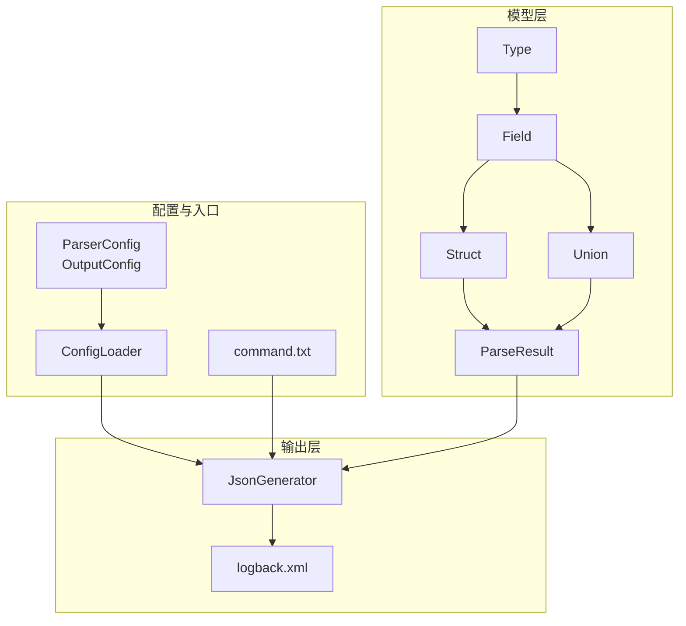
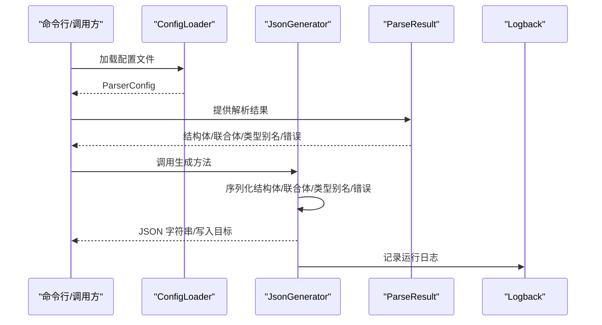
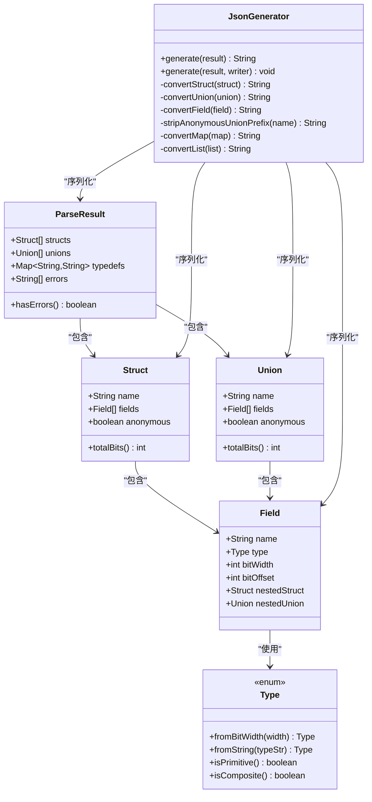
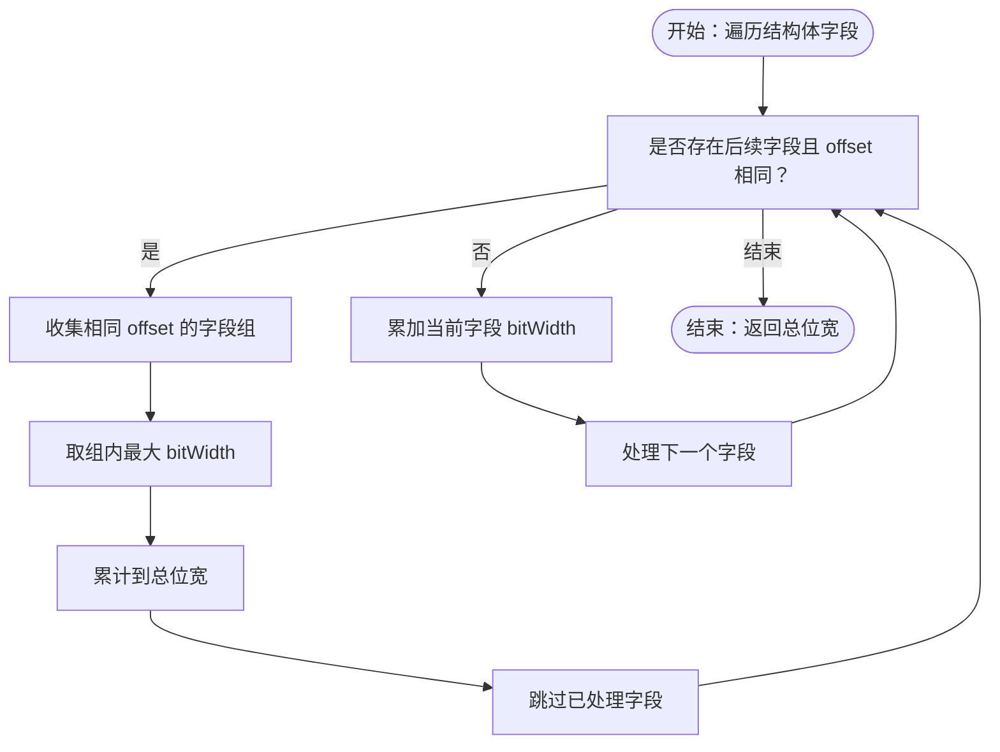
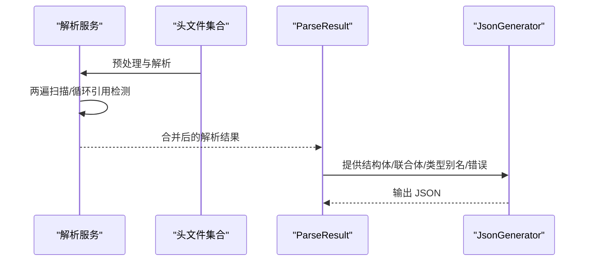
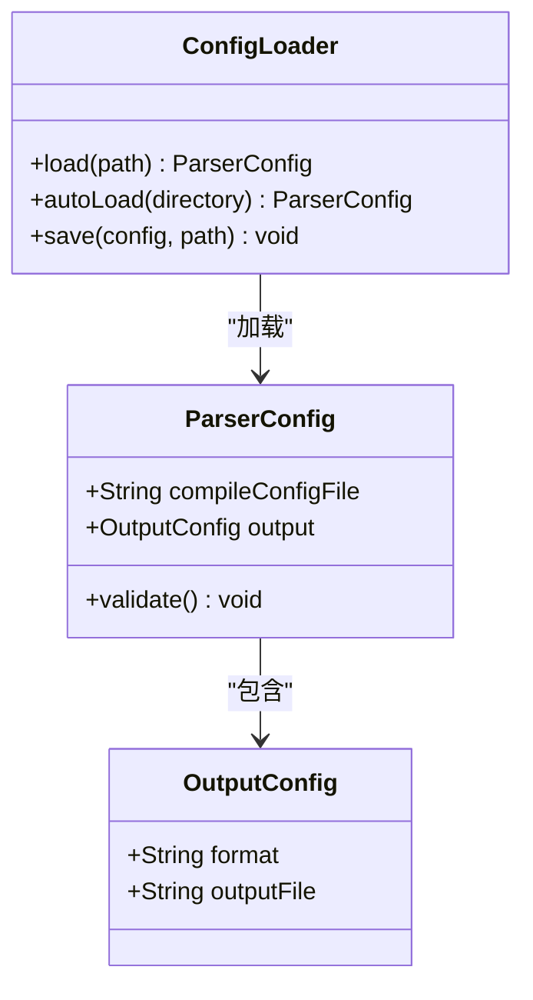
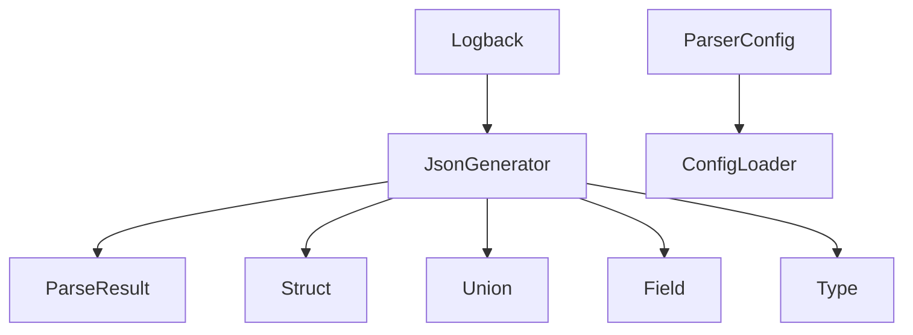

# 输出生成系统

<cite>
**本文引用的文件**
- [JsonGenerator.java](file://src/main/java/com/structparser/generator/JsonGenerator.java)
- [ParseResult.java](file://src/main/java/com/structparser/model/ParseResult.java)
- [Struct.java](file://src/main/java/com/structparser/model/Struct.java)
- [Union.java](file://src/main/java/com/structparser/model/Union.java)
- [Field.java](file://src/main/java/com/structparser/model/Field.java)
- [Type.java](file://src/main/java/com/structparser/model/Type.java)
- [ParserConfig.java](file://src/main/java/com/structparser/config/ParserConfig.java)
- [ConfigLoader.java](file://src/main/java/com/structparser/config/ConfigLoader.java)
- [logback.xml](file://src/main/resources/logback.xml)
- [struct-parser.yaml](file://struct-parser.yaml)
- [command.txt](file://src/main/resources/include/command.txt)
- [types.h](file://src/main/resources/include/types.h)
- [README.md](file://README.md)
</cite>

## 目录
1. [简介](#简介)
2. [项目结构](#项目结构)
3. [核心组件](#核心组件)
4. [架构总览](#架构总览)
5. [详细组件分析](#详细组件分析)
6. [依赖分析](#依赖分析)
7. [性能考虑](#性能考虑)
8. [故障排查指南](#故障排查指南)
9. [结论](#结论)
10. [附录](#附录)

## 简介
本文件面向“输出生成系统”，聚焦于 JSON 输出格式的设计、字段偏移与大小计算、结果合并机制，以及输出模板、格式化选项与自定义输出需求。系统基于 ANTLR4 语法解析与 GCC 预处理，生成包含结构体、联合体、类型别名与错误信息的 JSON 结构，并提供可扩展的输出配置与日志体系。

## 项目结构
输出生成系统位于 Java 模块中，核心输出逻辑集中在 JSON 生成器，数据模型由解析结果与结构/联合体/字段/类型等模型组成；配置通过 YAML/JSON 加载，日志通过 Logback 输出。

**图表来源**
- [ParserConfig.java:11-51](file://src/main/java/com/structparser/config/ParserConfig.java#L11-L51)
- [ConfigLoader.java:23-94](file://src/main/java/com/structparser/config/ConfigLoader.java#L23-L94)
- [ParseResult.java:10-77](file://src/main/java/com/structparser/model/ParseResult.java#L10-L77)
- [Struct.java:9-46](file://src/main/java/com/structparser/model/Struct.java#L9-L46)
- [Union.java:9-19](file://src/main/java/com/structparser/model/Union.java#L9-L19)
- [Field.java:6-22](file://src/main/java/com/structparser/model/Field.java#L6-L22)
- [Type.java:6-103](file://src/main/java/com/structparser/model/Type.java#L6-L103)
- [JsonGenerator.java:21-76](file://src/main/java/com/structparser/generator/JsonGenerator.java#L21-L76)
- [logback.xml:1-40](file://src/main/resources/logback.xml#L1-L40)
- [command.txt:1-2](file://src/main/resources/include/command.txt#L1-L2)

**章节来源**
- [README.md:391-428](file://README.md#L391-L428)
- [struct-parser.yaml:1-17](file://struct-parser.yaml#L1-L17)

## 核心组件
- JSON 生成器：负责将解析结果转换为 JSON 字符串或写入 Writer，包含结构体、联合体、类型别名与错误列表的序列化逻辑。
- 解析结果容器：封装结构体列表、联合体列表、类型别名映射与错误列表，提供查询与不可变副本。
- 数据模型：结构体、联合体、字段与类型枚举，承载位宽、位偏移、嵌套结构/联合体等信息。
- 输出配置：支持输出格式与输出文件路径，缺省为 JSON 与标准输出。
- 配置加载器：支持 YAML/JSON/Properties 配置文件自动发现与加载。
- 日志系统：Logback 配置输出应用日志与预处理内容日志。

**章节来源**
- [JsonGenerator.java:14-260](file://src/main/java/com/structparser/generator/JsonGenerator.java#L14-L260)
- [ParseResult.java:10-77](file://src/main/java/com/structparser/model/ParseResult.java#L10-L77)
- [Struct.java:9-46](file://src/main/java/com/structparser/model/Struct.java#L9-L46)
- [Union.java:9-19](file://src/main/java/com/structparser/model/Union.java#L9-L19)
- [Field.java:6-22](file://src/main/java/com/structparser/model/Field.java#L6-L22)
- [Type.java:6-103](file://src/main/java/com/structparser/model/Type.java#L6-L103)
- [ParserConfig.java:11-51](file://src/main/java/com/structparser/config/ParserConfig.java#L11-L51)
- [ConfigLoader.java:15-110](file://src/main/java/com/structparser/config/ConfigLoader.java#L15-L110)
- [logback.xml:1-40](file://src/main/resources/logback.xml#L1-L40)

## 架构总览
输出生成系统采用“模型驱动”的输出策略：解析阶段产出 ParseResult，随后由 JsonGenerator 将其序列化为 JSON。配置通过 ConfigLoader 读取，日志通过 logback.xml 配置输出。

**图表来源**
- [ConfigLoader.java:23-94](file://src/main/java/com/structparser/config/ConfigLoader.java#L23-L94)
- [JsonGenerator.java:21-76](file://src/main/java/com/structparser/generator/JsonGenerator.java#L21-L76)
- [logback.xml:1-40](file://src/main/resources/logback.xml#L1-L40)

## 详细组件分析

### JSON 输出格式设计
- 根节点包含键值：
  - structs：结构体数组，每个元素包含 name、type、bits（总位宽）、fields（字段数组）。
  - unions：联合体数组，每个元素包含 name、type、bits（最大字段位宽）、fields（字段数组）。
  - typedefs：类型别名映射（当存在时）。
  - errors：错误列表（当存在时）。
- 字段对象：
  - 普通字段：name、type（小写）、bits、offset。
  - 嵌套结构体/联合体字段：以对象形式展开，包含 name、type、bits、offset，并在其内部 fields 展开子字段。
- 匿名联合体成员名称处理：去除特殊前缀后展示实际成员名。

**图表来源**
- [ParseResult.java:10-77](file://src/main/java/com/structparser/model/ParseResult.java#L10-L77)
- [Struct.java:9-46](file://src/main/java/com/structparser/model/Struct.java#L9-L46)
- [Union.java:9-19](file://src/main/java/com/structparser/model/Union.java#L9-L19)
- [Field.java:6-22](file://src/main/java/com/structparser/model/Field.java#L6-L22)
- [Type.java:6-103](file://src/main/java/com/structparser/model/Type.java#L6-L103)
- [JsonGenerator.java:78-227](file://src/main/java/com/structparser/generator/JsonGenerator.java#L78-L227)

**章节来源**
- [JsonGenerator.java:21-76](file://src/main/java/com/structparser/generator/JsonGenerator.java#L21-L76)
- [JsonGenerator.java:78-227](file://src/main/java/com/structparser/generator/JsonGenerator.java#L78-L227)

### 字段偏移与大小计算
- 结构体总位宽（totalBits）：
  - 遍历字段，若相邻字段具有相同的 bitOffset，则视为来自同一匿名联合体，取这些字段中的最大 bitWidth 累加一次，避免重复计数。
  - 否则累加单个字段的 bitWidth。
- 联合体总位宽（totalBits）：
  - 返回所有字段的最大 bitWidth。
- 字段位宽与位偏移：
  - 由解析阶段确定，字段对象直接持有 bitWidth 与 bitOffset。

**图表来源**
- [Struct.java:16-45](file://src/main/java/com/structparser/model/Struct.java#L16-L45)
- [Union.java:16-18](file://src/main/java/com/structparser/model/Union.java#L16-L18)
- [Field.java:6-22](file://src/main/java/com/structparser/model/Field.java#L6-L22)

**章节来源**
- [Struct.java:16-45](file://src/main/java/com/structparser/model/Struct.java#L16-L45)
- [Union.java:16-18](file://src/main/java/com/structparser/model/Union.java#L16-L18)
- [Field.java:6-22](file://src/main/java/com/structparser/model/Field.java#L6-L22)

### 结果合并机制
- 解析阶段会扫描多个头文件并进行两遍解析：先收集顶层结构体/联合体名称，再解析字段并检测循环引用；最终将各文件的结果合并为一个 ParseResult。
- 合并后，JsonGenerator 对 structs、unions、typedefs、errors 分别进行序列化输出。

**图表来源**
- [README.md:387-388](file://README.md#L387-L388)
- [ParseResult.java:10-77](file://src/main/java/com/structparser/model/ParseResult.java#L10-L77)
- [JsonGenerator.java:21-76](file://src/main/java/com/structparser/generator/JsonGenerator.java#L21-L76)

**章节来源**
- [README.md:387-388](file://README.md#L387-L388)
- [ParseResult.java:10-77](file://src/main/java/com/structparser/model/ParseResult.java#L10-L77)

### 输出模板、格式化选项与自定义输出
- 输出格式：当前仅支持 JSON。
- 输出文件：可配置输出文件路径；未配置时输出到标准输出。
- 格式化：JSON 生成器使用缩进与换行，保证可读性。
- 自定义输出：可通过扩展 JsonGenerator 或引入新的输出适配器实现其他格式（当前代码未提供多格式适配器）。

**图表来源**
- [ParserConfig.java:11-51](file://src/main/java/com/structparser/config/ParserConfig.java#L11-L51)
- [ConfigLoader.java:23-94](file://src/main/java/com/structparser/config/ConfigLoader.java#L23-L94)

**章节来源**
- [ParserConfig.java:11-51](file://src/main/java/com/structparser/config/ParserConfig.java#L11-L51)
- [ConfigLoader.java:23-94](file://src/main/java/com/structparser/config/ConfigLoader.java#L23-L94)
- [struct-parser.yaml:10-16](file://struct-parser.yaml#L10-L16)

### JSON Schema 与示例输出
- JSON Schema（基于当前输出结构）：
  - 根对象包含键：
    - structs：数组，元素为对象，包含 name、type、bits、fields。
    - unions：数组，元素为对象，包含 name、type、bits、fields。
    - typedefs：对象，键为别名，值为实际类型字符串。
    - errors：数组，元素为字符串。
  - 字段对象包含键：
    - 普通字段：name、type、bits、offset。
    - 嵌套结构体/联合体字段：name、type、bits、offset，并包含 fields 子数组。
- 示例输出（来自 README 的示例 JSON）：
  - 包含 structs 数组与空的 unions 数组，字段数组包含 name、type、bits、offset。

**章节来源**
- [JsonGenerator.java:21-76](file://src/main/java/com/structparser/generator/JsonGenerator.java#L21-L76)
- [README.md:98-118](file://README.md#L98-L118)

### 输出验证、错误处理与性能优化
- 输出验证：
  - JsonGenerator 在生成过程中按结构拼接 JSON，未内置 JSON Schema 校验。
  - 若需要更强的校验，可在生成后使用外部 JSON Schema 工具进行校验。
- 错误处理：
  - 解析阶段产生的错误列表通过 ParseResult 暴露，JsonGenerator 在根节点输出 errors 键。
  - 日志系统通过 Logback 输出应用日志与预处理内容日志，便于定位问题。
- 性能优化：
  - 使用 JDK Record 与 Stream API，减少样板代码与临时对象。
  - 生成器使用 StringBuilder 与 StringWriter，降低字符串拼接成本。
  - 对嵌套结构体/联合体采用递归序列化，保持线性时间复杂度与清晰的层级表达。

**章节来源**
- [JsonGenerator.java:21-76](file://src/main/java/com/structparser/generator/JsonGenerator.java#L21-L76)
- [ParseResult.java:30-32](file://src/main/java/com/structparser/model/ParseResult.java#L30-L32)
- [logback.xml:1-40](file://src/main/resources/logback.xml#L1-L40)

### 与其他系统的集成指南与数据消费示例
- 集成步骤：
  - 准备 struct-parser.yaml，设置 compileConfigFile 指向包含 gcc 命令的文本文件。
  - 运行工具生成 JSON 输出（标准输出或指定文件）。
  - 在下游系统中解析 JSON 并消费 structs/unions/typedefs/errors。
- 数据消费建议：
  - 使用 JSON 解析库读取根对象的 structs/unions/typedefs/errors。
  - 对字段对象的 bits/offset 进行位级操作或可视化渲染。
  - 对 errors 进行聚合与告警。

**章节来源**
- [struct-parser.yaml:1-17](file://struct-parser.yaml#L1-L17)
- [command.txt:1-2](file://src/main/resources/include/command.txt#L1-L2)
- [README.md:25-66](file://README.md#L25-L66)

## 依赖分析
- 组件耦合：
  - JsonGenerator 依赖 ParseResult、Struct、Union、Field、Type。
  - ParserConfig 与 ConfigLoader 提供配置与加载能力，与输出流程解耦。
  - 日志系统独立于输出逻辑，通过 Logback 输出。
- 外部依赖：
  - Jackson 用于 YAML/JSON 配置文件的读写。
  - ANTLR4 与 GCC 预处理用于解析与条件编译支持。

**图表来源**
- [JsonGenerator.java:3-8](file://src/main/java/com/structparser/generator/JsonGenerator.java#L3-L8)
- [ParserConfig.java:3-18](file://src/main/java/com/structparser/config/ParserConfig.java#L3-L18)
- [ConfigLoader.java:3-18](file://src/main/java/com/structparser/config/ConfigLoader.java#L3-L18)
- [logback.xml:1-40](file://src/main/resources/logback.xml#L1-L40)

**章节来源**
- [JsonGenerator.java:3-8](file://src/main/java/com/structparser/generator/JsonGenerator.java#L3-L8)
- [ParserConfig.java:3-18](file://src/main/java/com/structparser/config/ParserConfig.java#L3-L18)
- [ConfigLoader.java:3-18](file://src/main/java/com/structparser/config/ConfigLoader.java#L3-L18)

## 性能考虑
- 字符串构建：使用 StringBuilder 与一次性拼接，避免频繁的字符串复制。
- 流式处理：利用 Stream API 对集合进行转换，提升可读性与可维护性。
- 时间复杂度：结构体总位宽计算为 O(n)，字段序列化为 O(m)，其中 n 为字段数量，m 为字段总数（含嵌套）。
- I/O：Writer 接口允许将 JSON 直接写入文件或网络流，减少内存占用。

## 故障排查指南
- 配置问题：
  - 确认 struct-parser.yaml 存在且 compileConfigFile 指向的文件存在。
  - 使用 ConfigLoader.autoLoad 自动查找配置文件。
- 预处理问题：
  - 检查 logs/preprocessed.log 以确认预处理结果是否符合预期。
  - 确保 GCC 可用且命令正确。
- 输出问题：
  - 若 errors 非空，检查错误列表并修正源头文件或宏定义。
  - 使用日志级别 DEBUG 获取更详细的处理信息。

**章节来源**
- [ParserConfig.java:33-42](file://src/main/java/com/structparser/config/ParserConfig.java#L33-L42)
- [ConfigLoader.java:66-94](file://src/main/java/com/structparser/config/ConfigLoader.java#L66-L94)
- [logback.xml:28-32](file://src/main/resources/logback.xml#L28-L32)

## 结论
输出生成系统以简洁的 JSON 结构呈现解析结果，结合位级布局信息与类型别名映射，满足嵌入式与硬件寄存器描述场景的需求。通过可配置的输出路径与日志体系，系统具备良好的可观测性与可扩展性。未来可考虑引入多格式输出适配器与 JSON Schema 校验，进一步增强健壮性与生态兼容性。

## 附录
- 输入示例头文件（资源目录）：包含基础类型、嵌套结构体/联合体、多层嵌套等场景，可用于验证解析与输出。
- 配置示例：struct-parser.yaml 与 command.txt，指导用户快速上手。

**章节来源**
- [types.h:1-99](file://src/main/resources/include/types.h#L1-L99)
- [struct-parser.yaml:1-17](file://struct-parser.yaml#L1-L17)
- [command.txt:1-2](file://src/main/resources/include/command.txt#L1-L2)