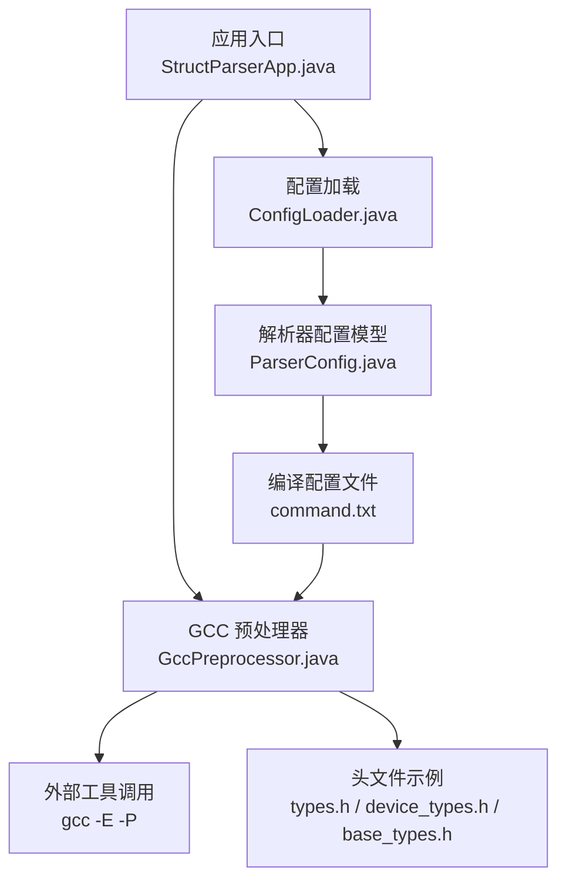
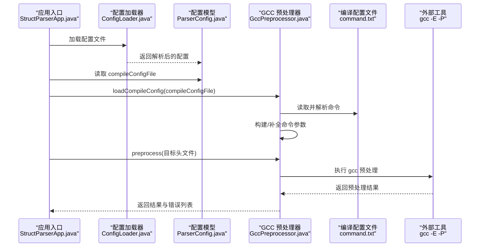
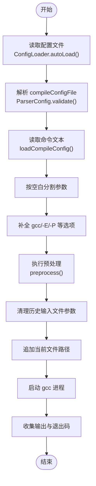
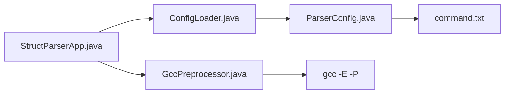

# 编译配置文件

<cite>
**本文档引用的文件**
- [command.txt](file://src/main/resources/include/command.txt)
- [GccPreprocessor.java](file://src/main/java/com/structparser/parser/GccPreprocessor.java)
- [ParserConfig.java](file://src/main/java/com/structparser/config/ParserConfig.java)
- [ConfigLoader.java](file://src/main/java/com/structparser/config/ConfigLoader.java)
- [struct-parser.yaml](file://struct-parser.yaml)
- [README.md](file://README.md)
- [GccPreprocessorTest.java](file://src/test/java/com/structparser/parser/GccPreprocessorTest.java)
- [StructParserApp.java](file://src/main/java/com/structparser/StructParserApp.java)
- [types.h](file://src/main/resources/include/types.h)
- [device_types.h](file://src/main/resources/include/device_types.h)
- [base_types.h](file://src/main/resources/include/base_types.h)
</cite>

## 目录
1. [简介](#简介)
2. [项目结构](#项目结构)
3. [核心组件](#核心组件)
4. [架构总览](#架构总览)
5. [详细组件分析](#详细组件分析)
6. [依赖关系分析](#依赖关系分析)
7. [性能考虑](#性能考虑)
8. [故障排除指南](#故障排除指南)
9. [结论](#结论)
10. [附录](#附录)

## 简介
本文件面向编译配置文件（compileConfigFile）与 command.txt 的使用与维护，重点解释以下内容：
- compileConfigFile 的作用机制与文件格式要求
- command.txt 的语法规范（GCC 命令行选项、宏定义、头文件包含路径等）
- 变量替换与路径解析规则
- 典型编译场景的完整配置示例
- 最佳实践与性能优化建议

## 项目结构
与编译配置相关的核心文件分布如下：
- 配置文件：struct-parser.yaml（应用配置）、src/main/resources/include/command.txt（编译命令配置）
- 核心实现：GccPreprocessor.java（GCC 预处理执行与命令构建）、ParserConfig.java（配置模型）、ConfigLoader.java（配置加载）
- 示例头文件：types.h、device_types.h、base_types.h（演示多文件包含与依赖）

图表来源
- [StructParserApp.java:63-92](file://src/main/java/com/structparser/StructParserApp.java#L63-L92)
- [ConfigLoader.java:23-40](file://src/main/java/com/structparser/config/ConfigLoader.java#L23-L40)
- [ParserConfig.java:11-18](file://src/main/java/com/structparser/config/ParserConfig.java#L11-L18)
- [GccPreprocessor.java:28-42](file://src/main/java/com/structparser/parser/GccPreprocessor.java#L28-L42)
- [command.txt:1-2](file://src/main/resources/include/command.txt#L1-L2)

章节来源
- [struct-parser.yaml:1-17](file://struct-parser.yaml#L1-L17)
- [README.md:120-180](file://README.md#L120-L180)

## 核心组件
- 编译配置文件（compileConfigFile）
  - 由应用配置文件 struct-parser.yaml 指定，指向一个包含 GCC 预处理命令的文本文件（如 command.txt）。
  - 该文件必须包含有效的 gcc 命令，并至少启用预处理与去注释选项。
- GccPreprocessor
  - 负责从编译配置文件加载命令、构建预处理参数、执行 gcc 并收集结果。
  - 对命令进行最小化增强：确保存在 gcc、-E、-P 等必要选项。
- ParserConfig 与 ConfigLoader
  - ParserConfig 定义 compileConfigFile 字段及输出配置；ConfigLoader 支持 YAML/JSON 自动加载与校验。

章节来源
- [ParserConfig.java:11-42](file://src/main/java/com/structparser/config/ParserConfig.java#L11-L42)
- [ConfigLoader.java:23-40](file://src/main/java/com/structparser/config/ConfigLoader.java#L23-L40)
- [GccPreprocessor.java:28-80](file://src/main/java/com/structparser/parser/GccPreprocessor.java#L28-L80)

## 架构总览
编译配置在运行时的处理流程如下：

图表来源
- [StructParserApp.java:70-92](file://src/main/java/com/structparser/StructParserApp.java#L70-L92)
- [ConfigLoader.java:23-40](file://src/main/java/com/structparser/config/ConfigLoader.java#L23-L40)
- [ParserConfig.java:33-42](file://src/main/java/com/structparser/config/ParserConfig.java#L33-L42)
- [GccPreprocessor.java:28-80](file://src/main/java/com/structparser/parser/GccPreprocessor.java#L28-L80)
- [GccPreprocessor.java:85-158](file://src/main/java/com/structparser/parser/GccPreprocessor.java#L85-L158)

## 详细组件分析

### 编译配置文件（compileConfigFile）的作用机制
- 文件定位与加载
  - 应用通过 ConfigLoader 自动查找 struct-parser.yaml/yml/json，并读取其中的 compileConfigFile 字段。
  - ParserConfig.validate() 会校验 compileConfigFile 是否非空且对应文件存在。
- 命令解析与增强
  - GccPreprocessor.loadCompileConfig() 读取配置文件内容，按空白分割为命令片段。
  - 若未显式包含 gcc、-E、-P，则自动插入这些必要选项。
- 预处理执行
  - preprocess() 在每次调用时复制命令，移除可能存在的独立 .c/.h/.cpp 输入参数（保留 -include/-imacros 后的文件名），追加当前目标文件路径后执行 gcc。
  - 捕获输出与退出码，记录日志并返回结果对象。

图表来源
- [ConfigLoader.java:66-94](file://src/main/java/com/structparser/config/ConfigLoader.java#L66-L94)
- [ParserConfig.java:33-42](file://src/main/java/com/structparser/config/ParserConfig.java#L33-L42)
- [GccPreprocessor.java:28-80](file://src/main/java/com/structparser/parser/GccPreprocessor.java#L28-L80)
- [GccPreprocessor.java:85-158](file://src/main/java/com/structparser/parser/GccPreprocessor.java#L85-L158)

章节来源
- [ConfigLoader.java:23-40](file://src/main/java/com/structparser/config/ConfigLoader.java#L23-L40)
- [ParserConfig.java:33-42](file://src/main/java/com/structparser/config/ParserConfig.java#L33-L42)
- [GccPreprocessor.java:28-80](file://src/main/java/com/structparser/parser/GccPreprocessor.java#L28-L80)
- [GccPreprocessor.java:85-158](file://src/main/java/com/structparser/parser/GccPreprocessor.java#L85-L158)

### command.txt 文件语法规范
- 文件格式
  - 纯文本文件，包含一条 gcc 预处理命令。
  - 至少应包含 -E（预处理）与 -P（去除注释）选项。
- 支持的 GCC 选项（节选）
  - -Dmacro[=defn]：在命令行定义宏（可用于条件编译）。
  - -include file：在处理输入前包含指定文件（常用于注入外部宏定义）。
  - -imacros file：包含宏定义文件（不输出到预处理结果）。
  - -Idir：添加头文件搜索目录。
  - -nostdinc：禁止标准头文件目录。
- 命令解析规则
  - 采用简单空白分割策略，不处理引号内的空格。
  - 若未显式包含 gcc、-E、-P，将自动插入。
  - 预处理时会移除独立的 .c/.h/.cpp 参数（保留 -include/-imacros 后的文件名）。

章节来源
- [README.md:134-149](file://README.md#L134-L149)
- [README.md:181-221](file://README.md#L181-L221)
- [GccPreprocessor.java:47-80](file://src/main/java/com/structparser/parser/GccPreprocessor.java#L47-L80)
- [GccPreprocessor.java:96-112](file://src/main/java/com/structparser/parser/GccPreprocessor.java#L96-L112)

### 变量替换与路径解析规则
- 变量替换
  - 当前实现不支持在命令文本中进行变量替换（例如 $VAR 或 ${VAR}）。宏定义请通过 -D 或 -include/-imacros 方案提供。
- 路径解析
  - 目标文件路径在执行时以绝对路径形式追加到命令末尾，避免相对路径导致的包含解析问题。
  - 头文件搜索路径通过 -I 指定，建议使用相对工程根目录的路径，便于跨平台一致性。

章节来源
- [GccPreprocessor.java:111-112](file://src/main/java/com/structparser/parser/GccPreprocessor.java#L111-L112)
- [README.md:134-149](file://README.md#L134-L149)

### 完整编译配置示例
以下示例覆盖常见 C 语言编译场景，请根据实际工程调整路径与宏定义。

- 基础示例（仅包含当前目录）
  - 命令：gcc -E -P -I.
  - 适用：单文件或简单包含关系的头文件。
- 多包含路径
  - 命令：gcc -E -P -I./include -I./drivers -I./hal
  - 适用：多模块或多层级头文件组织。
- 禁止标准头文件
  - 命令：gcc -E -P -I. -nostdinc
  - 适用：严格控制包含范围，避免系统头文件干扰。
- 宏定义与外部宏文件
  - 命令：gcc -E -P -I. -DFEATURE_A -DENABLE_CACHE -include features.h -imacros base_macros.h
  - 适用：通过命令行与外部文件组合定义宏，满足不同构建变体。
- 与应用配置结合
  - struct-parser.yaml 中的 compileConfigFile 指向上述 command.txt 文件。

章节来源
- [README.md:150-180](file://README.md#L150-L180)
- [README.md:181-221](file://README.md#L181-L221)
- [struct-parser.yaml:7-7](file://struct-parser.yaml#L7-L7)
- [command.txt:1-1](file://src/main/resources/include/command.txt#L1-L1)

### 头文件包含与多文件场景
- 示例头文件展示了跨文件引用与嵌套结构：
  - base_types.h 定义基础类型（struct Status、union ConfigValue、struct Version）。
  - device_types.h 通过 #include 引用 base_types.h，并定义更复杂的结构体。
  - types.h 展示了多层嵌套与匿名类型。
- 预处理流程
  - GccPreprocessor 会基于 command.txt 中的 -I 与 -include/-imacros 解析包含链。
  - 测试用例验证了嵌套包含、条件编译与宏展开的行为。

章节来源
- [base_types.h:1-28](file://src/main/resources/include/base_types.h#L1-L28)
- [device_types.h:1-50](file://src/main/resources/include/device_types.h#L1-L50)
- [types.h:1-99](file://src/main/resources/include/types.h#L1-L99)
- [GccPreprocessorTest.java:186-260](file://src/test/java/com/structparser/parser/GccPreprocessorTest.java#L186-L260)

## 依赖关系分析
- 组件耦合
  - StructParserApp 依赖 ConfigLoader 与 ParserConfig 完成配置加载与校验。
  - GccPreprocessor 依赖 compileConfigFile 提供的命令文本，并通过 ProcessBuilder 调用 gcc。
- 外部依赖
  - 必须安装并可在 PATH 中找到 gcc，否则应用无法运行。
- 潜在问题
  - 命令文本中包含独立的 .c/.h/.cpp 参数会被移除，避免重复输入导致的包含冲突。
  - 不支持在命令文本中进行变量替换，宏定义需通过 -D 或 -include/-imacros 提供。

图表来源
- [StructParserApp.java:70-92](file://src/main/java/com/structparser/StructParserApp.java#L70-L92)
- [ConfigLoader.java:23-40](file://src/main/java/com/structparser/config/ConfigLoader.java#L23-L40)
- [ParserConfig.java:33-42](file://src/main/java/com/structparser/config/ParserConfig.java#L33-L42)
- [GccPreprocessor.java:85-158](file://src/main/java/com/structparser/parser/GccPreprocessor.java#L85-L158)

章节来源
- [StructParserApp.java:63-92](file://src/main/java/com/structparser/StructParserApp.java#L63-L92)
- [GccPreprocessor.java:85-158](file://src/main/java/com/structparser/parser/GccPreprocessor.java#L85-L158)

## 性能考虑
- 减少包含深度与广度
  - 合理规划 -I 路径，避免不必要的全局包含，降低 gcc 预处理开销。
- 控制宏数量
  - 通过 -D 与 -include/-imacros 精准提供所需宏，避免大量冗余宏导致的展开成本。
- 使用 -imacros 注入宏定义
  - 对仅需宏定义、不希望出现在输出中的文件，使用 -imacros 可减少输出体积与后续解析负担。
- 避免重复输入文件
  - 预处理阶段会移除独立的 .c/.h/.cpp 参数，保持命令简洁，避免误传输入文件导致的额外 IO。

## 故障排除指南
- GCC 不可用
  - 现象：应用启动时报错提示 GCC 不可用。
  - 处理：安装 GCC 并确保其在 PATH 中可被发现。
- 编译配置文件不存在或路径错误
  - 现象：ParserConfig.validate() 抛出异常，提示 compileConfigFile 为空或文件不存在。
  - 处理：确认 struct-parser.yaml 中的 compileConfigFile 指向正确路径，并确保文件存在。
- 预处理失败（退出码非 0）
  - 现象：GccPreprocessor 返回错误列表与非零退出码。
  - 排查：检查 command.txt 中的 -I 路径、-include/-imacros 文件是否存在；确认宏定义是否正确传递。
- 缺失包含文件
  - 现象：预处理阶段报告找不到指定头文件。
  - 处理：确保 -I 指向的目录包含所需头文件，或使用 -include 引入外部宏文件。
- 日志定位
  - 应用日志与预处理内容分别写入 logs/struct-parser.log 与 logs/preprocessed.log，便于调试。

章节来源
- [StructParserApp.java:63-92](file://src/main/java/com/structparser/StructParserApp.java#L63-L92)
- [ParserConfig.java:33-42](file://src/main/java/com/structparser/config/ParserConfig.java#L33-L42)
- [GccPreprocessor.java:128-158](file://src/main/java/com/structparser/parser/GccPreprocessor.java#L128-L158)
- [README.md:469-485](file://README.md#L469-L485)

## 结论
- compileConfigFile 指向的 command.txt 是 GCC 预处理的唯一来源，必须包含 gcc、-E、-P 等必要选项。
- 命令解析采用简单空白分割，不支持变量替换；宏定义与包含路径通过 -D、-include、-imacros、-I 等选项提供。
- 通过合理的 -I 路径与宏定义策略，可高效支持多模块、多变体的头文件解析场景。
- 建议在 CI/CD 中固定 gcc 版本与包含路径，确保跨环境一致性。

## 附录
- 关键实现参考路径
  - 配置加载与校验：[ConfigLoader.java:23-40](file://src/main/java/com/structparser/config/ConfigLoader.java#L23-L40)，[ParserConfig.java:33-42](file://src/main/java/com/structparser/config/ParserConfig.java#L33-L42)
  - 命令解析与预处理：[GccPreprocessor.java:28-80](file://src/main/java/com/structparser/parser/GccPreprocessor.java#L28-L80)，[GccPreprocessor.java:85-158](file://src/main/java/com/structparser/parser/GccPreprocessor.java#L85-L158)
  - 应用入口与错误提示：[StructParserApp.java:63-92](file://src/main/java/com/structparser/StructParserApp.java#L63-L92)
- 示例与测试参考路径
  - 基础命令示例：[command.txt:1-1](file://src/main/resources/include/command.txt#L1-L1)
  - 多文件包含测试：[GccPreprocessorTest.java:186-260](file://src/test/java/com/structparser/parser/GccPreprocessorTest.java#L186-L260)
  - 头文件示例：[base_types.h:1-28](file://src/main/resources/include/base_types.h#L1-L28)，[device_types.h:1-50](file://src/main/resources/include/device_types.h#L1-L50)，[types.h:1-99](file://src/main/resources/include/types.h#L1-L99)