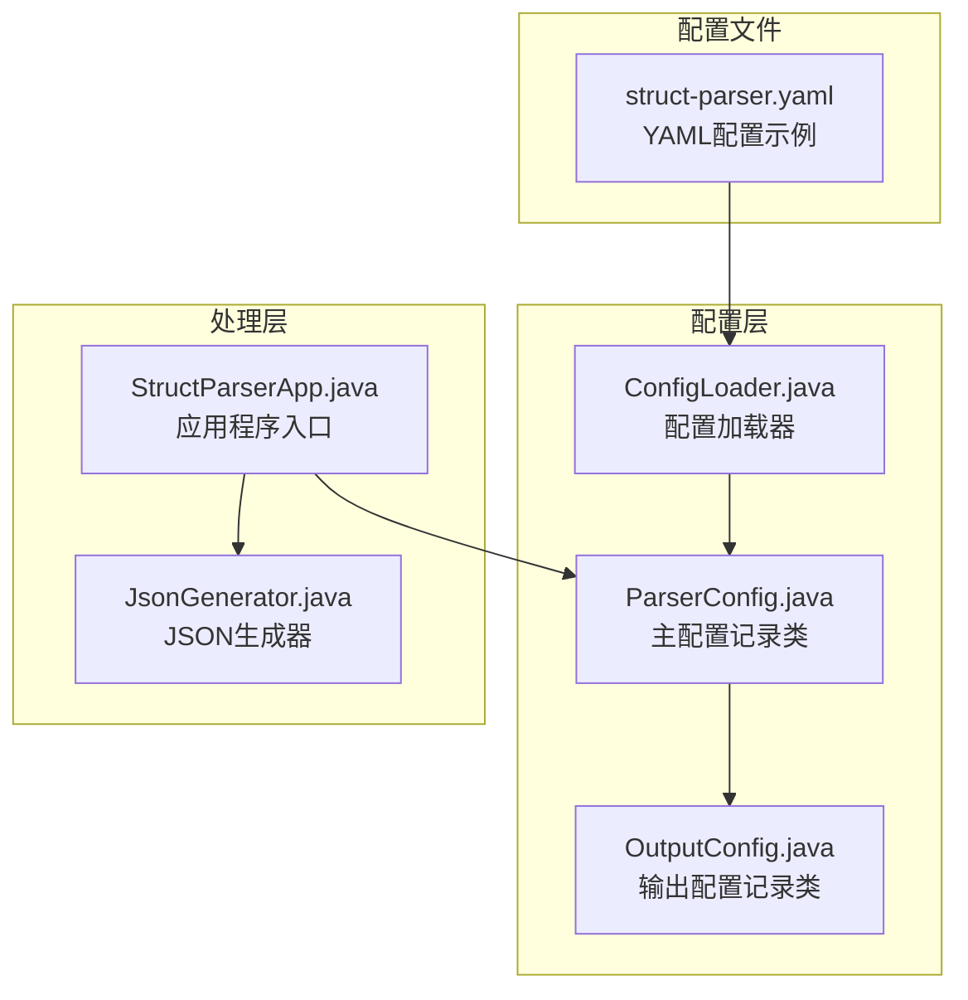
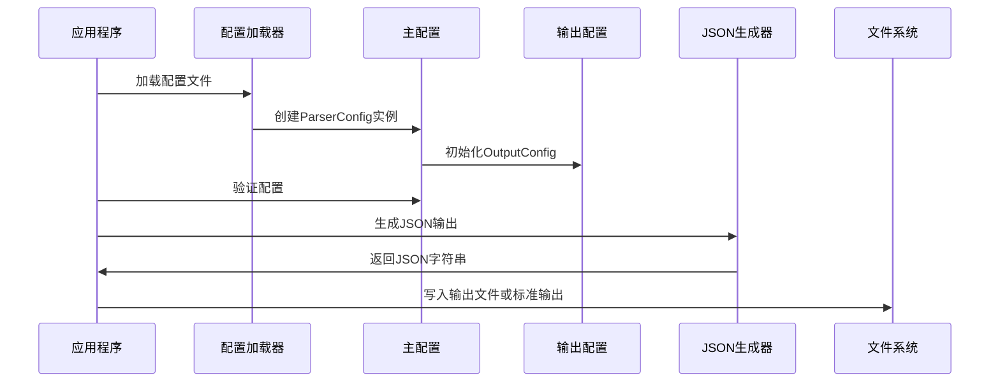
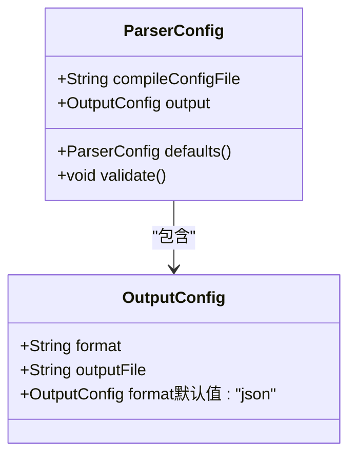
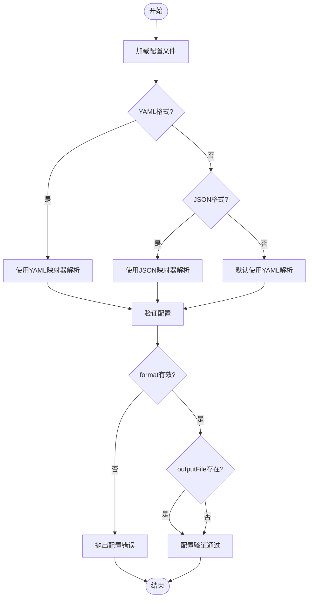
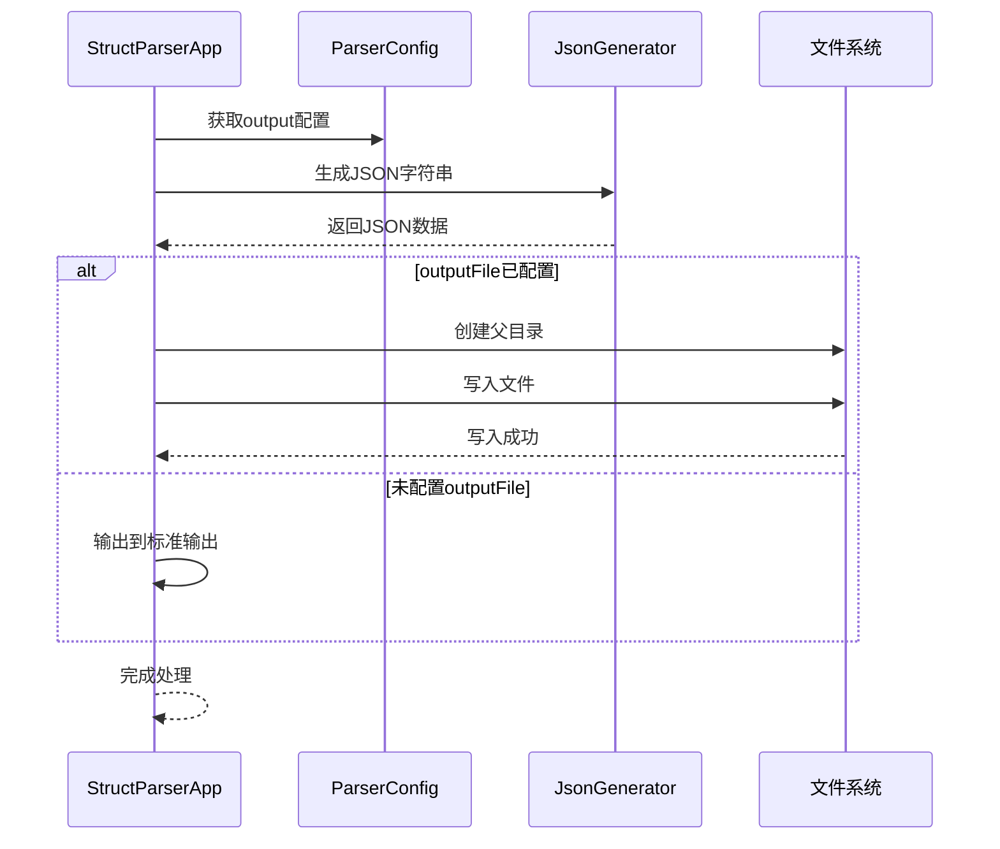
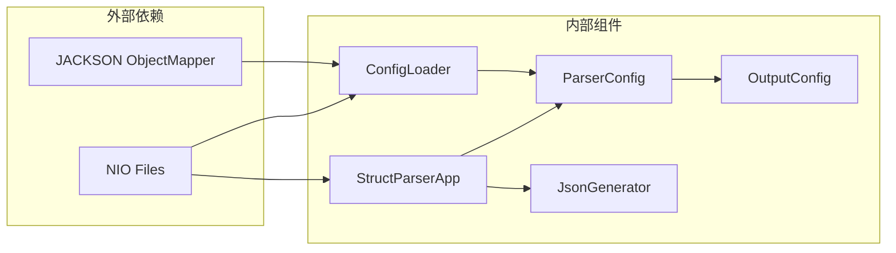
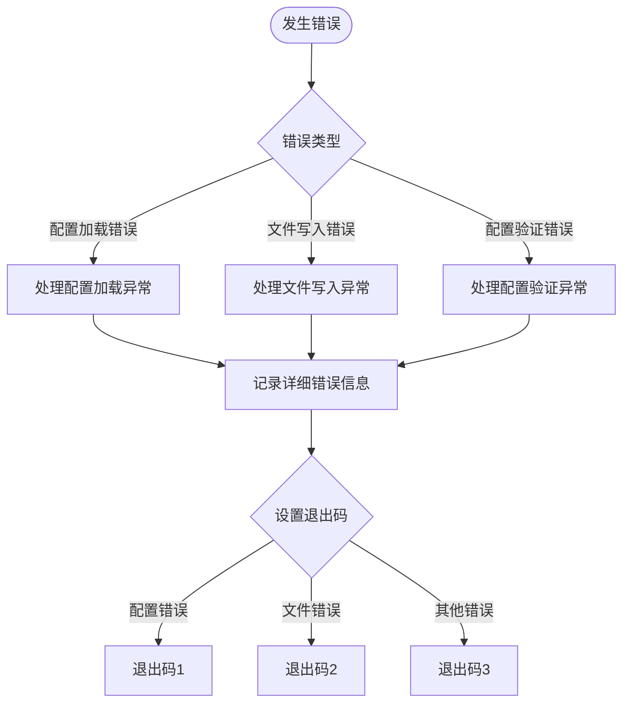

# 输出配置

<cite>
**本文档引用的文件**
- [ParserConfig.java](file://src/main/java/com/structparser/config/ParserConfig.java)
- [ConfigLoader.java](file://src/main/java/com/structparser/config/ConfigLoader.java)
- [JsonGenerator.java](file://src/main/java/com/structparser/generator/JsonGenerator.java)
- [StructParserApp.java](file://src/main/java/com/structparser/StructParserApp.java)
- [struct-parser.yaml](file://struct-parser.yaml)
- [ConfigLoaderTest.java](file://src/test/java/com/structparser/config/ConfigLoaderTest.java)
</cite>

## 目录
1. [简介](#简介)
2. [项目结构](#项目结构)
3. [核心组件](#核心组件)
4. [架构概览](#架构概览)
5. [详细组件分析](#详细组件分析)
6. [依赖关系分析](#依赖关系分析)
7. [性能考虑](#性能考虑)
8. [故障排除指南](#故障排除指南)
9. [结论](#结论)

## 简介
本文档详细说明了结构解析器的输出配置系统，重点介绍 OutputConfig 记录类的结构、配置选项以及相关的验证机制。输出配置决定了解析结果的格式和输出位置，当前版本仅支持 JSON 格式输出，并提供了灵活的文件路径配置选项。

## 项目结构
输出配置系统涉及以下关键文件和组件：

**图表来源**
- [ParserConfig.java:11-51](file://src/main/java/com/structparser/config/ParserConfig.java#L11-L51)
- [ConfigLoader.java:15-109](file://src/main/java/com/structparser/config/ConfigLoader.java#L15-L109)
- [JsonGenerator.java:14-260](file://src/main/java/com/structparser/generator/JsonGenerator.java#L14-L260)

**章节来源**
- [ParserConfig.java:1-53](file://src/main/java/com/structparser/config/ParserConfig.java#L1-L53)
- [ConfigLoader.java:1-110](file://src/main/java/com/structparser/config/ConfigLoader.java#L1-L110)

## 核心组件
输出配置系统的核心由三个主要组件构成：

### OutputConfig 记录类
OutputConfig 是一个不可变的数据类，包含两个关键字段：
- **format**: 输出格式标识符，默认值为 "json"
- **outputFile**: 输出文件路径，可选参数

### ParserConfig 主配置类
ParserConfig 包含 OutputConfig 的实例，并提供默认值设置和验证逻辑。

### ConfigLoader 配置加载器
负责从多种格式的配置文件中加载配置数据，支持 YAML、YML 和 JSON 格式。

**章节来源**
- [ParserConfig.java:47-51](file://src/main/java/com/structparser/config/ParserConfig.java#L47-L51)
- [ParserConfig.java:11-18](file://src/main/java/com/structparser/config/ParserConfig.java#L11-L18)

## 架构概览
输出配置系统的整体架构如下：

**图表来源**
- [StructParserApp.java:61-209](file://src/main/java/com/structparser/StructParserApp.java#L61-L209)
- [ConfigLoader.java:23-40](file://src/main/java/com/structparser/config/ConfigLoader.java#L23-L40)

## 详细组件分析

### OutputConfig 记录类分析
OutputConfig 采用 Java 16+ 的记录类语法，提供简洁的不可变数据封装：

**图表来源**
- [ParserConfig.java:11-18](file://src/main/java/com/structparser/config/ParserConfig.java#L11-L18)
- [ParserConfig.java:47-51](file://src/main/java/com/structparser/config/ParserConfig.java#L47-L51)

#### 字段详细说明

**format 字段**
- **类型**: String
- **默认值**: "json"
- **有效值**: 当前版本仅支持 "json"
- **作用**: 指定输出数据的格式

**outputFile 字段**
- **类型**: String
- **默认值**: null（表示输出到标准输出）
- **作用**: 指定输出文件的完整路径
- **行为**: 当提供路径时，程序会自动创建必要的目录结构

**章节来源**
- [ParserConfig.java:47-51](file://src/main/java/com/structparser/config/ParserConfig.java#L47-L51)

### 配置加载与验证流程

**图表来源**
- [ConfigLoader.java:23-40](file://src/main/java/com/structparser/config/ConfigLoader.java#L23-L40)
- [ParserConfig.java:33-42](file://src/main/java/com/structparser/config/ParserConfig.java#L33-L42)

**章节来源**
- [ConfigLoader.java:23-40](file://src/main/java/com/structparser/config/ConfigLoader.java#L23-L40)
- [ParserConfig.java:33-42](file://src/main/java/com/structparser/config/ParserConfig.java#L33-L42)

### 输出处理流程

**图表来源**
- [StructParserApp.java:193-209](file://src/main/java/com/structparser/StructParserApp.java#L193-L209)
- [JsonGenerator.java:21-29](file://src/main/java/com/structparser/generator/JsonGenerator.java#L21-L29)

**章节来源**
- [StructParserApp.java:193-209](file://src/main/java/com/structparser/StructParserApp.java#L193-L209)
- [JsonGenerator.java:21-29](file://src/main/java/com/structparser/generator/JsonGenerator.java#L21-L29)

## 依赖关系分析

**图表来源**
- [ConfigLoader.java:3-18](file://src/main/java/com/structparser/config/ConfigLoader.java#L3-L18)
- [StructParserApp.java:15-21](file://src/main/java/com/structparser/StructParserApp.java#L15-L21)

### 组件耦合度分析
- **低耦合**: OutputConfig 作为纯数据类，与其他组件解耦
- **单向依赖**: ConfigLoader -> ParserConfig -> OutputConfig
- **功能分离**: 配置加载、验证、输出处理职责清晰分离

**章节来源**
- [ConfigLoader.java:3-18](file://src/main/java/com/structparser/config/ConfigLoader.java#L3-L18)
- [ParserConfig.java:11-18](file://src/main/java/com/structparser/config/ParserConfig.java#L11-L18)

## 性能考虑
输出配置系统在性能方面的特点：

### 内存使用
- OutputConfig 为不可变记录类，内存占用极小
- JSON 生成器使用流式写入，避免大对象内存峰值

### I/O 性能
- 文件写入采用异步方式，减少阻塞时间
- 目录创建操作仅在必要时执行

### 扩展性考虑
- 当前仅支持 JSON 格式，未来可扩展其他格式
- 配置加载器支持多种文件格式，便于迁移

## 故障排除指南

### 常见配置错误及解决方案

**配置文件格式错误**
- **症状**: 配置文件无法解析
- **原因**: YAML/JSON 格式不正确
- **解决**: 使用配置加载器提供的验证方法检查格式

**输出路径权限问题**
- **症状**: 写入文件失败
- **原因**: 目标目录无写权限或路径不存在
- **解决**: 确保目标目录存在且具有写权限

**格式验证失败**
- **症状**: 运行时抛出配置验证异常
- **原因**: format 字段值不在允许范围内
- **解决**: 确保 format 字段值为 "json"

### 错误处理策略

**图表来源**
- [StructParserApp.java:95-102](file://src/main/java/com/structparser/StructParserApp.java#L95-L102)
- [ConfigLoaderTest.java:128-154](file://src/test/java/com/structparser/config/ConfigLoaderTest.java#L128-L154)

**章节来源**
- [StructParserApp.java:95-102](file://src/main/java/com/structparser/StructParserApp.java#L95-L102)
- [ConfigLoaderTest.java:128-154](file://src/test/java/com/structparser/config/ConfigLoaderTest.java#L128-L154)

## 结论
输出配置系统设计简洁高效，采用不可变记录类确保线程安全，提供清晰的配置验证机制。当前版本专注于 JSON 格式的稳定实现，同时为未来的格式扩展预留了良好的架构基础。通过合理的错误处理和日志记录，系统能够提供可靠的输出配置管理能力。