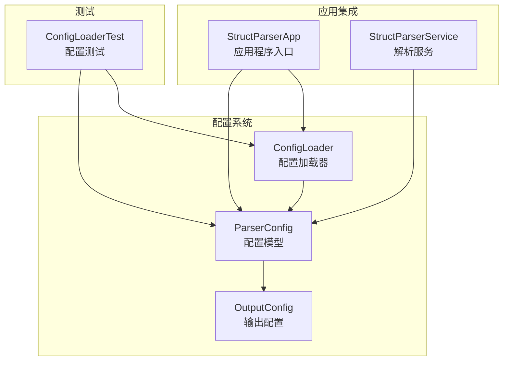
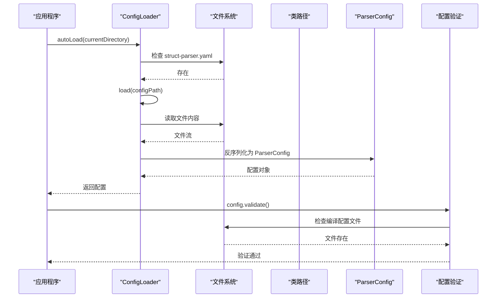
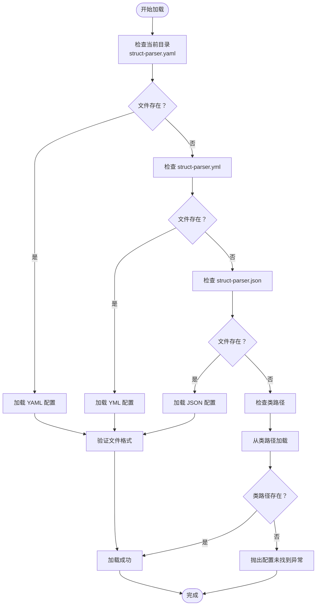
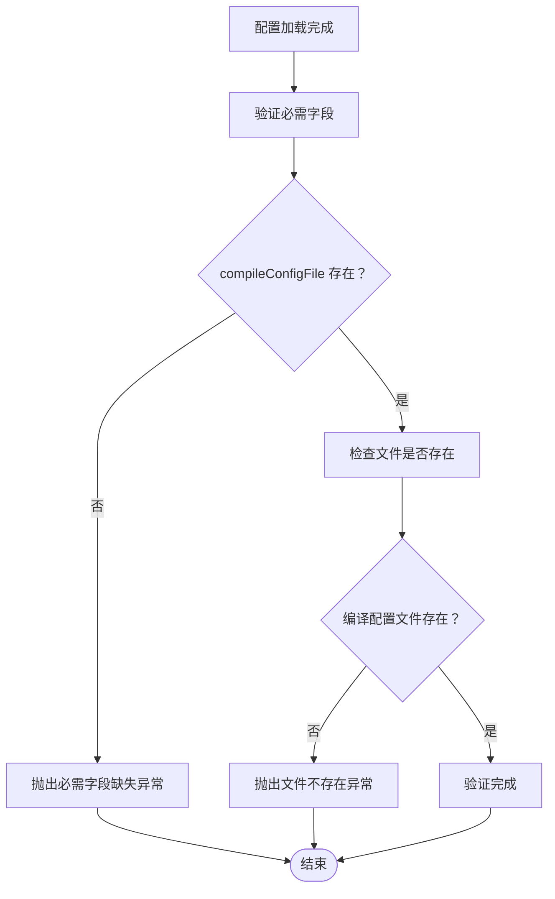
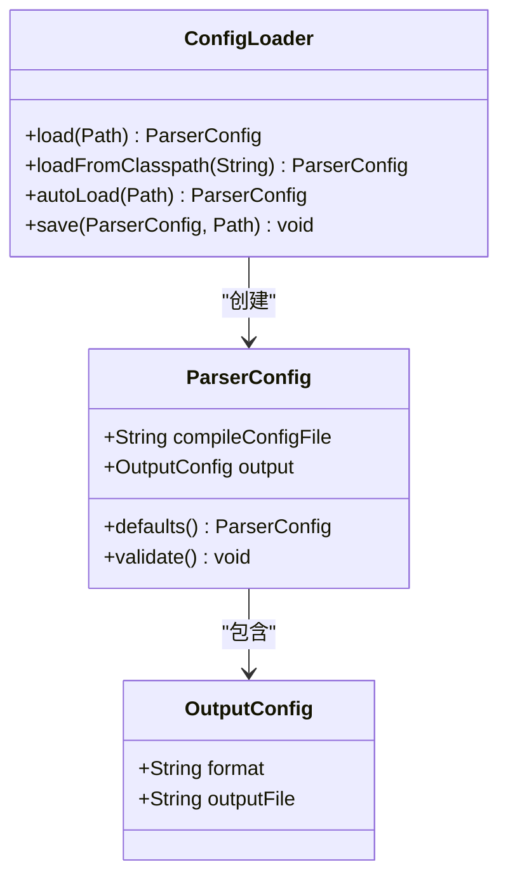
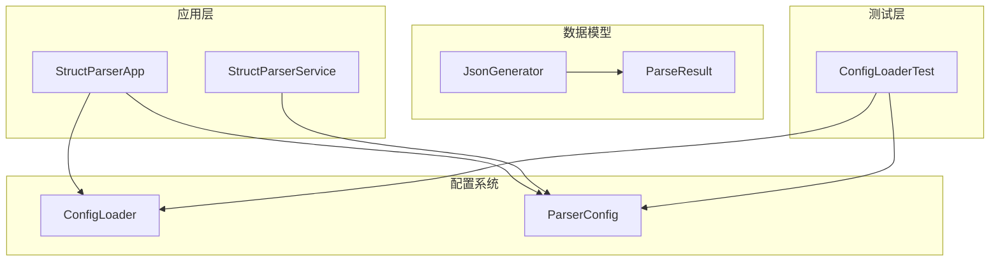

# 配置加载与验证

<cite>
**本文档引用的文件**
- [ConfigLoader.java](file://src/main/java/com/structparser/config/ConfigLoader.java)
- [ParserConfig.java](file://src/main/java/com/structparser/config/ParserConfig.java)
- [ConfigLoaderTest.java](file://src/test/java/com/structparser/config/ConfigLoaderTest.java)
- [struct-parser.yaml](file://struct-parser.yaml)
- [StructParserApp.java](file://src/main/java/com/structparser/StructParserApp.java)
- [StructParserService.java](file://src/main/java/com/structparser/parser/StructParserService.java)
- [ParseResult.java](file://src/main/java/com/structparser/model/ParseResult.java)
- [JsonGenerator.java](file://src/main/java/com/structparser/generator/JsonGenerator.java)
</cite>

## 目录
1. [简介](#简介)
2. [项目结构](#项目结构)
3. [核心组件](#核心组件)
4. [架构概览](#架构概览)
5. [详细组件分析](#详细组件分析)
6. [依赖分析](#依赖分析)
7. [性能考虑](#性能考虑)
8. [故障排除指南](#故障排除指南)
9. [结论](#结论)

## 简介

本项目实现了完整的配置加载与验证机制，支持多种配置格式（YAML、JSON），提供自动配置发现功能，并包含完善的错误处理和调试支持。配置系统采用分层设计，从底层的配置文件加载到高层的配置验证，确保了系统的可靠性和易用性。

## 项目结构

配置系统位于 `src/main/java/com/structparser/config/` 目录下，主要包含两个核心类：

**图表来源**
- [ConfigLoader.java:1-110](file://src/main/java/com/structparser/config/ConfigLoader.java#L1-L110)
- [ParserConfig.java:1-53](file://src/main/java/com/structparser/config/ParserConfig.java#L1-L53)
- [StructParserApp.java:1-286](file://src/main/java/com/structparser/StructParserApp.java#L1-L286)

**章节来源**
- [ConfigLoader.java:1-110](file://src/main/java/com/structparser/config/ConfigLoader.java#L1-L110)
- [ParserConfig.java:1-53](file://src/main/java/com/structparser/config/ParserConfig.java#L1-L53)

## 核心组件

### ConfigLoader - 配置加载器

ConfigLoader 是配置系统的核心组件，负责从不同来源加载配置文件并进行格式解析。

#### 主要功能特性：
- **多格式支持**：支持 YAML (.yaml, .yml) 和 JSON 格式
- **多源加载**：支持文件系统和类路径加载
- **自动发现**：自动查找配置文件，按优先级顺序尝试
- **智能格式识别**：根据文件扩展名自动选择解析器

#### 关键方法：
- `load(Path)` - 从文件系统加载配置
- `loadFromClasspath(String)` - 从类路径加载配置
- `autoLoad(Path)` - 自动查找并加载配置
- `save(ParserConfig, Path)` - 保存配置到文件

**章节来源**
- [ConfigLoader.java:15-110](file://src/main/java/com/structparser/config/ConfigLoader.java#L15-L110)

### ParserConfig - 配置模型

ParserConfig 是配置的数据模型，使用 Java Record 特性实现不可变配置对象。

#### 核心属性：
- `compileConfigFile`：编译配置文件路径（必需）
- `output`：输出配置对象（可选，默认 JSON 格式）

#### 默认值处理：
- 输出格式默认为 "json"
- 输出文件路径可为空，表示输出到标准输出

**章节来源**
- [ParserConfig.java:11-53](file://src/main/java/com/structparser/config/ParserConfig.java#L11-L53)

## 架构概览

配置系统采用分层架构设计，从底层的文件操作到高层的应用集成：

**图表来源**
- [StructParserApp.java:70-102](file://src/main/java/com/structparser/StructParserApp.java#L70-L102)
- [ConfigLoader.java:66-94](file://src/main/java/com/structparser/config/ConfigLoader.java#L66-L94)
- [ParserConfig.java:33-42](file://src/main/java/com/structparser/config/ParserConfig.java#L33-L42)

## 详细组件分析

### 配置加载流程

配置加载过程遵循严格的优先级顺序：

**图表来源**
- [ConfigLoader.java:66-94](file://src/main/java/com/structparser/config/ConfigLoader.java#L66-L94)

#### 加载优先级规则：
1. **文件系统优先**：优先检查当前目录下的配置文件
2. **格式优先级**：YAML > YML > JSON
3. **回退机制**：如果文件系统找不到，尝试类路径加载
4. **错误传播**：任何步骤失败都会抛出相应异常

### 配置验证机制

配置验证分为多个阶段，确保配置的有效性和完整性：

**图表来源**
- [ParserConfig.java:33-42](file://src/main/java/com/structparser/config/ParserConfig.java#L33-L42)

#### 验证阶段详解：

1. **必需字段检查**：
   - 检查 `compileConfigFile` 是否非空
   - 确保配置文件的基本完整性

2. **文件存在性验证**：
   - 验证编译配置文件的实际存在性
   - 防止指向不存在的文件

3. **格式正确性检查**：
   - YAML/JSON 格式的语法验证
   - 数据类型的正确性检查

**章节来源**
- [ParserConfig.java:33-42](file://src/main/java/com/structparser/config/ParserConfig.java#L33-L42)
- [ConfigLoaderTest.java:125-154](file://src/test/java/com/structparser/config/ConfigLoaderTest.java#L125-L154)

### 配置缓存机制

当前实现中，配置系统采用一次性加载模式，没有实现专门的缓存机制。每次运行时都会重新加载配置文件。

#### 性能考虑：
- **内存占用**：配置对象为不可变记录类，内存开销较小
- **I/O 次数**：每次启动只进行一次文件读取
- **缓存机会**：可以在应用级别实现配置缓存以提升性能

### 配置继承与覆盖规则

配置系统支持部分字段的默认值处理：

**图表来源**
- [ParserConfig.java:11-53](file://src/main/java/com/structparser/config/ParserConfig.java#L11-L53)
- [ConfigLoader.java:15-110](file://src/main/java/com/structparser/config/ConfigLoader.java#L15-L110)

#### 覆盖规则：
- **字段级别覆盖**：配置文件中的值会覆盖默认值
- **对象级别覆盖**：如果输出配置为空，则使用默认配置
- **格式继承**：支持多种配置格式的统一处理

**章节来源**
- [ParserConfig.java:16-18](file://src/main/java/com/structparser/config/ParserConfig.java#L16-L18)
- [ConfigLoaderTest.java:95-106](file://src/test/java/com/structparser/config/ConfigLoaderTest.java#L95-L106)

## 依赖分析

配置系统与其他模块的依赖关系：

**图表来源**
- [StructParserApp.java:3-11](file://src/main/java/com/structparser/StructParserApp.java#L3-L11)
- [StructParserService.java:1-19](file://src/main/java/com/structparser/parser/StructParserService.java#L1-L19)

**章节来源**
- [StructParserApp.java:3-11](file://src/main/java/com/structparser/StructParserApp.java#L3-L11)
- [StructParserService.java:1-19](file://src/main/java/com/structparser/parser/StructParserService.java#L1-L19)

## 性能考虑

### 当前性能特征：
- **加载时间**：配置文件通常很小，加载时间可忽略不计
- **内存使用**：配置对象为轻量级数据结构
- **I/O 操作**：单次文件读取，无重复访问

### 优化建议：
1. **配置缓存**：在应用级别实现配置缓存，避免重复加载
2. **异步加载**：对于大型配置文件，可以考虑异步加载
3. **增量验证**：实现配置变更检测，只验证修改的部分

## 故障排除指南

### 常见错误类型及解决方案：

#### 1. 配置文件未找到
**错误信息**：`No configuration file found. Expected one of: struct-parser.yaml, struct-parser.yml, struct-parser.json in directory: <path>`
**解决方法**：
- 确认配置文件存在于当前目录
- 检查文件权限和路径正确性
- 验证文件扩展名是否正确

#### 2. 编译配置文件缺失
**错误信息**：`compileConfigFile must be specified in configuration`
**解决方法**：
- 在配置文件中添加 `compileConfigFile` 字段
- 确保字段值不为空

#### 3. 编译配置文件不存在
**错误信息**：`Compile config file does not exist: <path>`
**解决方法**：
- 检查编译配置文件的实际路径
- 验证文件是否被正确放置

#### 4. 配置格式错误
**错误信息**：反序列化异常或格式解析错误
**解决方法**：
- 验证 YAML/JSON 格式的正确性
- 使用在线验证工具检查配置文件
- 参考示例配置文件格式

### 调试方法：

1. **启用详细日志**：在应用程序中启用 DEBUG 级别日志
2. **配置文件验证**：使用 `ConfigLoaderTest` 中的测试用例验证配置格式
3. **逐步排查**：从最简单的配置开始，逐步添加复杂配置项

**章节来源**
- [ConfigLoaderTest.java:247-283](file://src/test/java/com/structparser/config/ConfigLoaderTest.java#L247-L283)
- [StructParserApp.java:75-102](file://src/main/java/com/structparser/StructParserApp.java#L75-L102)

## 结论

本配置加载与验证机制实现了以下关键特性：

1. **多格式支持**：同时支持 YAML 和 JSON 格式，满足不同用户需求
2. **智能发现**：自动查找配置文件，简化用户操作
3. **完整验证**：多层次的配置验证确保系统稳定性
4. **错误处理**：清晰的错误信息和完善的异常处理机制
5. **易于扩展**：模块化设计便于功能扩展和维护

配置系统的设计充分考虑了实用性、可靠性和可维护性，在保证功能完整性的同时，提供了良好的用户体验和开发体验。