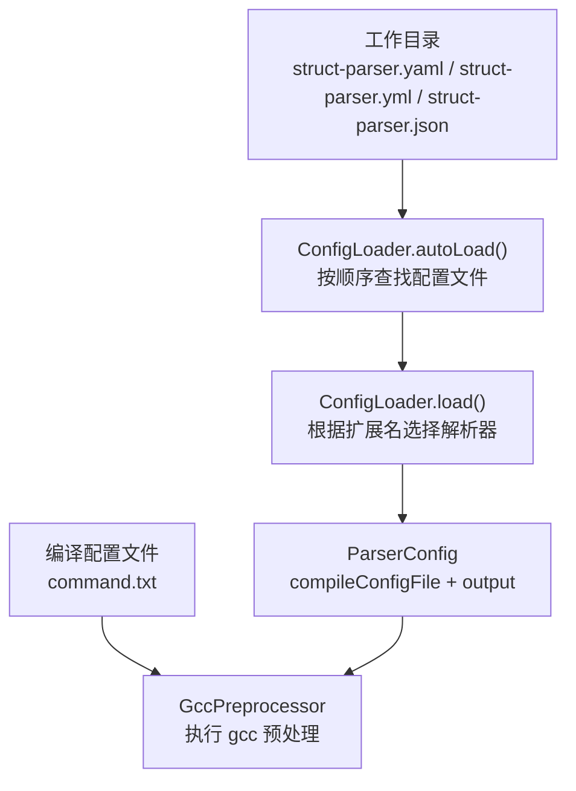
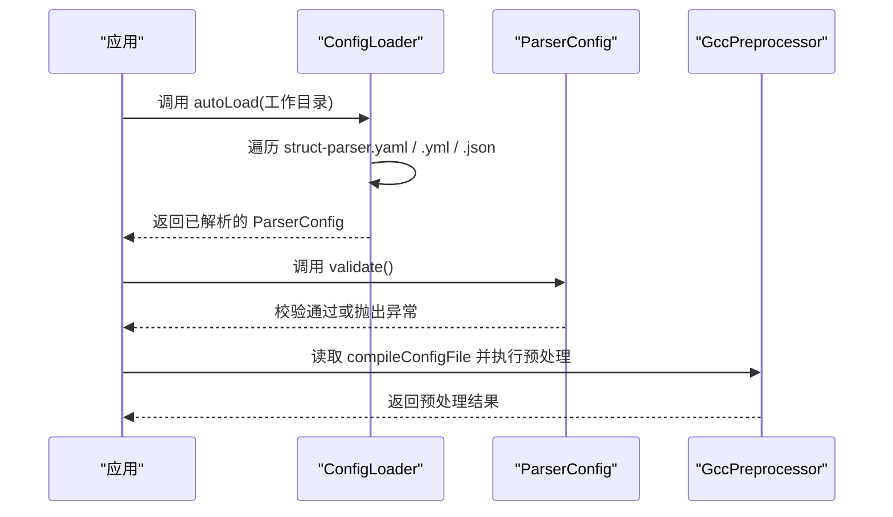
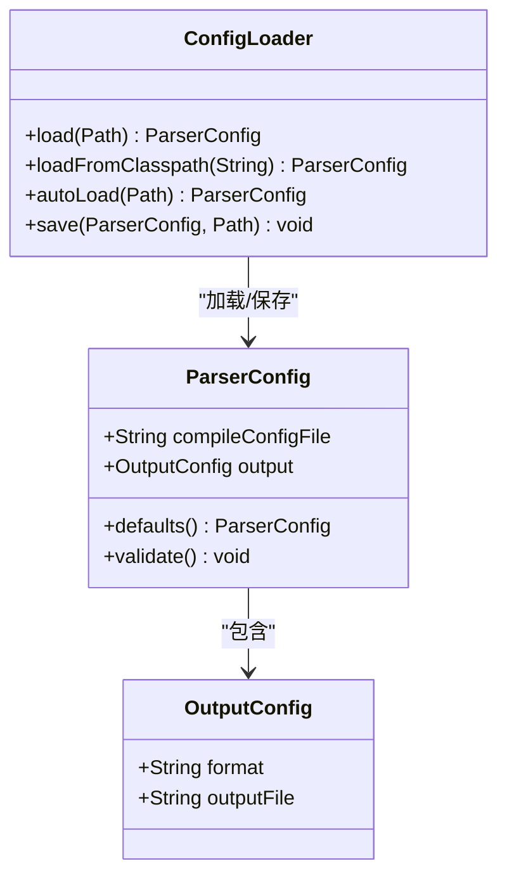

# 配置文件格式

<cite>
**本文引用的文件**
- [ConfigLoader.java](file://src/main/java/com/structparser/config/ConfigLoader.java)
- [ParserConfig.java](file://src/main/java/com/structparser/config/ParserConfig.java)
- [struct-parser.yaml](file://struct-parser.yaml)
- [README.md](file://README.md)
- [WIKI.md](file://doc/WIKI.md)
- [ConfigLoaderTest.java](file://src/test/java/com/structparser/config/ConfigLoaderTest.java)
- [command.txt](file://src/main/resources/include/command.txt)
</cite>

## 目录
1. [简介](#简介)
2. [项目结构](#项目结构)
3. [核心组件](#核心组件)
4. [架构总览](#架构总览)
5. [详细组件分析](#详细组件分析)
6. [依赖分析](#依赖分析)
7. [性能考虑](#性能考虑)
8. [故障排查指南](#故障排查指南)
9. [结论](#结论)
10. [附录](#附录)

## 简介
本文件面向使用者与维护者，系统化阐述配置文件格式与加载机制，重点覆盖以下方面：
- YAML 与 JSON 两种配置文件格式的完整语法与字段说明
- compileConfigFile 与 output 配置块的字段数据类型、默认值与取值范围
- 配置文件的加载优先级与覆盖规则
- 配置文件验证规则与常见格式错误的解决方案
- 完整的配置示例，覆盖不同场景

## 项目结构
与配置文件相关的核心代码与示例分布如下：
- 配置模型与加载器：src/main/java/com/structparser/config/ParserConfig.java、ConfigLoader.java
- 示例配置文件：struct-parser.yaml
- 编译配置文件示例：src/main/resources/include/command.txt
- 文档与示例：README.md、doc/WIKI.md
- 配置加载与验证的单元测试：src/test/java/com/structparser/config/ConfigLoaderTest.java

图表来源
- [ConfigLoader.java:66-94](file://src/main/java/com/structparser/config/ConfigLoader.java#L66-L94)
- [ConfigLoader.java:23-40](file://src/main/java/com/structparser/config/ConfigLoader.java#L23-L40)
- [ParserConfig.java:11-51](file://src/main/java/com/structparser/config/ParserConfig.java#L11-L51)

章节来源
- [ConfigLoader.java:15-110](file://src/main/java/com/structparser/config/ConfigLoader.java#L15-L110)
- [ParserConfig.java:8-53](file://src/main/java/com/structparser/config/ParserConfig.java#L8-L53)
- [struct-parser.yaml:1-17](file://struct-parser.yaml#L1-L17)
- [README.md:120-180](file://README.md#L120-L180)
- [WIKI.md:291-324](file://doc/WIKI.md#L291-L324)

## 核心组件
- 配置模型 ParserConfig：包含 compileConfigFile 与 output 两个字段；output 为嵌套的 OutputConfig 记录类。
- 配置加载器 ConfigLoader：负责从文件或类路径加载 YAML/JSON 配置，并提供自动查找与保存功能。
- 编译配置文件：一个纯文本文件，包含一条 gcc 预处理命令，用于后续的预处理阶段。

章节来源
- [ParserConfig.java:11-51](file://src/main/java/com/structparser/config/ParserConfig.java#L11-L51)
- [ConfigLoader.java:15-110](file://src/main/java/com/structparser/config/ConfigLoader.java#L15-L110)
- [command.txt:1-2](file://src/main/resources/include/command.txt#L1-L2)

## 架构总览
配置文件在运行时的加载与验证流程如下：

图表来源
- [ConfigLoader.java:66-94](file://src/main/java/com/structparser/config/ConfigLoader.java#L66-L94)
- [ParserConfig.java:33-42](file://src/main/java/com/structparser/config/ParserConfig.java#L33-L42)

## 详细组件分析

### 配置模型与字段定义
- compileConfigFile
  - 类型：字符串
  - 必填：是
  - 描述：指向编译配置文件的路径（相对或绝对均可）
  - 默认值：无
  - 取值范围：可访问的文件路径
  - 验证规则：必须存在且可读
- output
  - 类型：嵌套记录类 OutputConfig
  - 必填：否（若省略则使用默认值）
  - 默认值：format="json"，outputFile=null（表示输出到标准输出）
  - 子字段：
    - format：字符串，当前仅支持 "json"
    - outputFile：字符串，可选；若未设置则输出到标准输出

章节来源
- [ParserConfig.java:11-51](file://src/main/java/com/structparser/config/ParserConfig.java#L11-L51)
- [ParserConfig.java:33-42](file://src/main/java/com/structparser/config/ParserConfig.java#L33-L42)

### 配置文件格式与示例

#### YAML 格式
- 文件名：struct-parser.yaml 或 struct-parser.yml
- 示例（来自仓库示例）：
  - compileConfigFile: 指向编译配置文件路径
  - output:
    - format: json
    - outputFile: 输出文件路径（可选）

章节来源
- [struct-parser.yaml:1-17](file://struct-parser.yaml#L1-L17)
- [README.md:150-163](file://README.md#L150-L163)
- [WIKI.md:291-324](file://doc/WIKI.md#L291-L324)

#### JSON 格式
- 文件名：struct-parser.json
- 示例（来自仓库示例）：
  - compileConfigFile: 字符串，指向编译配置文件路径
  - output: 对象，包含 format 与 outputFile

章节来源
- [README.md:165-174](file://README.md#L165-L174)
- [WIKI.md:291-324](file://doc/WIKI.md#L291-L324)

#### 编译配置文件（command.txt）
- 类型：纯文本文件
- 内容：一条 gcc 预处理命令，例如 gcc -E -P -I. -nostdinc
- 支持的选项（来自文档）：
  - -Dmacro[=defn]：在命令行定义宏
  - -include file：在处理输入文件前先包含指定文件
  - -imacros file：包含宏定义文件（宏定义不会出现在预处理输出中）
  - -Idir：添加头文件搜索目录
- 注意：仅支持直接命令文件格式，不支持 JSON Compilation Database 或 Makefile

章节来源
- [README.md:134-149](file://README.md#L134-L149)
- [WIKI.md:301-314](file://doc/WIKI.md#L301-L314)
- [command.txt:1-2](file://src/main/resources/include/command.txt#L1-L2)

### 加载优先级与覆盖规则
- 自动加载顺序（ConfigLoader.autoLoad）：
  1) struct-parser.yaml
  2) struct-parser.yml
  3) struct-parser.json
- 若上述文件均不存在，则尝试从类路径加载同名资源
- 扩展名决定解析器选择：
  - .yaml/.yml：使用 YAML 解析器
  - .json：使用 JSON 解析器
  - 其他扩展名：默认按 YAML 解析
- 覆盖规则：
  - 以最后加载到的配置为准；若同一配置项在多个文件中出现，以最终生效的文件为准
  - 若仅部分字段存在，未显式提供的字段采用默认值

章节来源
- [ConfigLoader.java:66-94](file://src/main/java/com/structparser/config/ConfigLoader.java#L66-L94)
- [ConfigLoader.java:23-40](file://src/main/java/com/structparser/config/ConfigLoader.java#L23-L40)
- [ParserConfig.java:16-18](file://src/main/java/com/structparser/config/ParserConfig.java#L16-L18)

### 配置验证规则
- compileConfigFile 必须存在且可读
- 若未提供 output，将使用默认值：format="json"，outputFile=null
- 若未提供 compileConfigFile，将抛出异常

章节来源
- [ParserConfig.java:33-42](file://src/main/java/com/structparser/config/ParserConfig.java#L33-L42)
- [ConfigLoaderTest.java:108-154](file://src/test/java/com/structparser/config/ConfigLoaderTest.java#L108-L154)

### 配置保存与生成
- 支持将当前配置保存为 YAML 或 JSON 文件
- 扩展名决定保存格式：.yaml/.yml 保存为 YAML，其他扩展名保存为 JSON

章节来源
- [ConfigLoader.java:99-108](file://src/main/java/com/structparser/config/ConfigLoader.java#L99-L108)

## 依赖分析
- ConfigLoader 依赖 Jackson 的 YAML 与 JSON ObjectMapper 实现
- ParserConfig 为不可变记录类，内部对 output 字段提供默认值
- 编译配置文件由 GccPreprocessor 读取并执行

图表来源
- [ParserConfig.java:11-51](file://src/main/java/com/structparser/config/ParserConfig.java#L11-L51)
- [ConfigLoader.java:15-110](file://src/main/java/com/structparser/config/ConfigLoader.java#L15-L110)

章节来源
- [ParserConfig.java:11-51](file://src/main/java/com/structparser/config/ParserConfig.java#L11-L51)
- [ConfigLoader.java:15-110](file://src/main/java/com/structparser/config/ConfigLoader.java#L15-L110)

## 性能考虑
- 配置文件体积小，解析开销极低
- 自动加载按固定顺序查找，建议在工作目录放置所需格式的配置文件以减少 IO 搜索
- 输出到标准输出可避免磁盘写入，适合流水线场景

## 故障排查指南
- 配置文件未找到
  - 现象：抛出“未找到配置文件”异常
  - 排查：确认工作目录下存在 struct-parser.yaml/yml/json，或类路径下有对应资源
- 编译配置文件不存在或不可读
  - 现象：校验阶段抛出“编译配置文件不存在”异常
  - 排查：检查 compileConfigFile 指向的路径是否存在且可读
- YAML/JSON 格式错误
  - 现象：解析阶段抛出异常
  - 排查：使用在线 YAML/JSON 校验工具检查语法；参考仓库示例格式
- 输出文件路径无效
  - 现象：保存配置时报错
  - 排查：确认目标目录存在且具备写权限；扩展名决定保存格式

章节来源
- [ConfigLoaderTest.java:197-207](file://src/test/java/com/structparser/config/ConfigLoaderTest.java#L197-L207)
- [ConfigLoaderTest.java:247-283](file://src/test/java/com/structparser/config/ConfigLoaderTest.java#L247-L283)
- [ParserConfig.java:33-42](file://src/main/java/com/structparser/config/ParserConfig.java#L33-L42)

## 结论
本项目通过简洁的配置模型与严格的加载/验证流程，提供了稳定可靠的配置体验。YAML/JSON 双格式支持与自动加载机制降低了使用门槛；编译配置文件的直接命令格式保证了与 GCC 的无缝集成。遵循本文档的字段定义、默认值与验证规则，可有效避免常见错误并提升开发效率。

## 附录

### 字段与默认值一览
- compileConfigFile
  - 类型：字符串
  - 必填：是
  - 默认值：无
  - 取值范围：可访问的文件路径
- output.format
  - 类型：字符串
  - 必填：否
  - 默认值："json"
  - 取值范围："json"
- output.outputFile
  - 类型：字符串
  - 必填：否
  - 默认值：null（表示输出到标准输出）
  - 取值范围：可写的文件路径

章节来源
- [ParserConfig.java:11-51](file://src/main/java/com/structparser/config/ParserConfig.java#L11-L51)
- [ParserConfig.java:33-42](file://src/main/java/com/structparser/config/ParserConfig.java#L33-L42)

### 完整配置示例（路径引用）
- YAML 基础示例：[struct-parser.yaml:1-17](file://struct-parser.yaml#L1-L17)
- YAML 带输出文件示例：[README.md 示例:157-163](file://README.md#L157-L163)
- JSON 完整示例：[README.md 示例:165-174](file://README.md#L165-L174)
- 编译配置文件示例：[command.txt:1-2](file://src/main/resources/include/command.txt#L1-L2)