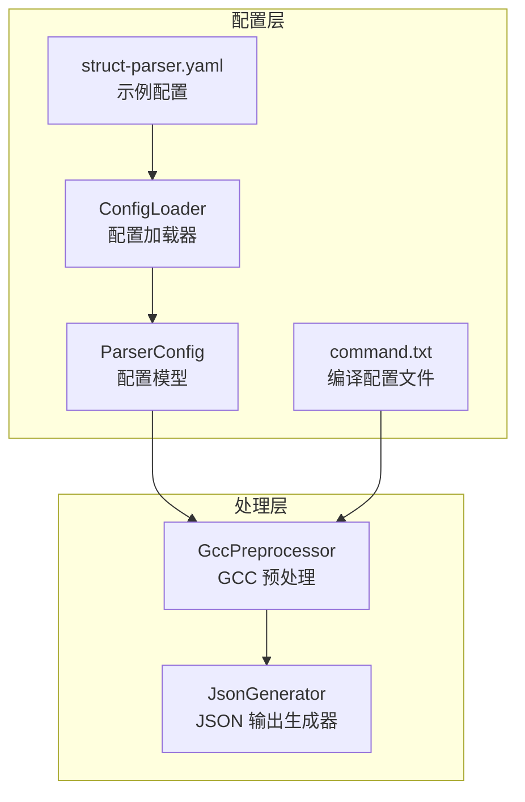
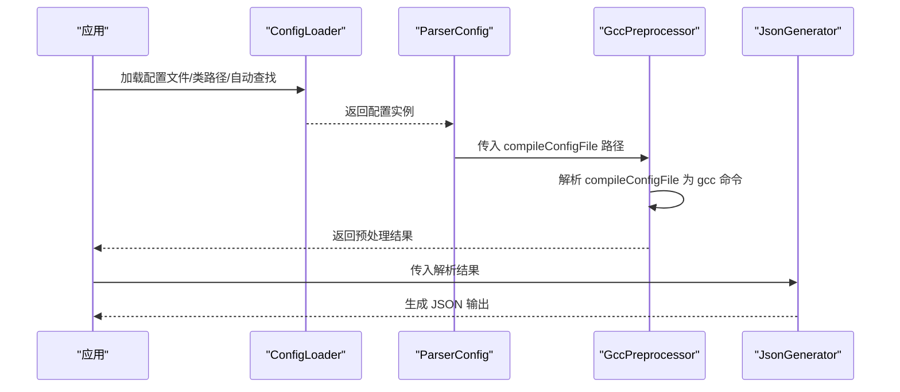
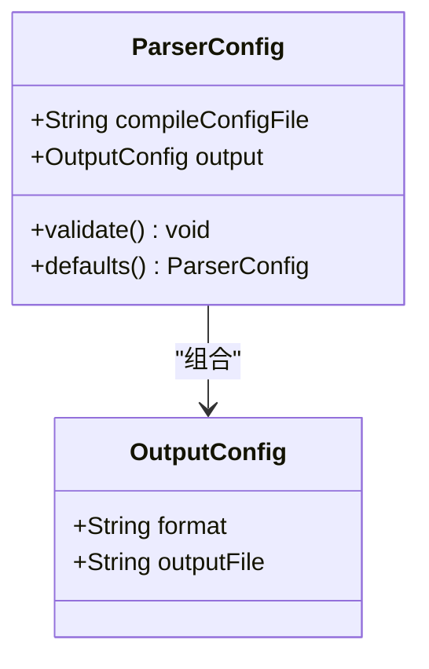
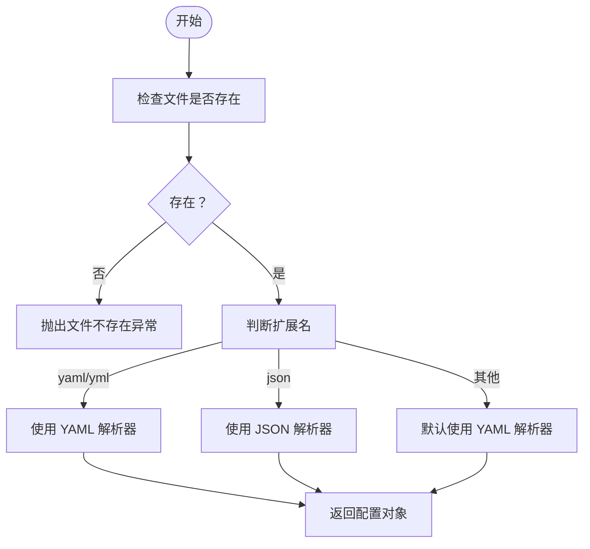
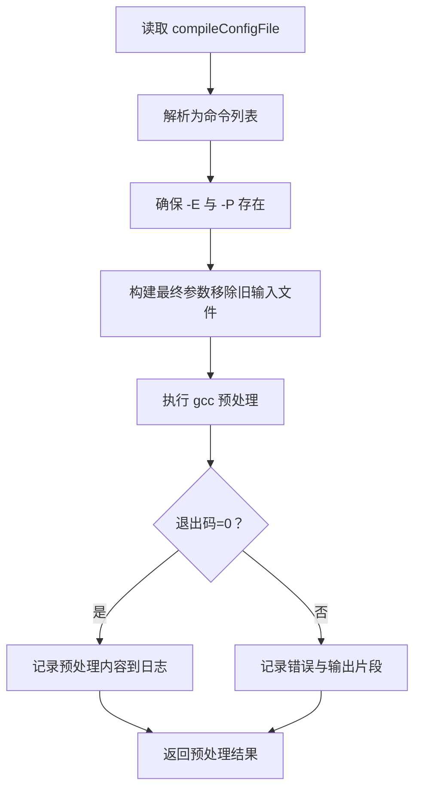

# 配置管理

<cite>
**本文引用的文件**
- [ConfigLoader.java](file://src/main/java/com/structparser/config/ConfigLoader.java)
- [ParserConfig.java](file://src/main/java/com/structparser/config/ParserConfig.java)
- [struct-parser.yaml](file://struct-parser.yaml)
- [README.md](file://README.md)
- [WIKI.md](file://doc/WIKI.md)
- [ConfigLoaderTest.java](file://src/test/java/com/structparser/config/ConfigLoaderTest.java)
- [command.txt](file://src/main/resources/include/command.txt)
- [JsonGenerator.java](file://src/main/java/com/structparser/generator/JsonGenerator.java)
- [GccPreprocessor.java](file://src/main/java/com/structparser/parser/GccPreprocessor.java)
</cite>

## 目录
1. [简介](#简介)
2. [项目结构](#项目结构)
3. [核心组件](#核心组件)
4. [架构总览](#架构总览)
5. [详细组件分析](#详细组件分析)
6. [依赖分析](#依赖分析)
7. [性能考虑](#性能考虑)
8. [故障排查指南](#故障排查指南)
9. [结论](#结论)
10. [附录](#附录)

## 简介
本文件面向配置管理系统，系统性阐述配置文件格式（YAML/JSON）、配置项语义与作用机制、compileConfigFile 的格式要求、GCC 命令行选项支持、输出格式配置、配置加载流程、验证机制与错误处理，并提供完整配置示例与最佳实践建议。同时给出版本兼容性与迁移指南，帮助用户在不同版本间平滑升级。

## 项目结构
配置管理相关的核心文件分布如下：
- 配置模型与加载器：ParserConfig、ConfigLoader
- 示例配置：struct-parser.yaml
- 编译配置文件：command.txt
- 输出生成器：JsonGenerator（负责 JSON 输出）
- 预处理器：GccPreprocessor（负责解析 compileConfigFile 并调用 gcc）

图表来源
- [ConfigLoader.java:15-109](file://src/main/java/com/structparser/config/ConfigLoader.java#L15-L109)
- [ParserConfig.java:11-52](file://src/main/java/com/structparser/config/ParserConfig.java#L11-L52)
- [struct-parser.yaml:1-17](file://struct-parser.yaml#L1-L17)
- [command.txt:1-2](file://src/main/resources/include/command.txt#L1-L2)
- [GccPreprocessor.java:28-80](file://src/main/java/com/structparser/parser/GccPreprocessor.java#L28-L80)
- [JsonGenerator.java:21-76](file://src/main/java/com/structparser/generator/JsonGenerator.java#L21-L76)

章节来源
- [ConfigLoader.java:15-109](file://src/main/java/com/structparser/config/ConfigLoader.java#L15-L109)
- [ParserConfig.java:11-52](file://src/main/java/com/structparser/config/ParserConfig.java#L11-L52)
- [struct-parser.yaml:1-17](file://struct-parser.yaml#L1-L17)
- [command.txt:1-2](file://src/main/resources/include/command.txt#L1-L2)
- [README.md:120-174](file://README.md#L120-L174)
- [WIKI.md:291-324](file://doc/WIKI.md#L291-L324)

## 核心组件
- 配置模型 ParserConfig
  - compileConfigFile：必需，指向编译配置文件路径（包含 gcc 预处理命令）
  - output：可选，包含 format 与 outputFile
    - format：输出格式，默认 json（当前版本仅支持 json）
    - outputFile：输出文件路径；若未指定则输出到标准输出
- 配置加载器 ConfigLoader
  - 支持从文件或类路径加载 YAML/JSON
  - 自动查找顺序：struct-parser.yaml → struct-parser.yml → struct-parser.json
  - 保存配置到文件（用于生成示例配置）
- 编译配置文件（compileConfigFile）
  - 直接命令文件（类 C DSL），包含 gcc 预处理命令
  - 支持常用选项：-D、-include、-imacros、-I
  - 固定启用 -E（预处理）与 -P（去注释）
- 输出生成器 JsonGenerator
  - 生成 JSON 结构：包含 structs、unions、typedefs（如有）、errors（如有）

章节来源
- [ParserConfig.java:11-52](file://src/main/java/com/structparser/config/ParserConfig.java#L11-L52)
- [ConfigLoader.java:23-94](file://src/main/java/com/structparser/config/ConfigLoader.java#L23-L94)
- [GccPreprocessor.java:28-80](file://src/main/java/com/structparser/parser/GccPreprocessor.java#L28-L80)
- [JsonGenerator.java:21-76](file://src/main/java/com/structparser/generator/JsonGenerator.java#L21-L76)

## 架构总览
配置管理贯穿“配置加载 → 编译配置解析 → 预处理 → 解析 → 输出”的主流程。

图表来源
- [ConfigLoader.java:23-94](file://src/main/java/com/structparser/config/ConfigLoader.java#L23-L94)
- [ParserConfig.java:33-42](file://src/main/java/com/structparser/config/ParserConfig.java#L33-L42)
- [GccPreprocessor.java:85-158](file://src/main/java/com/structparser/parser/GccPreprocessor.java#L85-L158)
- [JsonGenerator.java:21-76](file://src/main/java/com/structparser/generator/JsonGenerator.java#L21-L76)

## 详细组件分析

### 配置模型 ParserConfig
- 字段与默认值
  - compileConfigFile：必需，未设置时 validate 抛出异常
  - output.format：默认 json
  - output.outputFile：可选，未设置时输出到标准输出
- 校验逻辑
  - compileConfigFile 必须存在且非空
  - 路径存在性校验
- 默认配置
  - defaults() 提供最小可用配置，便于测试与示例

图表来源
- [ParserConfig.java:11-52](file://src/main/java/com/structparser/config/ParserConfig.java#L11-L52)

章节来源
- [ParserConfig.java:11-52](file://src/main/java/com/structparser/config/ParserConfig.java#L11-L52)
- [ConfigLoaderTest.java:84-106](file://src/test/java/com/structparser/config/ConfigLoaderTest.java#L84-L106)

### 配置加载器 ConfigLoader
- 文件加载
  - 根据扩展名选择 YAML/JSON 解析器
  - 若未指定扩展名，默认按 YAML 处理
- 类路径加载
  - 从 classpath 加载资源，支持 .yaml/.yml/.json
- 自动查找
  - 优先级：struct-parser.yaml → struct-parser.yml → struct-parser.json
  - 若目录下均不存在，则尝试从类路径加载
  - 若仍失败，抛出明确的 IO 异常
- 保存配置
  - 根据扩展名选择 YAML/JSON 输出格式

图表来源
- [ConfigLoader.java:23-40](file://src/main/java/com/structparser/config/ConfigLoader.java#L23-L40)

章节来源
- [ConfigLoader.java:23-94](file://src/main/java/com/structparser/config/ConfigLoader.java#L23-L94)
- [ConfigLoaderTest.java:24-55](file://src/test/java/com/structparser/config/ConfigLoaderTest.java#L24-L55)
- [ConfigLoaderTest.java:158-207](file://src/test/java/com/structparser/config/ConfigLoaderTest.java#L158-L207)

### 编译配置文件（compileConfigFile）
- 格式要求
  - 直接命令文件（类 C DSL），包含 gcc 预处理命令
  - 固定启用 -E（预处理）与 -P（去注释）
- 支持的 GCC 选项
  - -Dmacro[=defn]：命令行定义宏
  - -include file：在处理输入前包含文件
  - -imacros file：包含宏定义文件（不输出到预处理结果）
  - -Idir：添加头文件搜索目录
- 预处理流程
  - 从 compileConfigFile 读取命令
  - 构造最终 gcc 命令（确保 -E/-P 存在）
  - 执行预处理，捕获输出与错误
  - 将预处理内容写入专用日志文件（用于调试）

图表来源
- [GccPreprocessor.java:28-80](file://src/main/java/com/structparser/parser/GccPreprocessor.java#L28-L80)
- [GccPreprocessor.java:85-158](file://src/main/java/com/structparser/parser/GccPreprocessor.java#L85-L158)

章节来源
- [GccPreprocessor.java:28-80](file://src/main/java/com/structparser/parser/GccPreprocessor.java#L28-L80)
- [GccPreprocessor.java:85-158](file://src/main/java/com/structparser/parser/GccPreprocessor.java#L85-L158)
- [README.md:134-149](file://README.md#L134-L149)
- [WIKI.md:301-313](file://doc/WIKI.md#L301-L313)

### 输出格式配置
- format
  - 仅支持 json（当前版本）
  - 默认值：json
- outputFile
  - 可选；未指定时输出到标准输出
- JSON 输出结构
  - structs：结构体数组
  - unions：联合体数组
  - typedefs：类型别名映射（如有）
  - errors：错误列表（如有）
- 字段规范
  - name：字段名
  - type：字段类型（如 uint1、uint16 等）
  - bits：字段位宽
  - offset：字段位偏移
  - 对于嵌套结构/联合体，包含 fields 子数组

章节来源
- [ParserConfig.java:47-51](file://src/main/java/com/structparser/config/ParserConfig.java#L47-L51)
- [JsonGenerator.java:21-76](file://src/main/java/com/structparser/generator/JsonGenerator.java#L21-L76)
- [README.md:120-133](file://README.md#L120-L133)
- [WIKI.md:173-290](file://doc/WIKI.md#L173-L290)

## 依赖分析
- 组件耦合
  - ConfigLoader 与 ParserConfig：加载器负责解析与构造配置对象
  - ParserConfig 与 GccPreprocessor：配置中的 compileConfigFile 由预处理器解析并执行
  - GccPreprocessor 与 JsonGenerator：预处理结果交由输出生成器生成 JSON
- 外部依赖
  - Jackson：YAML/JSON 解析与序列化
  - GCC：预处理执行环境
- 循环依赖
  - 无直接循环依赖，职责清晰分离

图表来源
- [ConfigLoader.java:17-18](file://src/main/java/com/structparser/config/ConfigLoader.java#L17-L18)
- [ParserConfig.java:12-13](file://src/main/java/com/structparser/config/ParserConfig.java#L12-L13)
- [GccPreprocessor.java:17-19](file://src/main/java/com/structparser/parser/GccPreprocessor.java#L17-L19)
- [JsonGenerator.java:14](file://src/main/java/com/structparser/generator/JsonGenerator.java#L14)

章节来源
- [ConfigLoader.java:17-18](file://src/main/java/com/structparser/config/ConfigLoader.java#L17-L18)
- [ParserConfig.java:12-13](file://src/main/java/com/structparser/config/ParserConfig.java#L12-L13)
- [GccPreprocessor.java:17-19](file://src/main/java/com/structparser/parser/GccPreprocessor.java#L17-L19)
- [JsonGenerator.java:14](file://src/main/java/com/structparser/generator/JsonGenerator.java#L14)

## 性能考虑
- 配置加载
  - YAML/JSON 解析采用 Jackson，I/O 为瓶颈；建议将配置文件放置在本地磁盘，避免网络挂载
- 预处理
  - gcc 预处理为外部进程调用，耗时取决于头文件数量与复杂度；合理组织 include 路径与宏定义可减少冗余
- 输出生成
  - JsonGenerator 使用流式写入，内存占用低；大体量结构体/联合体时建议将输出写入文件而非标准输出

[本节为通用性能建议，不直接分析具体文件，故无章节来源]

## 故障排查指南
- 配置文件找不到
  - 现象：自动查找失败，抛出“未找到配置文件”异常
  - 排查：确认工作目录存在 struct-parser.yaml/yml/json，或类路径下存在对应资源
- compileConfigFile 为空或不存在
  - 现象：validate 抛出异常，提示缺少或不存在编译配置文件
  - 排查：检查配置项是否正确填写，路径是否可访问
- YAML/JSON 解析失败
  - 现象：加载配置时报错
  - 排查：检查配置文件格式是否符合 YAML/JSON 规范
- GCC 预处理失败
  - 现象：预处理返回非零退出码，记录错误与输出片段
  - 排查：检查 compileConfigFile 中的 gcc 选项是否正确，包含文件路径是否有效
- 输出文件写入失败
  - 现象：保存 JSON 失败
  - 排查：确认目标目录存在且具备写权限

章节来源
- [ConfigLoaderTest.java:247-283](file://src/test/java/com/structparser/config/ConfigLoaderTest.java#L247-L283)
- [ConfigLoaderTest.java:125-154](file://src/test/java/com/structparser/config/ConfigLoaderTest.java#L125-L154)
- [GccPreprocessor.java:138-158](file://src/main/java/com/structparser/parser/GccPreprocessor.java#L138-L158)

## 结论
配置管理系统以 ParserConfig 为核心模型，结合 ConfigLoader 的多格式支持与自动查找机制，配合 compileConfigFile 的直接命令文件格式与 GCC 预处理能力，实现了灵活、可维护的配置驱动解析流程。当前版本仅支持 JSON 输出，未来版本计划扩展更多输出格式与功能。遵循本文提供的配置格式、最佳实践与故障排查方法，可高效稳定地完成结构体/联合体解析任务。

[本节为总结性内容，不直接分析具体文件，故无章节来源]

## 附录

### 配置选项与默认值
- compileConfigFile
  - 类型：字符串
  - 必填：是
  - 默认值：无
  - 作用：指向包含 gcc 预处理命令的文本文件
- output.format
  - 类型：字符串
  - 必填：否
  - 默认值：json
  - 作用：输出格式（当前仅支持 json）
- output.outputFile
  - 类型：字符串
  - 必填：否
  - 默认值：无（输出到标准输出）

章节来源
- [ParserConfig.java:11-52](file://src/main/java/com/structparser/config/ParserConfig.java#L11-L52)
- [README.md:126-133](file://README.md#L126-L133)
- [WIKI.md:315-324](file://doc/WIKI.md#L315-L324)

### compileConfigFile 格式与 GCC 选项
- 格式：直接命令文件（类 C DSL），包含 gcc 预处理命令
- 固定启用：-E（预处理）、-P（去注释）
- 支持选项：
  - -Dmacro[=defn]
  - -include file
  - -imacros file
  - -Idir
- 示例命令文件内容参考：
  - [command.txt:1-2](file://src/main/resources/include/command.txt#L1-L2)

章节来源
- [GccPreprocessor.java:28-80](file://src/main/java/com/structparser/parser/GccPreprocessor.java#L28-L80)
- [README.md:134-149](file://README.md#L134-L149)
- [WIKI.md:301-313](file://doc/WIKI.md#L301-L313)

### 输出格式与 JSON 结构
- 输出格式：json（当前版本）
- JSON 结构要点：
  - structs：结构体数组
  - unions：联合体数组
  - typedefs：类型别名映射（如有）
  - errors：错误列表（如有）
- 字段规范：
  - name、type、bits、offset
  - 嵌套结构/联合体包含 fields 子数组

章节来源
- [JsonGenerator.java:21-76](file://src/main/java/com/structparser/generator/JsonGenerator.java#L21-L76)
- [README.md:120-133](file://README.md#L120-L133)
- [WIKI.md:173-290](file://doc/WIKI.md#L173-L290)

### 配置加载流程与验证机制
- 加载流程
  - 自动查找：struct-parser.yaml → struct-parser.yml → struct-parser.json
  - 类路径回退：若目录不存在，尝试从 classpath 加载
  - 文件加载：根据扩展名选择 YAML/JSON 解析器
- 验证机制
  - compileConfigFile 必填且存在
  - 预处理阶段对命令有效性进行检查与错误记录

章节来源
- [ConfigLoader.java:66-94](file://src/main/java/com/structparser/config/ConfigLoader.java#L66-L94)
- [ParserConfig.java:33-42](file://src/main/java/com/structparser/config/ParserConfig.java#L33-L42)
- [GccPreprocessor.java:28-80](file://src/main/java/com/structparser/parser/GccPreprocessor.java#L28-L80)

### 错误处理与日志
- 配置加载错误
  - 文件不存在、解析失败、自动查找失败
- 预处理错误
  - 退出码非零、中断、输出片段记录
- 日志位置
  - logs/struct-parser.log：应用日志
  - logs/preprocessed.log：预处理内容（用于调试）

章节来源
- [ConfigLoaderTest.java:247-283](file://src/test/java/com/structparser/config/ConfigLoaderTest.java#L247-L283)
- [GccPreprocessor.java:138-158](file://src/main/java/com/structparser/parser/GccPreprocessor.java#L138-L158)
- [WIKI.md:419-431](file://doc/WIKI.md#L419-L431)

### 版本兼容性与迁移指南
- 版本演进
  - v1.0：MVP 版本，基础解析与 JSON 输出
  - v1.1：多文件解析、GCC 预处理、配置驱动（YAML/JSON）、跨文件引用
  - v1.2：交叉引用检测、多文件引用场景、预处理优化（去注释）
  - v1.3（规划）：语法容错、条件编译、日志系统、typedef 完善、数组类型、代码生成、位对齐选项
- 迁移建议
  - 从 v1.0/v1.1 升级至 v1.2：注意交叉引用限制，确保引用类型先定义
  - 从 v1.2 升级至 v1.3：关注新增特性（数组、typedef、代码生成）的使用方式变更
  - 配置文件保持 YAML/JSON 格式不变，但建议逐步迁移到更严格的验证与默认值策略

章节来源
- [WIKI.md:478-510](file://doc/WIKI.md#L478-L510)
- [README.md:486-496](file://README.md#L486-L496)

### 完整配置示例与最佳实践
- 示例配置
  - YAML：参见 [struct-parser.yaml:1-17](file://struct-parser.yaml#L1-L17)
  - JSON：参见 [README.md:165-174](file://README.md#L165-L174)
- 最佳实践
  - compileConfigFile 使用相对路径，便于跨平台移植
  - 合理组织 include 路径与宏定义，减少冗余头文件
  - 输出文件路径建议使用绝对路径或与工作目录无关的相对路径
  - 在 CI/CD 中固定 GCC 版本，确保预处理一致性

章节来源
- [struct-parser.yaml:1-17](file://struct-parser.yaml#L1-L17)
- [README.md:150-174](file://README.md#L150-L174)