# 项目概述

<cite>
**本文档引用的文件**
- [README.md](file://README.md)
- [pom.xml](file://pom.xml)
- [StructParser.g4](file://src/main/antlr4/com/structparser/StructParser.g4)
- [StructParserApp.java](file://src/main/java/com/structparser/StructParserApp.java)
- [StructParserService.java](file://src/main/java/com/structparser/parser/StructParserService.java)
- [GccPreprocessor.java](file://src/main/java/com/structparser/parser/GccPreprocessor.java)
- [ConfigLoader.java](file://src/main/java/com/structparser/config/ConfigLoader.java)
- [ParserConfig.java](file://src/main/java/com/structparser/config/ParserConfig.java)
- [JsonGenerator.java](file://src/main/java/com/structparser/generator/JsonGenerator.java)
- [Struct.java](file://src/main/java/com/structparser/model/Struct.java)
- [Union.java](file://src/main/java/com/structparser/model/Union.java)
- [logback.xml](file://src/main/resources/logback.xml)
- [WIKI.md](file://doc/WIKI.md)
- [struct-parser.yaml](file://struct-parser.yaml)
</cite>

## 目录
1. [简介](#简介)
2. [项目结构](#项目结构)
3. [核心组件](#核心组件)
4. [架构总览](#架构总览)
5. [详细组件分析](#详细组件分析)
6. [依赖关系分析](#依赖关系分析)
7. [性能考虑](#性能考虑)
8. [故障排除指南](#故障排除指南)
9. [结论](#结论)
10. [附录](#附录)

## 简介

Struct Parser 是一个专为嵌入式系统和硬件寄存器描述场景设计的 C 风格结构体/联合体解析工具。该项目的核心目标是提供可靠、高效的结构体和联合体解析能力，支持 GCC 预处理、条件编译、跨文件引用等高级特性，并生成精确的 JSON 输出以描述字段的位级布局。

### 主要特性

- **结构体/联合体解析**：完整支持 C 风格的 struct 和 union 定义
- **嵌套类型支持**：支持嵌套和匿名的结构体/联合体
- **自定义数据类型**：uint1~uint32 数据类型，隐式位宽定义
- **紧凑打包布局**：字段紧密排列，支持位级布局计算
- **GCC 预处理集成**：通过 `gcc -E -P` 提供完整的 C 预处理支持
- **条件编译支持**：支持 `#ifdef`、`#if`、`-D`、`-include`、`-imacros`
- **语法容错能力**：忽略未识别的 C 语法（函数、枚举等）
- **循环引用检测**：检测并拒绝自引用和交叉引用
- **配置驱动**：支持 YAML/JSON 配置进行批量解析
- **跨文件引用**：支持引用其他头文件中定义的类型
- **日志系统**：SLF4J + Logback，分离错误日志和预处理内容日志
- **JSON 输出**：生成包含字段偏移和大小的结构化 JSON

### 应用场景

Struct Parser 在以下场景中发挥重要作用：

- **嵌入式系统开发**：解析硬件寄存器描述、设备驱动头文件
- **硬件接口定义**：描述硬件寄存器布局和数据格式
- **协议解析**：解析网络协议或通信协议的数据包格式
- **代码生成**：为不同编程语言生成相应的数据结构定义
- **系统集成**：在大型项目中统一管理复杂的头文件结构

### 技术栈概览

- **Java 26**：现代 Java 开发环境，利用 Record 类、Switch 表达式、模式匹配等新特性
- **ANTLR4**：强大的语法解析器生成器，支持语法容错
- **Maven**：构建和依赖管理工具
- **JUnit 5**：单元测试框架，拥有 122+ 测试用例
- **Jackson**：JSON 和 YAML 处理库
- **SLF4J + Logback**：日志框架，支持文件输出
- **GCC**：C 预处理器，用于处理头文件预处理

### 用户群体分析

- **嵌入式开发者**：需要解析硬件寄存器和设备驱动头文件
- **系统架构师**：需要统一管理复杂的头文件结构
- **工具链开发者**：需要在构建流程中集成结构体解析
- **协议工程师**：需要描述和验证数据包格式
- **测试工程师**：需要验证硬件接口的正确性

## 项目结构

项目的整体架构采用分层设计，清晰地分离了配置、解析、生成等各个层次：

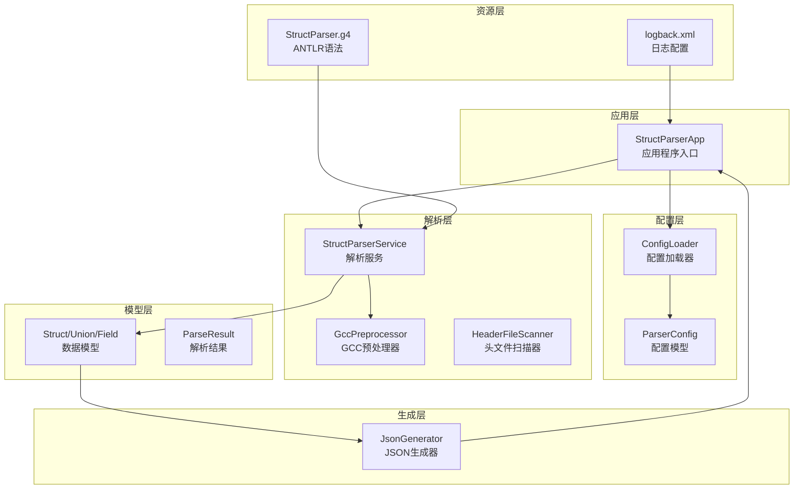

**图表来源**
- [StructParserApp.java:1-286](file://src/main/java/com/structparser/StructParserApp.java#L1-L286)
- [ConfigLoader.java:1-110](file://src/main/java/com/structparser/config/ConfigLoader.java#L1-L110)
- [StructParserService.java:1-185](file://src/main/java/com/structparser/parser/StructParserService.java#L1-L185)
- [GccPreprocessor.java:1-194](file://src/main/java/com/structparser/parser/GccPreprocessor.java#L1-L194)
- [JsonGenerator.java:1-260](file://src/main/java/com/structparser/generator/JsonGenerator.java#L1-L260)

**章节来源**
- [README.md:391-428](file://README.md#L391-L428)
- [pom.xml:1-140](file://pom.xml#L1-L140)

## 核心组件

### 应用程序入口点

`StructParserApp` 是整个系统的入口点，负责协调配置加载、文件扫描、解析执行和结果输出。它提供了简洁的命令行接口，支持无参数运行（使用配置文件）和特定命令（帮助信息、GCC 信息检查）。

### 配置管理系统

配置系统采用现代化的 Record 类设计，支持 YAML 和 JSON 格式配置文件。主要组件包括：

- **ConfigLoader**：智能配置加载器，支持多种配置文件格式和自动发现机制
- **ParserConfig**：配置模型，包含编译配置文件路径和输出配置
- **OutputConfig**：输出配置模型，支持格式和输出文件设置

### 解析服务层

`StructParserService` 是解析系统的核心，提供了灵活的解析接口：

- **GCC 预处理集成**：支持标准 C 预处理指令和宏定义
- **双遍扫描策略**：第一遍收集类型信息，第二遍解析字段并检测循环引用
- **语法容错**：忽略无法识别的 C 语法，专注于结构体和联合体解析
- **错误处理**：提供详细的错误信息和日志记录

### 语法解析引擎

基于 ANTLR4 的语法解析器，专门针对结构体和联合体解析进行了优化：

- **语法容错**：支持混合 C 代码，自动跳过不相关的内容
- **类型系统**：支持 uint1~uint32 自定义类型
- **嵌套处理**：支持嵌套结构体和联合体的解析
- **匿名类型**：支持匿名结构体和联合体的处理

### 数据模型层

采用 Java Record 类设计，提供不可变的数据模型：

- **Struct**：结构体模型，包含名称、字段列表和匿名标志
- **Union**：联合体模型，包含名称、字段列表和匿名标志
- **Field**：字段模型，包含类型、位宽、位偏移等信息
- **ParseResult**：解析结果容器，包含结构体、联合体、类型定义和错误信息

### 输出生成器

`JsonGenerator` 负责将解析结果转换为结构化的 JSON 格式：

- **紧凑格式**：普通字段采用一行显示的紧凑格式
- **嵌套展开**：嵌套结构体和联合体的字段展开显示
- **位级信息**：包含字段的位宽和位偏移信息
- **类型标识**：区分匿名嵌套和具名引用类型

**章节来源**
- [StructParserApp.java:25-286](file://src/main/java/com/structparser/StructParserApp.java#L25-L286)
- [ConfigLoader.java:15-110](file://src/main/java/com/structparser/config/ConfigLoader.java#L15-L110)
- [ParserConfig.java:11-53](file://src/main/java/com/structparser/config/ParserConfig.java#L11-L53)
- [StructParserService.java:23-185](file://src/main/java/com/structparser/parser/StructParserService.java#L23-L185)
- [Struct.java:9-47](file://src/main/java/com/structparser/model/Struct.java#L9-L47)
- [Union.java:9-20](file://src/main/java/com/structparser/model/Union.java#L9-L20)
- [JsonGenerator.java:14-260](file://src/main/java/com/structparser/generator/JsonGenerator.java#L14-L260)

## 架构总览

项目采用分层架构设计，各层职责明确，耦合度低，便于维护和扩展：

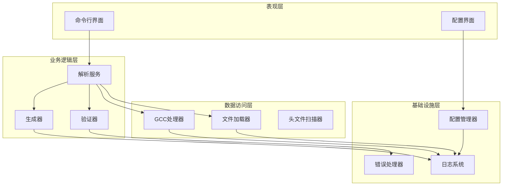

**图表来源**
- [StructParserApp.java:29-130](file://src/main/java/com/structparser/StructParserApp.java#L29-L130)
- [StructParserService.java:39-102](file://src/main/java/com/structparser/parser/StructParserService.java#L39-L102)
- [GccPreprocessor.java:28-82](file://src/main/java/com/structparser/parser/GccPreprocessor.java#L28-L82)

### 数据流架构

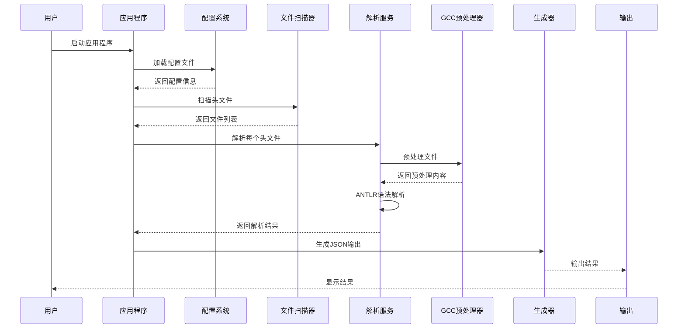

**图表来源**
- [StructParserApp.java:148-227](file://src/main/java/com/structparser/StructParserApp.java#L148-L227)
- [StructParserService.java:60-102](file://src/main/java/com/structparser/parser/StructParserService.java#L60-L102)
- [GccPreprocessor.java:85-158](file://src/main/java/com/structparser/parser/GccPreprocessor.java#L85-L158)

## 详细组件分析

### GCC 预处理器组件

GCC 预处理器是项目的核心组件之一，负责处理 C 语言的预处理指令：

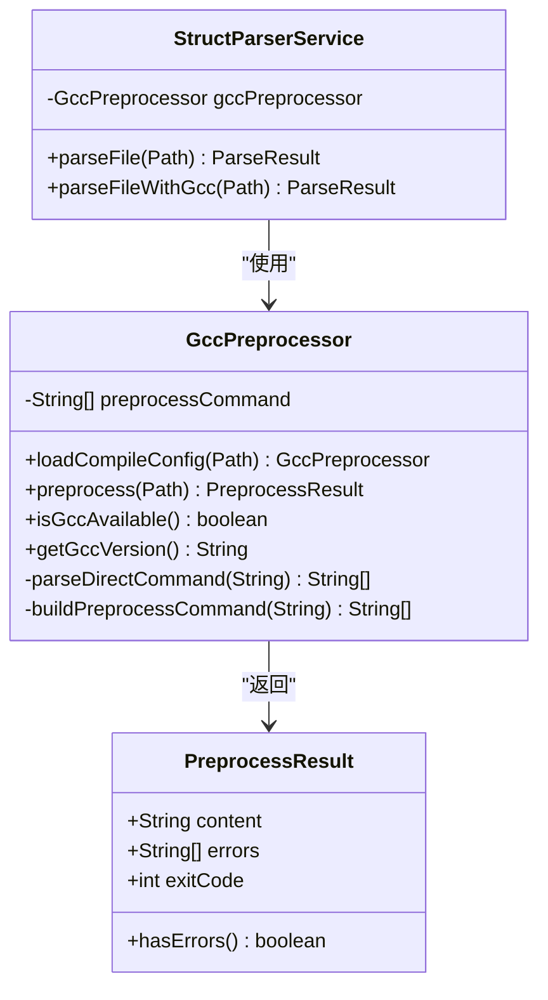

**图表来源**
- [GccPreprocessor.java:17-194](file://src/main/java/com/structparser/parser/GccPreprocessor.java#L17-L194)
- [StructParserService.java:27-34](file://src/main/java/com/structparser/parser/StructParserService.java#L27-L34)

#### 预处理流程

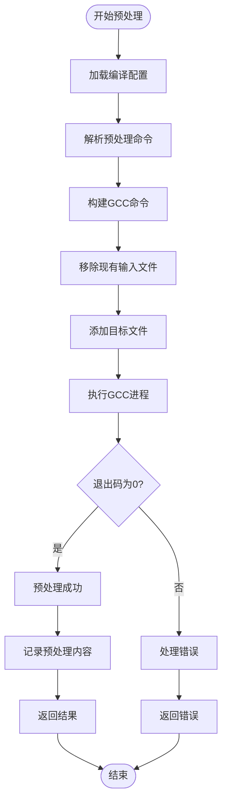

**图表来源**
- [GccPreprocessor.java:85-158](file://src/main/java/com/structparser/parser/GccPreprocessor.java#L85-L158)

### 解析服务组件

解析服务采用双遍扫描策略，确保能够正确处理复杂的类型引用关系：

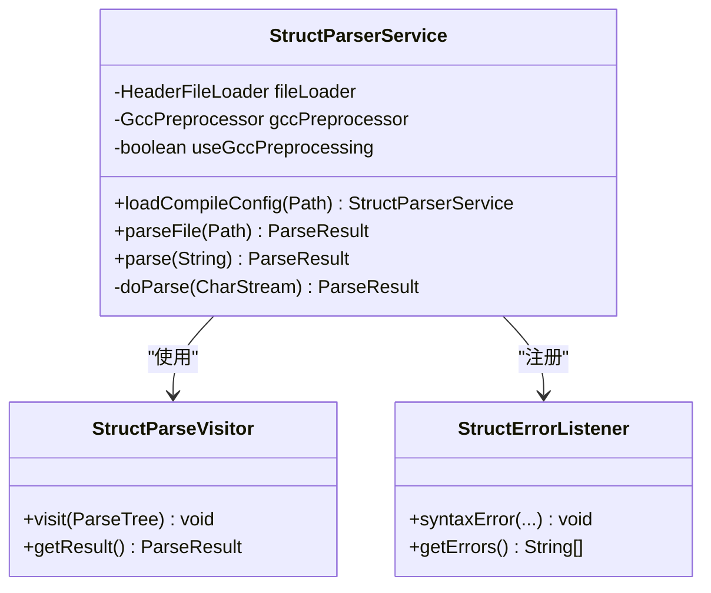

**图表来源**
- [StructParserService.java:23-185](file://src/main/java/com/structparser/parser/StructParserService.java#L23-L185)

#### 解析流程

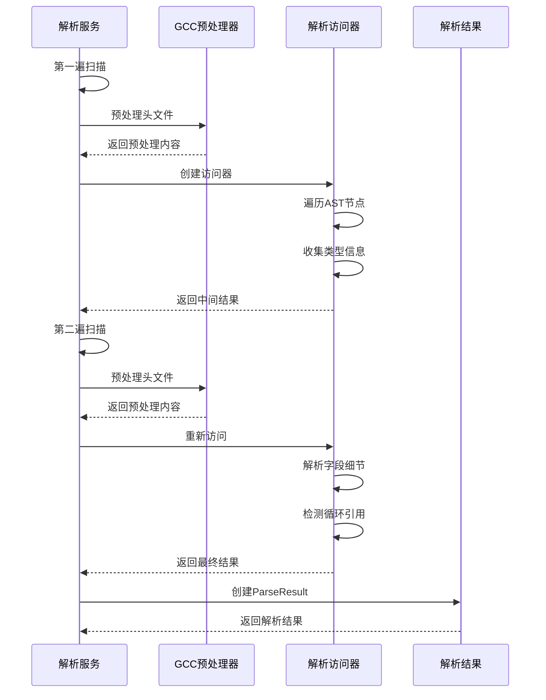

**图表来源**
- [StructParserService.java:125-153](file://src/main/java/com/structparser/parser/StructParserService.java#L125-L153)

### 数据模型组件

数据模型采用 Java Record 类设计，提供不可变和线程安全的数据结构：

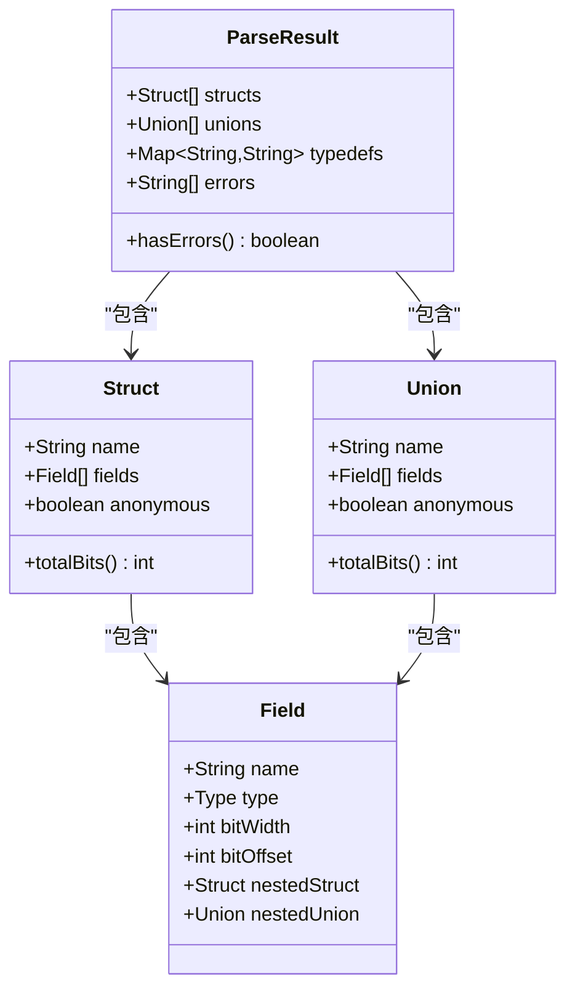

**图表来源**
- [Struct.java:9-47](file://src/main/java/com/structparser/model/Struct.java#L9-L47)
- [Union.java:9-20](file://src/main/java/com/structparser/model/Union.java#L9-L20)

#### 位布局计算

结构体的总位宽计算需要考虑联合体的特殊性：

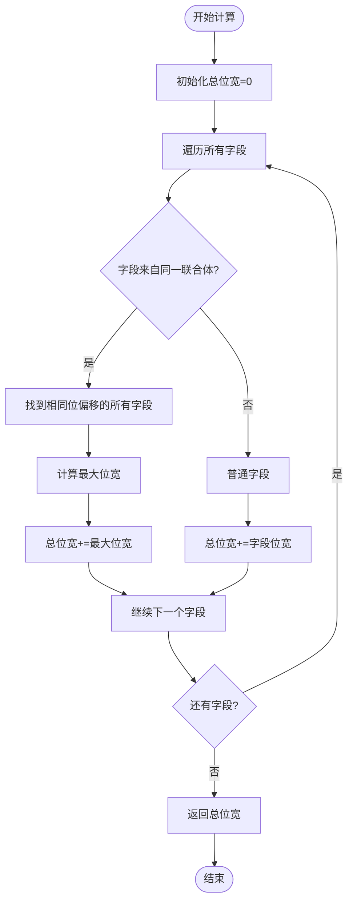

**图表来源**
- [Struct.java:16-45](file://src/main/java/com/structparser/model/Struct.java#L16-L45)

### JSON 生成器组件

JSON 生成器负责将解析结果转换为结构化的 JSON 格式输出：

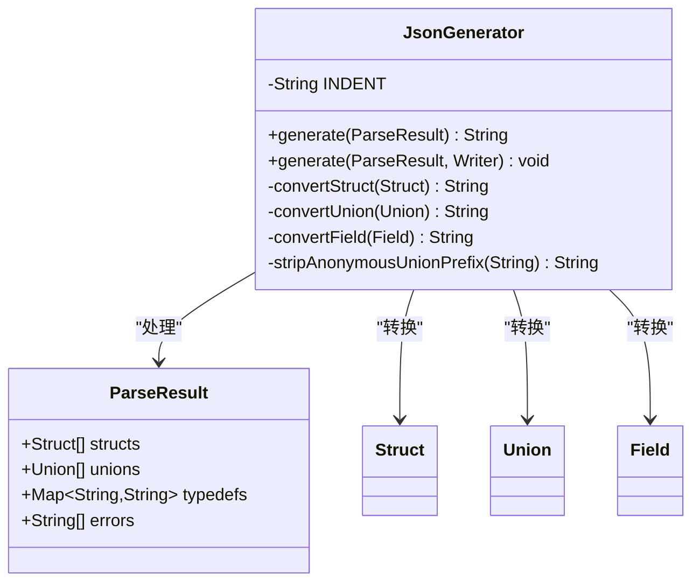

**图表来源**
- [JsonGenerator.java:14-260](file://src/main/java/com/structparser/generator/JsonGenerator.java#L14-L260)

#### 输出格式规范

JSON 输出采用标准化格式，包含以下关键字段：

- **structs**：结构体数组，每个元素包含名称、类型、位宽和字段列表
- **unions**：联合体数组，每个元素包含名称、类型、位宽和字段列表
- **typedefs**：类型别名映射（可选）
- **errors**：错误信息数组（可选）

**章节来源**
- [GccPreprocessor.java:17-194](file://src/main/java/com/structparser/parser/GccPreprocessor.java#L17-L194)
- [StructParserService.java:23-185](file://src/main/java/com/structparser/parser/StructParserService.java#L23-L185)
- [Struct.java:9-47](file://src/main/java/com/structparser/model/Struct.java#L9-L47)
- [Union.java:9-20](file://src/main/java/com/structparser/model/Union.java#L9-L20)
- [JsonGenerator.java:14-260](file://src/main/java/com/structparser/generator/JsonGenerator.java#L14-L260)

## 依赖关系分析

项目采用模块化设计，各组件之间的依赖关系清晰明确：

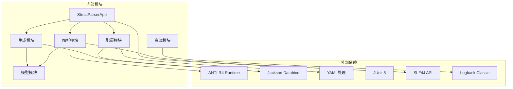

**图表来源**
- [pom.xml:27-70](file://pom.xml#L27-L70)

### Maven 依赖管理

项目使用 Maven 进行依赖管理，主要依赖包括：

- **ANTLR4 Runtime**：语法解析器运行时环境
- **Jackson**：JSON 和 YAML 处理库
- **JUnit 5**：单元测试框架
- **SLF4J + Logback**：日志系统实现

### 构建配置

构建系统采用 Maven 插件链式配置：

- **ANTLR4 Maven Plugin**：自动生成语法解析器代码
- **Compiler Plugin**：配置 Java 26 编译环境
- **Surefire Plugin**：配置 JUnit 5 测试执行
- **Assembly Plugin**：生成可执行的 JAR 包

**章节来源**
- [pom.xml:72-138](file://pom.xml#L72-L138)

## 性能考虑

### 解析性能优化

项目在多个层面进行了性能优化：

- **双遍扫描策略**：避免重复解析，提高处理效率
- **语法容错**：减少不必要的解析失败和重试
- **流式处理**：使用流式 API 处理大量数据
- **内存管理**：采用不可变 Record 类，减少内存碎片

### I/O 性能优化

- **文件缓存**：预处理结果的缓存机制
- **并发处理**：支持多文件并行解析
- **增量更新**：支持部分文件的增量解析

### 内存使用优化

- **不可变数据结构**：减少垃圾回收压力
- **延迟加载**：按需加载和解析数据
- **内存池**：复用解析器实例

## 故障排除指南

### 常见问题诊断

#### GCC 预处理问题

**问题症状**：
- GCC not found 错误
- 预处理失败，返回非零退出码
- 预处理输出为空

**解决方案**：
- 确认 GCC 已正确安装并添加到 PATH
- 检查编译配置文件中的 GCC 命令格式
- 验证头文件路径和包含目录设置

#### 配置文件问题

**问题症状**：
- 配置文件未找到
- 配置格式错误
- 输出路径不存在

**解决方案**：
- 确认配置文件存在于工作目录
- 检查 YAML/JSON 格式正确性
- 确保输出目录存在或设置正确的相对路径

#### 解析错误处理

**问题症状**：
- 解析结果为空
- 字段偏移计算错误
- 循环引用检测失败

**解决方案**：
- 检查头文件语法正确性
- 验证类型定义的顺序
- 确认没有循环引用关系

### 日志分析

项目提供详细的日志记录机制：

- **应用日志**：记录解析过程和错误信息
- **预处理日志**：记录完整的预处理内容，便于调试
- **控制台输出**：实时显示解析进度和结果

**章节来源**
- [GccPreprocessor.java:163-186](file://src/main/java/com/structparser/parser/GccPreprocessor.java#L163-L186)
- [logback.xml:10-32](file://src/main/resources/logback.xml#L10-L32)

## 结论

Struct Parser 项目是一个设计精良、功能完备的 C 风格结构体/联合体解析工具。它通过以下优势为用户提供了卓越的价值：

### 技术优势

- **现代技术栈**：基于 Java 26 和 ANTLR4，充分利用现代语言特性和强大解析能力
- **完整的预处理支持**：通过 GCC 集成，支持所有标准 C 预处理指令
- **灵活的配置系统**：支持多种配置格式，满足不同使用场景需求
- **健壮的错误处理**：提供详细的错误信息和日志记录
- **高性能设计**：采用双遍扫描策略和多种优化技术

### 应用价值

- **嵌入式系统开发**：为硬件寄存器描述和设备驱动开发提供强大支持
- **系统集成**：在大型项目中统一管理复杂的头文件结构
- **代码生成**：为不同编程语言生成相应的数据结构定义
- **协议解析**：描述和验证网络协议或通信协议的数据包格式

### 发展前景

项目正处于快速发展阶段，未来计划包括：

- **增强类型支持**：计划支持数组类型和更丰富的类型系统
- **代码生成扩展**：支持生成 C、Python、Rust 等多种语言的代码
- **IDE 集成**：开发 IDE 插件和 LSP 协议支持
- **可视化功能**：提供交互式的结构体可视化界面

## 附录

### 快速开始指南

1. **安装依赖**：确保安装 Java 26 和 GCC
2. **下载配置**：创建 `struct-parser.yaml` 配置文件
3. **准备头文件**：放置需要解析的头文件
4. **运行解析**：执行 `java -jar struct-parser.jar`
5. **查看结果**：检查生成的 JSON 输出文件

### 配置示例

```yaml
# 基本配置示例
compileConfigFile: ./command.txt
output:
  format: json
  outputFile: output/structs.json
```

### 支持的语法类型

- **基础类型**：uint1~uint32，支持 1-32 位宽度
- **复合类型**：结构体、联合体、嵌套类型
- **类型别名**：typedef 定义的类型别名
- **条件编译**：支持所有标准 C 条件编译指令